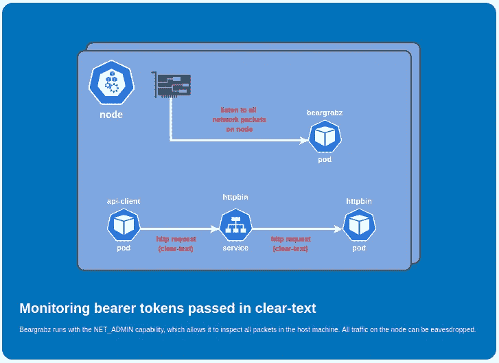
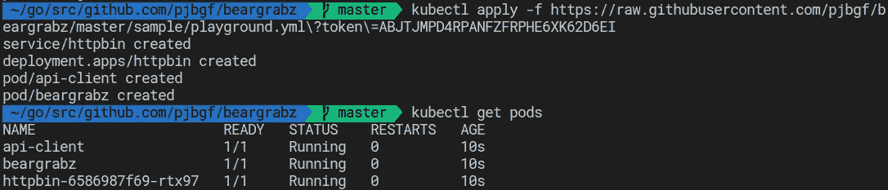
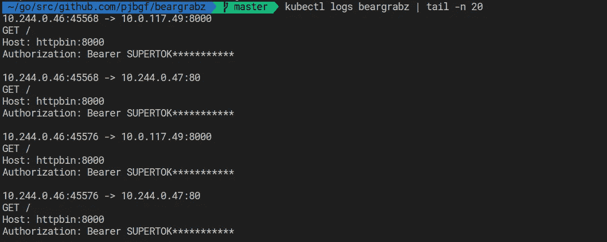

# DevSecOps:自动检测 Kubernetes 集群中以明文形式传递的不记名令牌

> 原文：<https://itnext.io/devsecops-automatically-detecting-clear-text-bearer-tokens-inside-kubernetes-cc1cd0827391?source=collection_archive---------3----------------------->

## DevSecOps 的一个重要部分是授权团队自动检测安全错误配置，这里有一个自动化的例子。

随着令人兴奋的服务网格的兴起，更多的微服务被取出并推入网格。一个这样的例子是使用 [Istio](https://istio.io/) 添加传输中加密的能力，而无需改变您的工作负载。

您可以在 pod 之间启用相互 TLS(MTL ),确保它们的通信是安全和机密的，并使集群中的其他组件难以窃听它们。

这种魔法的负面影响是，您的应用程序可能会忘记这些功能的状态。如果它们被意外禁用，您的应用程序将继续正常运行，但现在在集群内以明文形式发送数据，这对于某些用例来说可能是不可接受的。

所以我决定自动检测这种情况，以确保如果有人意外禁用了 mTLS，或者某些组件没有使用网格，我将能够检测到它，而不需要手动干预。

# **Beargrabz！**

现在的趋势是，你想解决一个问题，你就去为它创建一个 golang 应用程序，所以我做了！该应用程序名为“ [beargrabz](https://github.com/pjbgf/beargrabz) ”，它以混杂模式接入主机网络，检查所有 TCP 数据包，寻找明文形式的授权令牌。

这是一个包含一些额外组件的端到端示例:



# 成分

1.  **httpbin** : web 服务器监听端口 80。
2.  **httpbin** :服务监听端口 8000，重定向到 pod httpbin:80。
3.  **api-client** :持续查询 httpbin 发送承载令牌的`alpine`容器；

```
watch -n 1 timeout 1 wget --header "**Authorization: Bearer SUPERTOKEN**" -O- http://httpbin:8000
```

4. **beargrabz** :实际的应用程序，它只记录找到了承载令牌的请求。

# 运行示例

可以使用以下命令部署整个示例:

```
kubectl apply -f [https://raw.githubusercontent.com/pjbgf/beargrabz/master/sample/playground.yml?token=ABJTJMPD4RPANFZFRPHE6XK62D6EI](https://raw.githubusercontent.com/pjbgf/beargrabz/master/sample/playground.yml?token=ABJTJMPD4RPANFZFRPHE6XK62D6EI)
```



浏览 beargrabz 日志，我们可以看到目前为止捕获的令牌:



令牌被截断，因为您不希望整个令牌到处乱飞。:)

# 后续行动

这种应用程序可以按需执行——如果您有一个好的 GitOps 管道，还可以进行 E2E 测试。或者只是部署到集群中，并插入到您的日志记录/监控堆栈中，这样您就可以在违规时发出警报。

欲了解更多信息，请查看 github 。