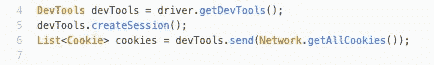
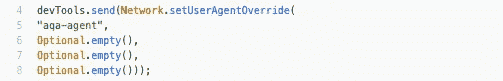
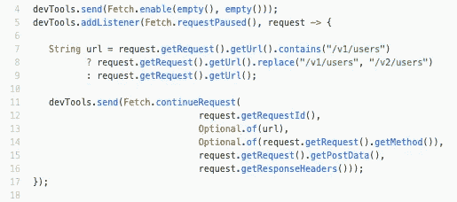
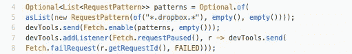
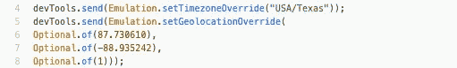

# Selenium 4 中的 DevTools 协议。

> 原文：<https://itnext.io/devtools-protocol-in-selenium-4-6acf89ecb84d?source=collection_archive---------1----------------------->

塞缪尔·伯克的照片

最流行的 UI 自动化工具之一是 Selenium Webdriver。在撰写本文时，第二个 beta 4 版本已经发布。

该版本包括一个通过 CDP (Chrome DevTools 协议)使用 DevTools 的 API，将与浏览器的交互提升到一个新的水平。

**Chrome dev tools 协议**允许工具对 Chrome、Chrome 和其他基于 Blink 的浏览器进行检测、检查、调试和分析。许多现有项目目前使用该协议。Chrome DevTools 使用这个协议，团队维护它的 API。

DevTools 工具包分为几个块(DOM、调试器、网络等。)，其中每一个都定义了支持的命令和生成的事件的列表。

Selenium 允许您直接与每个人一起工作，这使得:

*   使用浏览器缓存。
*   拦截和修改请求。
*   模拟网络状态。
*   设置地理位置。
*   绕过安全限制。
*   读取浏览器指标。

支持使用开发人员工具的驱动程序实现了 **getDevTools ()** 方法，您可以通过使用 **DevTools** 对象直接执行 CDP 命令。

为每个命令块提供了包装类。要发送命令，只需创建一个会话并调用 DevTools。发送(**命令< X >命令**)。

另一种方法是调用 executeCdpCommand()方法，该方法由 ChromiumDriver 继承者实现，不使用包装器，而是使用原始命令。方法参数—操作的名称和参数列表。

**新功能。**

*   **重新定义用户代理。**在 Selenium 4 之前，在创建驱动程序对象之前，只能通过功能安装 UserAgent。
    **网络。setUserAgentOverride** 在运行时模式下设置新的 UserAgent 值。

*   **权利授予。**对于某些操作，浏览器会请求用户的许可，例如，访问剪贴板或麦克风。您可以使用 **Browser 授予权限。通过向**传递所需权限类型的列表来授予权限。例如，让我们允许浏览器捕获音频。

*   **给请求添加标题。** **网络。setExtraHTTPHeaders** 允许您为请求添加自定义头。

*   请求的拦截和修改。 **Fetch.enable** 使能拦截，每个请求都会停止，直到客户端调用 failRequest、**full request**或 **continue request** 。
    您可以拦截所有请求并根据条件修改它们，或者通过指定 RequestPattern 只处理目标请求，下面列出了两个选项。修改 URL，例如，将/v1/users 请求重定向到/v2/users 后端的新版本。

以类似的方式模拟失败的请求。例如，测试集成失败的应用程序的操作。

*   互联网连接仿真。**network . emulatenetworkconditions**允许您设置连接参数，例如，测试 3G 信号弱或无网络时的行为。

*   清除缓存。**network . clearbrowsercache**清除浏览器缓存。

*   阻止资源加载。使用 **Network.setBlockedURLs** ，您可以通过模式限制资源加载。例如，阻止下载。挽救（saving 的简写）

*   设置时区和地理位置。**emulation . settimezoneoverride**覆盖浏览器的时区，而**emulation . setgeolocationoverride**覆盖地理位置。

*   绕过安全限制。**security . setignorecertificateerrors**将解决 SSL 证书的问题。我注意到，我并不呼吁采取这样的行动，而是展示机会的可用性。

*   度量标准。 **Performance.enable** 支持收集指标(资源、文档、JSHeapUsedSize 等。)，并且 **Performance.getMetrics** 返回当前值。

# 结论。

本文只考察了使用 DevTools 编写自动化脚本的一些可能性，其用途仅限于想象和一系列命令。

用于开发人员工具的 API 使得 Selenium Webdriver 更加强大，为设置、定制、仿真、流量拦截、事件跟踪和指标提供了可能性。

DevTools 功能将为您的测试增加灵活性。DevTools 将使预处理变得更容易，报告和崩溃原因变得更有用。

[https://test-engineer.site/](https://test-engineer.site/)

# 作者[安东·斯米尔诺夫](https://www.linkedin.com/in/vaskocuturilo/)