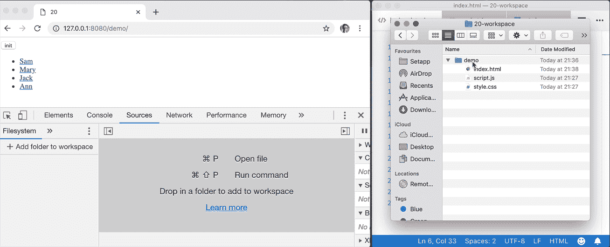
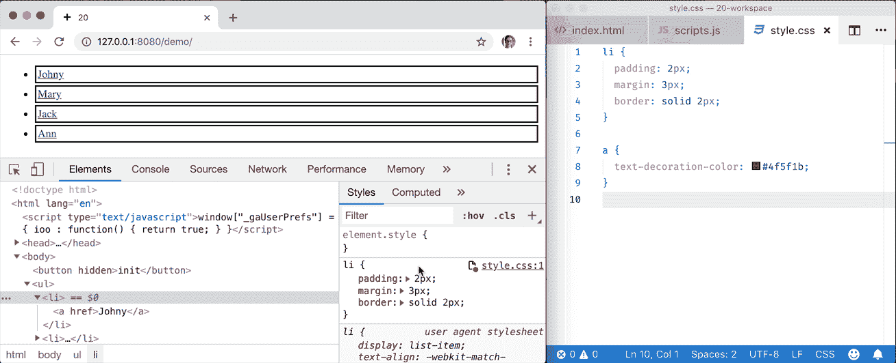
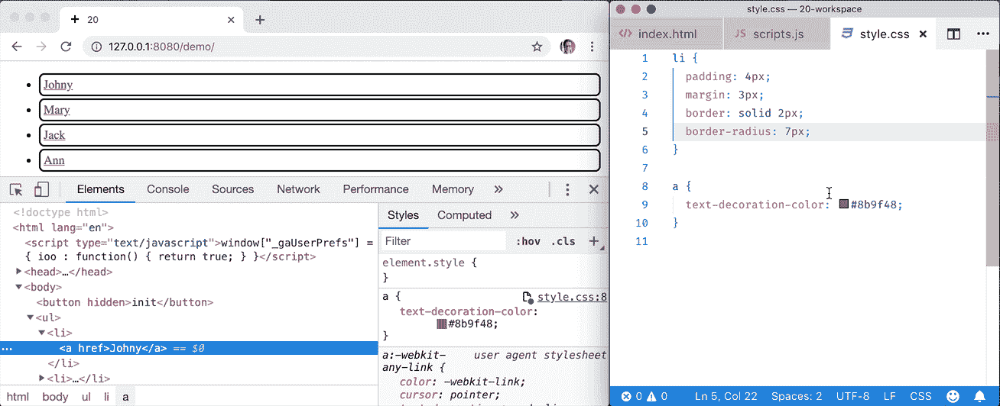

# DevTools 提示—第 20 天:工作区

> 原文：<https://itnext.io/devtools-tips-day-20-workspace-c5aab022d3c7?source=collection_archive---------7----------------------->

## “面向前端开发人员的降临节日历”系列的一部分

*在假期前的 24 天里，我发表了一些短文，介绍如何以更高效、更有趣的方式使用 DevTools。* [*昨天*](https://medium.com/@tomsu/devtools-tips-day-19-drawer-tips-1aa9cc48a1e8) *我们已经介绍了隐藏在 DevTools 抽屉中的几个面板，今天是工作区日:*

# 55.从 Chrome 编辑你的源文件

有时候，在评估代码的地方编辑代码是最简单的——在浏览器中。如果您只是将项目的文件夹拖放到 *Sources* 面板中，DevTools 会将您所做的更改与实际的文件系统同步。

这对于快速修复来说非常方便！(实际上，我认识一个开发人员，他更喜欢以这种方式编写大部分代码)

但是等等，会更好的…

# 56.Workspace 允许即时样式同步

正如我们刚才所说的，一旦你建立了你的 DevTools 工作空间，你就可以在 *Sources* 面板中编辑你的 HTML 和 JavaScript(或者实际上甚至是 TypeScript，如果你有 sourcemaps 的话)文件，在按下`ctrl+s`之后，它将被保存在文件系统中。

但是在款式方面就更好了。因为现在，即使你在*元素*面板的*样式*部分编辑你的样式规则…它也会同步。瞬间！

这是什么魔法？！

# 57.为新选择器选择目标位置

如果你想给现有的选择器添加一个新的样式，这很简单:只要在*元素*面板的*样式*部分找到那个选择器，然后开始编写你的 css。但是如果还没有这样的选择器，你需要按下那个*新样式规则*按钮。

但是，当您使用工作区时，新样式规则的默认位置——`"inspector-stylesheet:1"`位置——并不完全是您希望规则出现的位置。在这种情况下，只需按住*新样式规则* 按钮，您将看到选项会列出您所有的 css 文件。只需选择您的目的地，新规则将被保存在那里！

# 58.Workspace 允许 css 注入！

有了 workspace，不仅在浏览器中所做的更改会保存到文件系统中，而且保存在文件系统中的 **CSS** 更改(即，您的 VSCode、WebStorm、Notepad……)也会立即被浏览器获取并显示在您的页面上。**无需刷新。**

让我澄清一下:这里没有使用外部工具——没有 Webpack 热模块替换或什么都没有——它只是任何本地服务器和 DevTools 的工作区。

唷！我不知道你怎么想，但对我来说，这些建议实际上是令人兴奋的，如果不是有点疯狂的话😅
反正。一如既往，**如果你学了新的**，**请:**

**→打碎那个👏按钮** below️这样更多的人可以看到这个
**→** [**在 Twitter 上关注我**(@ sulco)](https://twitter.com/sulco)这样你就不会错过以后的帖子:

 [## tomek sukowski(@ sulco)|推特

### Tomek sukowski(@ sul co)的最新推文。# TypeScript # JavaScript @ Angular trainer & Angular Tricity…

twitter.com](https://twitter.com/sulco) 

还有，**第 21 天**已经出版了，看这里:

 [## DevTools 提示—第 21 天:代码片段

### “面向前端开发人员的降临节日历”系列的一部分

medium.com](https://medium.com/@tomsu/devtools-tips-day-21-snippets-e207f489031a)