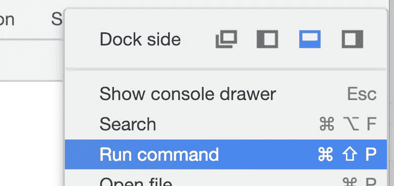
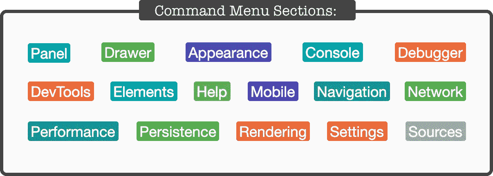
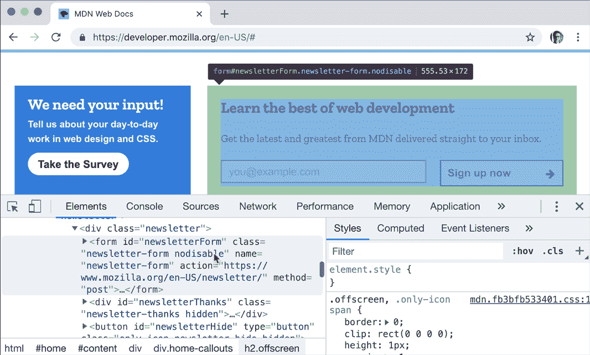
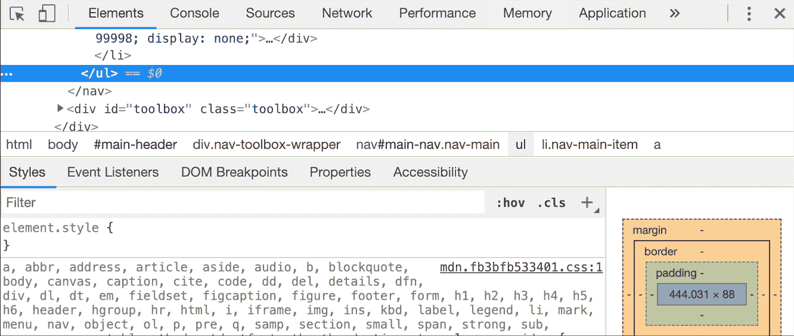

# DevTools 提示—第 6 天:命令菜单

> 原文：<https://itnext.io/devtools-tips-day-6-thecommand-menu-449eb3966d9?source=collection_archive---------3----------------------->

## “面向前端开发人员的降临节日历”系列的一部分

在假期前的 24 天里，我发表了一些短文，介绍了如何以更高效、更有趣的方式使用 DevTools。 [*昨天*](https://medium.com/@tomsu/devtools-tips-day-5-the-curious-case-of-console-log-36bc7e27a97f) *我们已经有了一个有趣的第 16 号提示，所以让我们继续从…* 开始

# 17.开始使用命令菜单(如果您还没有)

Chrome DevTools 的一些功能隐藏在特定的面板、菜单等中。有几个甚至藏在这些地方的下面。这就是为什么*命令菜单*是工具箱中必不可少的工具。

如果你曾经在 WebStorm 中使用过`"Find Action"`,或者在 Visual Studio 代码中使用过`"Command Palette"`,这是一个类似的功能。要显示它:

*   当 DevTools 打开时，按下`**[Ctrl]+[Shift]+[P]**`(或者在 Mac 上按下`**[⌘]+[Shift]+[P]**`)(它们不需要在焦点上)
*   或者使用 DevTools 的`**⋮**` 下拉按钮中的选项:

你会看到命令输入和一个可供选择的巨大命令列表，这些命令被分组到我在下图中收集的几个部分:

> 顺便说一句。我个人认为这张图片是最好的象征之一，表明了**开发工具是多么的强大！**

让我们看看藏在这里的一些宝石，好吗？

# 18.截图，大的小的

如果你想截取一个特定 DOM 节点的截图，选择该节点，打开**命令菜单**并寻找`**Capture node screenshot**`命令。

更有用的是，你还可以这样制作一个完整的页面截图——用`Capture full size screenshot`。需要明确的是，我们讨论的是整个页面，而不仅仅是适合窗口的那部分。我记得我不得不为它使用扩展！

# 19.快速切换面板布局

使用双面板布局的 DevTools 部分(例如*元素*或*源*)通常以可读的方式显示它们，根据可用的屏幕状态水平或垂直放置它们。有时这种布局不是你想要的。

(你有没有调整过 DevTools 的大小来将*样式*从 html 预览的下方移到右边或者相反的方向？是啊，这就是我说的😉)

打开**命令菜单** ，输入“ ***布局*** ，你会看到 3 个可能选项中的 2 个(*你当前激活的选项是不会显示的*):

*   `Use horizontal panel layout`
*   `Use vertical panel layout`
*   `Use automatic panel layout`

挑一个你需要的。

# 20.快速切换主题

你有没有突然开始反感光线，受不了看着炫目的亮屏？或者你在黑暗模式下工作，但突然太阳升起，开始照耀你的开发工具，所以你什么也看不见？

在**命令菜单**中寻找 ***主题****相关选项，快速切换暗&亮主题。*

**

*好了，今天的提示到此为止。像往常一样，**如果你学到了新东西，请:***

***→拍手👏按钮** below️这样更多的人可以看到这个
**→** [**在 Twitter 上关注我**(@ sulco)](https://twitter.com/sulco)这样你就不会错过以后的帖子了:*

* [## tomek sukowski(@ sulco)|推特

### Tomek sukowski(@ sul co)的最新推文。# TypeScript # JavaScript @ Angular trainer & Angular Tricity…

twitter.com](https://twitter.com/sulco) 

还有，**第七天**已经出版了，在这里看:

 [## DevTools 提示—第 7 天:异步控制台的简单乐趣

### “面向前端开发人员的降临节日历”系列的一部分

medium.com](https://medium.com/@tomsu/devtools-tips-day-7-the-simple-joys-of-async-console-578f4ce67df4)*