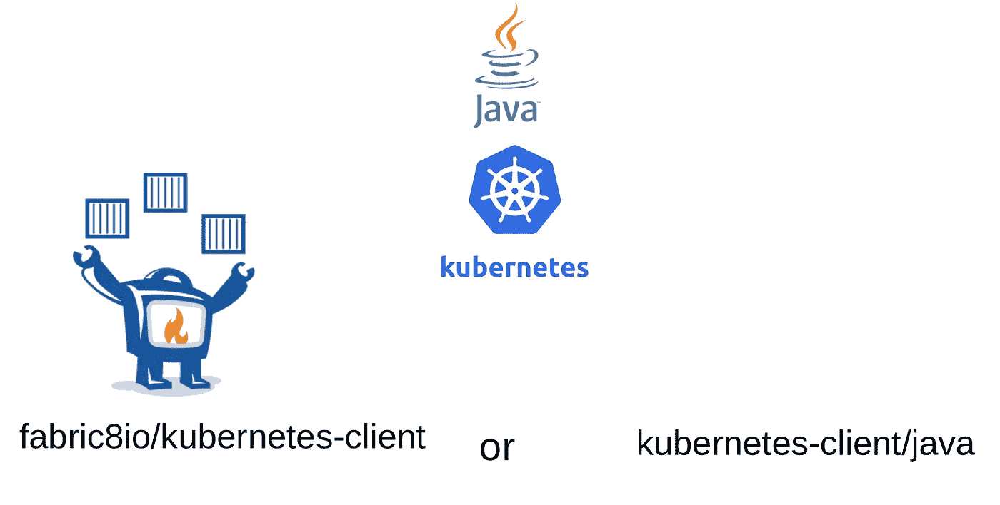
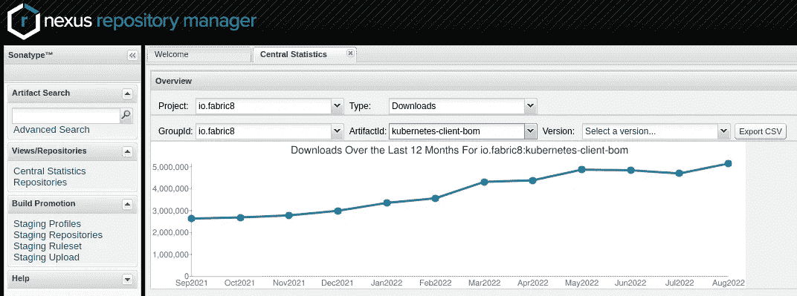

# Fabric8 和官方 Kubernetes Java 客户端的区别

> 原文：<https://itnext.io/difference-between-fabric8-and-official-kubernetes-java-client-3e0a994fd4af?source=collection_archive---------0----------------------->



很多人向我询问 Fabric8 Kubernetes 客户端与官方 Kubernetes 客户端有何不同，以及我们为什么不在所有使用中转向官方客户端。但我个人认为，与普通的 Kubernetes 客户端相比，Fabric8 Kubernetes 客户端极不公平。它不仅仅是一个 Java 客户端。

所以我认为写一个博客来描述 Fabric8 Kubernetes 客户端与官方 Java 客户端的不同之处是一个好主意。我还试用了官方的 Java 客户端，我会提供它们在用法上的一些差异。

# **历史:**

Fabric8 Kubernetes Client 是在 2015 年由 Kubernetes 早期的 [Ioannis Cannelos](https://github.com/iocanel) 和 [Jimmy Dyson](https://github.com/jimmidyson) 创建的，作为与 Kubernetes 交互的 Java 框架。当时，Fabric8 项目的愿景是成为运行在 Kubernetes 之上的云原生微服务的 PaaS 平台。Fabric8 Kubernetes 客户端在 Fabric8 生态系统中发挥了关键作用，因为它是对 Kubernetes REST API 的抽象。

Kubernetes 官方 Java 客户端于 2017 年底由 [Brendan Burns](https://github.com/brendandburns) (他也是 Kubernetes 的创始人)与其他语言如 PERL、Javascript、Python 等的其他几个客户端一起启动。所有的客户端似乎都是从一个通用的 [OpenAPI 生成器](https://github.com/OpenAPITools/openapi-generator)脚本生成的:[kubernetes-Client/gen](https://github.com/kubernetes-client/gen)Java 客户端也是以同样的方式生成的。所以它的用法类似于用这个脚本生成的其他客户端。

# **官方和 Fabric8 Java 客户端提供的包:**

```
+--------------------------------+---------------------------------+
|   **Fabric8 Kubernetes Client**    | **Official Kubernetes Client**      |
+--------------------------------+---------------------------------+
| kubernetes-model,              | client-java,                    |
| kubernetes-client,             | client-java-api,                |
| kubernetes-client-api,         | client-java-extended,           |  | openshift-model,               | client-java-proto,              |        
|                                | client-java-fluent,             |
| openshift-client,              | client-java-spring-integration  | 
| openshift-server-mock,         | client-java-prometheus-operator-| 
|                                |                    models,      |
|                                | client-java-cert-manager-models | 
|                                |                                 |
| kubernetes-httpclient-jdk,     |                                 |
| kubernetes-httpclient-jetty,   |                                 |
| kubernetes-httpclient-okhttp,  |                                 |
| kubernetes-openshift-uberjar,  |                                 |
| crd-generator                  |                                 |
| java-generator-core            |                                 |
| java-generator-maven-plugin    |                                 |
| kubernetes-junit-jupiter       |                                 |
| kubernetes-server-mock,        |                                 |
| kubernetes-junit-jupiter       |                                 |
| knative-model,                 |                                 |
| knative-client,                |                                 |
| tekton-model-v1alpha1,         |                                 |
| tekton-model-v1beta1,          |                                 |
| tekton-client,                 |                                 |
| servicecatalog-client,         |                                 |
| servicecatalog-model,          |                                 |
| volumesnapshot-client,         |                                 |
| volumesnapshot-model,          |                                 |
| chaosmesh-client,              |                                 |
| chaosmesh-model,               |                                 |    | istio-client,                  |                                 |
| istio-model,                   |                                 |
| open-cluster-management-model, |                                 |                       | open-cluster-management-client |                                 |
+--------------------------------+---------------------------------+
```

# **用户数量:**

当我们观察使用这两个库的用户数量时，Fabric8 遥遥领先。

## **Github 依赖者:**

我汇总了所有软件包的使用统计数据，以下是基于 Github 洞察的 Github 依赖者数量:

**Fabric8 Kubernetes 客户端(所有包):10276 个 Github 库**

Kubernetes 官方客户端(所有包):1591 个 Github 库

## Maven Central 下载统计数据:

如果我检查 maven 下载统计，下面是我看到的 Fabric8 Kubernetes 客户端 BOM(总下载量达到约 500 万):



OSS Sonatype Maven fabric 8 Kubernetes 客户端 2022 年 9 月统计

我不能为官方客户分享相同的，因为我不是他们组的成员。

# **用法差异:**

现在，让我们来详细了解一下这两种客户端在使用上的差异，我们将看看用户使用 Kubernetes 客户端与 Kubernetes API 进行交互的常见用例。

## **列出名称空间中的 pods(ku bectl get pods):**

下面是在一些指定的名称空间中列出窗格的例子。基本上相当于`kubectl get pods`命令:

[**官方 Kubernetes 客户端**](https://github.com/rohanKanojia/fabric8-official-java-client-comparison/blob/master/src/main/java/io/kubernetes/TestingPodList.java) **:**

使用官方 Kubernetes 客户端列出 pod，参见[TestingPodList.java](https://github.com/rohanKanojia/fabric8-official-java-client-comparison/blob/master/src/main/java/io/kubernetes/TestingPodList.java)中的代码

[**Fabric8 Kubernetes 客户端**](https://github.com/rohanKanojia/fabric8-official-java-client-comparison/blob/master/src/main/java/io/fabric8/PodListTest.java) **:**

使用 Fabric8 Kubernetes 客户端列出 pod，参见[PodListTest.java](https://github.com/rohanKanojia/fabric8-official-java-client-comparison/blob/master/src/main/java/io/fabric8/PodListTest.java)中的代码

## **创建一个简单的服务(kubectl create-f Service . yml):**

让我们看一个例子，我们已经有了一个 Yaml 清单，我们将它作为 Java POJO(kubernetes Java 模型)加载，并将其应用到 kubernetes 服务器上。

[**官方 Kubernetes 客户端**](https://github.com/rohanKanojia/fabric8-official-java-client-comparison/blob/master/src/main/java/io/kubernetes/LoadAndCreateService.java) **:**

使用官方 Kubernetes 客户端加载和创建对象，参见[LoadAndCreateService.java](https://github.com/rohanKanojia/fabric8-official-java-client-comparison/blob/master/src/main/java/io/kubernetes/LoadAndCreateService.java)中的代码

[**Fabric8 Kubernetes 客户端**](https://github.com/rohanKanojia/fabric8-official-java-client-comparison/blob/master/src/main/java/io/fabric8/LoadAndCreateService.java) **:**

使用 Fabric8 Kubernetes 客户端加载和创建对象，参见[LoadAndCreateService.java](https://github.com/rohanKanojia/fabric8-official-java-client-comparison/blob/master/src/main/java/io/fabric8/LoadAndCreateService.java)中的代码

**观看豆荚(kubectl get pods -w):**

在官方客户端查看资源有一点不同，因为这里的查看包括普通的 HTTP 调用。另一方面，Fabric8 Kubernetes 客户端使用网络套接字查看资源。

[**官方 Kubernetes 客户端**](https://github.com/rohanKanojia/fabric8-official-java-client-comparison/blob/master/src/main/java/io/kubernetes/WatchPods.java) **:**

使用官方 Kubernetes 客户端查看特定名称空间中的窗格，参见[WatchPods.java](https://github.com/rohanKanojia/fabric8-official-java-client-comparison/blob/master/src/main/java/io/kubernetes/WatchPods.java)中的代码

[**Fabric8 Kubernetes 客户端**](https://github.com/rohanKanojia/fabric8-official-java-client-comparison/blob/master/src/main/java/io/fabric8/PodWatchTest.java) **:**

使用 Fabric8 Kubernetes 客户端查看特定命名空间中的窗格，参见[PodWatchTest.java](https://github.com/rohanKanojia/fabric8-official-java-client-comparison/blob/master/src/main/java/io/fabric8/PodWatchTest.java)中的代码

## **使用构建器创建部署(kubectl create deploy ):**

您可以使用 fabric 8 Kubernetes Client builders 快速创建部署。这些是基于 sundrio 库的，也移植到了 Kubernetes 的官方客户端。您会注意到这些构建器在动态创建 Kubernetes 资源方面非常有用:

[**官方 Kubernetes 客户端**](https://github.com/rohanKanojia/fabric8-official-java-client-comparison/blob/master/src/main/java/io/kubernetes/DeploymentDemo.java) **:**

使用官方的 Kubernetes 客户端创建一个简单的 nginx 部署，参见[DeploymentDemo.java](https://github.com/rohanKanojia/fabric8-official-java-client-comparison/blob/master/src/main/java/io/kubernetes/DeploymentDemo.java)中的代码

[**Fabric8 Kubernetes 客户端**](https://github.com/rohanKanojia/fabric8-official-java-client-comparison/blob/master/src/main/java/io/fabric8/SimpleDeploymentCreate.java) **:**

使用 Fabric8 Kubernetes 客户端创建一个简单的 nginx 部署，参见[SimpleDeploymentCreate.java](https://github.com/rohanKanojia/fabric8-official-java-client-comparison/blob/master/src/main/java/io/fabric8/SimpleDeploymentCreate.java)中的代码

## **创建自定义资源:**

操纵定制资源是一个非常重要的特性，因为在编写 Kubernetes 操作符时经常用到它。Fabric8 和官方客户端都有自己为客户资源提供支持的方式。

Kubernetes 官方并不支持 Kubernetes 主`client-java` jar 中的自定义资源。为了能够使用`CustomResources`，您需要添加一些额外的依赖项。

然而，Fabric8 Kubernetes 客户端不需要任何额外的依赖。下面是一个使用 Fabric8 和官方客户端的名为`Dummy`的简单`CustomResource`的使用示例:

[**官方 Kubernetes 客户端**](https://github.com/rohanKanojia/fabric8-official-java-client-comparison/blob/master/src/main/java/io/kubernetes/CustomResourceDemo.java) **:**

为了能够在官方的 Kubernetes 客户端使用 CustomResources，您可以使用`GenericKubernetesApi`,它是一个通用类，有两个参数:资源和资源列表类型。您需要为您的定制资源提供 POJOs。假设您有一个名为`Dummy`的 CustomResource，其 CustomResourceDefinition 清单如下所示:

```
**apiVersion:** apiextensions.k8s.io/v1 
**kind:** CustomResourceDefinition 
**metadata:** 
  **name:** dummies.demo.fabric8.io 
**spec:** 
  **group:** demo.fabric8.io 
  **scope:** Namespaced 
  **versions:** 
    - **name:** v1 
      **served:** true 
      **storage:** true 
      **schema:** 
        **openAPIV3Schema:** 
          **type:** object 
          **properties:** 
            **spec:** 
              **type:** object 
              **properties:** 
                **foo:** 
                  **type:** string 
               ** bar:** 
                  **type:** string 
            **status:** 
              **type:** object 
              **properties:** 
                **dummyStatus:** 
                  **type:** string   
      **subresources:** 
        **status:** {}             
  **names:** 
    **kind:** Dummy 
    **plural:** dummies 
    **shortNames:** 
    - dummy
```

为了能够将官方的 Kubernetes 客户端用于`Dummy`资源，您需要为这些方法添加 POJOs:

*   假的
*   DummySpec
*   DummyStatus
*   傻瓜主义者

这些资源的定义分别如下:

**Dummy.java**

用于官方 K8s 客户端的虚拟自定义资源的 Pojo

**DummySpec.java**

DummySpec 的 POJO 将用于官方 K8s 客户端

**DummyStatus.java**

用于 DummyStatus 的 POJO 将在官方 K8s 客户端中使用

**DummyList.java**

POJO for DummyList 将在官方 K8s 客户端中使用

一旦你设置好了你的 POJOs。您可以通过提供这些 POJOs 来开始使用 Kubernetes 客户端。下面是一个简单的使用示例:

使用官方的 Kubernetes 客户端创建一个简单的 CustomResource，参见 CustomResourceDemo.java[的代码](https://github.com/rohanKanojia/fabric8-official-java-client-comparison/blob/master/src/main/java/io/kubernetes/CustomResourceDemo.java)

**Fabric8 Kubernetes 客户端:**

您不需要添加任何额外的依赖来使用`CustomResources`，因为它的支持已经很好地集成在 Fabric8 API 中。有两种方式将`CustomResources`与 Fabric8 Kubernetes 客户端一起使用:

*   [类型化 API](https://github.com/fabric8io/kubernetes-client/blob/master/doc/CHEATSHEET.md#customresource-typed-api) (必需的 POJOs)
*   [无类型 API](https://github.com/fabric8io/kubernetes-client/blob/master/doc/CHEATSHEET.md#customresource-typeless-api) (不需要任何 POJOs)

我们先来看看类型化 API。您需要为`Dummy`资源提供以下 POJOs:

*   假的
*   DummySpec
*   DummyStatus

这些资源的定义分别如下:

**Dummy.java:**

Fabric8 Kubernetes 客户端中使用的虚拟资源的 POJO

**DummySpec.java**

用于 DummySpec 的 POJO 将用于 Fabric8 Kubernetes 客户端

**DummyStatus.java**

用于 DummyStatus 的 POJO 将用于 Fabric8 Kubernetes 客户端

一旦您准备好了 POJOs，您就可以开始使用 Fabric8 Kubernetes 客户端来操作`Dummy`定制资源。下面是一个如何做到这一点的示例:

使用 Fabric8 类型化 API 创建虚拟定制资源，参见[CustomResourceCreateDemo.java](https://github.com/rohanKanojia/fabric8-official-java-client-comparison/blob/master/src/main/java/io/fabric8/CustomResourceCreateDemo.java)中的代码

如果您没有 POJOs 作为自定义资源，您还可以使用 Fabric8 Kubernetes 客户端的原始自定义资源 API 来管理您的自定义资源。下面是一个不使用任何 POJOs 完成上述相同任务的示例:

使用 Fabric8 无类型 API 创建虚拟定制资源，参见[CustomResourceCreateTypeless.java](https://github.com/rohanKanojia/fabric8-official-java-client-comparison/blob/master/src/main/java/io/fabric8/CustomResourceCreateDemoTypeless.java)中的代码

## 使用线人:

Fabric8 和官方的 Kubernetes 客户端都有 informer 实现。SharedInformer 实现早些时候从官方移植到 Fabric8 Kubernetes 客户端，但从那时起它已经发展了很多，变得相当被动。

下面是一个使用两个客户端为节点资源创建 Informer 的示例:

[**Kubernetes 官方客户端:**](https://github.com/rohanKanojia/fabric8-official-java-client-comparison/blob/master/src/main/java/io/kubernetes/InformerTest.java)

为节点创建告密者，【InformerTest.java】参见代号[](https://github.com/rohanKanojia/fabric8-official-java-client-comparison/blob/master/src/main/java/io/kubernetes/InformerTest.java)

**Fabric8 Kubernetes 客户端:**

****创建节点告密者，参见**[**InformerTest.java**](https://github.com/rohanKanojia/fabric8-official-java-client-comparison/blob/master/src/main/java/io/fabric8/InformerTest.java)**

## **使用动态客户端:**

**Fabric8 和官方客户端都提供使用动态客户端(使用客户端不提供任何特定类型。**

**以下是使用两种客户端向命名空间对象添加标签的示例:**

**[**官方 Kubernetes 客户端:**](https://github.com/rohanKanojia/fabric8-official-java-client-comparison/blob/master/src/main/java/io/kubernetes/DynamicClientTest.java)**

**使用动态客户端更新名称空间，**参见【DynamicClientTest.java】[](https://github.com/rohanKanojia/fabric8-official-java-client-comparison/blob/master/src/main/java/io/kubernetes/DynamicClientTest.java)**中的代码******

****[**Fabric8 Kubernetes 客户端:**](https://github.com/rohanKanojia/fabric8-official-java-client-comparison/blob/master/src/main/java/io/fabric8/DynamicClientTest.java)****

****使用动态客户端更新名称空间，**参见**[**DynamicClientTest.java**](https://github.com/rohanKanojia/fabric8-official-java-client-comparison/blob/master/src/main/java/io/fabric8/DynamicClientTest.java)中的代码****

## ****Kubernetes 官方客户端独有的功能:****

*   ****能够通过不同的 API 版本提供 Kubernetes 资源。Fabric8 现在也支持这一功能，但并非所有资源都支持。但是官方客户端为一个`Deployment`资源生成不同的类 [AppsV1Beta1Deployment](https://github.com/kubernetes-client/java/blob/master/kubernetes/src/main/java/io/kubernetes/client/models/AppsV1beta1Deployment.java) 、 [V1Beta2Deployment](https://github.com/kubernetes-client/java/blob/master/kubernetes/src/main/java/io/kubernetes/client/models/V1beta2Deployment.java) 和 [V1Deployment](https://github.com/kubernetes-client/java/blob/master/kubernetes/src/main/java/io/kubernetes/client/models/V1Deployment.java) 。****
*   ****使用 OkHttp 4.x(基于 Kotlin)。根据你的情况，你可能同意也可能不同意。****

```
**[INFO] io.kubernetes:client-java-api:bundle:16.0.0-SNAPSHOT
[INFO] +- com.squareup.okhttp3:okhttp:jar:4.10.0:compile
[INFO] |  +- com.squareup.okio:okio-jvm:jar:3.0.0:compile
[INFO] |  |  \- org.jetbrains.kotlin:kotlin-stdlib-common:jar:1.5.31:compile
[INFO] |  \- org.jetbrains.kotlin:kotlin-stdlib:jar:1.6.20:compile
[INFO] |     \- org.jetbrains:annotations:jar:13.0:compile**
```

*   ****支持 Azure 身份验证****
*   ****使用 Swagger 模式生成 Kubernetes 资源****
*   ****不同的 API 组有不同的入口点。例如，使用`core/v1`包的资源将使用`[CoreV1Api](https://github.com/kubernetes-client/java/blob/master/kubernetes/src/main/java/io/kubernetes/client/openapi/apis/CoreV1Api.java)`，而`apps/v1`包下的所有资源将使用`[AppsV1Api](https://github.com/kubernetes-client/java/blob/master/kubernetes/src/main/java/io/kubernetes/client/openapi/apis/AppsV1Api.java)`****
*   ****在与 Spring Boot 的内置集成中，基于 spring framework 的 bean 注入构建了一个 kubernetes 控制器，参见此处的附加文档。****
*   ****DSL 支持`kubectl`操作，更多[见此](https://github.com/kubernetes-client/java/blob/master/docs/kubectl-equivalence-in-java.md)。****
*   ****可用于 [Prometheus](https://github.com/kubernetes-client/java/tree/master/client-java-contrib/prometheus-operator) 和[证书管理器](https://github.com/kubernetes-client/java/tree/master/client-java-contrib/cert-manager)的自定义资源模型类****
*   ****控制器框架的内置支持，提供构建器库来编写您自己的控制器。你可以在这里了解更多信息****

## ****Fabric8 Kubernetes 客户端独有的功能:****

*   ****用于与 Kubernetes API 交互的丰富 DSL(领域特定语言)。例如，您可以使用`client.pods().inAnyNamespace().list().`用一行代码完成类似于`kubectl get pods`的简单`kubectl`操作****
*   ****Fabric8 6.x 将其 API 和实现分开。现在可以根据您的使用情况使用不同的 HTTP 客户端。目前，Fabric8 使用 OkHttp 3.x，但它也提供可插拔的 JDK HTTPClient ( `kubernetes-httpclient-jdk`)和 Jetty HTTPClient ( `kubernetes-httpclient-jetty`)模块。为了使用它们，排除`kubernetes-httpclient-okhttp`依赖和`kubernetes-httpclient-jdk` / `kubernetes-httpclient-jetty`依赖。****
*   ****观看连接管理:Fabric8 Kubernetes 客户端使用 WebSockets 底层进行观看，并支持重新连接功能，这为观看 Kubernetes 资源提供了真正可靠的支持。****
*   ****等待条件支持集成到 DSL 中****
*   ****大量的用户实用程序，可以用任何 Kubernetes 资源做简单的事情。****
*   ****通过系统属性、环境变量、`~/.kube/config`文件和`ServiceAccount`令牌以及挂载的 CA 证书进行集群连接配置。基本上这意味着，当从您的系统或者从一个`Pod`中使用客户端时，您不需要做任何类型的配置。****
*   ****支持将`Deployment`展示:`restart()`、`undo()`、`updateImage()`等集成到 DSL 中****
*   ****支持`aws-iam-authenticator`等客户端认证器命令****
*   ****使用`OAuthToken`验证****
*   ****直接使用 Kubernetes 源代码生成 Kuberneted 模型代码****
*   ****一个 ApiResource walk API，用于高效地搜索 Kubernetes 集群中的资源，参见[这个例子](https://github.com/shawkins/kubernetes-client/blob/master/kubernetes-itests/src/test/java/io/fabric8/kubernetes/ApiGroupResourceListsIT.java#L79)。****
*   ****扩展钩子能够让一个客户端基于`KubernetesClient`来适应你自己的需求。现在 Fabric8 Kubernetes 客户端已经扩展了 [Knative](https://github.com/fabric8io/kubernetes-client/tree/master/extensions/knative) 、 [Tekton](https://github.com/fabric8io/kubernetes-client/tree/master/extensions/tekton) 、 [Istio](https://github.com/fabric8io/kubernetes-client/tree/master/extensions/istio) 、 [CertManager](https://github.com/fabric8io/kubernetes-client/tree/master/extensions/certmanager) 、 [ServiceCatalog](https://github.com/fabric8io/kubernetes-client/tree/master/extensions/service-catalog) 、 [VolumeSnapshot](https://github.com/fabric8io/kubernetes-client/tree/master/extensions/volumesnapshot) 、 [ChaosMesh](https://github.com/fabric8io/kubernetes-client/tree/master/extensions/chaosmesh) 、 [OpenClusterManagement](https://github.com/fabric8io/kubernetes-client/tree/master/extensions/open-cluster-management) 和 [Kudo](https://github.com/fabric8io/kubernetes-client/pull/2197) (目前为 WIP)****
*   ****能够从 java 源代码生成自定义资源定义 YAML 清单，参见 [CRD 生成器](https://github.com/fabric8io/kubernetes-client/tree/master/crd-generator)****
*   ****能够从自定义资源定义 YAML 清单生成 Java POJOs，参见 [Java 生成器](https://github.com/fabric8io/kubernetes-client/blob/master/doc/java-generation-from-CRD.md)****

## ****结论:****

****我想以此结束我的博客。嘿，等等，我还没有回答这个问题，“使用哪个客户端更好？”。我一直在使用 Fabric8，所以我总是建议使用 Fabric8，因为我认为它在提供 Java 开发人员体验方面要好得多(也许我有偏见🙄).因此，我让用户来分析这一点，并根据他的需求选择合适的客户端。****

****您可以在这个 github 资源库中找到与本博客相关的所有源代码:****

****[](https://github.com/rohanKanojia/fabric8-official-java-client-comparison) [## rohanKanojia/fabric 8-官方-Java-客户端-比较

### 这个项目试图展示 Fabric8 和官方 Kubernetes 客户端在 API 使用上的差异。它试图给出一些…

github.com](https://github.com/rohanKanojia/fabric8-official-java-client-comparison) 

我希望这个博客能帮助你找到适合你需求的客户。谢谢！

页（page 的缩写）S: Bdw， [Fabric8 Kubernetes 客户端](https://github.com/fabric8io/kubernetes-client)也喜欢 Github🌟。****