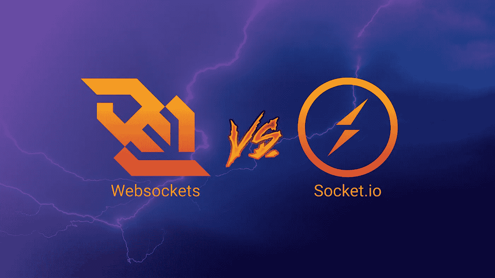
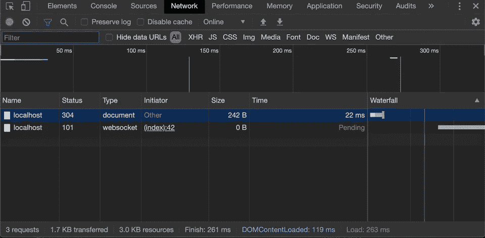

# WebSockets 和 Socket 的区别。超正析象管(Image Orthicon)

> 原文：<https://itnext.io/differences-between-websockets-and-socket-io-a9e5fa29d3dc?source=collection_archive---------0----------------------->

WebSockets 和 Socket。IO 可能是现代网络中实现实时通信的两种最流行的解决方案。但是它们有什么不同呢？

在构建实时应用程序时，有时您必须选择如何实现客户机和服务器之间的实时数据交换。WebSockets 和 Socket。IO 可能是现代网络中实现实时通信的两种最流行的解决方案。但是我们应该选择哪一个呢？这两种技术有什么区别？让我们来了解一下！

# WebSockets

当谈到 WebSockets 时，我们指的是通过单一 TCP 连接提供全双工通信通道的 web 通信协议。简而言之，它允许客户机和服务器之间以最小的开销进行交互，允许我们构建利用实时通信优势的应用程序。

例如，想象一下如果你正在构建一个聊天应用程序:你需要尽快地接收和发送数据，对吗？嗯，这是 WebSockets 的正确工作！您可以打开一个 TCP 连接并共享数据，只要您需要，就让它保持打开状态。

WebSockets 最早出现在 2010 年的 Google Chrome 4 中，第一个 RFC ( [RFC 6455](https://tools.ietf.org/html/rfc6455) )已经在一年后的 2011 年发布。

WebSockets 的优秀用例包括:

*   聊天应用程序
*   多人游戏
*   协作编辑
*   社交订阅源
*   基于位置的应用

还有很多。

# 插座。超正析象管(Image Orthicon)

插座。IO 是建立在 WebSocket…和其他技术之上的 JavaScript 库。事实上，它在可用的时候使用 WebSockets，但是它也准备使用其他技术，比如 Flash Socket、AJAX Long Polling、AJAX Multipart Stream 等等；允许插座。在不支持 WebSockets 的上下文中使用 IO。Ably 博客中有一篇[的精彩文章，深入描述了它的特点。](https://www.ably.io/concepts/socketio)

# WebSocket 和 Socket 的区别。超正析象管(Image Orthicon)

插座的主要优点。web 套接字上的 IO 有:

*   不像 WebSocket，Socket。IO 允许您向所有连接的客户端广播消息。例如，如果您正在编写一个聊天应用程序，并且希望通知所有连接的客户端有一个新用户加入了聊天，那么您可以很容易地将该消息一次性广播给所有人。使用普通 WebSocket，您需要一个所有连接的客户端的列表，然后直接一个接一个地发送消息。
*   代理和负载平衡器使得 WebSockets 难以实现和扩展。插座。IO 支持这些现成的技术。
*   之前说了，插座。当客户端不支持时，IO 可以回退到 WebSockets 之外的技术。
*   如果(由于某种原因)WebSocket 连接断开，它不会自动重新连接…但是猜猜会发生什么？插座。木卫一为你处理！
*   插座。IO APIs 是为了更容易使用而构建的。

所以，看来那个插座。木卫一有点像“实时通信的天堂”，对吗？实际上，使用普通 WebSockets 有一些很好的理由。

首先，现在所有的现代浏览器都支持 WebSockets。插座。IO 使用了更多的样板代码和资源来使它退回到其他技术。大多数时候，你不需要这种程度的支持。甚至在网络流量方面，Socket。IO 要贵得多。事实上，对于普通的 WebSockets，浏览器可能只需要运行两个请求:

*   对 HTML 页面的`GET`请求
*   到 WebSocket 的`UPGRADE`连接

仅此而已。您已经准备好开始与服务器进行实时通信了！但是插座呢。木卫一？

*   HTML 页面的`GET`请求
*   插座。IO 客户端库( [207kb](https://bundlephobia.com/result?p=socket.io@2.3.0) )
*   三个长轮询 Ajax 请求
*   与 WebSocket 的`UPGRADE`连接

在这个世界上，我们使用许多 JavaScript 代码，库也在大幅减轻它们的重量……207 kb 太多了！那么所有这些请求呢？真是浪费网络流量！

甚至有一个名为`websocket-vs-socket.io`的`npm`包(见这里的)被用来比较这两种技术的网络流量:

WebSocket 网络流量:

插座。IO 网络流量:

多么巨大的差异啊！

# 编写实时代码

到目前为止，我们只是在纸上看到了一些差异，但在编写实时应用程序时，它们有什么不同呢？

简单的 WebSocket 服务器在下面的 Node.js 程序中，我们创建了一个暴露在端口`3001`上的 WebSocket 服务器。每次客户端连接时，我们都会为其会话分配一个唯一的 ID。当客户端发送消息时，我们将用下面的格式回复:`[<client-id>]: <message>`这样他就知道消息已经成功发送了。

太好了！但是，如果我想将该消息广播给每个连接的客户端，该怎么办呢？WebSockets 默认不支持消息广播！没错，但是消息广播仍然很容易用普通的 WebSockets 实现:

如此简单！如您所见，`WebSocket.Server`跟踪每一个连接的客户端，因此我们可以循环访问它们并向每个人发送所需的消息！我们刚刚实现了有史以来最简单的聊天服务器！你可以用任何 WebSocket 客户端测试上面的代码，无论是在[桌面](https://websocket-client.com/)上还是通过 [Chrome 扩展](https://chrome.google.com/webstore/detail/browser-websocket-client/mdmlhchldhfnfnkfmljgeinlffmdgkjo)。

简单插座。IO 服务器好了，这简直太容易了！但是插座。IO 承诺让它变得更简单！我们应该如何用那个库实现同一个服务器？

哇！将近一半的 WebSocket 服务器代码！如你所见，有了插座。IO native `broadcast`方法，我们不会将消息发送回发送方；出于这个原因，我们需要手动将该消息发送给客户端。

但是有一个问题:你不能在一个标准的 WebSocket 客户端上测试它(正如我们在前面的例子中看到的)。那是因为(之前说过)，Socket。IO 不使用普通的 WebSockets，而是混合多种技术来支持尽可能多的客户端(并避免某些问题，如上所述)。那么如何测试它呢？

你需要使用插座。IO 客户端。在上面的例子中，我们使用了一个 CDN 交付的客户端，它允许我们在一个网络浏览器上进行一些快速和肮脏的测试。

正如你所看到的，这两个例子可能看起来没有什么不同…但是当谈到兼容性时，你必须记住这个插座。IO 将始终使用它自己的客户端库，所以除了 web 开发之外，您将无法使用它。这对于 WebSockets 来说是不正确的，web sockets 可以用来解决大量的问题，例如 p2p 通信、实时服务器到服务器的数据传输等等。

# 要记住的事情

正如我们在开头已经看到的，有许多问题需要解决。木卫一试图解决。

*   水平缩放。假设您的聊天应用取得了很大成功，您需要添加另一台服务器和一个负载平衡器来处理所有请求。嗯，如果您在“`server 1`”上打开一个连接，但是负载均衡器将您切换到“【T3”)，您将得到以下错误:“【T4”。插座。IO 使用 cookie 解决了这个问题(或者基于它们的起始地址路由连接)，但是 WebSockets 没有提供现成的替代机制。
*   表演。正如我们之前说过的，插座。IO 在普通的 WebSockets 传输层上提供了多个抽象层。它还将强制 JSON 打包，以便将真实的二进制数据从客户机发送到服务器(反之亦然)。如果您需要达到这种性能水平，您需要定制库来避免这种特定的行为。有了普通的 WebSockets，你就不会有这个问题。那么，我该选择什么呢？

这个问题没有简单的答案。插座。木卫一肯定会让事情变得简单一些；你不必担心与负载平衡器相关的问题、连接失败和消息广播…但是你确定你真的需要这些功能吗？只有插座。光是 IO 客户端库就比 React，Redux，React-Redux 打包在一起还重。你确定不能用浏览器原生 WebSocket API 吗？

另一件要记住的事情是插座。在服务器端实现的 IO 是一个定制的库/框架，在大多数情况下，由于 Socket 应用的抽象，您并没有遵循传统的 WebSocket 逻辑。木卫一本身。如果你正在重构 Node.js 微服务(比如说)到 Go、Elixir、Java 或任何其他语言，你将不得不重写套接字背后的大部分逻辑。IO 行为来实现与普通 WebSockets 相同的结果。例如，考虑用 Socket 向每个连接的客户机广播一条消息。IO 只是一种方法(`.broadcast`)，但是在普通的 WebSockets 中，你必须自己实现它，所以你必须重新思考它的工作方式。所以也许，从头开始使用 vanilla WebSockets 是值得的，这样会更容易用其他语言重构、扩展或实现新功能(如果你正在编写微服务/lambdas 等)。).

那么，你会为你的下一个实时应用选择什么呢？

