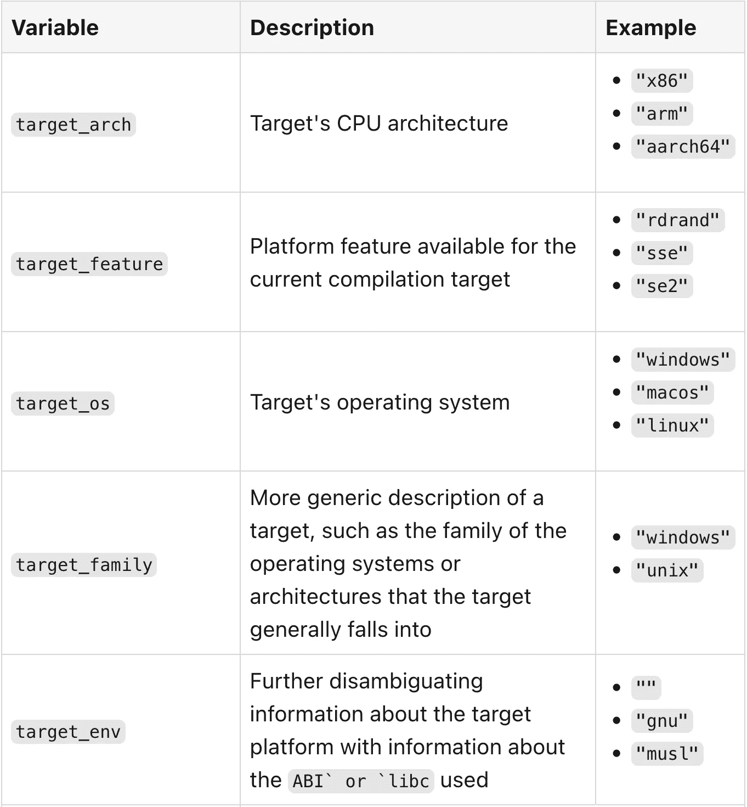
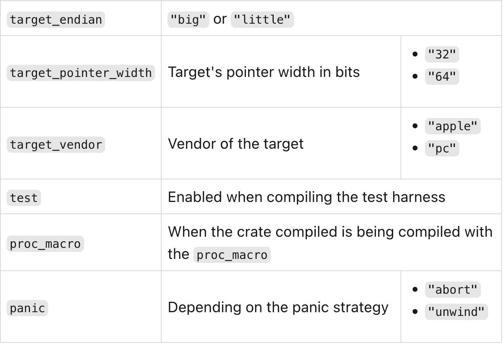

# 铁锈的不同测试范围

> 原文：<https://itnext.io/different-test-scopes-in-rust-6a5fc87472af?source=collection_archive---------0----------------------->


我还在学 Rust。除了句法，学习一门语言需要熟悉它的习惯用法和生态系统。我现在想探索 Rust 中的测试。

# 最初的问题

我们已经在 JVM 上使用依赖注入*很多年了。即使您没有使用框架，依赖注入也有助于分离组件。这里有一个基本的例子:*

```
class Car(private val engine: Engine) { fun start() {
        engine.start()
    }
}interface Engine {
    fun start()
}class CarEngine(): Engine {
    override fun start() = ...
}class TestEngine(): Engine {
    override fun start() = ...
}
```

在常规代码中:

```
val car = Car(CarEngine())
```

在测试代码中:

```
val dummy = Car(TestEngine())
```

DI 是根据上下文执行不同的代码片段。

# 生锈测试

Rust 与 Kotlin 方法有两点不同:

*   大多数 DI 框架发生在运行时，Dagger 2 是我所知道的唯一例外。Rust 专注于编译时。
*   Rust 不是面向对象的

出于这两个原因，我们不能复制上述方法。然而，Rust 擅长宏。对于测试，它提供了`test`宏。

> *要将一个函数更改为测试函数，在 fn 前的行上添加* `*#[test]*` *。当您使用* `*cargo test*` *命令运行测试时，Rust 会构建一个运行带注释的函数的测试运行器二进制文件，并报告每个测试函数是通过还是失败。*
> 
> *——*——[——*解剖测试功能*——](https://doc.rust-lang.org/book/ch11-01-writing-tests.html#the-anatomy-of-a-test-function)

在最基本的层面上，它允许定义测试函数。这些功能仅在调用`cargo test`时有效:

```
fn main() {
    println!("{}", hello());
}fn hello() -> &'static str {
    return "Hello world";
}#[test]
fn test_hello() {
    assert_eq!(hello(), "Hello world");
}
```

`cargo run`产量如下:

```
Hello world
```

另一方面，`cargo run`产量:

```
running 1 test
test test_hello ... oktest result: ok. 1 passed; 0 failed; 0 ignored; 0 measured; 0 filtered out; finished in 0.00s running 0 teststest result: ok. 0 passed; 0 failed; 0 ignored; 0 measured; 0 filtered out; finished in 0.01s
```

然而，我们的主要问题是不同的:我们想根据它是否是一个测试环境来编码。

`test`宏不是我们要找的解决方案。

# 使用`cfg`宏

Rust 区分了“单元”测试和“集成”测试。我加了双引号，因为我认为语义可能会误导人。他们的意思是:

*   单元测试与主测试写在同一个文件中。您用`#[test]`宏对它们进行注释，并调用`cargo test`，如上所示
*   集成测试在要测试的代码之外。您可以用`#[cfg(test)]`宏注释代码作为集成测试的一部分。

进入`cfg`宏:

> *在编译时评估配置标志的布尔组合。*
> 
> *除了* `*#[cfg]*` *属性，该宏还允许配置标志的布尔表达式评估。这通常会减少重复代码。*
> 
> *—* [*宏标准::cfg*](https://doc.rust-lang.org/std/macro.cfg.html)

`cfg`宏提供了许多现成的配置变量:



你可能已经注意到了众多变量中的`test`旗。要编写集成测试，用`#[cfg(test)]`宏注释代码:

```
#[cfg(test)]
fn test_something() {
    // Whatever
}
```

也可以使用宏在`test`上下文中提供替代代码:

```
fn hello() -> &'static str {
    return "Hello world";
}#[cfg(test)]
fn hello() -> &'static str {
    return "Hello test";
}
```

上面的片段在`cargo run`期间有效，但在`cargo test`期间无效。在第一种情况下，第二个函数被忽略；在第二种情况下，它不是，Rust 试图用相同的签名编译两个函数。

```
error[E0428]: the name `hello` is defined multiple times
  --> src/lib.rs:10:1
   |
5  | fn hello() -> &'static str {
   | -------------------------- previous definition of the value `hello` here
...
10 | fn hello() -> &'static str {
   | ^^^^^^^^^^^^^^^^^^^^^^^^^^ `hello` redefined here
   |
   = note: `hello` must be defined only once in the value namespace of this module
```

幸运的是，`cfg`宏提供了布尔逻辑。因此，我们可以否定第一个函数的`test`配置:

```
fn main() {
    println!("{}", hello());
}#[cfg(not(test))]
fn hello() -> &'static str {
    return "Hello world";
}#[cfg(test)]
fn hello() -> &'static str {
    return "Hello test";
}#[test]
fn test_hello() {
    assert_eq!(hello(), "Hello test");
}
```

*   `cargo run`产量`Hello world`
*   `cargo test` *编译*然后成功执行测试

虽然它解决了我们的问题，但它有明显的缺陷:

*   它是二进制的——测试上下文与否
*   它不可伸缩:在特定的规模之后，大量的注释将使项目难以管理

# 完善设计

为了改进设计，让我们想象一个我在 JVM 上多次遇到的简单场景:

*   在常规运行期间，代码连接到生产数据库，*，例如*，Postgres
*   对于集成测试，代码使用本地数据库*，例如*，SQLite
*   对于单元测试，代码不使用数据库，而是使用模拟

这是设计的基础:

```
fn main() {
    // Get a database implementation                          // 1
    db.do_stuff();
}trait Database {
    fn doStuff(self: Self);
}struct MockDatabase {}
struct SqlitDatabase {}
struct PostgreSqlDatabase {}impl Database for MockDatabase {
    fn doStuff(self: Self) {
        println!("Do mock stuff");
    }
}impl Database for SqlitDatabase {
    fn doStuff(self: Self) {
        println!("Do stuff with SQLite");
    }
} impl Database for PostgreSqlDatabase {
    fn doStuff(self: Self) {
        println!("Do stuff with PostgreSQL");
    }
}
```

1.  如何根据上下文得到正确的实现？

我们有三个上下文，而`cfg[test]`只提供了一个布尔标志。是时候采用新的方法了。

# 利用货物特征

当我寻找解决方案时，我在 Rust Slack 频道上询问。威廉·狄龙很友好地回答了这个问题，并建议我看看货物的特征。

> *Cargo“特征”提供了一种表达条件编译和可选依赖的机制。一个包在* `*Cargo.toml*` *的* `*[features]*` *表中定义了一组命名的特性，每个特性可以被启用或禁用。正在构建的包的特性可以在命令行上使用标志来启用，例如* `*--features*` *。在* `*Cargo.toml*` *的依赖关系声明中可以启用依赖关系的特性。*
> 
> *—* [*特征*](https://doc.rust-lang.org/cargo/reference/features.html)

# 定义特征

第一步是定义我们将使用什么功能。在`Cargo.toml`文件中配置它们:

```
[features]
unit = []
it = []
prod = []
```

# 使用代码中的功能

为了使用该功能，我们利用了`cfg`宏:

```
fn main() {
    #[cfg(feature = "unit")]                   // 1
    let db = MockDatabase {};
    #[cfg(feature = "it")]                     // 2
    let db = SqlitDatabase {};
    #[cfg(feature = "prod")]                   // 3
    let db = PostgreSqlDatabase {};
    db.do_stuff();
}trait Database {
    fn do_stuff(self: Self);
}#[cfg(feature = "unit")]                       // 1
struct MockDatabase {}#[cfg(feature = "unit")]                       // 1
impl Database for MockDatabase {
    fn do_stuff(self: Self) {
        println!("Do mock stuff");
    }
}// Abridged for brevity's sake                 // 2-3
```

1.  仅在激活`unit`功能时编译
2.  仅在激活`it`功能时编译
3.  仅在激活`prod`功能时编译

# 激活功能

您必须使用`-F`标志来激活一个功能。

```
cargo run -F unitDo mock stuff
```

# 默认功能

“生产”特性应该是最简单的。因此，默认设置它是至关重要的。

它在过去咬了我一口:当你的同事休假，而你需要构建/部署时，阅读代码以理解哪些标志是强制性的是一片混乱。

Rust 允许设置默认功能。它们不需要被激活；默认情况下，它们是打开的。神奇的事情发生在`Cargo.toml`文件中。

```
[features]
default = ["prod"]                             # 1
unit = []
it = []
prod = []
```

1.  `prod`功能被设置为默认

我们现在可以运行程序，而无需显式设置`prod`功能:

```
cargo runDo stuff with PostgreSQL
```

# 独家功能

这三个功能都是互斥的:一次只能激活一个。要禁用默认标志，我们需要一个额外的标志:

```
cargo run --no-default-features -F unitDo mock stuff
```

该文档提供了避免同时激活独占功能的多种方法:

> 在极少数情况下，功能可能会互相不兼容。如果可能的话，应该避免这种情况，因为它需要在依赖图中协调包的所有使用，以避免同时启用它们。如果不可能，考虑添加一个编译错误来检测这种情况。
> 
> *—* [*互斥特性*](https://doc.rust-lang.org/cargo/reference/features.html#mutually-exclusive-features)

让我们添加代码:

```
#[cfg(all(feature = "unit", feature = "it"))]
compile_error!("feature \"unit\" and feature \"it\" cannot be enabled at the same time");
#[cfg(all(feature = "unit", feature = "prod"))]
compile_error!("feature \"unit\" and feature \"prod\" cannot be enabled at the same time");
#[cfg(all(feature = "it", feature = "prod"))]
compile_error!("feature \"it\" and feature \"prod\" cannot be enabled at the same time");
```

如果我们试图在默认的`prod`功能启用时使用`unit`功能运行:

```
cargo run -F uniterror: feature "unit" and feature "prod" cannot be enabled at the same time
 --> src/main.rs:4:1
  |
4 | compile_error!("feature \"unit\" and feature \"prod\" cannot be enabled at the same time");
  | ^^^^^^^^^^^^^^^^^^^^^^^^^^^^^^^^^^^^^^^^^^^^^^^^^^^^^^^^^^^^^^^^^^^^^^^^^^^^^^^^^^^^^^^^^^
```

# 修复上述设计

上面的设计没有那么轻微的误导。在测试中，入口点不是`main`函数，而是测试函数本身。

让我们像在初始阶段一样重新添加一些测试。

```
#[cfg(feature = "prod")]                            // 1
fn main() {
    let db = PostgreSqlDatabase {};
    println!("{}", db.do_stuff());
}trait Database {
    fn do_stuff(self: Self) -> &'static str;        // 2
}#[cfg(feature = "unit")]
struct MockDatabase {}
#[cfg(feature = "prod")]
struct PostgreSqlDatabase {}#[cfg(feature = "unit")]
impl Database for MockDatabase {
    fn do_stuff(self: Self) -> &'static str {
        "Do mock stuff"
    }
}#[cfg(feature = "prod")]
impl Database for PostgreSqlDatabase {
    fn do_stuff(self: Self) -> &'static str {
        "Do stuff with PostgreSQL"
    }
}#[test]
#[cfg(feature = "unit")]
fn test_unit() {
    let db = MockDatabase {};
    assert_eq!(db.do_stuff(), "Do mock stuff");     // 3
}// it omitted for brevity
```

1.  当任何测试功能被激活时，`PostgreSqlDatabase`结构不可用
2.  更改签名以便能够测试
3.  测试！

此时，我们可以运行不同的命令:

```
cargo test --no-default-features -F unit            #1
cargo test --no-default-features -F it              #2
cargo run                                           #3
```

1.  运行单元测试
2.  运行“集成测试”测试
3.  运行应用程序

# 结论

在这篇文章中，我描述了由不同的测试套件引起的问题，关注不同的范围。默认的`test`配置变量是二进制的:要么作用域是`test`，要么不是。当一个人需要在单元测试和集成测试之间进行分离时，这是不够的，每一个都需要不同的特征实现。

Rust 的特性是解决这个问题的一种方法。一个特性允许保护标签后面的一些代码，这可以在命令行上每次运行时启用。

老实说，我不知道 Rust 特性是否是实现不同测试范围的正确方法。无论如何，它是有效的，让我更好地理解了 Rust 生态系统。

这篇文章的完整源代码可以在 [GitHub](https://github.com/ajavageek/rust-test-suites) 找到。

**更进一步:**

*   [生锈测试](https://doc.rust-lang.org/book/ch11-00-testing.html)
*   [生锈示例:测试](https://doc.rust-lang.org/rust-by-example/testing.html)
*   [有条件编译](https://doc.rust-lang.org/reference/conditional-compilation.html)

*原载于* [*一个 Java 极客*](https://blog.frankel.ch/different-test-scopes-rust/)*2022 年 10 月 9 日*