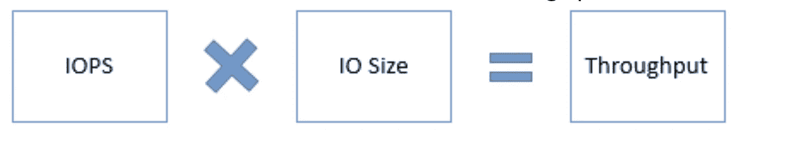
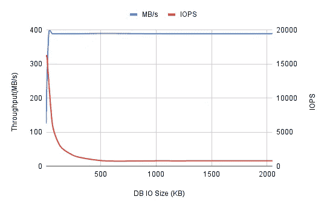
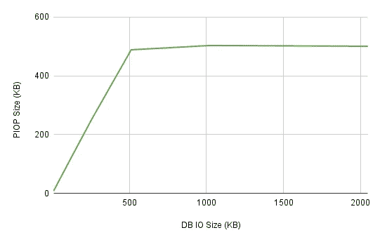
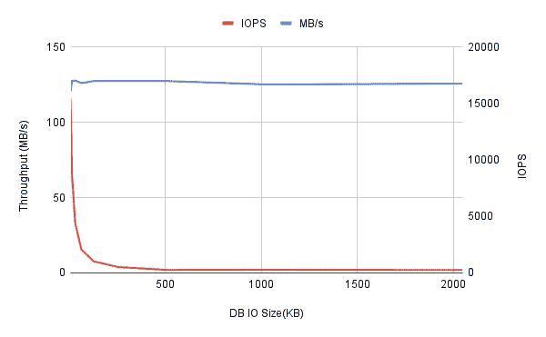
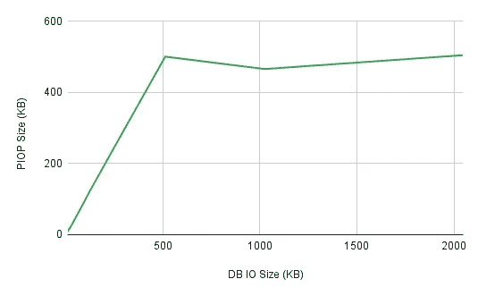
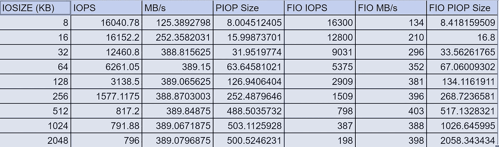
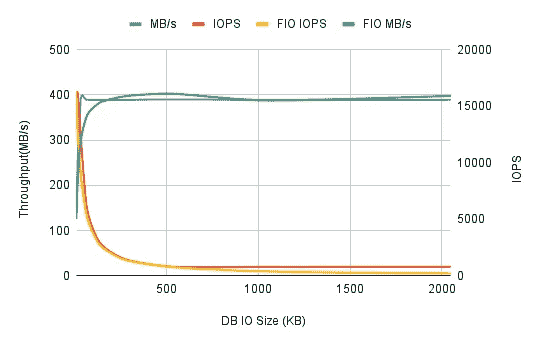
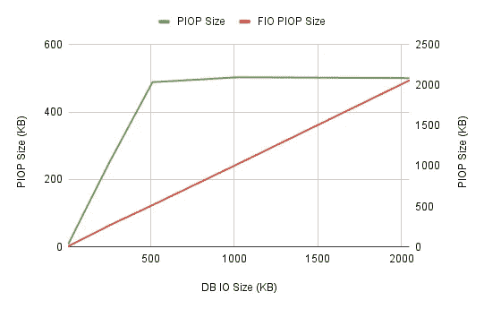

# 深入了解 Oracle DB Azure VM 上的 IO 行为

> 原文：<https://itnext.io/digging-into-io-performance-on-azure-vm-for-oracle-db-fabb3762a0af?source=collection_archive---------4----------------------->

这是为了理解专门针对 Oracle 数据库的 Azure 虚拟机上的 IO 行为。微软在 Azure 中提供了关于不同磁盘层的磁盘 IO 性能的良好文档。我正在执行测试以验证所提供的信息，测试结果将受到我使用的虚拟机 SKU 和磁盘 SKU 的限制。让我们看看是否能找到有趣的东西。

测试程序很简单，其灵感来自我的前同事 Maris 在 [AWS RDS 和 EC2](https://blog.pythian.com/investigating-io-performance-on-amazon-rds-for-oracle/) 上的工作。

# 我们有什么？

1.  具有 Sku [Standard_E8s_v3](https://docs.microsoft.com/en-us/azure/virtual-machines/ev3-esv3-series) 的 Azure 虚拟机，即 vCPU:8 和内存(GiB):64，最大缓存和临时存储吞吐量 IOPS/MBps: 16000/128，突发缓存和临时存储吞吐量 IOPS/MBps: 16000/400，虚拟机突发默认启用。

2.用于 Oracle 数据库数据文件的磁盘

*磁盘大小:512 GiB，磁盘 sku:* [*高级 SSD LRS*](https://docs.microsoft.com/en-us/azure/virtual-machines/premium-storage-performance#premium-storage-disk-sizes) *，性能层:P30–5000 IOPS，200 MB/s，最大突发 IOPS:高达 30000，最大突发吞吐量:1000 MB/s*

该磁盘上未启用按需拆分，但启用了只读缓存。

3.Oracle 数据库 19c 企业版版本 19.15.0.0.0

4.不使用 ASM 的非 CDB 实例，所有数据文件都在单个 Azure 磁盘上。

5.在整篇文章中，我没有考虑写 io，因为几乎没有任何活动。为了简单起见，我对一些数字进行了四舍五入，并且在某些地方认为 KiB 等于 KB，MiB 等于 MB。

6.将 IO 作为物理 IO 调用到存储，实际的物理 IO 可能会有所不同。物理 IOPS 被称为 PIOPS。

# 我们在做什么？

对于多块读取，数据库(取决于存储)通常会发出大小高达 1MB 的 IO，因此如果使用 8K 块大小，则表扫描将在单个 IO 的 *db 文件分散读取* **或** *直接路径读取中读取多达 128 个块(默认情况下 db _ file _ multi block _ read _ count = 128)。*

根据 Azure [文档](https://docs.microsoft.com/en-us/azure/virtual-machines/disks-types#premium-ssd-transactions)

*对于高级固态硬盘，小于或等于 256 KiB 吞吐量的每个 I/O 操作都被视为单个 I/O 操作。吞吐量大于 256 KiB 的 I/O 操作被视为大小为 256 KiB 的多个 I/O。*

出于 PIOPS 容量消耗的目的，大于 *256 KiB (262.144 KB)* 的 I/O 请求被视为多个 I/O。根据上面的陈述，看起来数据库发出的 100 万个大型 IO 将被计为 4 个独立的 IO 操作，这显然会比预期更快地耗尽分配的 IOPS。

我们的主要目的是验证上述陈述，并在测试时记录任何其他观察结果。

我们将使用[康纳·麦克唐纳](https://asktom.oracle.com/pls/apex/f?p=100:11:0::::P11_QUESTION_ID:9449954200346196651#9487022200346341617)的帖子创建一个大小为 1 GB 的表格。

测试的代码将是:

```
alter session set "_serial_direct_read"=always;
alter session set db_file_multiblock_read_count=&1;
-- Run FTS against T table forever.
declare
  n number:=1;
begin
  while n>0
  loop
    select /*+ full(t) */ count(*) into n from t;
  end loop;
end;
/
```

我将刷新缓冲区缓存，这将通过将 *_serial_direct_read* 设置为“ALWAYS”来强制直接路径读取，然后，我将根据我想要发出的 IO 大小选择*DB _ file _ multi block _ read _ count*(默认情况下，*DB _ file _ multi block _ read _ count*未设置，它解析为 128，因此来自数据库的 IO 的最大大小为 1 MB)，我将使用不同大小的 IO 进行测试

用于收集 IOSTAT 数据的命令

```
# here sdc is the block device used for datafiles
iostat -d -x 1 300 sdc | awk '{print $4 " "  $6 " " $8}'output => r/s rkB/s avgrq-sz
```

其中 r/s 是每秒读取的 io 数，rkB/s 是每秒读取的 kB 数，avgrq-sz 是以扇区为单位的平均读取请求大小(一个扇区=512 字节)

# 测试结果

使用 1、2、4、8、16、32、64 和 128 的*db _ file _ multi block _ read _ count*完成测试。对于每个测试，都会捕获吞吐量和 IOPS，并且还会导出有效 IO 大小。DB 实例是空闲的，但是在测试过程中可能会有一些小的 IO 发生。



IOPS、IO 大小和带宽/吞吐量之间的关系

[链接到 IOSTAT 数据](https://docs.google.com/spreadsheets/d/1kHgjHWoLgmxkbv5vDWBF0I0ytVAF3HspTLITVu6Rz_8/edit?usp=sharing)



Diag1 磁盘吞吐量和 IOPS:突发

1.  由于我们没有启用按需猝发，并且磁盘层是 P30，因此我**预计不会出现猝发**。关于 [*磁盘突发模型*](https://docs.microsoft.com/en-us/azure/virtual-machines/disk-bursting) 的微软文档建议必须手动启用按需突发(在我们的示例中未启用)，并且默认情况下，仅针对 P20 和更小的磁盘层启用基于信用的突发。吞吐量一直增加到 400 MB/s 的突发阈值，这是在 [虚拟机规模调整文档](https://docs.microsoft.com/en-us/azure/virtual-machines/ev3-esv3-series#esv3-series)中提到的*突发缓存和临时存储吞吐量 IOPS/MBps: 16000/400 的限制。根据观察，400 MB/s 的吞吐量只能在 30 分钟的连续时间段内实现，这对于基于信用的突发来说是真实的。**因此，根据实验期间收集的数据，似乎虚拟机突发与基于信用的突发一起发挥作用，吞吐量达到了缓存磁盘的虚拟机阈值。***
2.  对于较小的数据库 IO 大小，我们达到了最大 IOPS，例如*DB _ file _ multi block _ read _ count = 1*，数据库 IO 大小=8 Kb，平均 IOPS 约为 16K，这是缓存存储的虚拟机爆发 IOPS 阈值
3.  当我们将*DB _ file _ multi block _ read _ count*增加到 4 并将 DB IO 大小增加到 32 Kb 时，达到了最大吞吐量(400 MB/s 的阈值),并据此调整了 IOPS(减少到 12500)。随着我们不断增加*DB _ file _ multi block _ read _ count*(以及最终的 DB IO 大小)，IOPS 不断减少，直到达到最大 IO 大小。
4.  因此，对于 Azure Premium SSDs，它是关于哪个阈值先达到(IOPS 或吞吐量)，另一个相应地调整。
5.  从图 2 中，我观察到物理 IO 大小随着我们增加*DB _ file _ multi block _ read _ count*而增加，对于*DB _ file _ multi block _ read _ count≤64，它大约等于*DB _ file _ multi block _ read _ count** 8KB(DB IO 大小)。*
6.  **物理 IO 大小不超过 512 KB，即当我们将***db _ file _ multi block _ read _ count 选择为* **64、128 和 256 时，选择的 PIO 大小约为 512 KB，这与下面来自** [**文档**](https://docs.microsoft.com/en-us/azure/virtual-machines/disks-types#premium-ssd-transactions) 的陈述相矛盾

*吞吐量大于 256 KiB 的 I/O 操作被视为大小为 256 KiB 的多个 I/O。*



Diag2 PIO 大小与数据库 IO 大小:突发

30 分钟后，当爆破点数用完时，我又重复了一次测试。

*   我们对爆裂试验所做的所有观察结果对没有爆裂的试验都是正确的。第 2、3、4、5 和 6 点仍然适用。
*   30 分钟过后，**吞吐量降至 128 MBps** ，这是虚拟机的最大缓存和临时存储吞吐量 IOPS/MBps 的值:16000/128。尽管吞吐量下降到 128 MBps，但我们注意到，当我们使用大小为 8KB 的数据库 IO 进行测试时，IOPS 最大值仍达到 16000。虽然磁盘目标 IOPS 是 5000，但我们仍然能够达到 16000，因此当**基于信用的爆发耗尽时，它会影响吞吐量，但不一定会影响 IOPS。**



图表 3 IOPS 和吞吐量:无突发



图 4 PIO 大小与数据库 IO 大小的对比:无突发

# 结果比较:DB IO 与 fio

我的同事[格莱布](https://blog.gleb.ca)建议我用 [fio](https://docs.oracle.com/en-us/iaas/Content/Block/References/samplefiocommandslinux.htm) 来对比这些数据。已创建。每个数据块大小的 fio 文件，即 8K、16K、32K、64K、128K、256K、512K、1024K 和 2048K。

这里有一个 8K 块大小的例子(测试的块设备是/dev/sdc)，假设我们将其命名为 fio_8k.fio

```
[global]
bs=8K
iodepth=64
direct=1
ioengine=libaio
group_reporting
time_based
runtime=120
numjobs=1
name=raw-read
rw=read
[job1]
filename=/dev/sdc
```

然后发出以下命令

```
fio fio_8k.fio
```

在 fio 测试完成时，突发开始生效，因此我们将与具有突发的 DB IO 测试进行比较。



fio 与 DB IO 测试

**根据上表，除了块大小(fio io 大小)为 1024K 和 2048K 的 IOPS 大约是数据库 IO 大小为 1024K 的 IOPS 的一半和数据库 IO 大小为 2048K 的 IOPS 的 1/4 之外，其他数字都是一致的。**

**Pio 的计算方法是*吞吐量除以 IOPS* ，因此，块大小(fio IO 大小)为 1024K 和 2048K 的 PIO 大小分别为 1026.6K 和 2058.3K，但在 DB IO 测试(上面的第 6 点)中并非如此，在 DB IO 测试中，针对 DB IO 大小 512K、1024K 和 2048K 得出的 PIO 大小为 512KB。**



吞吐量和 IOPS 比较



PIO 尺寸比较

当 fio 测试在一个会话中运行时，我在另一个会话中收集 iostat 数据，而 **iostat 数据与块大小(fio IO 大小)为 1024K 和 2048K 的 fio 数据不匹配。iostat 数据仍然显示块大小(fio IO 大小)为 1024K 和 2048K 的 PIO 大小为 512K，与我们预期的一样。**

IO 大小为 2048K 的示例

```
iostat
r/s rkB/s avgrq-sz
783.00 398416.00 1016.37fio
 1 (f=1): [R(1)][13.2%][r=390MiB/s,w=0KiB/s][r=195,w=0 IOPS][eta 01m:45s]
```

*   Fio 报告 IOPS 为 195，而 iostat 为 783(r/s-每秒读取值)。**这归因于内核与用户空间指标的差异。Fio 发出 2MB 的读操作，这些读操作显然在代码路径的某个地方被分解成更小的 io，这些 io 实际上是发送到磁盘的内容。**
*   *avgrq-sz* 值为 1016；这是向设备发出的 io 的平均大小(以扇区为单位)。
*   由于磁盘扇区为 512 字节，读取 IO 大小为 512 x 1016= 508k =大约。512K。因此，fio 发出的每个 2MB 读取在数据块层被分解为 4 个 512k 读取，fio 发出的每个 1MB 读取在数据块层被分解为 2 个 512k 读取。
*   iostat 报告的每秒读取数(783)大约是 fio 报告的 IOPS(195)的 4 倍。

# 关键要点

*   最大物理 IO 大小不超过 512 KB，这与 Azure 文档中提到的 256 KB 不符
*   即使对于 P30 层及更高层的磁盘，默认情况下也会启用基于信用的突发。
*   当基于信用的突发用尽时，它会影响吞吐量，但不一定会影响 IOPS。
*   对于尝试的 IO 大小大于 512KB 的测试，FIO 与 IOSTAT 的数据差异。这归因于内核和用户空间度量的差异

注意:这些观察是为磁盘 SKU 优质 SSD，我计划做类似的测试超 SSD 磁盘 SKU。

除了上面讨论的观察之外，参考 [Azure 文档](https://docs.microsoft.com/en-us/azure/virtual-machines/premium-storage-performance#application-performance-indicators)了解其他磁盘性能注意事项。

[](https://faun.to/bP1m5)

加入牧神: [**网站**](https://faun.to/i9Pt9) 💻**|**|[**播客**](https://faun.dev/podcast)**🎙️**|**[**推特**](https://twitter.com/joinfaun) 🐦 **|** [**脸书**](https://www.facebook.com/faun.dev/) 👥**|**[**insta gram**](https://instagram.com/fauncommunity/)**📷| [**Facebook 群**](https://www.facebook.com/groups/364904580892967/)**🗣️**|**[**LinkedIn 群**](https://www.linkedin.com/company/faundev) 💬 **|** [**松弛**](https://faun.dev/chat) 📱 **|** [**云原生** **新闻**](https://thechief.io) 📰 **|** [**更有**](https://linktr.ee/faun.dev/) **。********

****如果这篇文章有帮助，请点击拍手👏按钮几下，以示你对作者的支持👇****