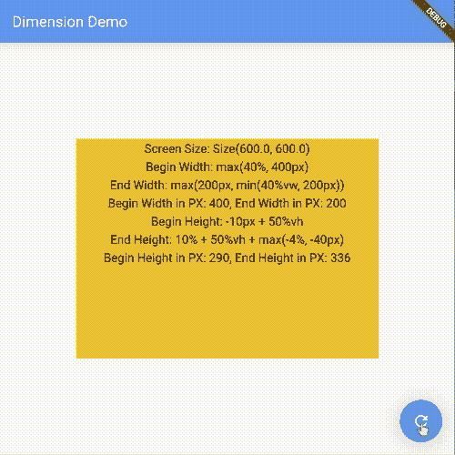

# dimension——一个受 CSS 启发的颤振距离计算软件包

> 原文：<https://itnext.io/dimension-a-css-inspired-distance-calculating-package-for-flutter-e0604f62e707?source=collection_archive---------6----------------------->

CSS 提供了 <length>/ <percentage>数据类型，使得网站的响应设计更加容易。它还允许一些方便的功能，如:</percentage></length>

```
max(10px, 10%)
calc(10px + 10%)
clamp(10px, 50%, 20px)
```

Flutter 的布局系统不同于 web，它不使用 CSS。但是在我看来，能够做一些类似于 CSS 为更容易响应的设计目的所提供的事情仍然是有益的。

这就是为什么我创建了[维度](https://pub.dev/packages/dimension)包(正式名称为 length_unit)。基类简称 Dimension，下面是这个类的接口(实现略):

```
abstract class Dimension {
  const Dimension();

  double toPX({double? constraint, Size? screenSize});

  @protected
  Dimension? add(Dimension other) => null;

  Dimension operator +(Dimension other);

  Dimension operator -();

  Dimension operator -(Dimension other);

  Dimension scale(double t);

  static Dimension max(Dimension value1, Dimension value2);

  static Dimension min(Dimension value1, Dimension value2);

  static Dimension clamp(Dimension min, Dimension value, Dimension max); Dimension? lerpFrom(Dimension? a, double t);

  Dimension? lerpTo(Dimension? b, double t);

  static Dimension? lerp(Dimension? a, Dimension? b, double t);
}
```

你可以看到它支持加法和减法。还支持 Lerp(补间)。像 min、max 和 clamp 这样的函数应该像 CSS 提供的那样工作，并且可以嵌套。我们只需要调用 toPX()方法将一个 Dimension 实例转换成 Flutter 使用的 PX 值。

维度是抽象的。您实际使用的是长度类:

```
class Length extends Dimension {
  final double value;
  final LengthUnit unit;

  const Length(this.value, {this.unit = LengthUnit.px}); ...}
```

它有一个值和一个单位。支持的单位有:

```
enum LengthUnit {
  *///logic pixel* px,
  *///percent of the parent size* percent,
  *///percent of the screen width* vw,
  *///percent of the screen height* vh,
}
```

要创建长度实例，请编写:

```
var length=Length(10.0, unit: LengthUnit.percent);
```

或者使用那些方便的扩展方法:

```
length=10.toPXLength; //10 px
length=10.toPercentLength; // 10% of the parent constraint
length=10.toVWLength; //10% of the screen width
length=10.toVHLength; //10% of the screen height
```

然后将长度转换为 px 值:

```
double px=length.toPX(constraint: 100, screenSize: MediaQuery.of(context).size);
```

约束值是百分比单位，应由用户提供。可以通过调用 LayoutBuilder 来获取父约束大小。

下面是创建响应容器的一个片段:

Dimension 类支持序列化/反序列化(就像我开发的其他包一样)，包括函数调用和多长度实例的组合。

```
Dimension length=Dimension.clamp(10.toPXLength+10.toVWLength, 100.toPXLength+20.toPercentLength, Dimension.max(500.toPXLength, 50.toVWLength));
String jsonStr=json.encode(length.toJson());
Dimension newLength=parseDimension(jsonStr);
```

dimension 包更像是一个帮助器类，让你根据父约束和屏幕大小快速计算一些距离。如果你有这个包的用例，欢迎在下面评论。谢谢大家！



在两个响应尺寸之间制作动画