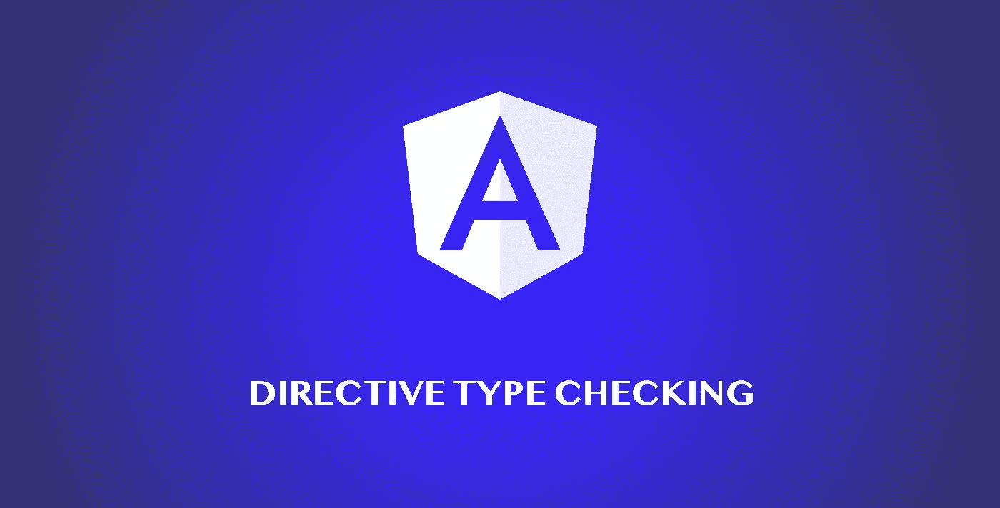
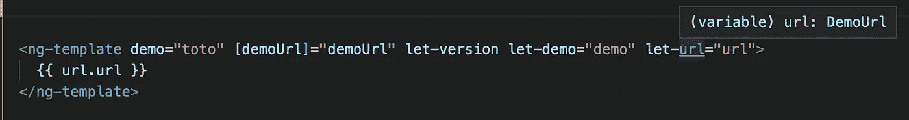
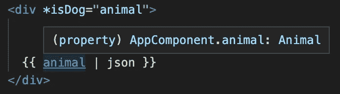
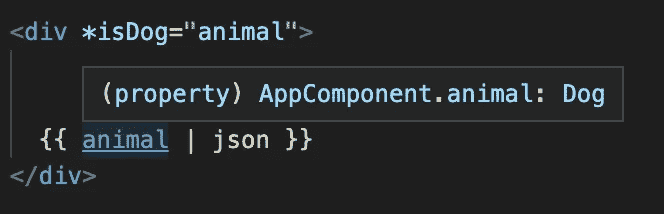

# 指令类型检查

> 原文：<https://itnext.io/directive-type-checking-3d3c5f1137b3?source=collection_archive---------1----------------------->



**指令**是一个非常强大的工具，我们应该掌握它来提高我们的角度技巧。Typescript 强制执行严格类型，并帮助我们使我们的代码库更有弹性。不幸的是，定制指令并不是开箱即用的。本文的目的是向您展示如何将严格的类型添加到您的结构化指令中，并使您的角度代码库更具弹性。

为了支持类型检查，我们需要使用 Angular 提供的两个方便的类型保护:

*   ngTemplateContextGuard :为我们的自定义指令的上下文声明一个自定义类型
*   **ngTemplateGuard _[customInputProperty]**:缩小输入属性的呈现类型。

在我们深入这些静态角度函数之前，我们需要理解 Typescript 类型谓词是如何工作的。如果你不理解或者从未听说过这篇文章，我邀请你阅读这篇文章。

[](https://medium.com/@thomas.laforge/typescript-type-predicate-d9b8c4a15569) [## 类型脚本类型谓词

### 在 Typescript 中获取您的类型的控件

medium.com](https://medium.com/@thomas.laforge/typescript-type-predicate-d9b8c4a15569) 

## ngTemplateContextGuard

如果我们需要为我们的自定义指令提供一个上下文，我们可以使用静态函数 **ngTemplateContextGuard** 确保它在模板中被正确地键入。它的工作方式类似于 Typescript 类型保护函数，并返回一个类型谓词。

让我们看一个例子来更好地理解这个概念。

```
interface DemoUrl {
  url: string;
  video: boolean;
}

// interface declaring the Context of this Directive
interface DemoContext {
  $implicit: number;
  demo: string;
  url: DemoUrl;
}

@Directive({
  selector: '[demo]',
  standalone: true,
})
export class DemoDirective implements OnInit {
  @Input() demo!: string;
  @Input() demoUrl!: DemoUrl;

  constructor(
    private readonly viewContainerRef: ViewContainerRef,
    private readonly templateRef: TemplateRef<DemoContext>
  ) {}

  ngOnInit(): void {
    const context = {
      $implicit: 1,
      demo: this.demo,
      url: this.demoUrl,
    };
    this.viewContainerRef.createEmbeddedView(this.templateRef, context);
  }

  // Guard to help Typescript correctly type checked 
  // the context with which the template will be rendered
  static ngTemplateContextGuard(
    directive: DemoDirective,
    context: unknown
  ): context is DemoContext {
    return true;
  }
}
```

*ngTemplateContextGuard 返回 true，因为该指令总是将 DemoContext 类型的上下文传递给模板。*

现在，当我们在模板中使用这个指令时，我们得到了类型正确的属性。



> 额外提示:我们可以用三种不同的方式编写结构指令。所有这些都被编译器以同样的方式解释。

```
<ng-template demo="toto" [demoUrl]="demoUrl" let-version let-demo="demo" let-url="url">
  {{ url.url }}
</ng-template>

// * is the shorthand for what angular will interpret with ng-template
<div *demo="'toto'; let version; url: demoUrl; let demo = demo; let url = url">
  {{ url.url }}
</div>

// We can use "as" in replacement of "let ... = "
<div *demo="'toto' as version; url: demoUrl; demo as demo; url as url">
  {{ url.url }}
</div>
```

## ngTemplateGuard _[customInputProperty]

理解这个保护有点复杂。结构指令控制模板在运行时的呈现方式。*(例如，只有当输入条件为 thrustly 时，NgIf 才会将模板添加到 DOM 中。)*

如果我们的自定义指令的输入具有复杂的类型，并且该指令仅在满足特定条件时才呈现模板，那么我们可以使用这种保护来缩小呈现的类型。

让我们展示这个例子来更好地理解这个概念:

```
// Typescript type guard
export const isDog = (animal: Animal): animal is Dog => {
  return (animal as Dog).breed !== undefined;
}

interface Cat {
  name: string;
  type: 'cat';
}

interface Dog {
  name: string;
  race: string;
  type: 'dog';
}

type Animal = Dog | Cat;

@Directive({
  selector: '[isDog]',
  standalone: true,
})
export class DogDirective {
  @Input('isDog') set isDogInput(animal: Animal) {
    if (isDog(animal.type)) {
      this.viewContainerRef.createEmbeddedView(this.templateRef);
    } else {
      this.viewContainerRef.clear();
    }
  }

  constructor(
    private readonly viewContainerRef: ViewContainerRef,
    private readonly templateRef: TemplateRef<unknown>
  ) {}
```

该指令将一个`Animal`作为输入，并且仅当输入动物的类型为`Dog`时才呈现模板。尽管我们 100%确定只有当我们的输入是`Dog`类型时，这个模板才会被渲染，但是我们可以看到模板中的动物变量仍然是`Animal`类型。



没有 **ngTemplateGuard**

这就是 **ngTemplateGuard** 前来救援的地方。我们使用下面的函数将我们的类型缩小到`Dog`，并在模板中享受更好的类型安全性。

```
static ngTemplateGuard_isDog(
  dir: DogDirective,
  state: Animal // input type
): state is Dog { // output type
  return true;
}
```

我们现在可以在模板中看到正确推断的类型



与 **ngTemplateGuard**

**备注:**如果我们决定更改绑定到我们内部输入名称的模板中使用的名称，如*@ Input(' isDogExternal ')isDog*，则防护采用外部值。这意味着守卫将变成*ngTemplateGuard _ isDogExternal*。

然而，除非我们有充分的理由，否则应该避免混淆。同一个属性有两个名称(外部和内部)会引起混淆。*(查看* [*棱角风格指南*](https://angular.io/guide/styleguide#avoid-aliasing-inputs-and-outputs) *)。)*

就是这样！您不再有任何借口不严格输入您的自定义指令…

如果你觉得这篇文章有用，请考虑支持我的工作，为它鼓掌👏👏帮助它接触到更广泛的受众。非常感谢你的支持。

我希望你学到了新的角度概念。你可以在[媒体](https://medium.com/@thomas.laforge)、[推特](https://twitter.com/laforge_toma)或 [Github](https://github.com/tomalaforge) 上找到我。如果你有更多的问题，不要犹豫来找我

> 👉如果你想加快你的角度学习之旅，来看看[角度挑战](https://github.com/tomalaforge/angular-challenges)。