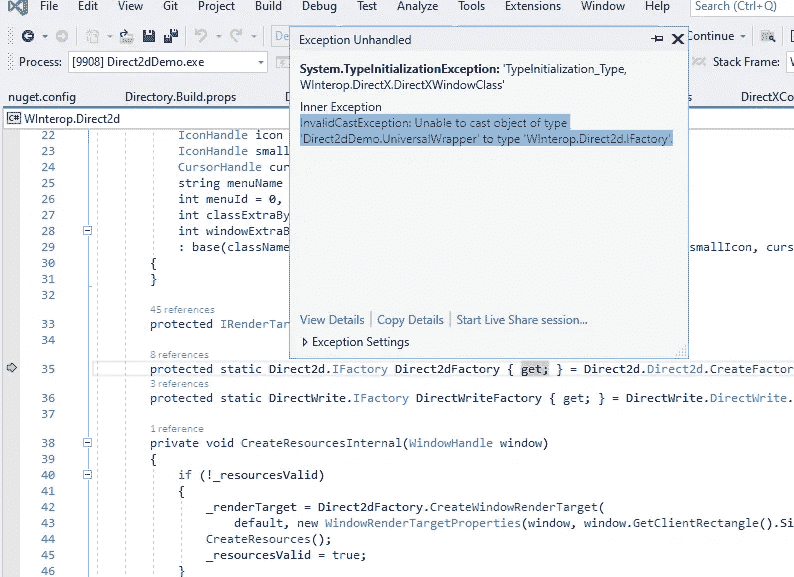
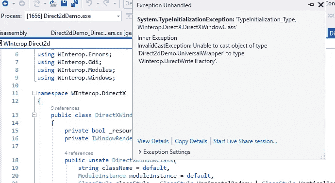

# NativeAOT 中的 DirectX

> 原文：<https://itnext.io/directx-in-nativeaot-2ce996a15c23?source=collection_archive---------1----------------------->

我一直在寻找各种有趣的项目，在那里我可以展示 AOT 本土的优势。所以今天我要写一下 DirectX。从技术上讲，DirectX 只是另一个 COM 库，因为我之前在 native aut 中写过关于 [COM 的文章，所以在这方面没有什么特别的。本文的新内容是，今天我将使用源代码生成器快速创建一个 ComWrappers 实例，以便在我的小应用程序中使用。](https://codevision.medium.com/using-com-in-nativeaot-131dbc0d559e)

作为起点，我将再次从杰里米·屈尼的库开始。如果在任何时候你觉得无聊，直接去[源代码](https://github.com/kant2002/WInterop/tree/test-aot/src/Samples/CoreWindows/Direct2dDemo)并使用样本。

那么，当前需要什么来使 NativeAOT 和 COM 旋转呢？通常，我通过以下简单的步骤开始将应用程序移植到 NativeAOT。我创建了一个新的空白 ComWrappers 类。

这里是一个类，它将作为我将在应用程序中使用的所有 COM 对象的通用运行时可调用包装器。

然后，我注册 ComWrappers 进行全局封送，这样所有 COM interop 都将被转发到新创建的 ComWrappers。

然后我运行应用程序，直到它在某个地方抛出。在目前的情况下，是在我的通用包装器接口到`Winterop.Direct2d.IFactory`的转换过程中。

这意味着我应该在 RCW 上实现`Winterop.Direct2d.IFactory`,让那部分代码工作。这是通过在`UnversalWrappers`类上添加属性来实现的。该接口所需的所有实现将由`[WinFormsComInterop.SourceGenerator](https://www.nuget.org/packages/WinFormsComInterop.SourceGenerator/0.2.6)` NuGet 包完成。

我再次运行构建，它失败了，并出现 2 个错误

`error CS8121: An expression of type ‘IGeometry’ cannot be handled by a pattern of type ‘UniversalWrapper’
error CS8121: An expression of type ‘IRenderingParams’ cannot be handled by a pattern of type ‘UniversalWrapper’.`

我添加了另外两个必需的接口。

然后我再次构建，它失败了，添加所需的接口。冲洗并重复。冲洗并重复。最后这个过程结束，并且构建成功。

现在，我再次运行应用程序。你猜怎么着？

再次崩溃。所以我使用属性`[RuntimeCallableWrapper(typeof(WInterop.DirectWrite.IFactory))]`添加了一个接口。一段时间后，它解决了，我们实现所有的接口，并再次运行应用程序。

示例中的最后一个屏幕

就是这样。现在，该应用程序可以在本地 AOT 环境中进行测试了。让我们运行`dotnet publish -c Release -r win-x64`并看看进展如何。嘿！起作用了。又是 1，4 Mb 的磁盘空间。

**P.S.** 我应该注意，我在这里公然滥用了 ComWrappers，为了获得最佳效果，您应该遵循 [CsWinRT](https://github.com/microsoft/CsWinRT) 的路径，使用 ComWrappers 的精简版本，并以稍微不同的方式构造代码生成，这不需要拥有全局 ComWrapper 实例。[我的库和源代码生成器](https://github.com/kant2002/WinFormsComInterop)服务于不同的目的——让旧的应用程序在原生 AOT 环境中工作。第二个目标是减轻运行它们的痛苦，如果有人愿意尝试的话。

我会再次拿起武器！加入原力！通过使用本地 AOT 运行你的应用程序来帮助这个项目，万一有问题去[和在 Gitter](https://gitter.im/dotnet/corert) 聊天，在 [Github repo](https://github.com/dotnet/runtimelab) 文件问题，这里的人非常有帮助。