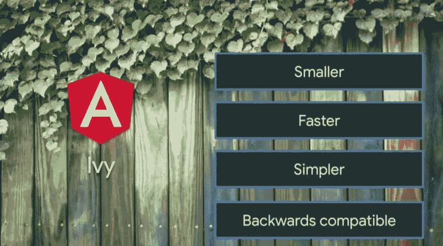
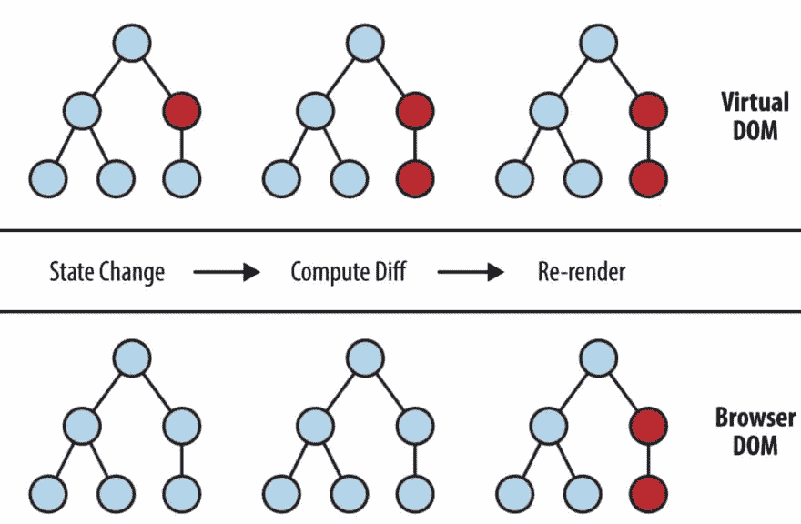
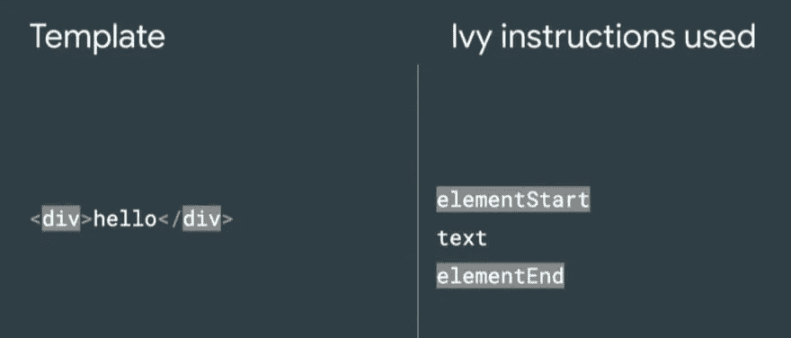
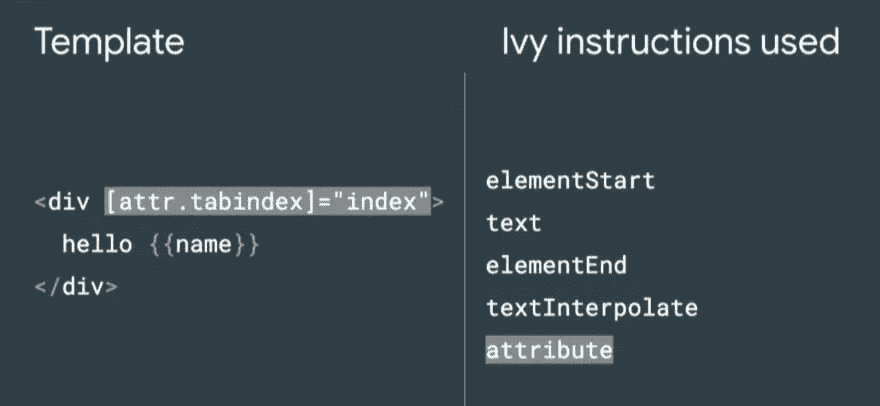
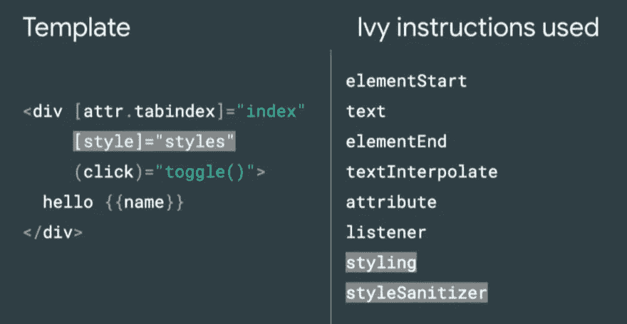
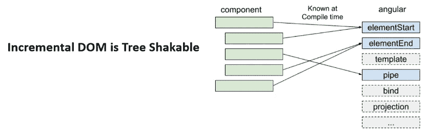
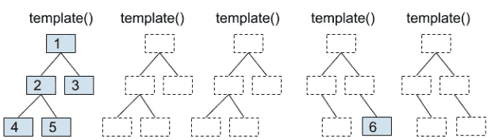
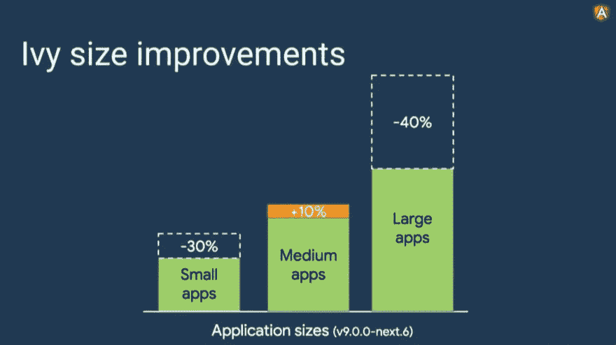

# 探索迭代 DOM，棱角分明的常春藤背后的魔力

> 原文：<https://itnext.io/discover-iterative-dom-the-magic-behind-angular-ivy-4ce84123e58e?source=collection_archive---------2----------------------->


由 [Cederic X](https://unsplash.com/@cedericx?utm_source=unsplash&utm_medium=referral&utm_content=creditCopyText) 在 [Unsplash](https://unsplash.com/s/photos/magic?utm_source=unsplash&utm_medium=referral&utm_content=creditCopyText) 上拍摄的照片

## Ivy 如何减少包的大小和内存占用

9 月 18 日和 19 日，我参加了在伦敦举行的 AngularConnect 会议。


这是一次很棒的经历，不仅是非常有趣的会议，也是与 Angular 团队进行个人对话的可能性。

今年，两个主要话题是**性能改进**，当然还有 **Ivy** ，新的 Angular 编译和渲染管道。
虽然与 Angular 4 同时发布的名为`Renderer2`的视图引擎并未引起人们的注意，但 Ivy 激起了更高的兴趣。更受关注的变化是渲染性能的提高和生成包大小的减小。



为了实现这些重大改进，有必要对整个编译过程进行彻底的改变。

Angular 团队推迟了 Ivy 的最终发布，以避免对现有应用程序造成任何破坏性影响。目前，Ivy 兼容 85%的最流行的库，团队正在不断努力增加这个数字。

**从 Angular v9 开始，任何项目都会默认启用 Ivy。**
(计划 11 月下旬发布)。

但是，如果我们在应用程序中发现任何冲突，我们仍然有可能*选择退出*，也就是说，通过更改我们的`tsconfig.json`文件中的以下属性来禁用 Ivy:

> *用 Ivy 进行 AOT 编译比用 View Engine 要快，可以用于开发。如果您选择退出 Ivy，AOT 编译将会更慢，并且不应该用于大型项目的开发。
> 当对大型项目禁用 Ivy 时，确保该项目配置中的 aot 构建选项设置为 false，并且仅在生产配置中设置为 true。*

在会议期间，观众被邀请尽快切换到他们的项目常春藤(当然不是生产中的那些😄)以便能够增加测试的场景。

如果你想创建一个启用了 Ivy 的新项目(使用 Angular < v9), you can run the following command:

```
ng new my-ivy-app --enable-ivy
```

Or in case of an existing project:

```
ng update @angular/core@next
```

**注意**:

> *要预览 Ivy，请使用@ Angular/core @ Angular 的下一版本，而不是@angular/core@latest，因为它包含了所有最新的错误修复和改进。*

# 团队的目标

目标是开发具有良好性能的角度应用程序，特别是在移动设备上。因此，生成的项目必须具有较小的包大小和较低的内存占用。

为此，Ivy 使用了**迭代 DOM** 。
我们已经知道了虚拟世界，并因虚拟世界而出名。迭代 DOM 将极限推得更远。

# 虚拟 DOM 与迭代 DOM

在 React 中，组件被呈现为 DOM 树。每次更新它的模型时，都会在内存中生成一个新的虚拟 DOM 树。新的变化被应用到内存版本，然后与真正的*DOM 进行比较。*



这样做的好处是，只有差异被应用到真正的 DOM，从而减少节点更新。

**迭代 DOM** 有不同的做法。组件被编译成函数(也称为指令):



对于每种绑定，都会生成一组特定的指令:



通过向我们的模板添加新的绑定，将相应地创建新的指令:



有趣的是，只有我们将使用的指令会出现在最终的包中，所有其他的都被*树动摇*掉了。



这是革命性的方面:能够使渲染引擎本身树摇动。如果一个组件没有引用一条指令，它将不会被使用，因此会被从包中排除。

迭代 DOM 还有分配更少内存的优势。与虚拟 DOM 不同，只有在添加或删除 DOM 节点时才会用到内存。

对于值的更改，更新是在树结构中就地完成的。



由于我们通常不会在应用程序模板中添加/删除很多元素(至少在大多数 spa 情况下)，这转化为显著的内存节省，尤其是对于大型项目。



目前，对于中型应用程序，使用 Ivy 并没有带来改进，反而增加了整体大小，即使只是少量增加。Igor Minar 证实了这一结果，并补充说 Angular 团队目前正在研究这些值。希望他们能很快找到解决办法。

你能传给艾薇不兴奋吗？

我计划在这个周末为我的个人角度项目测试它。如果您在使用 Ivy 时发现任何异常，请添加一个新的(记录完整的😄)问题，这将极大地有助于进一步改进它。

就当是感谢 Angular 团队吧！❤️

*原发布于 2019 年 9 月 29 日*[*https://dev . to*](https://dev.to/paco_ita/discover-iterative-dom-the-magic-behind-angular-ivy-4c6g)*。*