# 数据湖:敏感数据的发现、安全和隐私

> 原文：<https://itnext.io/discovery-security-and-privacy-of-sensitive-data-955c5ba4ec52?source=collection_archive---------7----------------------->

## 使用 Amazon Macie 来发现和保护您基于 Amazon S3 的数据湖中的敏感数据

# 介绍

与分析客户一起工作时，经常会看到具有十几个或更多离散数据源的数据湖。数据通常来自客户的内部和外部来源。内部数据可能来自多个团队、部门、分部和企业系统。外部数据来自供应商、合作伙伴、公共资源以及对许可数据源的订阅。不同数据源的数量、速度、多样性、准确性和交付方法各不相同。所有这些数据都被送入数据湖，用于分析、商业智能和机器学习等目的。

鉴于传入数据量和数据源之间的差异不断增加，组织确保遵守相关法律、政策和法规变得越来越复杂、昂贵和耗时。影响数据湖中数据处理方式的法规包括组织健康保险便携性和责任法案(HIPAA)、通用数据隐私法规(GDPR)、支付卡行业数据安全标准(PCI DSS)、加州消费者隐私法案(CCPA)和联邦信息安全管理法案(FISMA)。

# 数据湖

AWS 将[数据湖](https://aws.amazon.com/big-data/datalakes-and-analytics/what-is-a-data-lake/)定义为一个集中式存储库，允许您存储任何规模的所有结构化和非结构化数据。一旦进入数据湖，您就可以运行不同类型的分析，从仪表盘和可视化到大数据处理、实时分析和机器学习，以指导更好的决策。

数据湖中的数据按照其在分析过程中所处的阶段有规律地组织或分离。传入的数据通常被称为原始数据。然后对数据进行处理，如有必要，进行清理、过滤、丰富和标记。最后，对数据进行分析和聚合，并将结果写回数据湖。分析和汇总的数据用于构建商业智能仪表板和报告、机器学习模型，并交付给下游或外部系统。不同类别的数据(原始数据、已处理数据和聚合数据)通常被称为青铜级、白银级和黄金级，这是对其整体数据质量或价值的一种参考。

# 保护数据湖

假设您收到了来自外部数据源的大量数据。传入的数据被清理、过滤和丰富。数据被重新格式化、分区、压缩以提高分析效率，并被写回数据湖。您的分析管道针对数据运行复杂且耗时的查询。不幸的是，在为一组利益相关者构建报告时，您意识到原始数据意外地包含了您的客户的信用卡信息和其他敏感信息。除了不合规之外，您还浪费了初始数据处理的时间和费用，以及替换和重新处理数据的额外时间和费用。解决方案——亚马逊 Macie。

# 亚马逊 Macie

根据 AWS 的说法，[亚马逊 Macie](https://aws.amazon.com/macie/) 是一项完全托管的数据安全和数据隐私服务，它使用机器学习和模式匹配来发现和保护你存储在[亚马逊简单存储服务](https://aws.amazon.com/s3/)(亚马逊 S3)中的敏感数据。Macie 的警报或发现可以被搜索、过滤并发送到 [Amazon EventBridge](https://aws.amazon.com/eventbridge/) ，以前称为 Amazon CloudWatch Events，以便与现有工作流或事件管理系统轻松集成，或与 AWS 服务结合使用，如 [AWS 步骤功能](https://aws.amazon.com/step-functions/)或[Amazon Managed Workflows for Apache air flow(MWAA)](https://aws.amazon.com/managed-workflows-for-apache-airflow/)以自动执行补救任务。

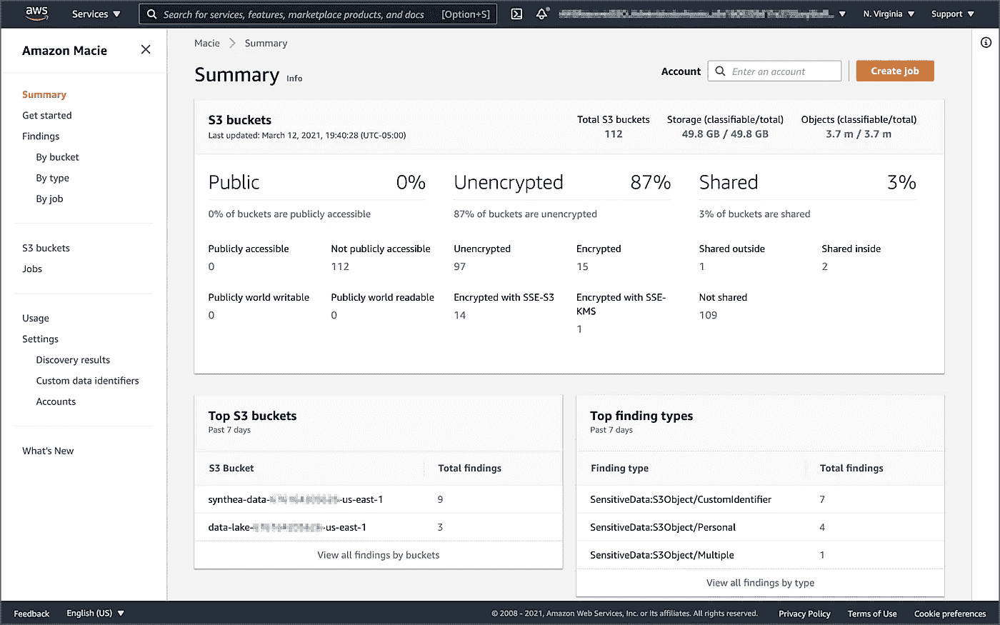

亚马逊 Macie 的摘要视图

# 数据发现和保护

在本文中，我们将部署一个自动化的数据检查工作流来检查位于 S3 的数据湖中的样本数据。亚马逊 Macie 将检查上传到加密 S3 桶的数据文件。如果在文件中发现敏感数据，这些文件将被移动到加密的隔离桶中，以供进一步调查。将发送电子邮件和短信提醒。该工作流将利用亚马逊 EventBridge、[亚马逊简单通知服务](https://aws.amazon.com/sns/)(亚马逊 SNS)、 [AWS Lambda](https://aws.amazon.com/lambda/) 和 [AWS 系统管理器参数存储](https://docs.aws.amazon.com/systems-manager/latest/userguide/systems-manager-parameter-store.html)。

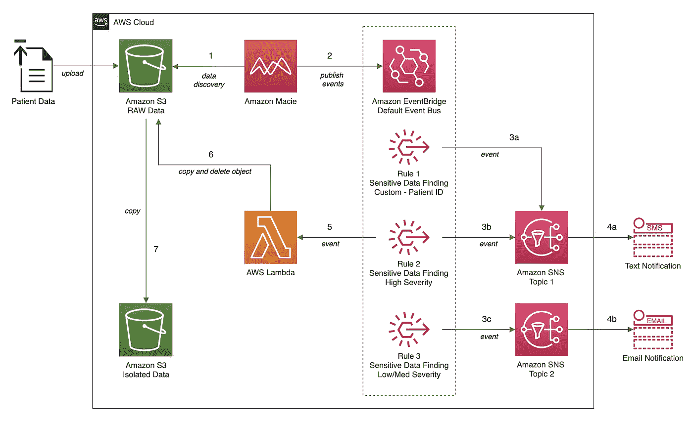

Macie 数据检查工作流程架构

## 源代码

使用这个`git clone`命令，下载这篇文章的 [GitHub 库](https://github.com/garystafford/macie-demo)到你的本地环境。

```
git clone --branch main --single-branch --depth 1 --no-tags \
    https://github.com/garystafford/macie-demo.git
```

这篇文章的 AWS 资源可以使用 [AWS 云形成](https://aws.amazon.com/cloudformation/)来部署。为了跟进，您需要安装最新版本的 [Python 3](https://www.python.org/downloads/) 、 [Boto3](https://boto3.amazonaws.com/v1/documentation/api/latest/guide/quickstart.html#installation) 和 [AWS CLI 版本 2](https://docs.aws.amazon.com/cli/latest/userguide/install-cliv2.html) 。

## 抽样资料

我们将使用 MITRE 公司免费提供的合成患者数据。这些数据是由 MITRE 的开源合成患者生成器 [Synthea](https://synthetichealth.github.io/synthea/#technology-landing) 生成的，该生成器对合成患者的病史进行建模。Synthea 数据以多种数据标准导出，包括 [HL7 FHIR](http://hl7.org/fhir/) 、 [C-CDA](https://www.healthit.gov/policy-researchers-implementers/consolidated-cda-overview) 和 CSV。我们将在这篇文章中使用 CSV 格式的数据文件。从 [Synthea](https://synthetichealth.github.io/synthea/#technology-landing) 网站下载并解压缩 CSV 文件。

```
REMOTE_FILE="synthea_sample_data_csv_apr2020.zip"wget "https://storage.googleapis.com/synthea-public/${REMOTE_FILE}"unzip -j "${REMOTE_FILE}" -d synthea_data/
```

十六个 CSV 数据文件包含总共 471，852 行数据，包括列标题。

```
*> wc -l *.csv* 598 allergies.csv
    3,484 careplans.csv
    8,377 conditions.csv
       79 devices.csv
   53,347 encounters.csv
      856 imaging_studies.csv
   15,479 immunizations.csv
   42,990 medications.csv
  299,698 observations.csv
    1,120 organizations.csv
    1,172 patients.csv
    3,802 payer_transitions.csv
       11 payers.csv
   34,982 procedures.csv
    5,856 providers.csv
        1 supplies.csv
  ------------------------------
  **471,852 total**
```

## Amazon Macie 自定义数据标识符

为了演示 Amazon Macie 的一些高级特性，我们将使用三个[自定义数据标识符](https://docs.aws.amazon.com/macie/latest/user/custom-data-identifiers.html)。根据 Macie 的文档，自定义数据标识符是您定义的一组标准，反映了您组织的特定专有数据，例如，员工 id、客户帐号或内部数据分类。我们将创建三个自定义数据标识符来检测特定 Synthea 格式的患者 ID、美国司机号和美国护照号列。

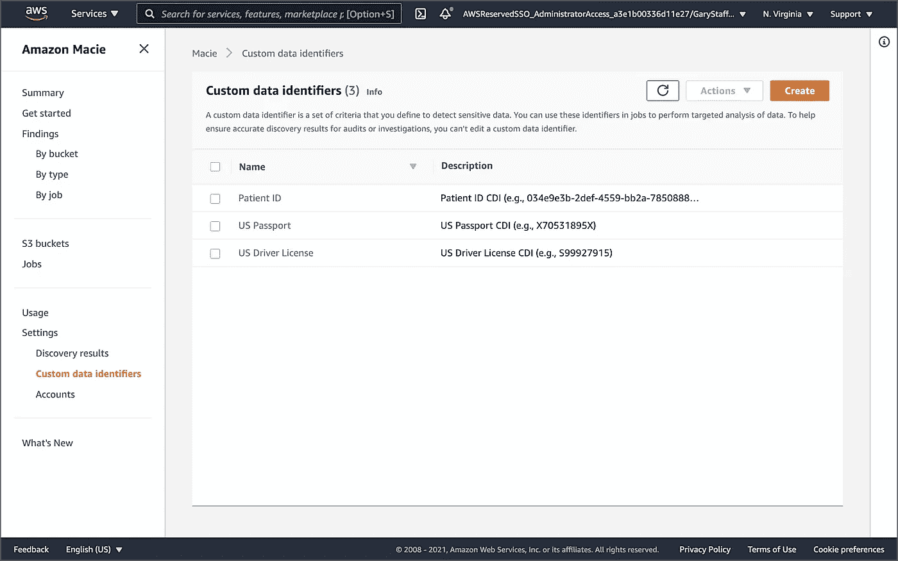

Post 的三个自定义数据标识符

本文中的自定义数据标识符使用了正则表达式( *regex* )和关键字的组合。标识符设计用于处理结构化数据，如 CSV 文件。如果这些关键字中的任何一个出现在存储文本的列或字段的名称中，或者文本在字段值中这些单词之一的最大匹配距离内，Macie 将报告与 regex 模式匹配的文本。Macie [支持](https://docs.aws.amazon.com/macie/latest/user/custom-data-identifiers.html#custom-data-identifiers-regex-support)Perl 兼容正则表达式(PCRE)库提供的 regex 模式语法的子集。

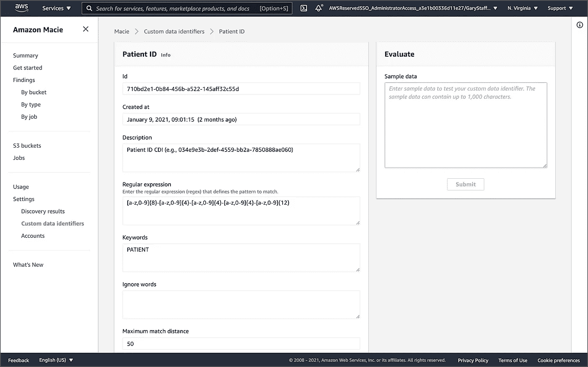

患者 ID 自定义数据标识符控制台

## 启用 Macie

在使用本演示的资源创建 CloudFormation 堆栈之前，您需要从 AWS 管理控制台启用 Amazon Macie，或者使用带有`enable-macie`命令的`[macie2](https://awscli.amazonaws.com/v2/documentation/api/latest/reference/macie2/index.html)` API 和 AWS CLI。

```
aws macie2 enable-macie
```

您的多帐户 [AWS 组织](https://aws.amazon.com/organizations/)也可以启用 Macie。`enable-organization-admin-account`命令指定一个账户作为 AWS 组织的委托 Amazon Macie 管理员账户。有关更多信息，请参见[在 Amazon Macie 中管理多个账户](https://docs.aws.amazon.com/macie/latest/user/macie-accounts.html)。

```
AWS_ACCOUNT=111222333444aws macie2 enable-organization-admin-account \
    --admin-account-id ${AWS_ACCOUNT}
```

## 云形成堆栈

要使用提供的模板`[cloudformation/macie_demo.yml](https://github.com/garystafford/macie-demo/blob/main/cloudformation/macie_demo.yml)`创建 CloudFormation 堆栈，请运行以下 AWS CLI 命令。您需要将电子邮件地址和电话号码作为输入参数。当 Macie 产生[敏感数据发现](https://docs.aws.amazon.com/macie/latest/user/findings-types.html#findings-sensitive-data-types)时，这些参数值将用于发送电子邮件和文本警报。

*在继续之前，请确保您了解创建 CloudFormation 堆栈的所有潜在成本和安全影响。*

```
SNS_PHONE="+12223334444"
SNS_EMAIL="your-email-address@email.com"

aws cloudformation create-stack \
  --stack-name macie-demo \
  --template-body file://cloudformation/macie_demo.yml \
  --parameters ParameterKey=SNSTopicEndpointSms,ParameterValue=${SNS_PHONE} \
  ParameterKey=SNSTopicEndpointEmail,ParameterValue=${SNS_EMAIL} \
  --capabilities CAPABILITY_NAMED_IAM
```

如 AWS CloudFormation 控制台所示，新的`macie-demo`栈将包含 21 个 AWS 资源。

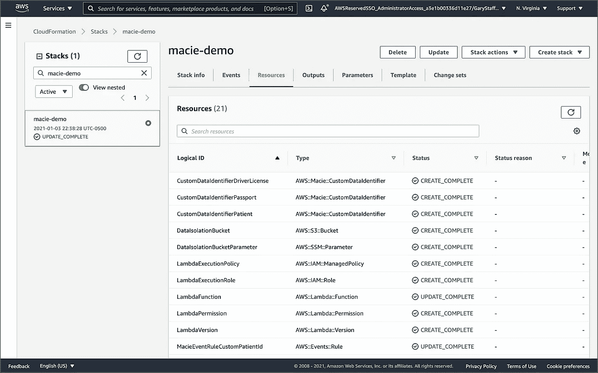

成功创建云形成堆栈

## 上传数据

接下来，随着栈的部署，将 CSV 格式的数据文件上传到加密的 S3 桶，代表您的数据湖。目标 S3 时段具有以下命名约定，`synthea-data-<aws_account_id>-<region>`。您可以从 [AWS Systems Manager 参数存储库](https://docs.aws.amazon.com/systems-manager/latest/userguide/systems-manager-parameter-store.html)中检索两个新的 bucket 名称，它们是由 CloudFormation 使用`ssm` API 编写的。

```
aws ssm get-parameters-by-path \
  --path /macie_demo/ \
  --query 'Parameters[*].Value'
```

使用以下`ssm`和`s3` API 命令上传数据文件。

```
DATA_BUCKET=$(aws ssm get-parameter \
    --name /macie_demo/patient_data_bucket \
    --query 'Parameter.Value')aws s3 cp synthea_data/ \
    "s3://$(eval echo ${DATA_BUCKET})/patient_data/" --recursive
```

您应该在 S3 存储桶中找到 16 个 CSV 文件，总共大约 82.3 MB。

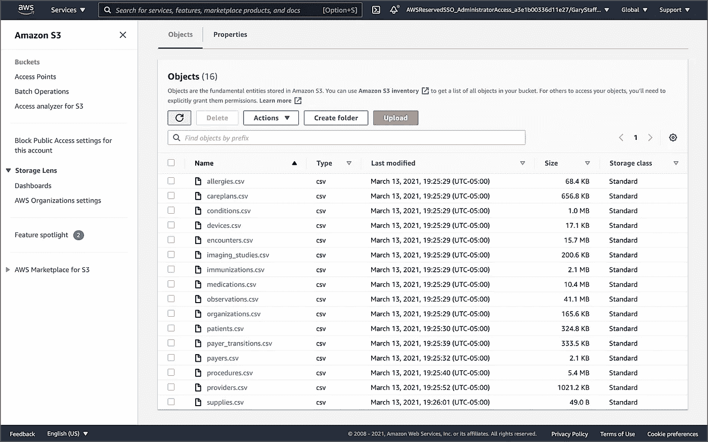

合成患者数据文件上传至 S3

## 敏感数据发现作业

随着 CloudFormation 堆栈的创建和患者数据文件的上传，我们将创建两个敏感数据发现作业。这些作业将扫描加密 S3 存储桶的内容以查找敏感数据，并报告结果。根据[文档](https://docs.aws.amazon.com/macie/latest/user/discovery-jobs.html)，您可以将敏感数据发现作业配置为仅运行一次以进行按需分析和评估，或者重复运行以进行定期分析、评估和监控。在本次演示中，我们将使用 AWS CLI 创建一次性敏感数据发现作业。我们还将使用 AWS SDK for Python (Boto3)创建一个重复的敏感数据发现作业。这两个作业也可以在 Macie 的作业控制台中创建。

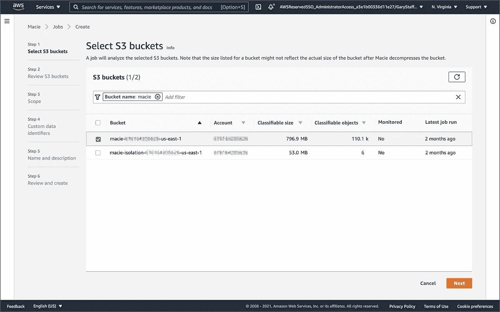

创建新作业 Macie 的作业控制台

对于这两个敏感数据发现作业，我们将包括三个自定义数据标识符。每个自定义数据标识符都有一个唯一的 ID。我们将需要这三个 id 来创建两个敏感数据发现作业。您可以使用 AWS CLI 和`macie2` API 来检索这些值。

```
aws macie2 list-custom-data-identifiers --query 'items[*].id'
```

接下来，修改`[job_specs/macie_job_specs_1x.json](https://github.com/garystafford/macie-demo/blob/main/job_specs/macie_job_specs_1x.json)`文件，添加三个定制数据标识符 id。此外，更新您的 AWS 帐户 ID 和 S3 时段名称(第 3–5、12 和 14 行)。请注意，由于所有的患者数据文件都是 CSV 格式，我们将只检查文件扩展名为`csv`的文件(第 18–33 行)。

上面的 JSON 模板是使用标准的 AWS CLI `generate-cli-skeleton`命令生成的。

```
aws macie2 create-classification-job --generate-cli-skeleton
```

要使用上述 JSON 模板创建一次性敏感数据发现作业，请运行以下 AWS CLI 命令。将根据当前时间动态生成唯一的作业名称。

```
aws macie2 create-classification-job \
    --name $(echo "SyntheaPatientData_${EPOCHSECONDS}") \
    --cli-input-json file://job_specs/macie_job_specs_1x.json
```

在 Amazon Macie 作业控制台中，我们可以看到一个一次性敏感数据发现作业正在运行。采样深度为 100 时，运行该作业需要几分钟时间。可以调整`samplingPercentage` [作业属性](https://docs.aws.amazon.com/macie/latest/APIReference/jobs.html#jobs-properties)来扫描任意百分比的数据。如果该值小于 100，Macie 会随机选择要分析的对象，直到达到指定的百分比，并分析这些对象中的所有数据。

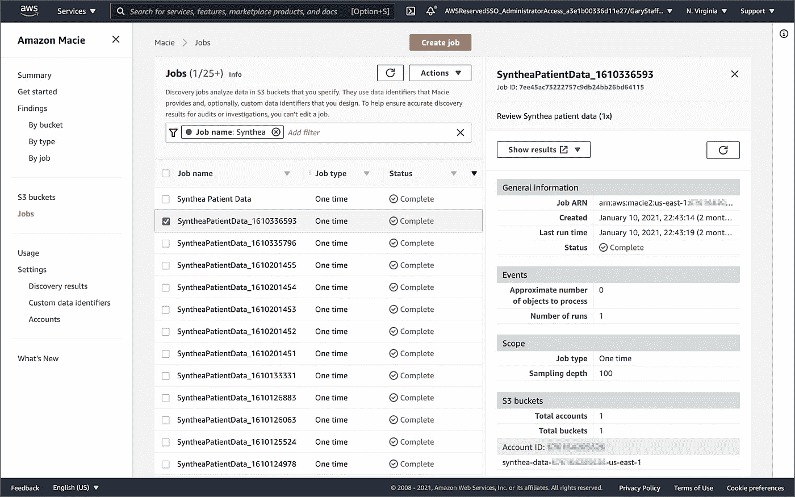

一次性敏感数据发现作业正在运行

一旦工作完成，[的调查结果](https://docs.aws.amazon.com/macie/latest/user/findings.html)将会出现在梅西的调查结果控制台上。除了 Macie 的[管理数据标识符](https://docs.aws.amazon.com/macie/latest/user/managed-data-identifiers.html)之外，使用三个自定义数据标识符，在 S3 的 Synthea 患者数据文件中应该总共有十五个发现。应该有六个高严重性调查结果和九个中等严重性调查结果。其中，三个属于个人查找类型，七个属于自定义标识符查找类型，五个属于多重查找类型，同时具有个人和自定义标识符查找类型。

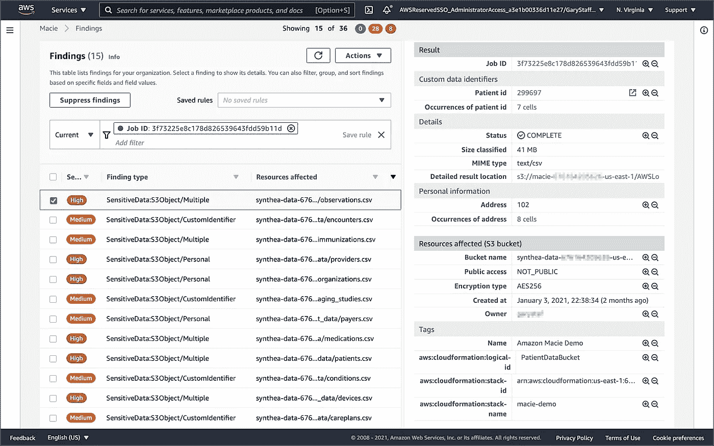

Macie 的结果控制台显示一次性作业的结果

## 隔离高严重性发现

我们部署的数据检查工作流使用 AWS Lambda 函数`macie-object-mover`，将所有具有高严重性发现的数据文件隔离到第二个 S3 存储桶。违规文件被复制到隔离桶，并从源桶中删除。

## 亚马逊事件桥

根据 Macie 的[文档](https://docs.aws.amazon.com/macie/latest/user/findings-publish-event-schemas.html)，为了支持与其他应用程序、服务和系统的集成，例如监控或事件管理系统，Amazon Macie 会自动将发现结果发布到 [Amazon EventBridge](https://aws.amazon.com/eventbridge/) 作为发现事件。Amazon EventBridge 是一个无服务器的事件总线，它使得使用从您的应用程序、集成的软件即服务(SaaS)应用程序和 AWS 服务生成的事件来大规模构建事件驱动的应用程序变得更加容易。

CloudFormation 堆栈中包括三个 Amazon EventBridge 规则。根据发现的类型和严重性，每个规则都将发现事件链接到电子邮件或文本消息警报。如果发现的严重性很高，EventBridge 规则`macie-rule-high`会触发 Lambda`macie-object-mover`，将文件移动到隔离状态。亚马逊 SNS 也发送 SMS 文本消息。

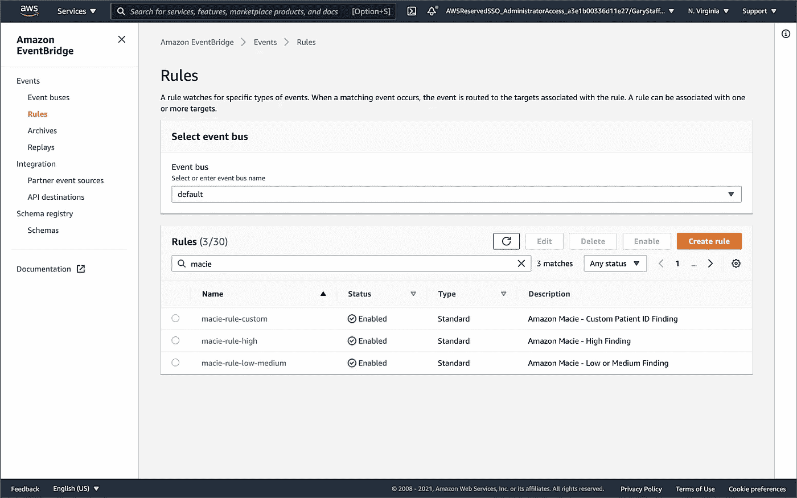

Post 的事件规则，显示在 Amazon EventBridge 控制台中

每个 EventBridge 规则都包含一个事件模式。事件模式用于过滤特定模式的传入事件流。当 Macie 发现基于任何自定义数据标识符`macie-rule-custom`时触发的 EventBridge 规则使用如下所示的事件模式。该模式检查触发事件的三个自定义数据标识符名称之一的查找事件。

```
{
  "source": [
 **"aws.macie"**  ],
  "detail-type": [
 **"Macie Finding"**  ],
  "detail": {
    "classificationDetails": {
      "result": {
        "customDataIdentifiers": {
          "detections": {
            "name": [
 **"Patient ID",
              "US Passport",
              "US Driver License"**            ]
          }
        }
      }
    }
  }
}
```

包含高严重性发现的六个数据文件将由 Lambda 移动到隔离桶，由 EventBridge 触发。

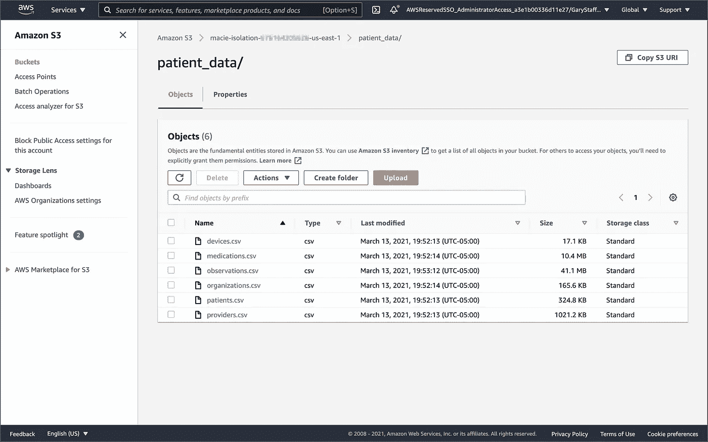

包含具有高严重性发现的数据文件的隔离存储桶

## 计划的敏感数据发现作业

数据源通常在重复的基础上交付数据，例如夜间数据馈送。对于这些类型的数据源，我们可以安排敏感数据发现作业按计划运行。在本演示中，我们将使用用于 Python 的 AWS SDK(boto 3)创建一个计划作业。与基于 AWS CLI 的一次性作业不同，您不需要修改项目的脚本，`[scripts/create_macie_job_daily.py](https://github.com/garystafford/macie-demo/blob/main/scripts/create_macie_job_daily.py)`。Python 脚本将检索您的 AWS 帐户 ID 和三个自定义数据标识符 ID。Python 脚本然后运行`[create_classification_job](https://boto3.amazonaws.com/v1/documentation/api/latest/reference/services/macie2.html#Macie2.Client.create_classification_job)`命令。

要创建计划的敏感数据发现作业，请运行以下命令。

```
python3 ./scripts/create_macie_job_daily.py
```

`scheduleFrequency`参数被设置为`{ 'dailySchedule': {} }`。该值指定运行作业的每日重复模式。`create_classification_job`命令的`initialRun`参数被设置为`True`。这将导致新作业在创建后立即分析所有符合条件的对象，此外还会每天进行分析。

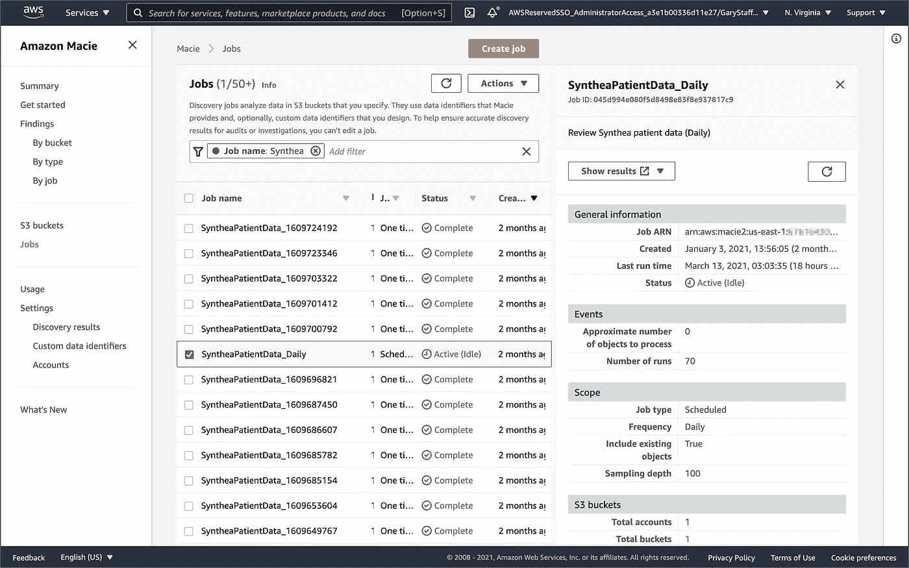

处于活动/空闲状态的计划敏感数据发现作业

# 结论

在这篇文章中，我们了解了如何使用 Amazon Macie 来发现和保护亚马逊 S3 的敏感数据。我们学习了如何使用自动化来根据 Macie 的发现触发警报，并根据发现的类型隔离数据文件。邮政的数据检查工作流程可以很容易地整合到现有的数据湖摄取管道，以确保传入数据的完整性。

这篇博客代表我自己的观点，而不是我的雇主亚马逊网络服务公司(AWS)的观点。所有产品名称、徽标和品牌都是其各自所有者的财产。