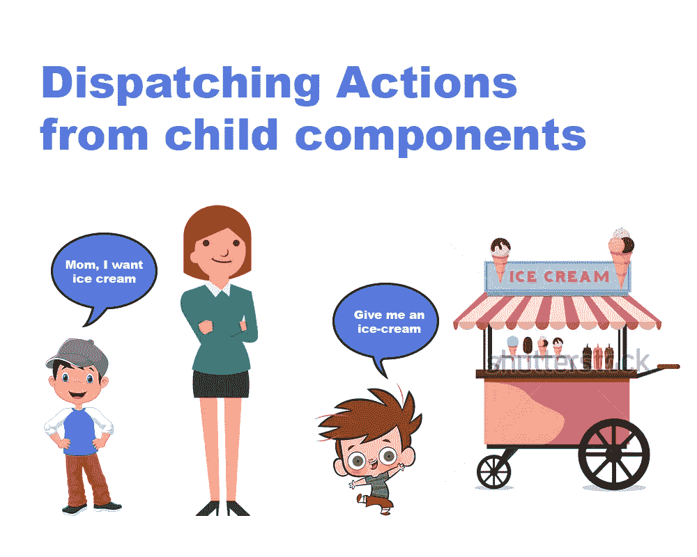
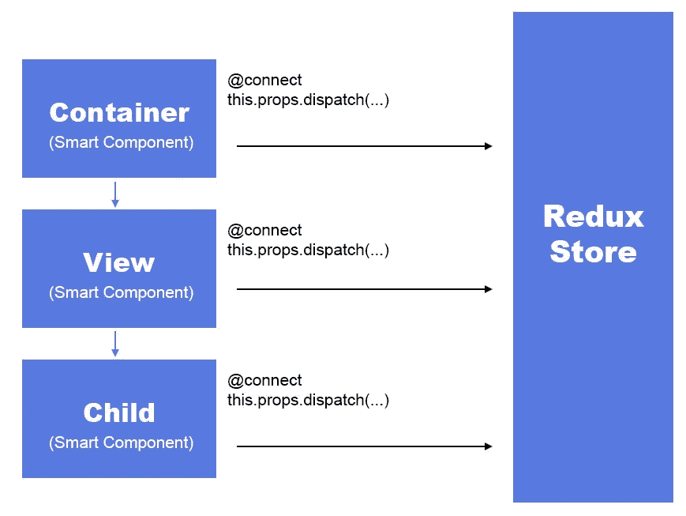
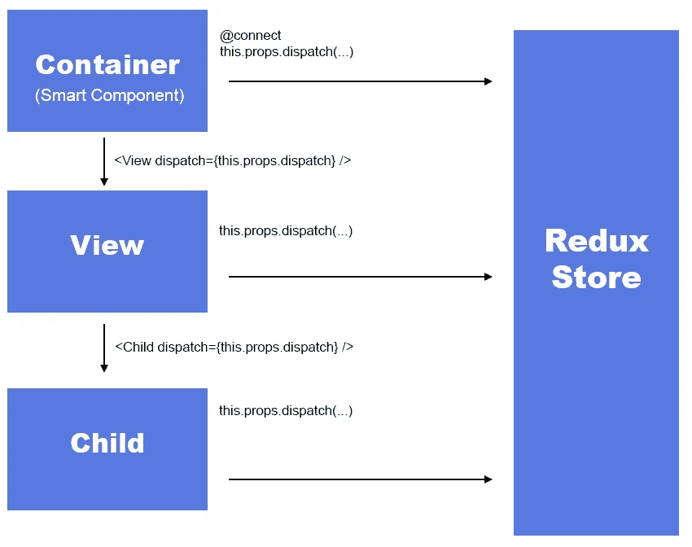
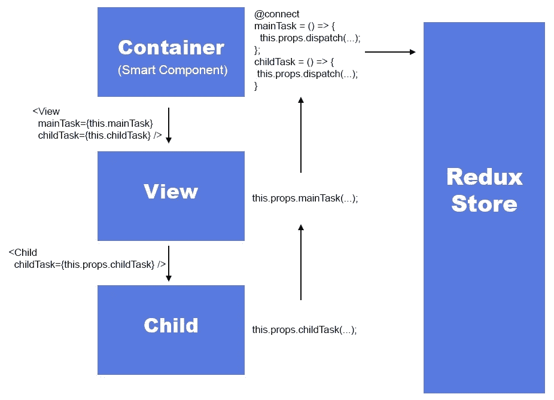
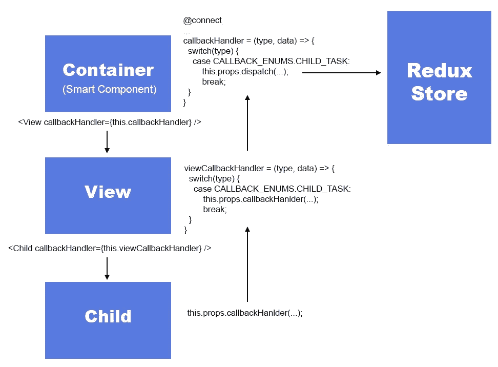

# 从子组件调度操作

> 原文：<https://itnext.io/dispatching-actions-from-child-components-bd292a51f176?source=collection_archive---------0----------------------->



在 React-Redux 设置中，我们有使用 connect 注释连接到 store 的容器。该容器包含视图或其他子组件。子组件可以从视图向下 n 层。并且通常需要子组件来分派动作。

## 我已经讨论了实现这一点的 4 种方法:

1.  直接方法(不太正确的方法…)
2.  通过调度功能作为道具(好吧，但仍然不是一个好主意..)
3.  将回调函数传递给 child(差不多了，但是稍后事情会变得混乱……)
4.  带有枚举的单个回调函数(我建议的解决方案…)

## **直接进场**

因此，要从任何组件调度操作，您需要访问调度函数。因此，首先想到的是将 connect 注释放在子组件中，并分派操作。



直接从子组件调用动作

**但是，有几个问题:**

1.  子组件成为智能组件。
2.  重用子组件变得很困难。
3.  所有子组件都需要知道动作类型和 redux 存储结构
4.  让每个组件访问存储不是一个合适的 react-redux 架构。

## 通过调度功能作为道具

将分派功能从容器传递到子功能可以解决让我们的每个子组件都成为智能组件的问题。

**my container . jsx**

```
@connect(store => ({ myStore: store.myStore }))
class MyContainer extends Component {render() {
    return (
      <MyComponent
        **dispatch={this.props.dispatch}**
      />
  }
}
```

***my components . jsx***

```
class MyComponent extends Component {
  static propTypes = {
    dispatch: PropsTypes.func,
  } onButtonClick = () = {
    this.props.dispatch(MyActions.BUTTON_CLICKED, data);
  } render() {
    return (
      <div>
        <button onClick={this.onButtonClick}>        
        // implement component view
      </div>
    )
  }
}
```



将分派直接传递给所有子动作和调用动作

在这种方法中，我们不再需要将子组件声明为智能组件，并且该组件可以重用，但是它仍然无法解决其他问题:

1.  子组件仍然需要知道 redux 结构和动作类型。
2.  父节点将无法控制子节点的功能。

## **将回调函数传递给子组件**

牢记好的实践，我们应该只从容器中调用所有的动作。为此，我们可以将回调函数作为道具传递给子组件。所以每个子组件都有一个在 prop-types 中定义的回调函数列表。父节点可以将函数引用传递给子节点。

***my container . jsx***

```
@connect(store => ({ myStore: store.myStore }))
class MyContainer extends Component { onTaskStart = (payload) => {
    this.props.dispatch(MyActionTypes.TASK_START, payload);
  } onTaskEnd = (payload) => {
    this.props.dispatch(MyActionTypes.TASK_END, payload);
  } render() {
    return (
      <MyComponent
        **onTaskStart={this.onTaskStart}
        onTaskEnd={this.onTaskEnd}**
      />
  }
}
```

***my component . jsx***

```
class MyComponent extends Component {
  static propTypes = {
    onTaskStart: PropsTypes.func,
    onTaskEnd: PropTypes.func,
  } render() {
    return (
      <div>
        // implement component view
      </div>
    )
  }
}
```



将每个动作的回调函数分别从容器传递给子动作

这给了我们一些优势

1.  子组件可以通过其属性类型清楚地指定它向父组件公开的所有任务或功能。
2.  孩子不需要担心动作的功能或调用哪个动作。
3.  父母可以选择实现或忽略某些功能。
4.  子组件可以根据需要使用 prop-type 来强制实现某些功能。

虽然这有时是大多数开发人员的首选方法，但您很快就会遇到一些明显的缺点:

1.  随着功能的增加，将如此多的函数引用从容器传递到子组件看起来很糟糕。
2.  当子组件超过一层或两层时，想象通过所有层传递所有的函数引用属性。
3.  在一个内部子组件中添加一个功能需要将容器中的所有组件更改为该子组件文件。对于任何中等规模的项目容器来说，孩子可以很容易地超过 3 级，到这个时候，你已经敲你的头或放弃。

## 带有枚举的单个回调函数

查看以前的实现，我想提出一个解决方案，它具有像调度一样的单个函数回调的优点，并且将控制权交给父组件，同时不需要进行太多的代码更改来在任何子组件中添加新功能。我是这样实现的:

**my container . jsx**

```
@connect(store => ({ myStore: store.myStore }))
class MyContainer extends Component { **callbackHandler = (type, data) => {
    switch(type) {
      // will come to back to this later on
    }
  }** render() {
    return (
      <**MyMainView**
        **callbackHanlder={this.callbackHandler}**
      />
    }
  }
}
```

MyContainer 连接到存储并访问调度功能。它不是传递分派函数本身，而是传递一个函数引用 callbackHandler()。

***MyMainView.jsx***

```
import { 
  CALLBACK_ENUMS,
}, ChildComponent from './MyChildComponent.jsx';// merged list of all possible enums, also from child
**const VIEW_CALLBACK_ENUMS = {
  ...CALLBACK_ENUMS,
  MAIN_VIEW_TASK: 'MY_MAIN_VIEW/MAIN_VIEW_TASK',
};**class MyMainView extends Component { // handle only the requst from the child compoenents
  // it either choose to bubble to the parent or choose to stop the request
  // it can manipulate the data passed to parent if required.

  **viewCallBackHandler = (type, data) => {
    switch(type) {
      case CALLBACK_ENUMS.CHILD_MAIN_TASK:** // manipulate data if required **this.props.callbackHandler(type, data);
        break;** **case CALLBACK_ENUMS.CHILD_SECONDARY_TASK:** // choose to ignore this action **break;** **default:** // bubble up all other actions to parent **this.props.callbackHandler(type, data);
      }
  };** onViewButtonClick = () => {
    this.props.callbackHandler(
      VIEW_CALLBACK_ENUMS.MAIN_VIEW_TASK,
      data,
    );
  };render() {
    return (
      <div>
        <Button 
          onClick={this.onViewButtonClick}
        >
          Main Container Button
        </Button>
        <ChildCompoenent 
          **callbackHandler={this.viewCallBackHandler}**
          // callbackHandler={this.props.callbackHandler}
          // if parent need not filter out child's requests
        /> 
      </div>
    )
  }
}export default MyMainView;
export {
  VIEW_CALLBACK_ENUMS as CALLBACK_ENUMS,
};
```

MyMainView 可以包含子组件以及它自己的具有功能的视图。viewCallbackHandler 充当子容器和父容器之间的中间过滤器。它是可选的，可以删除。在这种情况下，props 中的 callbackHandler 可以直接传递给孩子。这个过滤函数可以在将数据传递给父对象之前处理数据，甚至可以选择忽略某些请求。默认情况下，此函数中未显式处理的任何请求都会传递给父级。所有请求都可以由类型唯一标识，该类型是在组件本身中描述的枚举。

这里要注意的另一件事是 VIEW_CALLBACK_ENUMS 如何合并子元素及其自身的所有 enum。这确保了所有级别的所有子组件的所有枚举都被合并并传递到父容器。

***mychildcomponent . jsx***

```
// list of all possible enums in child
**const VIEW_CALLBACK_ENUMS = {
  CHILD_MAIN_TASK: 'MY_CHILD/CHILD_MAIN_TASK',
  CHILD_SECONDARY_TASK: 'MY_CHILD/CHILD_SECONDARY_TASK',
};**class MyChildComponent extends Component { onMainButtonClick = () => {
    **this.props.callbackHandler(
      VIEW_CALLBACK_ENUMS.CHILD_MAIN_TASK,
      data,
    );**
  }; onSecondaryButtonClick = () => {
    **this.props.callbackHandler(
      VIEW_CALLBACK_ENUMS.CHILD_SECONDARY_TASK,
      data,
    );**
  }; render() {
    return (
      <div>
        <Button 
          onClick={this.onMainButtonClick}
        >
          Child Main Button
        </Button>
        <Button 
          onClick={this.onSecondaryButtonClick}
        >
          Child Secondary Button
        </Button>
      </div>
    )
  }
}export default MyChildComponent;
export {
  VIEW_CALLBACK_ENUMS as CALLBACK_ENUMS,
};
```

MyChildComponent 只导出了自己的一组枚举。所有动作都由 props 中的 callbackHandler 函数处理。子节点不需要知道父节点如何处理这些动作，也不需要知道 redux 结构或任何动作类型。

MyChildComponent 只是一个可重用的视图组件，它的所有操作都由函数 callbackHandler 作为 props 传递，所有功能类型都作为枚举导出。

***现在让我们回到 MyContainer.jsx callbackHandler 函数:***

```
import { CALLBACK_ENUMS }, MyMainView from './MyMainView.jsx';// ...callbackHandler = (type, data) => {
  switch(type) {
     case CALLBACK_ENUMS.CHILD_MAIN_TASK:
        this.props.dispatch(MyActions.childMainTask(data);
        break;
     case CALLBACK_ENUMS.MAIN_VIEW_TASK:
        this.props.dispatch(MyActions.childMainTask(data);
        break; }
}
```



将一个回调函数从容器向下传递给所有子容器

你想知道优势吗？

1.  子组件现在是哑组件，不需要知道 redux 结构或动作类型。
2.  子组件可以在任何地方轻松重用，因为它们不依赖于任何严格的动作类型。
3.  如果你想添加一个功能到下三层的子容器中，你只需要在子容器和主容器中进行修改。只要不想过滤或操纵动作数据，所有的中间级别都不必担心。
4.  父组件可以选择对来自子组件的任何预处理或阻止操作进行过滤。
5.  父容器可以跟踪从它的视图传递的所有动作。
6.  父容器可以从所有级别访问其子容器的所有枚举。因此，我们可以很容易地了解这个视图实现了哪些功能。
7.  所有动作最终只能从容器中调度。世界终于又好了！！！

## 结论

在一个中等规模的项目中，这种方法非常适合我。特别是在添加新功能时会变得非常混乱，这种方法只需要在两个文件中进行更改。它把所有的动作调用放在一个地方，用枚举和所有子组件的适当公开的功能来保持代码的整洁。