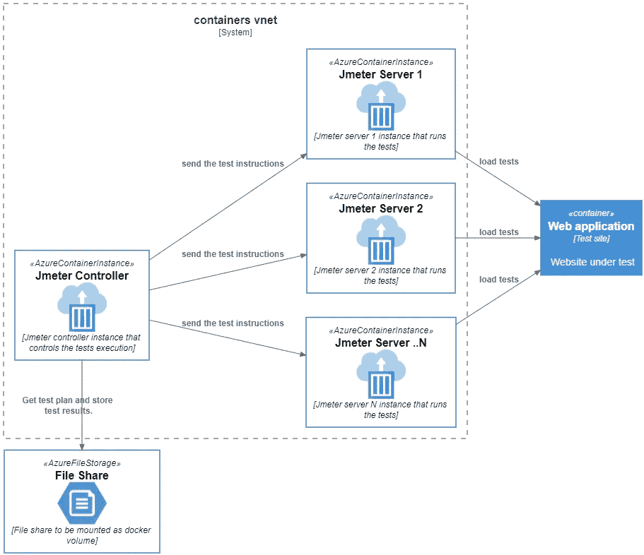
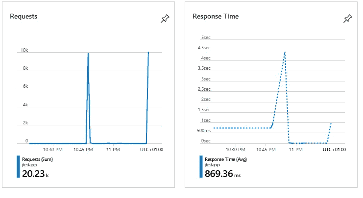
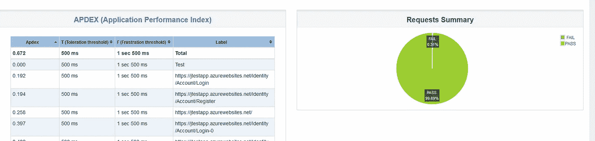

# 使用 JMeter 和 Azure 容器实例进行分布式测试

> 原文：<https://itnext.io/distributed-testing-with-jmeter-and-azure-container-instances-d0ef658086ad?source=collection_archive---------1----------------------->

当开发 web 应用程序时，您希望确保您的产品已经准备好处理成功和流量，这就是为什么负载测试和压力测试对于确保 web 应用程序的性能和可伸缩性非常重要。

现在有大量的负载测试解决方案，有商业的也有免费的，所以你可以考虑在这个时候什么是最适合你的项目的。负载测试并不总是 CI/CD 管道的一部分，通常是为季节性事件启动的，如报税、夏季销售、黑色星期五、圣诞节等。因此，许多项目选择免费的解决方案，这不会给财务带来额外的负担，但会给经过测试的 web 应用程序带来负担:)

在这篇文章中，我想分享我的分布式测试方法，使用 [Apache JMeter](https://jmeter.apache.org/) 、 [Docker](https://www.docker.com/) 和 [Azure 容器实例](https://azure.microsoft.com/en-gb/services/container-instances/)。我更喜欢这种设置，因为您可以在相对较短的时间内以相对较低的价格、相对较低的工作量创建高负载。

好吧，好吧，我知道你已经在想:“哦，来吧！说重点，你这个该死的******！”。整个想法并不新颖，简单来说就是这样:

使用 JMeter 和 Azure 容器实例进行分布式测试

JMeter 控制器实例正在向 JMeter 服务器发送测试和必要的指令，这些服务器正在我们的测试网站上创建负载。为了设置和运行这个程序，我们用 JMeter 在非 Gui 模式下构建了两个 Docker 映像——JMeter 控制器映像和 JMeter 服务器映像。然后，我们在一个容器实例中运行控制器，并根据需要启动尽可能多的服务器(工作器)实例。为了使控制器更容易访问工作节点，它们被放置在同一个虚拟网络和子网中。因为我们需要一些地方来保存我们的测试文件、日志和测试报告，所以我们将 Azure 文件共享作为卷安装到我们的容器中。当我们的基础设施被填充时，控制器节点向工作节点发出命令，它们开始向我们的 web 应用程序施加负载。在测试执行之后，报告存储在我们的文件共享中。

出于演示的目的，我部署了一个简单的 Asp.net 核心应用程序，具有注册和登录功能，并从 6 个工作人员那里运行测试，其中每个工作人员在 10 秒内添加 40 个用户的负载。因为我的测试访问了几个页面，所以在峰值负载时会产生 10k 个请求。观察响应时间如何变化也很有趣。

测试执行后，日志和测试报告存储在我们的 Azure 文件共享中，看起来有点像这样。

可以使用 [Azure Storage Explorer](https://azure.microsoft.com/en-us/features/storage-explorer/) 下载报告，或者我们可以在脚本的末尾添加一个下载命令(最后我有点懒)。使用不同的 JMeter 插件\插件也有很多调整/升级报告的可能性。JMeter 社区真的很好，很有帮助。

为了自动化整个过程，我准备了 Docker 文件和一个运行 Azure CLI 命令的 PowerShell 脚本。这个脚本提供所有的基础设施，然后运行测试。由于它运行的是 Azure CLI 命令，如果有必要，它可以很容易地转换成其他 shell 脚本——我使用 PowerShell 是因为我目前在 Windows 上工作。我将在下面列出脚本中的主要步骤:

1.  为测试设置创建 Azure 资源组。
2.  创建虚拟网络和子网。
3.  创建存储帐户。
4.  创建文件共享并获取访问密钥。
5.  将 JMeter 测试计划上传到文件共享。
6.  为控制器和服务器构建和推送 docker 映像。
7.  使用 JMeter 服务器映像创建和运行容器实例，并收集它们的 IP 地址。
8.  使用 Jmeter 控制器映像创建实例并运行测试。

> 注意，所有必要的参数，如`TEST_DIR, TEST_FILE, SERVERS`都作为环境变量传递给 docker 容器。

要获得完整的解决方案，请查看我的 [Github 库](https://github.com/f1xxxer/jmetertests)，不要犹豫修改脚本，甚至发送一些拉请求；)

> 另外，在运行脚本之前，不要忘记使用`az login`登录 azure。

GL&HF