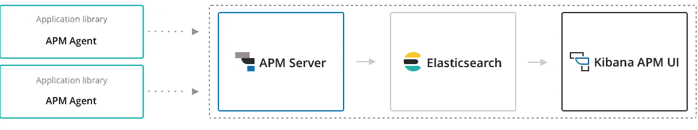
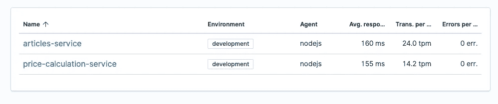
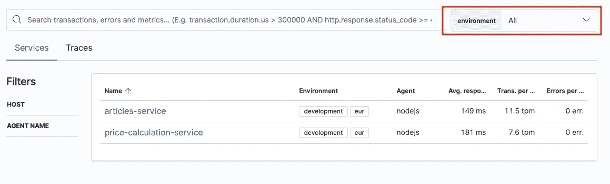
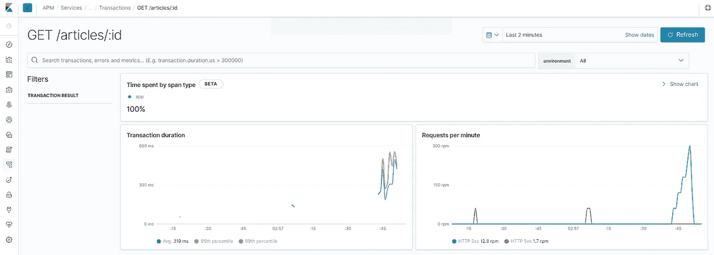

# 使用 Node 在您的 Kibana 中进行分布式跟踪。射流研究…

> 原文：<https://itnext.io/distributed-tracing-in-your-kibana-with-nodejs-610c9f07b4b4?source=collection_archive---------0----------------------->

分布式跟踪是一种用于分析和监控应用程序的方法，尤其是那些使用微服务架构构建的应用程序。分布式跟踪有助于查明故障发生的位置以及导致低性能的原因。此外，它可以用来可视化和理解微服务之间的通信，而无需额外的文档(这通常很快就会过时)。

在很长一段时间里有两个主要选项可供选择，它们是[齐普金](https://zipkin.io/)和[耶格](https://www.jaegertracing.io/)。但是在弹性堆栈中有一只相对较新的野兽叫做 [APM](https://www.elastic.co/products/apm) 。通过使用 Elastic APM，可以在 Elasticsearch 中存储分布式跟踪信息，并在 Kibana 中将其可视化。如果你已经使用了 Elasticsearch 和 Kibana 来记录日志，这是非常有用的，因为它打开了一个现成的解决方案来链接日志和你的跟踪信息。您不必再在系统之间跳转来关联您的日志和跟踪。

# 高层架构



图像取自 [APM 文档](https://www.elastic.co/guide/en/apm/get-started/current/images/apm-architecture-cloud.png)

**APM 代理**

APM 代理实际上是您的服务的一部分，它收集跟踪数据并将其发送到 APM 服务器。Elastic team 已经为最流行的编程语言(例如 Go、Node)创建了一堆代理。JS，。NET、Java 等)。受支持代理和相应文档的完整列表可在 [APM 文档](https://www.elastic.co/guide/en/apm/agent/index.html)中找到。

**APM 服务器**

APM 服务器负责处理来自代理的请求。它执行验证、安全扫描、创建有效文档并将其存储到弹性搜索索引中。

**弹性搜索**

它是分布式搜索和分析引擎。简单地说，你可以把它当作一种数据库。

**基巴纳**

与 Elasticsearch 配合使用的丰富可视化平台。

# 将 APM 代理添加到节点。JS 服务

将 APM 代理添加到您现有的服务中非常容易，并且只需要最少的更改。

首先，它应该被添加到一个应用程序。

```
npm install elastic-apm-node --save
```

下一步是添加并启动代理。

```
const apm = require('elastic-apm-node').start({
  serviceName: 'my-awesome-service',
  serverUrl: 'http://localhost:8200',
})
```

这里最重要的是，它应该是你在应用中要求的第一个模块(详情见下文)。节点。启动期间的 JS APM 代理工具库。它包装节点。JS 核心服务和安装的外部库能够自动启动、配置和结束事务和跨度。可以在 [elastic-apm-node 库](https://github.com/elastic/apm-agent-nodejs/tree/v3.3.0/lib/instrumentation/modules)和官方[文档](https://www.elastic.co/guide/en/apm/agent/nodejs/current/supported-technologies.html)中找到插装模块的列表。作为开发人员，您实际上可以通过将[*disable instrumentation*配置](https://github.com/elastic/apm-agent-nodejs/tree/v3.3.0/lib/instrumentation/modules)传递给代理来禁用任何特定模块的插装，甚至可以通过[*instrument*](https://www.elastic.co/guide/en/apm/agent/nodejs/3.x/configuration.html#instrument)*属性完全禁用插装。*

*APM 代理已经启动并正在运行。它为传入的 HTTP 请求启动和完成事务，为出站请求、外部存储调用创建跨度，将相应的 HTTP 头传递给下一个服务(上下文传播)等，而无需服务开发人员提供任何额外的显式代码行。*

*我宁愿提一下*开始*功能可能包括[吨设置](https://www.elastic.co/guide/en/apm/agent/nodejs/2.x/configuration.htmlhttps://www.elastic.co/guide/en/apm/agent/nodejs/2.x/configuration.html)。因此，对代理进行细粒度的配置是可能的。来自 Elastic 的人们通过提供相当灵活的方法在配置方面做得很好。所以可以通过代码使用全局设置、环境变量和配置。设置在[中应用，优先级如下](https://github.com/elastic/apm-agent-nodejs/blob/v3.3.0/lib/config.js#L212-L218):*

*   *通过环境变量传递的选项— **最高优先级***
*   *传递给 *agent.start()的选项**
*   *全局配置文件中的选项*
*   *默认选项—最低优先级*

*回到凝视 APM 代理。有一句话是这样的:*

# *APM 代理使用建议*

*这些建议是基于我个人对 Node 的体验。JS 弹性 APM 剂。*

***检查交易和跨度明细***

*如果打开了检测，那么准备好查看代理收集的数据。例如，APM 代理存储入站 HTTP 请求的请求头和请求体。它还根据您的请求对象等中的信息添加当前用户信息。存在以下问题:*

1.  *存储无谓的信息会增加弹性搜索的内存消耗*
2.  *存储敏感信息。令牌和其他敏感信息通常是通过头传递的。(幸运的是，90%的情况下 APM 服务器会删除此类信息)*
3.  *代理将用户 id、名称和电子邮件添加到事务中，如果它能够在请求对象中找到这些信息的话。例如，您的应用程序使用 passport，passport 将用户信息存储在 *request.user，*中。因此，如果没有明确指定用户，APM 代理将从请求中获取值。存储这样的信息可能是 GDPR 的问题*

***使用标签和海关***

*有可能向交易和跨度添加附加信息。它们是标签和习俗。它们之间的主要区别是标签是索引的(可搜索的)，而海关不是。*

*标签示例:*

*   *系统在跟踪前已经有一个关联 id ( [如何添加关联 id](https://medium.com/@evgeni.kisel/add-correlation-id-in-node-js-applications-fde759eed5e3) )。因此，correlation id 是添加到所有事务中的一个很好的标签。*
*   *蓝绿色，金丝雀释放。信息也可以存储在标签中，以区分不同类型的服务。甚至可以使用 APM 代理中的[全局标签设置](https://github.com/nodejs/node/issues/22360)来设置这种标签。*

*海关的例子:*

*   *存储与上下文相关的信息，这些信息在搜索过程中没有任何意义，但通过提供一些特定于应用程序的上下文来帮助分析。*

***处理多集群环境***

*如果有多个集群(例如，针对特定客户或特定位置的独立集群)，那么可以肯定的是，应该在交易中跟踪关于集群的信息，以便能够根据该数据进行过滤。实际上有两种方法可以跟踪这些数据。*

*   *第一个选项是通过标签设置集群名称。使用这种方法，在 Kibana 的服务页面上，每个服务只有一个记录。*

**

*   *第二个选项是通过[环境](https://www.elastic.co/guide/en/apm/agent/nodejs/current/configuration.html#environment)代理参数设置集群名称。在这种情况下，您可以很容易地在 Kibana 中按环境进行过滤。所有页面上都有一个专用的快速过滤器。*

**

***检查资源消耗***

*当采用跟踪时，确保它是在没有抽样事务的情况下进行测试的。内存消耗可能会增加。就我个人而言，我有过几次内存泄漏，幸运的是很快就被修复了。*

***支持采样率快速切换***

*实际上，让跟踪一直处于全功率状态是没有意义的。在直接性能研究期间，通常以全功率使能。其余时间，它应该以 10-20%的功率工作，以减少弹性搜索的无谓负载。10–20%的功耗让您可以创建报告，并对系统的性能和问题有一个高层次的认识。*

*不幸的是没有“深度采样”/“采样传播”。这意味着如果有两个服务*服务 A* 和*服务 B* 并且一个调用另一个，并且两者都配置了采样速率，则采样分别应用于每个服务。这样做的副作用是，可能有 *ServiceA* 事务，但没有任何 *ServiceB* 事务，反之亦然。IMHO 的最佳情况是，如果根事务被持久化，那么它应该强制所有子事务被持久化，如果根事务没有被持久化，那么所有子事务也不应该被持久化。我称之为抽样传播。*

***用跟踪信息丰富日志记录***

*为了能够将日志记录和跟踪数据关联起来，需要用包括以下一个或多个字段的跟踪信息来丰富日志记录:*

*   **transaction.id**
*   **trace.id**
*   **span.id**

*代理提供 API 来为 currentation 事务 *apm.currentTraceIds.* 获取这些值，唯一的事情是将它们注入特定的记录器。*

*此外，将 *trace.id* 和 *transaction.id* 添加到响应头中是有意义的。*

***注意风俗习惯***

*大部分仪器通过[异步挂钩](https://nodejs.org/api/async_hooks.html)工作。所以请记住，由于 V8 的问题，插装对于使用自定义名称的库(例如，mongoose 使用自己的开箱即用的承诺)不起作用。关于这个问题的更多细节可以在这里找到:*

*   *[https://github.com/elastic/apm-agent-nodejs/issues/1550](https://github.com/elastic/apm-agent-nodejs/issues/1550)*
*   *[https://github.com/nodejs/node/issues/22360](https://github.com/nodejs/node/issues/22360)*

*猫鼬怎么修？*

*   *首先，需要将内置承诺注册为 mongoose 的默认承诺*

```
*mongoose.Promise = global.Promise;*
```

*   *使用`exec()`运行数据库操作*

```
*async function getDataNotTrackedByAPM() {
    const result = await Model.find();
    result result;
}async function getData() {
    const result = await Model.find().exec();
    result result;
}*
```

*如何确保代码中没有使用自定义名称？我有一个相当肮脏的方法，但它有助于迁移相当大的代码库(但它需要良好的测试覆盖)。*

```
*if (*process*.env.NODE_ENV !== `production`) {
    mongoose.Query.prototype.then = function() {
        throw new *Error*(
            `use exec() because requests cannot be tracked by APM Agent`,
        );
    };
}*
```

# *配置本地开发环境*

*使用 docker 可以轻松配置本地开发环境。它只需要两个文件和 docker:*

*   *apm-server.yml*

```
*apm-server:
  host:
    "0.0.0.0:8200"

output.elasticsearch:
  hosts:
    ["elasticsearch:9200"]*
```

*   *docker-compose.yml*

```
*version: "3"
services:
  elasticsearch:
    image: docker.elastic.co/elasticsearch/elasticsearch:7.4.0
    ports:
      - 9200:9200
      - 9300:9300
    environment:
      - discovery.type=single-node

  apm-server:
    image: docker.elastic.co/apm/apm-server:7.4.0
    depends_on:
      - elasticsearch
    environment:
      - output.elasticsearch.hosts=["elasticsearch:9200"]
    volumes:
      - "./apm-server.yml:/usr/share/apm-server/apm-server.yml:ro"
    ports:
      - 8200:8200

  kibana:
    image: docker.elastic.co/kibana/kibana:7.4.0
    depends_on:
      - elasticsearch
    ports:
      - 5601:5601
    environment:
      - ELASTICSEARCH_HOSTS=http://elasticsearch:9200*
```

*为了能够使用分布式跟踪，应该运行 docker-compose。然后通过[http://localhost:5601](http://localhost:5601)URL 打开 Kibana，找到 APM 选项卡，按照设置说明进行操作。*

*下面是一些简单的例子:*

****

# *结论*

*弹性 APM 解决方案非常合适，并且可以很容易地采用，因为已经实现的 APM 代理具有各种各样的“魔力”,可以最大限度地减少所需的服务开发人员工作量。如果已经有了 Kibana，这种解决方案还消除了添加额外可视化资源的不必要步骤。*

*有用的链接:*

*   *https://www.elastic.co/products/apm*
*   *[https://www . elastic . co/guide/en/APM/get-started/current/index . html](https://www.elastic.co/guide/en/apm/get-started/current/index.html)*
*   *[https://www.elastic.co/guide/en/apm/agent/nodejs/index.html](https://www.elastic.co/guide/en/apm/agent/nodejs/index.html)*
*   *[https://www.npmjs.com/package/elastic-apm-node](https://www.npmjs.com/package/elastic-apm-node)*
*   *[https://nodejs.org/api/async_hooks.html](https://nodejs.org/api/async_hooks.html)*
*   *[https://medium . com/Autodesk-TLV/async-hooks-a-whole-new-world-of-opportunities-a1 a6 daf 1990 a](https://medium.com/autodesk-tlv/async-hooks-a-whole-new-world-of-opportunities-a1a6daf1990a)*