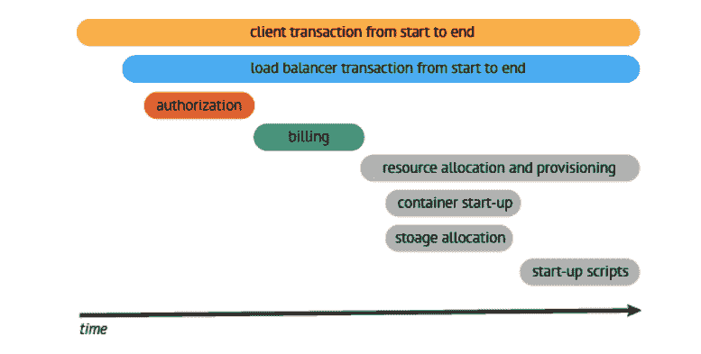
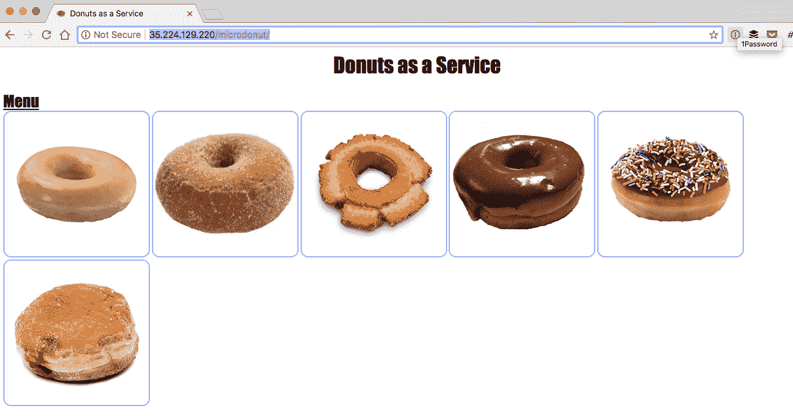
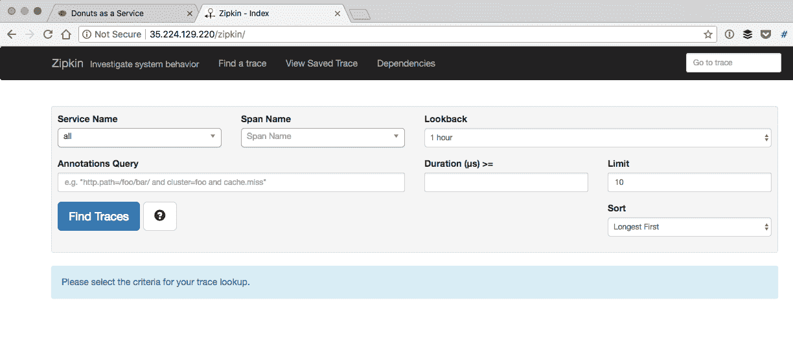
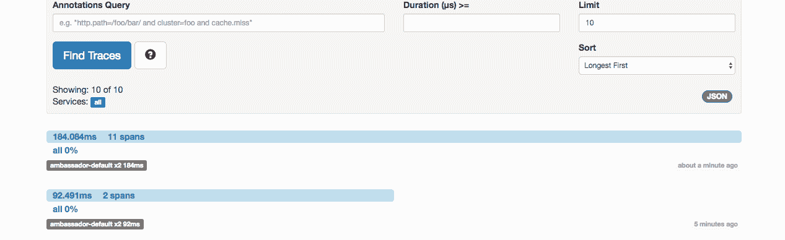
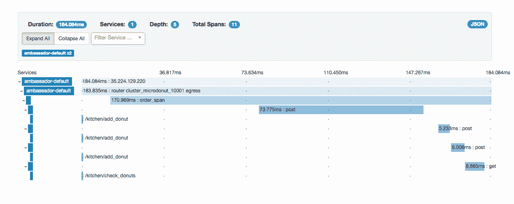

# 使用 Java“微数据点”、Kubernetes 和 Ambassador API 网关进行分布式跟踪

> 原文：<https://itnext.io/distributed-tracing-with-java-microdonuts-kubernetes-and-the-ambassador-api-gateway-c3e663e1f79a?source=collection_archive---------6----------------------->

分布式跟踪越来越被视为观察基于微服务的应用的必要组成部分，许多现代微服务语言框架都提供了对跟踪实现的支持，如 T2 的 Open Zipkin T3、T4 的 Jaeger T5、T6 的 Open census T7 和 T8 的 light step xPM T9。谷歌是第一批在 2010 年的一篇论文中谈论他们使用分布式跟踪的组织之一，该论文描述了他们的 [Dapper](https://research.google.com/archive/papers/dapper-2010-1.pdf) 实现，并且他们得出的基本要求之一是跟踪系统的无处不在的部署:

> 无处不在是很重要的，因为即使系统的一小部分没有被监控，跟踪基础设施的有用性也会受到严重影响

正如我之前所写的，许多工程师开始一个绿地项目或探索基于微服务架构的迁移时，通常从在边缘部署前端代理或 API 网关开始[以便动态地将流量路由到独立的服务](/using-api-gateways-to-facilitate-your-transition-from-monolith-to-microservices-c08fe3489237)。由于每个入站请求都流经该组件，因此边缘网关自然需要支持分布式跟踪，最好使用一个成熟的开放协议。

本文探讨了如何将开源 [Ambassador API Gateway](https://www.getambassador.io/) 提供的分布式跟踪支持添加到 Kubernetes 中运行的现有 open tracing Java "[micro donuts](https://github.com/opentracing-contrib/java-opentracing-walkthrough)"演示应用程序中。

# 从为什么开始？

正如 Cindy Sridharan 在她内容丰富的“[Monitoring in the Time of Cloud Native](https://medium.com/@copyconstruct/monitoring-in-the-time-of-cloud-native-c87c7a5bfa3e)”博客中所讨论的，分布式跟踪不仅被认为是现代可观测性的三大支柱之一(与指标监控和日志记录一起)，而且它为开发人员提供了更丰富的调试分布式系统的选项:

> 当请求流经分布式系统的各个组件时，跟踪可以捕获请求的生存期。支持使用额外的键值对来丰富正在传播的上下文，这使得在跟踪中编码应用程序特定的元数据成为可能，这可能会给开发人员带来更多的调试能力。

根据我构建和使用微服务的经验，在开发和生产中诊断问题时，跟踪非常有用。了解基于服务的应用程序的行为通常是一项重要的任务，当您将此与系统表现出的不确定性行为(尤其是在部署到云环境中时)或与不可靠的第三方的通信结合起来时，挑战只会更加严峻。至关重要的是，分布式跟踪可以让您了解应用程序中如何处理请求。

# 分布式跟踪 101

分布式跟踪背后的基本思想相对简单——请求所经过的特定拐点必须在系统中被识别并被检测。例如，这些拐点包括 API 网关、每个内部服务和数据存储或有状态的外部服务。必须协调和整理所有的跟踪数据，以提供请求的有意义的流程视图；这就是为什么您会听说使用相关性标识符来将相关的跟踪数据分组在一起，以便进行[更有意义的分析](https://thenewstack.io/opentracing-aims-clearer-view-processes-distributed-systems/):



CNCF 托管的 [OpenTracing API](http://opentracing.io/) 正在成为事实上的开放跟踪标准，有几个流行的开源框架实现了这一点，如 [OpenZipkin](https://zipkin.io/) 和 [Jaeger](https://www.jaegertracing.io/) ，以及商业选项如 [LightStep](https://lightstep.com/) 。许多微服务框架现在提供集成或兼容的跟踪实现。Java [Spring Boot](https://spring.io/projects/spring-boot) 栈为 [Spring Cloud Sleuth](https://cloud.spring.io/spring-cloud-sleuth/) 提供 Zipkin 集成，Golang [micro](https://micro.mu/) 框架提供 [OpenTracing wrappers](https://github.com/micro/go-plugins/blob/master/wrapper/trace/opentracing/opentracing.go) 。

# 使用大使 API 网关进行跟踪

最近，Kubernetes-native Ambassador API gateway[增加了分布式跟踪支持](https://www.getambassador.io/user-guide/tracing-tutorial)，它基于底层[特使代理](https://www.envoyproxy.io/docs/envoy/latest/intro/arch_overview/tracing)在其核心提供的功能。Ambassador 现在可以生成一个请求(关联)标识符，并填充 x-request-id HTTP 头。上游服务可以转发该报头，以便传播请求上下文，用于跟踪和统一聚合日志记录。

大使跟踪实现目前支持开放的 Zipkin 和兼容 Zipkin 的后端，如 Jaeger 和 Lightstep 的商业 xPM 产品。与 Envoy 一样，当使用 Zipkin tracer 时，Ambassador 会添加 [B3 HTTP 头](https://github.com/openzipkin/b3-propagation)，当使用 LightStep tracer 时， [x-ot-span-context HTTP 头](https://www.envoyproxy.io/docs/envoy/latest/configuration/http_conn_man/headers#config-http-conn-man-headers-x-ot-span-context)会被添加到任何向上游发送的请求中。

# 探索微点应用

OpenTracing 社区贡献了一系列非常有用的示例应用程序，这些应用程序使用提到的所有实现来演示分布式跟踪。“[Java-open tracing-walk through](https://github.com/opentracing-contrib/java-opentracing-walkthrough)”GitHub 存储库提供了一个“微点”示例，该示例为基于 web 的甜甜圈订购应用程序提供跟踪。这个例子被设计成通过 Maven 运行，不需要任何额外的基础设施，比如 Docker 和 Kubernetes。

MicroDonuts 应用程序是作为一个独立的应用程序执行的(具有一个静态的 void 主入口点)，但是它提供了几个 servlets 来模拟运行多个服务的[，这些服务可用于准备我们的甜甜圈订单:](https://github.com/danielbryantuk/java-opentracing-walkthrough/blob/master/microdonuts/src/main/java/com/otsample/api/ApiContextHandler.java#L37)

```
void registerServlets() {
  kitchenConsumer = new KitchenConsumer();
  addServlet(new ServletHolder(new OrderServlet(kitchenConsumer)), "/order");
  addServlet(new ServletHolder(new StatusServlet(kitchenConsumer)), "/status");
  addServlet(new ServletHolder(new ConfigServlet(config)), "/config.js");
    }
```

应用程序中的跟踪组件是使用 [OpenTracing Java SDK](https://github.com/opentracing/opentracing-java) 和[“勇敢”Zipkin Java SDK](https://github.com/openzipkin/brave) 实现的。根据指定的配置文件(更多信息见下文)，[应用程序类](https://github.com/danielbryantuk/java-opentracing-walkthrough/blob/master/microdonuts/src/main/java/com/otsample/api/App.java)初始化跟踪框架:

```
} else if ("zipkin".equals(tracerName)){
    OkHttpSender sender = OkHttpSender.create(
        "http://" +
            config.getProperty("zipkin.reporter_host") + ":" +
            config.getProperty("zipkin.reporter_port") + "/api/v1/spans");
    Reporter<Span> reporter = AsyncReporter.builder(sender).build();
    tracer = BraveTracer.create(Tracing.newBuilder()
        .localServiceName(componentName)
        .spanReporter(reporter)
        .build());
}
```

然后通过 HTTP 请求为 servlet 的每个创新创建跨度。如果您查看 ApiContextHandler 类，您将看到我对 OrderServlet 所做的修改，以便从当前的下游请求中提取跟踪头(这将在您通过 web 浏览器向应用程序发出请求后由 Ambassador 完成)，并将此 span 指定为您为每个油炸圈饼订单创建的新 span 的父 span:

```
[@Override](http://twitter.com/Override)
public void doPost(HttpServletRequest request, HttpServletResponse response) throws ServletException, IOException {
 **TextMap headersTextMap = new TextMapExtractAdapter(getHeadersInfo(request));
    SpanContext parentSpanCtx = GlobalTracer.get().extract(Format.Builtin.HTTP_HEADERS, headersTextMap);**try (Scope orderSpanScope = GlobalTracer.get()
            .buildSpan("order_span")
 **.asChildOf(parentSpanCtx)**
            .startActive(true)) {request.setAttribute("span", orderSpanScope.span());
...
```

完成这些修改后，我需要做的就是将应用程序打包并部署到 Kubernetes 上。

# 与大使一起在 Kubernetes 上部署微点

在 meetups 上使用 MicroDonuts 示例演示了跟踪概念之后，我经常被问及如何将这个应用程序打包以部署到 Kubernetes 上(因为这是许多组织在生产中运行应用程序的流行平台)。我热衷于测试新的 Ambassador 分布式跟踪功能，因此这提供了一个完美的借口，在 Docker 中打包 MicroDonuts 应用程序，并将其与 Ambassador 一起部署在 Kubernetes 上。

我在另一篇文章中提供了对我所采用的方法的深入探究(以及我所遇到的考验和磨难！)，但是本文关注的是结果，目标是让您在 10 分钟内开始使用示例。

首先从[https://github . com/danielbryantuk/Java-open tracing-walk through](https://github.com/danielbryantuk/java-opentracing-walkthrough)中克隆我的项目分叉版本，并导航到目录中

```
$ git clone [https://github.com/danielbryantuk/java-opentracing-walkthrough](https://github.com/danielbryantuk/java-opentracing-walkthrough) 
$ cd java-opentracing-walkthrough
```

您需要配置一个空的 Kubernetes 集群，并准备就绪。我通常使用[谷歌的 Kubernetes 引擎(GKE)](https://cloud.google.com/kubernetes-engine/) 和通过 [gcloud SDK](https://cloud.google.com/sdk/install) 配置的短暂实例，因为这以合理的价格提供了真正的集群体验。但是，您应该能够使用 minikube 或 Docker for Mac/Windows，只需进行最小的更改。

```
$ gcloud container clusters create ambassador-tracing-demo --preemptible
...
kubeconfig entry generated for ambassador-tracing-demo.
NAME                     LOCATION       MASTER_VERSION  MASTER_IP      MACHINE_TYPE   NODE_VERSION  NUM_NODES  STATUS
ambassador-tracing-demo  us-central1-a  1.9.7-gke.5     35.226.58.170  n1-standard-1  1.9.7-gke.5   3          RUNNING
$
$ # As all GKE clusters enable RBAC by default, create a cluster-admin clusterrolebinding 
$ # for your user account
$ kubectl create clusterrolebinding cluster-admin-binding-new \
--clusterrole cluster-admin --user [my.user.account@gmail.com](mailto:my.user.account@gmail.com)
```

尽管 Dockerfile 是一个带有 OpenJDK 8 JRE 的相当标准的 Java 映像，但您可以随意探索这个目录中的 docker file。接下来，导航到 kubernetes-ambassador 目录，其中包含引导演示所需的配置文件:

```
$ cd kubernetes-ambassador/
(master) kubernetes-ambassador $ ls -lsa
total 304
  0 drwxr-xr-x   8 danielbryant  staff    256 12 Aug 15:13 .
  0 drwxr-xr-x  11 danielbryant  staff    352  8 Aug 16:42 ..
  8 -rw-r--r--@  1 danielbryant  staff   2043  1 Aug 16:26 ambassador-rbac.yaml
  8 -rw-r--r--   1 danielbryant  staff    374  8 Aug 10:43 ambassador-service.yaml
  8 -rw-r--r--   1 danielbryant  staff   1145 12 Aug 15:10 microdonut.yaml
  8 -rw-r--r--   1 danielbryant  staff    576 12 Aug 14:53 tracing-config.yaml
  8 -rw-r--r--   1 danielbryant  staff   1037  8 Aug 11:16 zipkin.yaml
```

大使 API 网关部署和管理服务在 ambassador-rbac.yaml 文件中配置，外部[httpbin.org](https://httpbin.org/)服务的简单重写映射大使注释示例包含在 ambassador-service.yaml 文件中。

# 在 Kubernetes 部署 Zipkin 和大使

Zipkin 部署和服务是在 zipkin.yaml 文件中配置的，该文件使用 OpenZipkin Docker 映像。这个文件中有两个大使注释:一个 TracingService 指定负责收集 Zipkin 跟踪数据的服务，另一个映射允许您导航到 Zipkin UI 并在浏览器中检查跟踪。下面显示了该配置的摘录:

```
---
apiVersion: v1
kind: Service
metadata:
  name: zipkin
  annotations:
    getambassador.io/config: |
      ---
      apiVersion: ambassador/v0
      kind: TracingService
      name: /tracing/
      service: zipkin:9411
      driver: zipkin
      ---
      apiVersion: ambassador/v0
      kind: Mapping
      name: zipkin_mapping
      prefix: /zipkin/
      rewrite: ""
      service: zipkin:9411
```

在 microdonut.yaml 中定义的 MicroDonut 应用程序由一个服务和一个相关联的部署组成，该部署使用了我在[danielbryantuk/microd onut:1.3](https://hub.docker.com/r/danielbryantuk/microdonut/tags/)添加到 DockerHub 存储库中的容器。我还为服务的映射添加了一个大使注释，以便您可以通过 UI 订购一些甜甜圈。

如果您检查 microdonut.yaml 文件，您将看到我已经为 microdonut 容器指定了一个卷挂载，并用 configMap 对此进行了备份。ConfigMap 在 tracing-config.yaml 文件中定义，其内容用于配置 MicroDonut 应用程序的所有跟踪选项。如果您想从 Zipkin 更改为 Jaeger 跟踪，或者更改 Zipkin 收集器服务主机或端口，请编辑该文件。

```
---kind: ConfigMap
apiVersion: v1
metadata:
    name: tracing-config
data:
    tracer_config.properties: |
        public_directory=../client**// Selector for the below config blocks
        tracer=zipkin**// Jaeger config
        jaeger.reporter_host=localhost
        jaeger.reporter_port=5775**// Zipkin config
        zipkin.reporter_host=zipkin
        zipkin.reporter_port=9411**// LightStep config
        lightstep.collector_host=collector.lightstep.com
        lightstep.collector_port=80
        lightstep.access_token={your_token}
```

您可以部署 kubernetes-ambassador 目录下的 YAML 文件中指定的所有服务和配置，如下所示:

```
$ kubectl apply -f .
service "ambassador-admin" created
clusterrole "ambassador" created
serviceaccount "ambassador" created
clusterrolebinding "ambassador" created
deployment "ambassador" created
service "ambassador" created
service "microdonut" created
deployment "microdonut" created
configmap "tracing-config" created
service "zipkin" created
deployment "zipkin" created
```

现在，您可以通过 kubectl 查询所有的服务，但是如果使用 GKE，您可能需要等待一段时间，大使负载平衡器服务才能获得一个外部 IP(最初查询可能会导致“【T2”)

```
$ kubectl get svc
NAME               TYPE           CLUSTER-IP      EXTERNAL-IP      PORT(S)          AGE
ambassador         LoadBalancer   10.51.248.134   35.224.129.220   80:30306/TCP     1m
ambassador-admin   NodePort       10.51.245.207   <none>           8877:32035/TCP   1m
kubernetes         ClusterIP      10.51.240.1     <none>           443/TCP          1m
microdonut         ClusterIP      10.51.245.91    <none>           10001/TCP        1m
zipkin             NodePort       10.51.244.91    <none>           9411:31899/TCP   1m
```

您现在可以通过访问以下网址来查看 MicroDonut 网页:

`http://<external-ip>/microdonut/`



您也可以访问以下网站查看 Zipkin 仪表盘:

`http://<external-ip>/zipkin/`



一切都准备好了，现在你需要做的就是订购一些唐

# 追踪油炸圈饼

现在，为了看到一些有趣的痕迹，您需要订购一些甜甜圈。为此，只需点击 MicroDonut 网页上的几张甜甜圈图片，然后点击甜甜圈图片下方的图标“订购”。完成此操作后，您应该会在图标中看到一个倒计时，并显示甜甜圈准备阶段的一系列步骤(“添加”、“等待”、“烹饪”等)。随意下几个订单，尽管做这个的时候尽量不要太饿！


接下来，打开 Zipkin 仪表盘，点击“查找痕迹”。通过 Ambassador 的每一个请求(包括对 Zipkin dashboard 的任何请求)都会被跟踪，因此您必须确定一个与准备甜甜圈相关的跟踪。

通常，大多数具有 2 个跨度(两个服务跳)的较短跟踪与 Zipkin 仪表板相关，而具有 9+跳(多个服务跳，以及每个服务创建的多个跨度)的较长跟踪与 MicroDonut 应用程序相关。您可能需要订购几个甜甜圈，并快速切换到 Zipkin dash 来查找相关的跟踪，因为这些可能会在 UI 搜索结果中很快被 Ambassador 跟踪的其他请求所取代。

在下面的截图中，您可以看到在我的示例中，一个甜甜圈订单创建了 11 个跨度，用了 184.084 毫秒完成。



您可以点击跟踪，以获得更详细的请求处理情况，例如:



在这里，您可以看到 Ambassador 处理了入口请求，然后将该请求向上游传递到“order_span”开始的微节点服务。“ambassador-default”服务名在跟踪中清晰可见，我不确定为什么“microdonut”服务名没有出现，因为它看起来在 MicroDonut 应用程序的 [Zipkin (Brave / OpenTracing)配置](https://github.com/danielbryantuk/java-opentracing-walkthrough/blob/master/microdonuts/src/main/java/com/otsample/api/App.java#L98)中被正确指定。

需要注意的另一件有趣的事情是，即使您在订购和烹饪甜甜圈的过程中向同一个 MicroDonut 应用程序发出多个请求，每个请求都是通过 localhost loopback 适配器发出的进程外 HTTP 请求(因此不通过 Ambassador)，并且 span 信息由 Brave implement 传播，以便正确地连接所有这些跟踪。

# 下一步是什么？

给定这个示例应用程序和 Ambassador 配置，您应该能够毫不费力地启动和运行任何 Zipkin 兼容的应用程序。由于 Ambassador 将 Zipkin 头注入到任何上游请求中，任何识别这些头(并向前传播它们)的应用程序都应该是可跟踪的。

[示例 Java 代码](https://github.com/danielbryantuk/java-opentracing-walkthrough/tree/master/microdonuts)展示了如何使用 Brave 库实现 Zipkin 头处理(以及如何将[大使生成的 span 作为父 span](https://github.com/danielbryantuk/java-opentracing-walkthrough/commit/ec549bc5e7ffaf47d30b6ee4f7fb540df5815b96)附加到每个子 span)，我将在其他帖子中更详细地介绍我是如何修改 MicroDonut 示例的。然而，不要让这个例子是用 Java 编写的这一事实阻止了你。任何支持 Zipkin 的语言或框架都应该可以使用提供的配置开箱即用——您只需指定 Zipkin Kubernetes 服务主机和端口，就可以开始了！

您可以在 https://www . getambassador . io 了解更多关于 ambassador 的信息，并在 Ambassador 文档中了解 [Ambassador 分布式跟踪](https://www.getambassador.io/user-guide/tracing-tutorial)功能。如果你有任何问题，请加入我们的 [Slack](http://d6e.co/slack) ，在下面的评论中给我们留言，或者在 Twitter 上发 [@getambassadorio](https://twitter.com/getambassadorio) 。

*本文原载于* [*getambassador.io 博客*](https://blog.getambassador.io/distributed-tracing-with-java-microdonuts-kubernetes-and-the-ambassador-api-gateway-ace15b62a89e) *。*