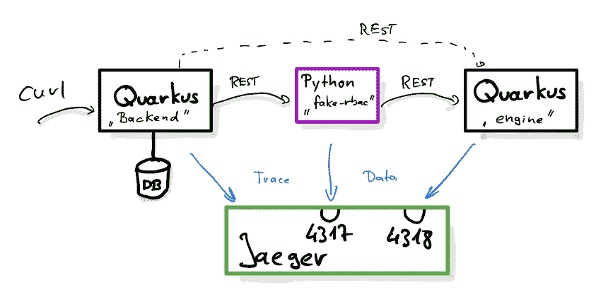
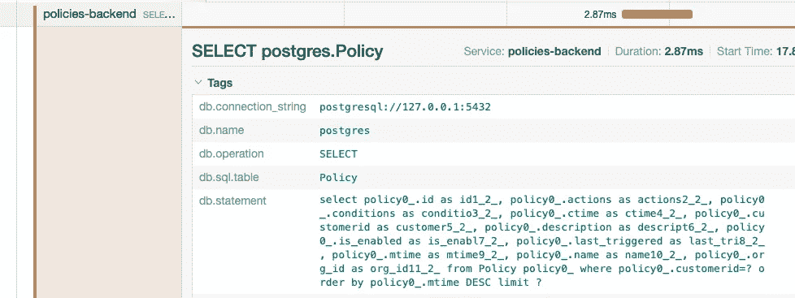
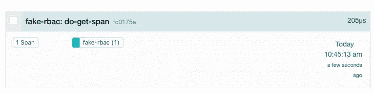
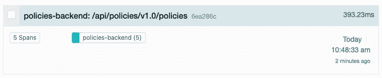

# 用 Quarkus、Python、Open Telemetry 和 Jaeger 进行分布式追踪(第 1 部分)

> 原文：<https://itnext.io/distributed-tracing-with-quarkus-python-open-telemetry-and-jaeger-part-1-2d83f761b786?source=collection_archive---------2----------------------->

在微服务世界中，没有简单的方法将调试器或分析器附加到一个组件上，以了解它为什么公开某种行为。剖析一个组件可能会发现这是其他人的问题。我过去曾经使用过 OpenTracing，但是现在这个已经被弃用了，而且 OpenTelemetry 是一个新的很酷的产品，我想去看看。下图显示了该帖子的整体设置:



一般设置

这个设置部分是一个真实的用例，因为我有一个基于 Quarkus 的应用程序“*后端*，它调用一个 Python 服务器“ *fake-rbac* ”。为了让事情变得更有趣，也为了便于学习，我还从 Python 应用程序向另一个基于 Quarkus 的服务“ *engine* ”发出了一个出站调用。让我们从后端 Quarkus 应用程序开始吧

## 将 OpenTelemetry 添加到我的 Quarkus *后端*应用程序

OpenTelemetry 上的 [Quarkus 指南是一个很好的起点。因为我已经有了基本代码，所以我继续将以下依赖项添加到我的 pom.xml 文件:](https://quarkus.io/guides/opentelemetry)

```
<dependency>
    <groupId>io.quarkus</groupId>
    <artifactId>quarkus-opentelemetry</artifactId>
</dependency>
<dependency>
    <groupId>io.quarkus</groupId>
    <artifactId>quarkus-opentelemetry-exporter-otlp</artifactId>
</dependency>
<dependency>
    <groupId>io.opentelemetry</groupId>
    <artifactId>opentelemetry-extension-trace-propagators</artifactId>
</dependency>
<dependency>
    <groupId>io.opentelemetry.instrumentation</groupId>
    <artifactId>opentelemetry-jdbc</artifactId>
</dependency>
<dependency>
    <groupId>io.opentelemetry</groupId>
    <artifactId>opentelemetry-extension-annotations</artifactId>
</dependency>
```

这看起来很多，我希望只有一个包含以上所有内容的*quar kus-open telemetry-all*扩展，但最终这并不重要，因为我必须添加一次这个，然后就完成了。

下一步是在 *application.properties* 中添加一些设置，然后我们就可以开始了。首先，我们设置跟踪收集器的位置，在新的 OpenTelemetry Line Protocol (OTLP)本地模式中，它将是 [Jaeger](https://www.jaegertracing.io) :

```
**quarkus.application.name**=backend
**quarkus.opentelemetry.enabled**=true
**quarkus.opentelemetry.tracer.exporter.otlp.endpoint**=http://127.0.0.1:4317
```

接下来，更改数据库连接以支持跟踪:

```
**quarkus.datasource.db-kind**=postgresql

**quarkus.datasource.jdbc.url**=jdbc:***otel***:postgresql://127.0.0.1:5432/postgres
**quarkus.datasource.jdbc.driver**=io.opentelemetry.instrumentation.jdbc.OpenTelemetryDriver
```

## 开始 Jaeger

[Jaeger](https://www.jaegertracing.io) 从 1.35 版本开始原生支持 [OTLP。当我在笔记本电脑上使用 docker-compose 启动一系列服务时，我有以下条目，它启用 OTLP 并打开端口 4317/4318(分别用于 grpc 和 http 传输)。查看](https://medium.com/jaegertracing/introducing-native-support-for-opentelemetry-in-jaeger-eb661be8183c) [Jaeger 文档了解更多部署](https://www.jaegertracing.io/docs/1.37/deployment/)选项。

```
**jaeger**:
  **image**: jaegertracing/all-in-one:1.37.0
  **ports**:
    - 16686:16686
    - 4317:4317
    - 4318:4318
  **environment**:
    **COLLECTOR_OTLP_ENABLED**: true
```

当我们现在点击*后端*上的 REST-endpoint，转到端口 16686 上的 Jaeger UI，搜索踪迹并点击现有的踪迹，我们将看到如下的可视化:


Jaeger 在单个过程中可视化一个轨迹

我们看到总处理时间为 26 毫秒，并且由此触发了 2 次数据库查询。我们还看到一些 RbacFilter 被调用。下面我就说说那个滤镜。

## 框架的自动检测

有趣的是，在没有任何代码更改的情况下，我们获得了被调用方法的计时，包括数据库调用的计时。OpenTelemetry 为常用的框架提供了大量的工具。上面我们已经引入了对*io . open telemetry . instrumentation:open telemetry-JDBC*的依赖，并稍微修改了 jdbc url，将 *otlp* 包含在其中，从而为我们的数据库调用获取数据。事实上，当我们单击其中一个调用的范围以展开详细信息时，我们甚至可以看到触发了什么查询:



Jaeger UI 中的数据库查询详细信息

自动插装不仅存在于 Quarkus(或者一般的 Java ),也存在于各种各样的编程语言和框架。

## 现在转到 Python

在我的项目中，我需要调用一个用 Python 编写的 RBAC(基于角色的访问控制)服务器。由于我想了解在该服务器中启用跟踪需要什么，我开始用内置的 Python http.server 包实现一个简单的 http-server(我很清楚其他服务器也存在，甚至 OpenTelemetry Python [*入门*](https://opentelemetry.io/docs/instrumentation/python/getting-started/) 也使用 Flask)。

尽管有[open telemetry-instrument](https://opentelemetry.io/docs/instrumentation/python/getting-started/#run-the-instrumented-app)的存在，我还是决定使用手动插装，以便更清楚地了解插装你自己的库所涉及的一些细节。

我不打算在这里分享完整的代码，你可以在 GitHub 上找到。相反，我将专注于核心部分。

我们要做的第一件事是从全局配置的工厂中获取一个 *tracer* 实例(我们稍后会谈到这个问题):

```
from opentelemetry import trace
tracer = trace.get_tracer(__name__)
```

然后，我们可以在服务器处理程序方法(do_GET)中使用它:

```
def do_GET(self):
    with tracer.start_as_current_span("do-get-span") as span:
        self.send_response(200)
        span.set_attribute("type", "json")
```

在这里，我们从跟踪器中启动一个*跨度*(基本上是上面 Jaeger 可视化中的一个棕色条)，然后在跨度上设置一个属性。然后，处理继续正常进行，一旦 do_GET 完成，span 就结束。

## 把数据发给耶格

OpenTelemetry 通过 OpenTelemetry API(我们刚刚看到的)将数据采集与 OpenTelemetry SDK 中对数据进行导出、批处理或采样等操作的部分分开。这意味着仅仅使用上面的 OpenTelemetry 还不知道如何处理跨度以及如何将跨度输出到 Jaeger。因此，我们必须在获取数据之前配置导出器:

```
# Set up exporting
#  First set the name of our service
resource = Resource(attributes={ SERVICE_NAME: "fake-rbac" })
# Configure the provider with the service name
provider = TracerProvider(resource=resource)
# Set up the OTLP exporter as processor
processor = BatchSpanProcessor(
            **OTLPSpanExporter(endpoint="http://localhost:4317"))**# Tell OTEL to use this processor
provider.add_span_processor(processor)# And finally tell the tracer to use this provider
trace.set_tracer_provider(provider)

tracer = trace.get_tracer(__name__)
```

首先，我们需要设置服务的名称。没有它也能工作，但耶格只会显示出*未知 _ 服务*这不是我们想要的。然后，我们建立了出口商。在这种情况下，我选择了 OTLP-Grpc 导出程序。还有一个 http/protobuf 变体，如果您的 grpc 库有问题，这可能是理想的。对于该变体，您将配置端点使用端口 4318，例如在[http://localhost:4318/v1/traces](http://localhost:4318/v1/traces)中。

当我现在使用 curl 访问我的服务时，我在 Jaeger 中看到一个很好的跟踪:



概述中对我们服务的跟踪

## 让我们连接电话

现在让我们触发后端调用 Python 服务，看看会发生什么



我看到了来自后端的跟踪，但没有提到假 rbac Python 服务。原因是我们还没有告诉我们的 Python 代码如何处理 trace-id 的传播。

而这(作为一个扣人心弦的:-)也是这个帖子的结尾。在[的下一篇文章](https://pilhuhn.medium.com/distributed-tracing-with-quarkus-python-open-telemetry-and-jaeger-part-2-d533e3a83703)中，我会谈到*后端*和*假 rbac* 之间的痕迹传播。请再次记住，我在这里“手动”做了很多工作，以显示通常隐藏在检测库中的细节。这些库当然对日常工作有很大的帮助，所以我不想鼓励不使用它们。

感谢[Jura ci paix o krhling](https://medium.com/u/31f1d3c010e9?source=post_page-----2d83f761b786--------------------------------)审阅本文。