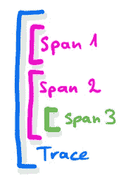
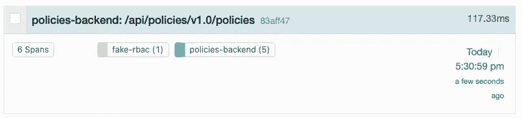
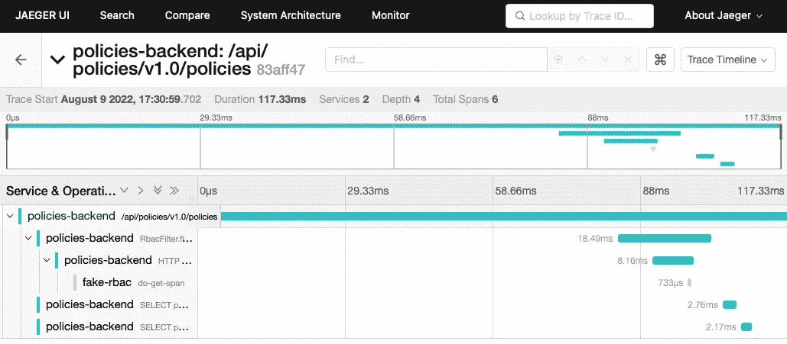
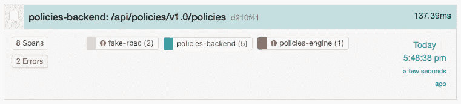
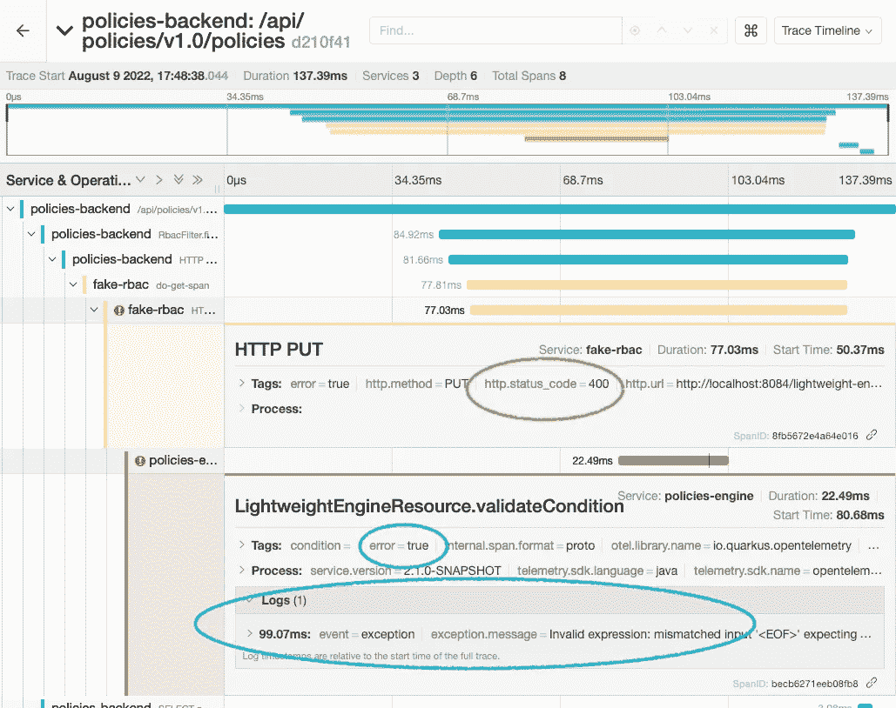

# 用 Quarkus、Python、Open Telemetry 和 Jaeger 进行分布式追踪(第 2 部分)

> 原文：<https://itnext.io/distributed-tracing-with-quarkus-python-open-telemetry-and-jaeger-part-2-d533e3a83703?source=collection_archive---------4----------------------->

在[的最后一部分](https://pilhuhn.medium.com/distributed-tracing-with-quarkus-python-open-telemetry-and-jaeger-part-1-2d83f761b786)中，我们看了一些 Quarkus 和 Python 代码，以获取我们转发给 Jaeger 的踪迹。不幸的是，这两者没有联系，因此我们无法获得完整的图片。让我们解决这个问题。



具有一些嵌入跨度的轨迹

每个轨迹和每个跨度都有一个唯一的 ID。span 另外还有 traceId 和它们的父 span 的 Id(你可以把一个 trace 想象成一个没有父 span)。在上图中，跨度 3 将跨度 2 作为父项，跨度 1 和跨度 2 都将蓝色轨迹作为其共同的父项。蓝色轨迹本身没有父轨迹。

这意味着能够将我们的 Python 代码链接到由*后端*启动的跟踪，我们需要告诉它跟踪 id 以及跨度的 id，这应该是 Python 代码的父跨度。一种常见的方法是在 http 头中传播该信息。有几个标准可以做到这一点，[所以一个新的标准被发明了](https://xkcd.com/927/)，W3C Tracecontext 。这里，在 http-requests 中发送一个单独的 header *traceparent* 。该标题包含所有必要的信息，如下所示([参考完整信息标准](https://www.w3.org/TR/trace-context/#trace-context-http-headers-format)):

```
version2-traceId32-parentId16-flags2
```

标题值由四个字段组成，用破折号分隔。每个字段由一个十六进制数表示，其中上面给出了位数。有了这些信息，我们现在可以从传入的请求中提取头部，并从中创建 SpanContext，然后当我们在 requesthandler 中创建 Span 时，它将被传递:

```
**inc_trace = self.headers["traceparent"]**
ctx = {}
span_context = None
if inc_trace is not None:
    span_context = extract_trace_data(**inc_trace**)
    ctx = trace.set_span_in_context(NonRecordingSpan(**span_context**))
with tracer.start_as_current_span("my-span",**context=ctx**) as span:
    self.send_response(200)
    ...
```

我们首先获取 http-header，然后将它传递给提取器代码，提取器代码创建一个 *SpanContext* 对象，当我们在 handler 方法中启动新的 span to 时，将使用这个对象。有了这样的改变，我们可以在*后端*上触发另一次运行，并在 Jaeger 中获得预期的结果:



包括假 rbac 和后端的跟踪概述

在详细视图中，我们还可以清楚地看到橙色的 *fake-rbac* 的范围



## 从 Python 到 Quarkus 的传播

前面的成功留给我们从 Python 到第二个 [Quarkus](https://quarkus.io) 服务的传播，如第一篇文章的第一幅图所示。现在我们知道如何手工操作，我使用了一个快捷方式，并且使用了[*请求*库检测](https://opentelemetry-python-contrib.readthedocs.io/en/latest/instrumentation/requests/requests.html)。代码中的设置非常简单:只需在设置 *TraceProvider* 之前添加下面一行，就大功告成了。

```
RequestsInstrumentor().instrument()
```

对后端的另一个请求产生以下结果:



包含服务的更复杂的跟踪

我们看到了所有 3 个服务，但是概述显示了 2 个错误。这是怎么回事？让我们看看跟踪的细节，并用红色感叹号展开两个跨度。



具有扩展详细信息的跟踪视图

我们可以在跟踪视图中看到，fake-rbac 对引擎的 PUT 请求导致了 400“无效请求”返回代码(用绿色标记)。因此，对请求库的检测将 span 标记为错误。

## 将跨度标记为错误

当我们查看返回 400 代码的引擎范围时，我们可以看到它也被标记为错误，并且它包含一条日志消息，告诉我们请求失败的原因。为此，*引擎*服务器代码需要一些工具:

```
} catch (Exception e) {
    Span span = Span.*current*();    
    span.recordException(e);
    span.setStatus(StatusCode.*ERROR*);
    span.setAttribute("condition", condition);
```

这将检索当前范围，然后记录异常。这不会自动将跨度标记为错误，所以我们明确地这样做。在最后一步中，导致异常的 condition 元素被存储为 attribute，这样它就会出现在 span 的标记中，就像上面用空值做的那样。

## 更多…

你可以在 GitHub 上获得[完整的 Python 代码。在下一篇](https://github.com/pilhuhn/fake-rbac)[帖子](/distributed-tracing-with-quarkus-python-open-telemetry-and-jaeger-part-3-79137543b2c5)中，我将讨论如何在 Kafka 中使用 OpenTelemetry。

你可以在介质上找到第 1 部分。再次感谢[Jura ci paix o krhling](https://medium.com/u/31f1d3c010e9?source=post_page-----d533e3a83703--------------------------------)审阅这篇文章。