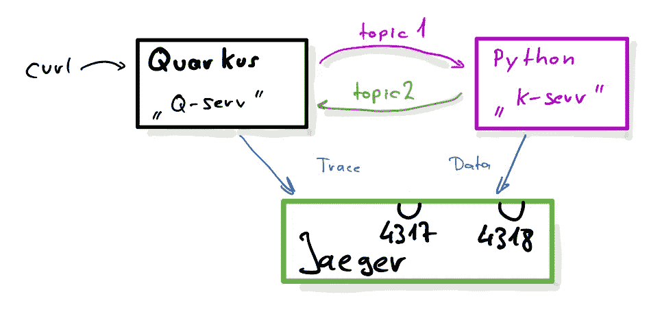
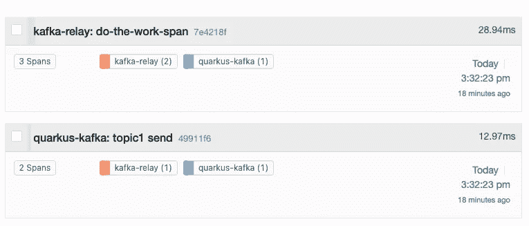
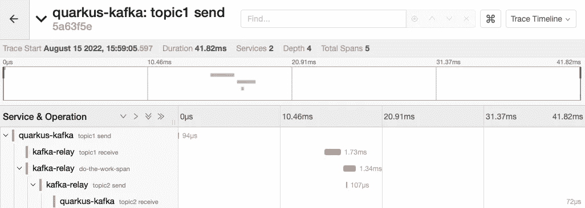
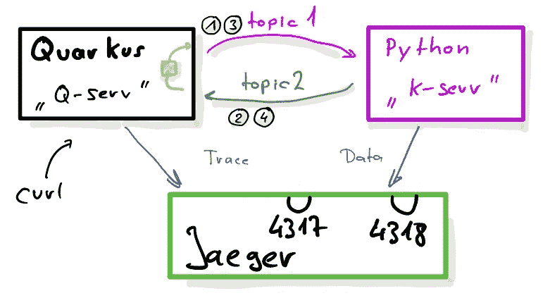
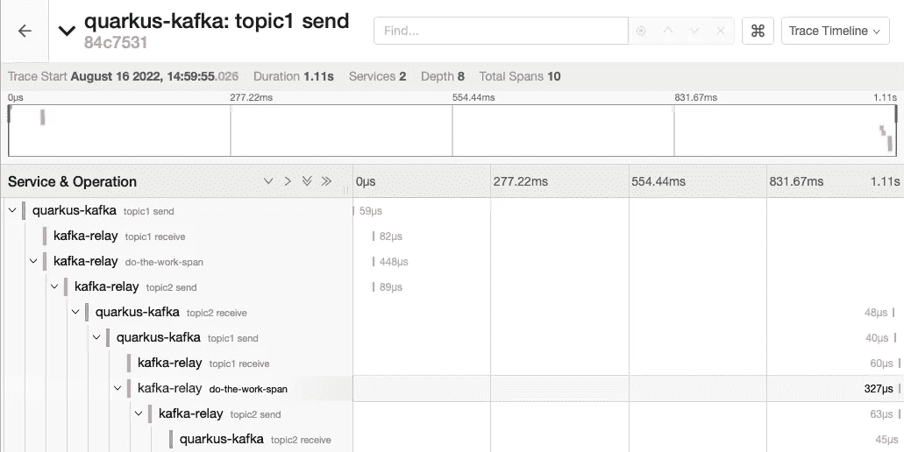

# 用 Quarkus、Python、Open Telemetry 和 Jaeger 进行分布式追踪(第 3 部分)

> 原文：<https://itnext.io/distributed-tracing-with-quarkus-python-open-telemetry-and-jaeger-part-3-79137543b2c5?source=collection_archive---------3----------------------->

本系列的最后两部分( [1](/distributed-tracing-with-quarkus-python-open-telemetry-and-jaeger-part-1-2d83f761b786) 、 [2](/distributed-tracing-with-quarkus-python-open-telemetry-and-jaeger-part-2-d533e3a83703) )集中在跟踪基础知识和针对 http 请求的 [Quarkus](https://quarkus.io) 和 Python 代码的插装上。一种非常流行的数据传输机制是 Apache Kafka。在这篇文章中，我们将看看如何检测 Kafka 使用的代码，并让跟踪传播工作。总的场景与前面的相似，除了 Quarkus 部分，我只使用了一个服务器:



该零件的设置

Quarkus 在 *pom.xml* 和 *application.properties* 中被配置为跟踪，如本系列第一部分中的[所述。向*主题 1* 发送数据的发送方代码如下所示(](/distributed-tracing-with-quarkus-python-open-telemetry-and-jaeger-part-1-2d83f761b786)[消息传递入门](https://quarkus.io/guides/kafka-reactive-getting-started)指南中有更多信息):

```
@Inject
@Channel("topic1")
Emitter<String> emitter;

@GET
public String doSend() {
    emitter.send("Hello World");
    return "done";
}
```

当我通过 curl 调用端点时(@GET 表示这是一个 REST-endpoint)，一个有效负载为" *Hello World* "的消息被发送到 Kafka 上的 *topic1* 。当通过 *kafkacat* 查看发送的消息时，我们可以看到 W3C 跟踪传播头，我们[已经在前一部分](/distributed-tracing-with-quarkus-python-open-telemetry-and-jaeger-part-2-d533e3a83703)中讨论过:

```
**$** kcat -C -t **topic1** -b localhost:9092 -o beginning **-J**
{"topic":"topic1","partition":0,"offset":0,
 "tstype":"create","ts":1660559408201,"broker":0,
 "headers":["**traceparent**","00-08b53bb8eb480e0abda9acb0ccb3e636-755009f86a258b5f-01"],
 "key":null,
 "**payload**":"Hello World"}
```

注意， *kafkacat* 只显示有效载荷，除非提供了类似 *-J* 的格式化选项。

## 现在来看 Python 代码

我们的 Python 代码非常简单。我们在 *topic1* 上启动一个消费者，然后打印传入的消息:

```
from kafka import KafkaConsumer
consumer = KafkaConsumer('topic1')

for msg in consumer:
    print(msg)
```

运行代码将在控制台上打印如下消息，我们可以看到传递的 *traceparent* 消息头和消息体:

```
ConsumerRecord(topic='topic1', partition=0, 
   offset=9, timestamp=1660563030653, 
   **value**=b'Hello World', 
   **headers**=[
      ('traceparent', b'00-8a6a62d94e611819d4f7a3523d95542b-5fd53b80e46d4ffa-01')
  ]
  ... 
  )
```

我们现在可以提取头部并创建 *SpanContext* ，如 http-example etc 中所示，但这次我们选择了简单的方法，并使用现有的[Kafka instrumentation for open telemetry](https://github.com/open-telemetry/opentelemetry-python-contrib/tree/main/instrumentation/opentelemetry-instrumentation-kafka-python):

```
from opentelemetry.instrumentation.kafka import KafkaInstrumentor
KafkaInstrumentor().instrument()
```

这设置了所有必要的魔法，因此我们的代码可以非常简洁:

```
consumer = KafkaConsumer('topic1')
producer = KafkaProducer()

for msg in consumer:

    with tracer.start_as_current_span("do-the-work-span") as span:
        # do the work
        body = msg.value.decode('utf-8')
        body = body + ' from Python'
        # and send it off to topic2
        producer.send('topic2', body.encode('utf-8'))
```

触发来自夸尔库斯(夸尔库斯接收器已经就位)的卡夫卡信息，我们在耶格中得到如下显示:



耶格展示了两条痕迹

等等，这不是我们想要的。我们看到“足够”的数据，但那些痕迹应该是一个。一些观察和调试表明，Kafka instrumentation(到 1.11 版为止)没有将接收到的 *traceId* 作为父跟踪进行传播。

## 有帮助

有了标题中的 *traceparent* 和该系列的[第 2 部分](/distributed-tracing-with-quarkus-python-open-telemetry-and-jaeger-part-2-d533e3a83703)中的知识，我们可以很容易地解决这个问题:

```
# look for traceparent header and return its value
trace_parent = get_trace_parent_header(msg)# Create a SpanContext object from the header value
span_context = extract_trace_data(trace_parent)# Use this SpanContext as parent
ctx = trace.set_span_in_context(NonRecordingSpan(span_context))

with tracer.start_as_current_span("do-the-work-span", context=ctx) as span:
```

现在看来，它应该是:



在卡夫卡身上追踪一条信息的全部痕迹

## 夸库斯接收器

最后一个缺失的部分是 Quarkus 的接收端。这很简单:

```
@Incoming("topic2")
void process(String message) {

    System.*out*.println("Got a message: " + message);

}
```

对，就是这样。仪器为我们做了一切。

## 在 Quarkus 内重新发送消息

与 Python 的情况一样，我现在想再次转发传入的消息。设置基本保持不变，但是在 Quarkus 进程中，将对收到的消息进行检查，然后最终再次转发到 *k-serv* :



略有变化的新设置

当触发时，消息(1)被发送到 *k-serv* ，k-serv 对其进行转换并发回消息(2)。 *Q-serv* 然后检查它之前是否见过它，否则将其作为消息(3)再次转发给 *k-serv* ，k-serv 然后再次转换并重新发送(4)。

与 Python 示例一样，我们希望 Quarkus 中的转发也传播跟踪信息，以获得完整的图像。

不幸的是，这种传播还不是自动的(从 Quarkus 2.11 开始)，我们需要自己做一些工作。首先，我们需要更改方法的签名:

```
@Incoming("topic2")
CompletionStage<Void> process(Message<String> message) {
```

这允许我们检索标题，从而检索 *traceparent* :

```
Optional<TracingMetadata> optionalTracingMetadata = TracingMetadata.*fromMessage*(message);
if (optionalTracingMetadata.isPresent()) {
    TracingMetadata tracingMetadata = optionalTracingMetadata.get();
```

然后，我们使用它来设置工作单元的当前上下文。使用 try-with-resources 块可以确保范围在结束时关闭，这是上下文 API 所要求的。

```
try (Scope _ignored =  
         tracingMetadata.getCurrentContext().makeCurrent()) {
```

如果应该重新发送邮件(上面的数字(3))，我们现在创建一个新邮件，将跟踪信息附加到该邮件中并发送出去:

```
// Get the body
String body = message.getPayload();// We need to use a Message to emit with headers
Message<String> out = Message.*of*(body);

// Add the tracing metadata to the outgoing message header
out = out.addMetadata(
              TracingMetadata.*withCurrent*(Context.*current*()));

// And send to round 2
emitter.send(out);
```

通过这些更改，我们可以清楚地看到消息是如何处理的:



显示消息处理的 Jaeger 用户界面截图

## 给我看看代码

[Python](https://github.com/pilhuhn/fake-rbac/blob/main/kaf-relay.py) 和 [Quarkus](https://github.com/pilhuhn/quarkus-kafka-otel) 代码都存在于 GitHub 上。Quarkus 转发数据的扩展用例位于 [*转发分支*](https://github.com/pilhuhn/quarkus-kafka-otel/blob/forwarding/src/main/java/de/bsd/quarkus_kafka_otel/KafkaReceiver.java) 。

感谢 [Bruno Baptista](https://twitter.com/brunobat_) 对本文的反馈。