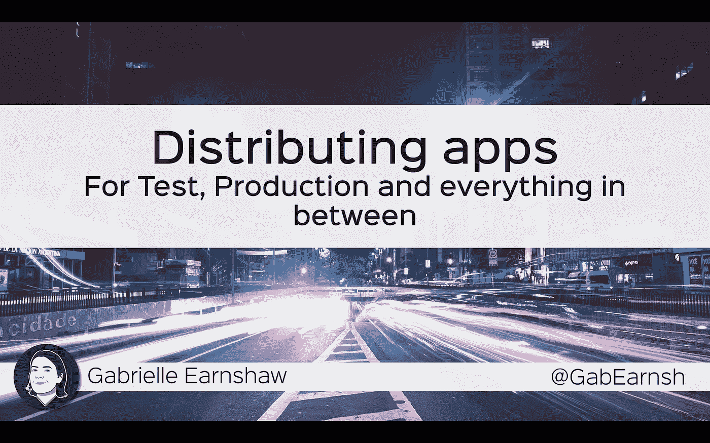

# 分发应用程序

> 原文：<https://itnext.io/distributing-apps-6ab6861e2677?source=collection_archive---------5----------------------->

## 用于测试、生产和中间的一切

当你开发 iOS 和 android 应用程序时，你的主要关注点是把你的应用程序发布给最终用户。但是，当你制作商业应用程序时，在接近公开发布之前，它们必须经过许多阶段，每个阶段都要求我们的应用程序以不同的方式发布。在本次演示中，我将解释我们如何在 Intercept IP 中管理这一点。

## **00:34**

首先，让我们看看我们对应用程序分发的要求。

## **00:37**

我们需要为各种不同的目的分发我们的应用程序。

## **00:41**

*   *特性测试*——我们的代码变更符合目的吗？
*   *回归和集成测试* —我们是否破坏了任何东西，应用程序是否还能与系统的其他部分进行对话？
*   *产品负责人审核* —我们的产品团队对客户看到这个版本的应用程序是否满意？
*   *用户接受度测试* —用户满意吗？
*   *客户试用* —我们可能希望向客户提供应用程序的预发布版本
*   *公开发布* —在应用商店发布应用

## 01:11

作为我们发行策略的一部分，我们希望包括一些重要的功能。

## 01:17

*   *版本化* —我们需要对我们的应用程序进行版本化，这样我们就能确切地知道哪个版本中有哪些功能
*   多种环境 —你可能有一个测试环境，一个用户验收测试环境，和一个生产环境，我们的应用程序需要可供人们在这些环境中使用
*   *访问控制—* 我们希望确保在经过适当的质量控制后，正确的人能够访问应用程序
*   *流程—* 我们需要一个流程将所有这些整合在一起，并在正确的时间、在正确的环境中为正确的人提供正确的版本。

## 01:53

让我们来看看其中的第一个，*应用版本*

## 01:57

当开发人员完成一小块工作时，他们会将它合并到我们的源代码控制主分支中。这将启动一个自动化过程，首先运行自动化测试以确保一切正常。如果是，它将对代码进行版本化。版本控制有效地用版本号标记了代码的那个片段。

## **02:23**

这个版本是在 android 或 iOS 项目文件中设置的，在源代码控制中作为提交的标签，在我们的标签系统中作为修复版本，所以我们可以把所有东西绑在一起。

## 02:38

这就是版本控制

## 02:39

接下来让我们看看*多种环境*

## 02:43

对于我们想要分发的给定应用程序，我们会制作多种*风格的*。每种风格都是一个独立的应用程序，它们可以同时安装在一个设备上。它们由相同版本的相同代码构建而成，但它们封装了不同的配置，这让我们可以创建这些不同的应用程序，使用不同的图标，并指向不同的环境。

## 03:11

我们通过持续部署来制造这些口味。当新版本的代码到来时，我们已经为不同的应用程序风格准备了各种不同的配置文件，比如*测试*、 *UAT* 和*生产*。构建服务器选择它需要的版本和配置的组合，然后打包并部署到它需要的地方。其他口味也一样。

## 03:42

这就是我们处理多种环境的方式。

## 03:46

接下来让我们看看如何处理*访问控制*。

## 03:48

首先，我要谈谈我们使用的不同平台。对于在 iOS 上的公开发布，我们使用苹果应用商店，对于 Android，我们使用谷歌 Play 商店。对于私有和测试版本，我们使用内置于 App Store 中的 TestFlight，并使用内置于谷歌 Play 商店中的测试功能。

## 04:11

TestFlight 和 Play Store 允许我们建立不同的测试组或通道，以控制对不同版本应用程序的访问。首先，我们有内部测试小组。这是我们组织内部的一小部分人，他们需要立即访问我们应用的新版本。我们使用这个渠道进行特性测试、回归测试和集成测试。

接下来我们有私人频道。我们根据自己的需要配置这些，但通常我们可能会有一个审查渠道。这是为了我们组织内部的一小部分人，他们需要尽早访问我们的应用程序，但要在他们通过一定程度的质量控制之后。然后我们有试用用户。这是一个更广泛的人群，他们可能来自我们组织的内部或外部。这些人需要访问我们的应用程序的预发布版本，但在它经过大量的质量控制之后。我们将这些用于产品所有者审查、用户验收测试和客户试用。

最后，我们有公共应用商店，在那里我们的应用通过公开发布走向更广阔的世界。

## 05:36

让我们看看如何将我们的版本放入每个渠道。对于内部测试人员来说，当一个构建被部署时，一个新的版本会自动到达。对于私人渠道，我们手动提供一个经过适当质量控制的版本。对于 App Store 来说，这个过程稍微复杂一点。我们为应用程序商店创建截屏和更新内容，然后提交应用程序进行审查。一旦它通过审查，我们就可以把它提供给更广泛的世界。

## 06:14

在任何给定的时间，这些频道中的每一个都可以并且将会有不同的版本。

## 06:21

这就是我们控制访问的方式。

## 06:24

最后让我们看看过程。

## 06:34

左侧是我们的测试组，顶部是我们不同的应用风格。

当一个功能完成时，我们制作一个版本，打包并部署到应用程序的测试版本中，内部测试人员会在这里进行挑选。他们将测试这个版本中的新功能和错误修复。在某个时候，我们会打包一些特性，并决定要发布一个版本，然后测试人员会对该版本进行全面的回归测试。

当他们高兴，所有的测试都通过了，我们会把它做成 UAT 风味。他们会在这个内部测试通道里做一些烟雾测试。当他们高兴时，评审团队将可以访问该应用程序。他们会检查应用程序，并确保他们对其中的功能感到满意，并且他们对客户看到这个版本的应用程序感到满意。

如果是的话，我们会在内部试验中公布。我们将在内部测试中运行该应用程序一段时间，我们将对其进行监控，以确保该应用程序按预期运行。

如果是的话，我们会在应用程序的生产版本中发现它。同样，我们将在这里进行冒烟测试，一旦测试合格，我们将让客户试用。在这里，我们的客户可以看到应用程序的预发布版本，并确保他们的最终用户看到它感到高兴。如果是的话，我们会在 app store 上发布。

## 08:08

我们在 Intercept IP 的所有应用中都使用这一流程，但我们会根据应用的复杂程度进行大量定制。这正是我们驾驶分析产品 IC6 所遵循的流程。这是一个复杂的产品，它集成了硬件组件和后端系统，需要大量的审查和测试。

在天平的另一端，我们可能有一个只有一个环境的非常简单的应用程序。从内测到 UAT，再到 App Store 的路径非常简单。这是我们在阅读路标应用程序中使用的过程，它显示了马恩岛的路标信息。

## 08:56

这就解释了这个过程，并联系了我们如何为测试、生产和中间的一切分发应用程序。

## 09:08

如果你想说“嗨”或者问我任何问题，我是 twitter 上的@GabEarnsh。