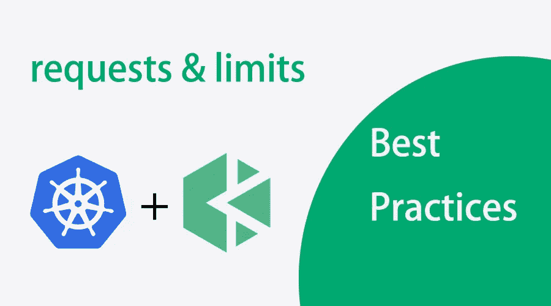
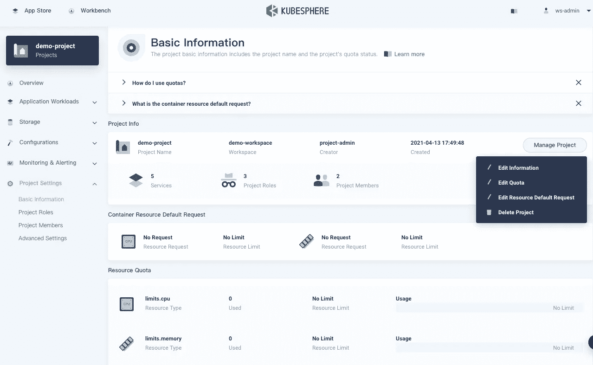
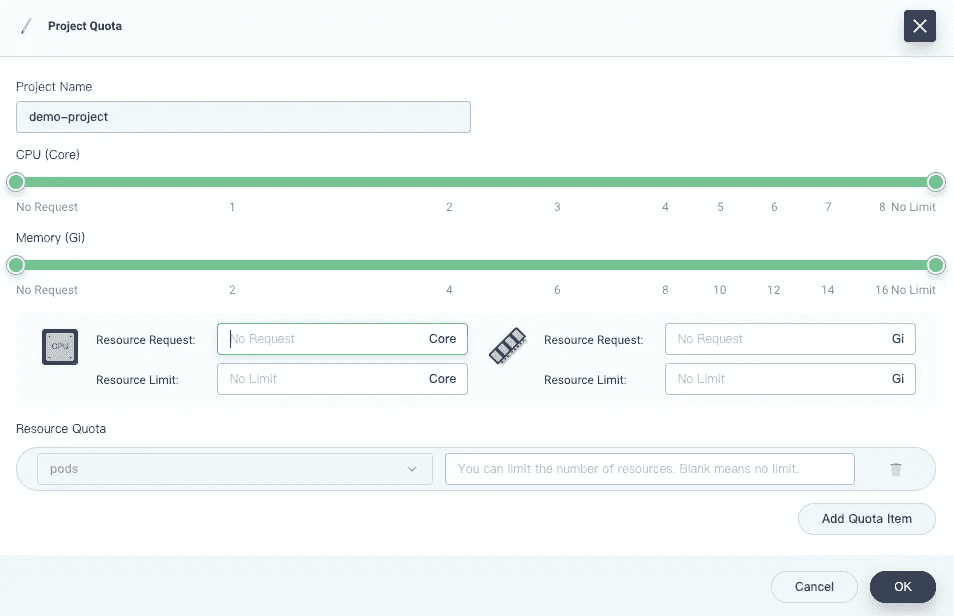
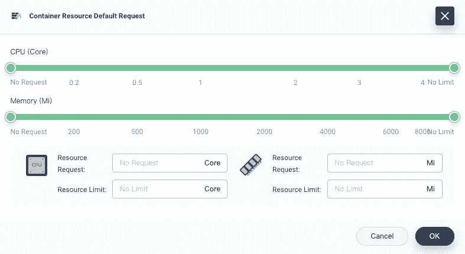
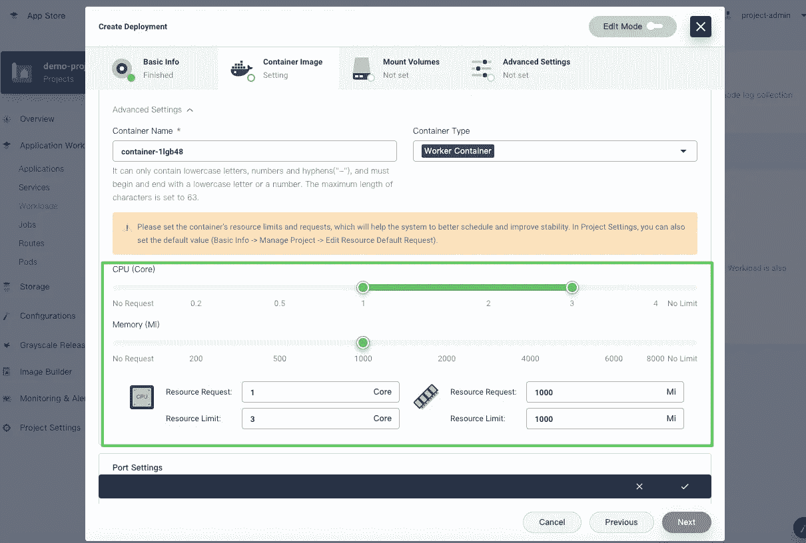

# 深入探究 Kubernetes 中的资源请求和限制

> 原文：<https://itnext.io/dive-deep-into-resource-requests-and-limits-in-kubernetes-3e99030697ec?source=collection_archive---------1----------------------->



在 Kubernetes 集群中创建资源时，您可能会遇到以下情况:

1.  没有为工作负载指定 CPU 请求或指定较低的 CPU 请求，这意味着更多的单元“似乎”能够在同一个节点上工作。在流量突发期间，您的 CPU 会因较长的延迟而达到极限，而您的一些机器可能会出现 CPU 软锁定。
2.  同样，没有为工作负载指定内存请求或低内存请求。有些 pod，尤其是运行 Java 业务应用的，在本地测试中实际上可以正常运行的时候，会一直重启。
3.  在 Kubernetes 集群中，工作负载通常不会均匀地跨节点进行调度。特别是在大多数情况下，内存资源是不均匀分布的，这意味着一些节点可以看到比其他节点高得多的内存利用率。作为容器编排的事实上的标准，Kubernetes 应该有一个有效的调度器来确保资源的均匀分布。但是，真的是这样吗？

一般来说，如果当所有机器挂起并且 SSH 登录失败时，在流量激增的情况下发生上述问题，集群管理员除了重新启动集群之外什么也做不了。在本文中，我们将深入 Kubernetes 的请求和限制，分析可能出现的问题并讨论它们的最佳实践。如果你也对底层机制感兴趣，也可以找源代码角度的分析。希望这篇文章能帮助你理解 Kubernetes 的请求和限制是如何工作的，以及为什么它们能以预期的方式工作。

# 概念

为了充分利用 Kubernetes 集群中的资源并提高调度效率，Kubernetes 使用请求和限制来控制容器的资源分配。每个容器都有自己的请求和限制。这两个参数由`resources.requests`和`resources.limits`指定。一般来说，请求在调度中更重要，而限制在运行中更重要。

```
resources:  
    requests:    
        cpu: 50m
        memory: 50Mi
    limits:    
        cpu: 100m
        memory: 100Mi
```

请求定义了容器需要的最小资源量。例如，对于运行 Spring Boot 业务的容器，指定的请求必须是 Java 虚拟机(JVM)需要在容器映像中消耗的最小资源量。如果您只指定一个低内存请求，那么 Kubernetes 调度程序很可能会将 Pod 调度到没有足够资源来运行 JVM 的节点上。也就是说，Pod 不能使用 JVM 启动过程所需的更多内存。结果，吊舱不断重启。

另一方面，限制决定了容器可以使用的最大资源量，防止由于过度消耗资源而导致资源短缺或机器崩溃。如果设置为`0`，表示容器没有资源限制。特别是，如果您设置了`limits`而没有指定`requests`，Kubernetes 默认认为`requests`的值与`limits`的值相同。

请求和限制适用于两种类型的资源—可压缩资源(例如 CPU)和不可压缩资源(例如内存)。对于不可压缩资源，适当的限制是极其重要的。

以下是对请求和限制的简要总结:

*   如果 Pod 中的服务使用的 CPU 资源超过指定的限制，Pod 将受到限制，但不会被终止。如果没有设置限制，Pod 可以使用所有空闲的 CPU 资源。
*   如果 Pod 使用的内存资源超过指定的限制，Pod 中的容器进程将由于 OOM 而被终止。在这种情况下，Kubernetes 倾向于在原始节点上重启容器，或者简单地创建另一个 Pod。
*   0 <=请求< =可分配的节点；请求< =限制< =无穷大。

# 情况分析

在我们看了请求和限制的概念之后，让我们回到开头提到的三个场景。

# 场景 1

首先也是最重要的，你需要知道 CPU 资源和内存资源是完全不同的。CPU 资源是可压缩的。CPU 的分配和管理基于完全公平调度器(CFS)和 Cgroups。简单地说，如果 Pod 中的服务使用的 CPU 资源超过了指定的 CPU 限制，那么 Kubernetes 就会对其进行节流。对于没有 CPU 限制的 pod，一旦闲置的 CPU 资源用完，之前分配的 CPU 资源量就会逐渐减少。在这两种情况下，最终，pod 将无法处理外部请求，导致更长的延迟和响应时间。

# 场景 2

相反，内存无法压缩，Pods 无法共享内存资源。这意味着如果内存耗尽，新内存资源的分配肯定会失败。

Pod 中的一些进程在初始化时专门需要一定量的内存。例如，JVM 在启动时会申请一定数量的内存。如果指定的内存请求小于 JVM 应用的内存，内存应用将失败(OOM-kill)。因此，Pod 会不断重启和失败。

# 场景 3

当创建一个 Pod 时，Kubernetes 需要以平衡和全面的方式分配或提供不同的资源，包括 CPU 和内存。同时，Kubernetes 调度算法需要多种因素，如`NodeResourcesLeastAllocated`和 Pod 亲和力。内存资源经常分布不均的原因是，对于 app 来说，内存被认为比其他资源更稀缺。

此外，Kubernetes 调度器基于集群的当前状态工作。换句话说，当创建新的 Pods 时，调度程序会根据当时集群的资源规格为 Pods 选择一个最佳节点来运行。这是潜在问题发生的地方，因为 Kubernetes 集群是高度动态的。例如，为了维护一个节点，您可能需要封锁它，并且在它上面运行的所有 pod 将被调度到其他节点。问题是，在维护之后，这些 pod 不会自动调度回原始节点。这是因为一个正在运行的 Pod 一旦在开始时绑定到一个节点，就不能由 Kubernetes 自己重新调度到另一个节点。

# 最佳实践

从上面的分析我们可以知道，集群的稳定性对你的应用程序的性能有直接的影响。暂时的资源短缺通常是集群不稳定的主要原因，这意味着应用程序故障甚至节点故障。这里，我们想介绍两种提高集群稳定性的方法。

首先，通过[编辑 kubelet 配置文件](https://kubernetes.io/docs/tasks/administer-cluster/out-of-resource/)，预留一定的系统资源。当您处理不可压缩的计算资源(如内存或磁盘空间)时，这一点尤其重要。

其次，为 pod 配置合适的[服务质量(QoS)等级](https://kubernetes.io/docs/tasks/configure-pod-container/quality-service-pod/)。Kubernetes 使用 QoS 等级来确定 pod 的调度和驱逐优先级。不同的 pod 可以被分配不同的 QoS 等级，包括`Guaranteed`(最高优先级)、`Burstable`和`BestEffort`(最低优先级)。

*   `Guaranteed`。Pod 中的每个容器(包括 init 容器)都必须有为 CPU 和内存指定的请求和限制，并且它们必须相等。
*   `Burstable`。Pod 中至少有一个容器具有为 CPU 或内存指定的请求。
*   `BestEffort`。Pod 中的任何容器都没有为 CPU 和内存指定请求和限制。

*注:*

*使用 Kubelet 的 CPU 管理策略，您可以为特定的 Pod 设置 CPU 关联。有关更多信息，请参见 Kubernetes 文档**[*。*](https://kubernetes.io/docs/tasks/administer-cluster/cpu-management-policies/)*

*当资源耗尽时，您的集群将首先杀死 QoS 等级为`BestEffort`的 Pods，然后是`Burstable`。换句话说，具有最低优先级的 pod 首先被终止。如果你有足够的资源，你可以把所有的吊舱都分配到`Guaranteed`这个等级。这可以被认为是计算资源与性能和稳定性之间的权衡。您可能期望更高的开销，但是您的集群可以更高效地工作。同时，为了提高资源利用率，您可以将运行业务服务的 pod 分配给`Guaranteed`类。对于其他服务，根据其优先级将它们分配到`Burstable`或`BestEffort`类。*

*接下来，我们将使用 [Kubernetes 平台](https://kubesphere.io/)作为例子，来看看如何为 Pods 优雅地配置资源。*

# *使用 KubeSphere 分配资源*

*如上所述，请求和限制是集群稳定性的两个重要组成部分。作为 Kubernetes 的主要发行版之一，KubeSphere 拥有一个简洁、清晰和交互式的用户界面，大大减少了 Kubernetes 的学习曲线。*

# *开始之前*

*KubeSphere 具有一个高功能的多租户系统，用于不同用户的细粒度访问控制。在 KubeSphere 3.0 中，可以分别为名称空间(ResourceQuotas)和容器(LimitRanges)设置请求和限制。要执行这些操作，您需要创建一个工作区、一个项目(即命名空间)和一个帐户(`ws-admin`)。有关更多信息，请参见[创建工作空间、项目、账户和角色](https://kubesphere.io/docs/quick-start/create-workspace-and-project/)。*

# *设置资源配额*

1.  *进入您项目的**概述**页面，在**项目设置**中导航到**基本信息**，在**管理项目**下拉菜单中选择**编辑额度**。*

**

*2.在出现的对话框中，为您的项目设定请求和限制。*

**

*请记住:*

*   *在此页面上设置的请求或限制必须大于为项目中所有窗格指定的请求或限制总数。*
*   *当您在项目中创建容器而没有指定请求或限制时，您会在创建时看到一条错误消息(记录在事件中)。*

*一旦您配置了项目配额，就需要为项目中创建的所有容器指定`requests`和`limits`。正如我们常说的，“代码就是法律”。项目配额设定了所有容器都要遵守的规则。*

**注:**

**kube sphere 中的项目配额与 Kubernetes 中的* [*资源配额*](https://kubernetes.io/docs/concepts/policy/resource-quotas/) *相同。除了 CPU 和内存，您还可以单独为其他对象(如部署和配置图)设置资源配额。详见* [*项目定额*](https://kubesphere.io/docs/workspace-administration/project-quotas/) *。**

# *设置默认请求和限制*

*如上所述，如果指定了项目配额，您需要相应地配置 pod 的请求和限制。事实上，在测试甚至生产中，`requests`的值和`limits`的值非常接近，甚至对大多数吊舱来说是等价的。为了简化创建工作负载的过程，KubeSphere 允许用户预先为容器设置默认请求和限制。这样，您就不需要在每次创建 pod 时都设置请求和限制。*

*要设置默认请求和限制，请执行以下步骤:*

1.  *同样在**基本信息**页面，从**管理项目**下拉菜单中点击**编辑资源默认请求**。*
2.  *在出现的对话框中，配置容器的默认请求和限制。*

**

**注**

**kube sphere 中的默认容器请求和限制在 Kubernetes 中称为* [*限制范围*](https://kubernetes.io/docs/concepts/policy/limit-range/) *。更多信息请参见* [*集装箱限制范围*](https://kubesphere.io/docs/project-administration/container-limit-ranges/) *。**

*3.当您稍后创建工作负荷时，将自动预填充请求和限制。有关如何在 KubeSphere 中创建工作负载的更多信息，请参见[KubeSphere 文档](https://kubesphere.io/docs/project-user-guide/application-workloads/deployments/)。*

**

*对于运行关键业务流程的容器，它们需要处理比其他容器更多的流量。实际上，没有灵丹妙药，您需要对这些容器的请求和限制做出谨慎和全面的决定。思考以下问题:*

1.  *您的容器是 CPU 密集型还是 IO 密集型？*
2.  *它们的可用性高吗？*
3.  *你的服务的上游和下游对象是什么？*

*如果你长期观察集装箱的装载量，你会发现它是周期性的。在这方面，历史监控数据可以作为配置请求和限制的重要参考。在集成到平台中的 Prometheus 的背面，KubeSphere 具有强大的整体可观测性系统，可以在粒度级别上监控资源。纵向上，它涵盖了从集群到单元的数据。横向上，它跟踪关于 CPU、内存、网络和存储的信息。通常，您可以基于历史数据的平均值指定请求，而限制需要高于平均值。也就是说，你可能需要根据需要对你的最终决定做一些调整。*

# *源代码分析*

*现在，您已经知道了配置请求和限制的一些最佳实践，让我们更深入地研究源代码。*

# *请求和计划*

*以下代码显示了 Pod 请求和 Pod 中容器请求之间的关系。*

```
*func computePodResourceRequest(pod *v1.Pod) *preFilterState {
 result := &preFilterState{}
 for _, container := range pod.Spec.Containers {
  result.Add(container.Resources.Requests)
 }// take max_resource(sum_pod, any_init_container)
 for _, container := range pod.Spec.InitContainers {
  result.SetMaxResource(container.Resources.Requests)
 }// If Overhead is being utilized, add to the total requests for the pod
 if pod.Spec.Overhead != nil && utilfeature.DefaultFeatureGate.Enabled(features.PodOverhead) {
  result.Add(pod.Spec.Overhead)
 }return result
}
...
func (f *Fit) PreFilter(ctx context.Context, cycleState *framework.CycleState, pod *v1.Pod) *framework.Status {
 cycleState.Write(preFilterStateKey, computePodResourceRequest(pod))
 return nil
}
...
func getPreFilterState(cycleState *framework.CycleState) (*preFilterState, error) {
 c, err := cycleState.Read(preFilterStateKey)
 if err != nil {
  // preFilterState doesn't exist, likely PreFilter wasn't invoked.
  return nil, fmt.Errorf("error reading %q from cycleState: %v", preFilterStateKey, err)
 }s, ok := c.(*preFilterState)
 if !ok {
  return nil, fmt.Errorf("%+v  convert to NodeResourcesFit.preFilterState error", c)
 }
 return s, nil
}
...
func (f *Fit) Filter(ctx context.Context, cycleState *framework.CycleState, pod *v1.Pod, nodeInfo *framework.NodeInfo) *framework.Status {
 s, err := getPreFilterState(cycleState)
 if err != nil {
  return framework.NewStatus(framework.Error, err.Error())
 }insufficientResources := fitsRequest(s, nodeInfo, f.ignoredResources, f.ignoredResourceGroups)if len(insufficientResources) != 0 {
  // We will keep all failure reasons.
  failureReasons := make([]string, 0, len(insufficientResources))
  for _, r := range insufficientResources {
   failureReasons = append(failureReasons, r.Reason)
  }
  return framework.NewStatus(framework.Unschedulable, failureReasons...)
 }
 return nil
}*
```

*从上面的代码可以看出，调度器(调度线程)计算的是要调度的 Pod 所需的资源。具体来说，它根据 Pod 规范分别计算 init 容器的总请求数和工作容器的总请求数。将使用较大的一个。请注意，对于轻量级虚拟机(例如 kata-container)，它们自己的虚拟化资源消耗需要计入缓存中。在接下来的`Filter`阶段，将检查所有节点是否满足条件。*

**注:**

**调度流程包含不同的阶段，包括*`*Pre filter*`*`*Filter*`*`*Post filter*`*`*Score*`*。有关更多信息，请参见* [*过滤器和分数节点*](https://kubernetes.io/docs/concepts/scheduling-eviction/kube-scheduler/#kube-scheduler-implementation) *。*****

**在过滤之后，如果只有一个适用的节点，则 Pod 将被调度给它。如果有多个适用的 pod，调度程序将选择加权分数总和最高的节点。评分基于各种因素，因为[调度插件](https://kubernetes.io/docs/reference/scheduling/config/#scheduling-plugins)实现了一个或多个扩展点。注意，`requests`的值和`limits`的值直接影响插件`NodeResourcesLeastAllocated`的最终结果。下面是源代码:**

```
**func leastResourceScorer(resToWeightMap resourceToWeightMap) func(resourceToValueMap, resourceToValueMap, bool, int, int) int64 {
	return func(requested, allocable resourceToValueMap, includeVolumes bool, requestedVolumes int, allocatableVolumes int) int64 {
		var nodeScore, weightSum int64
		for resource, weight := range resToWeightMap {
			resourceScore := leastRequestedScore(requested[resource], allocable[resource])
			nodeScore += resourceScore * weight
			weightSum += weight
		}
		return nodeScore / weightSum
	}
}
...
func leastRequestedScore(requested, capacity int64) int64 {
	if capacity == 0 {
		return 0
	}
	if requested > capacity {
		return 0
	} return ((capacity - requested) * int64(framework.MaxNodeScore)) / capacity
}**
```

**对于`NodeResourcesLeastAllocated`，如果一个节点有更多的资源用于相同的 Pod，它将获得更高的分数。换句话说，Pod 将更有可能被调度到具有足够资源的节点。**

**创建 Pod 时，Kubernetes 需要分配不同的资源，包括 CPU 和内存。每种资源都有一个权重(源代码中的`resToWeightMap`结构)。总的来说，它们告诉 Kubernetes 调度程序实现资源平衡的最佳决策是什么。在`Score`阶段，调度器除了`NodeResourcesLeastAllocated`还使用其他插件进行评分，比如`InterPodAffinity`。**

# **QoS 和调度**

**作为 Kubernetes 中的一种资源保护机制，QoS 主要用于控制内存等不可压缩资源。它还影响不同舱和容器的 OOM 分数。当一个节点内存不足时，内核(OOM 黑仔)会杀死低优先级的 Pods(分数越高意味着优先级越低)。下面是源代码:**

```
**func GetContainerOOMScoreAdjust(pod *v1.Pod, container *v1.Container, memoryCapacity int64) int {
	if types.IsCriticalPod(pod) {
		// Critical pods should be the last to get killed.
		return guaranteedOOMScoreAdj
	} switch v1qos.GetPodQOS(pod) {
	case v1.PodQOSGuaranteed:
		// Guaranteed containers should be the last to get killed.
		return guaranteedOOMScoreAdj
	case v1.PodQOSBestEffort:
		return besteffortOOMScoreAdj
	} // Burstable containers are a middle tier, between Guaranteed and Best-Effort. Ideally,
	// we want to protect Burstable containers that consume less memory than requested.
	// The formula below is a heuristic. A container requesting for 10% of a system's
	// memory will have an OOM score adjust of 900\. If a process in container Y
	// uses over 10% of memory, its OOM score will be 1000\. The idea is that containers
	// which use more than their request will have an OOM score of 1000 and will be prime
	// targets for OOM kills.
	// Note that this is a heuristic, it won't work if a container has many small processes.

memoryRequest := container.Resources.Requests.Memory().Value()
oomScoreAdjust := 1000 - (1000*memoryRequest)/memoryCapacity

        // A guaranteed pod using 100% of memory can have an OOM score of 10\. Ensure
	// that burstable pods have a higher OOM score adjustment.

       if int(oomScoreAdjust) < (1000 + guaranteedOOMScoreAdj) {
           return (1000 + guaranteedOOMScoreAdj)
	}
	// Give burstable pods a higher chance of survival over besteffort pods.
	if int(oomScoreAdjust) == besteffortOOMScoreAdj {
	    return int(oomScoreAdjust - 1)
	}
	return int(oomScoreAdjust)
}**
```

# **摘要**

**作为一个可移植和可扩展的开源平台，Kubernetes 是为管理容器化的工作负载和服务而生的。它拥有一个全面、快速增长的生态系统，这有助于确保其作为容器编排事实上的标准的地位。也就是说，用户学习 Kubernetes 并不总是容易的，这就是 KubeSphere 发挥作用的地方。KubeSphere 使用户能够在其仪表板上执行几乎所有的操作，同时他们还可以选择使用内置的 web kubectl 工具来运行命令。本文主要关注请求和限制、它们在 Kubernetes 中的底层逻辑，以及如何使用 KubeSphere 来配置它们，以便于集群的操作和维护。**

# **关于 KubeSphere**

**KubeSphere 是一个基于 Kubernetes 的开源容器平台，其核心是应用程序。它提供全栈 It 自动化操作和简化的开发运维工作流。**

**[KubeSphere](https://kubesphere.io/) 已被全球数千家企业采用，如 **Aqara、新浪、奔来、中国太平、华夏银行、国药控股、微众银行、Geko Cloud、VNG 公司、Radore** 。KubeSphere 为运维提供向导界面和各种企业级功能，包括 Kubernetes 资源管理、[、DevOps (CI/CD)](https://kubesphere.io/devops/) 、应用生命周期管理、服务网格、多租户管理、[监控](https://kubesphere.io/observability/)、日志记录、警报、通知、存储和网络管理以及 GPU 支持。有了 KubeSphere，企业能够快速建立一个强大且功能丰富的容器平台。**

**欲了解更多信息，请访问 [https://kubesphere.io](https://kubesphere.io/)**