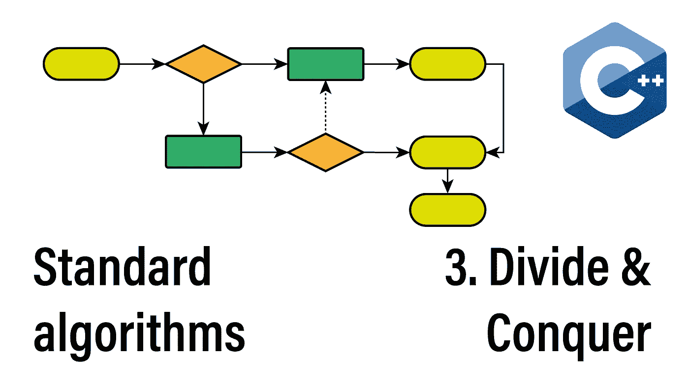
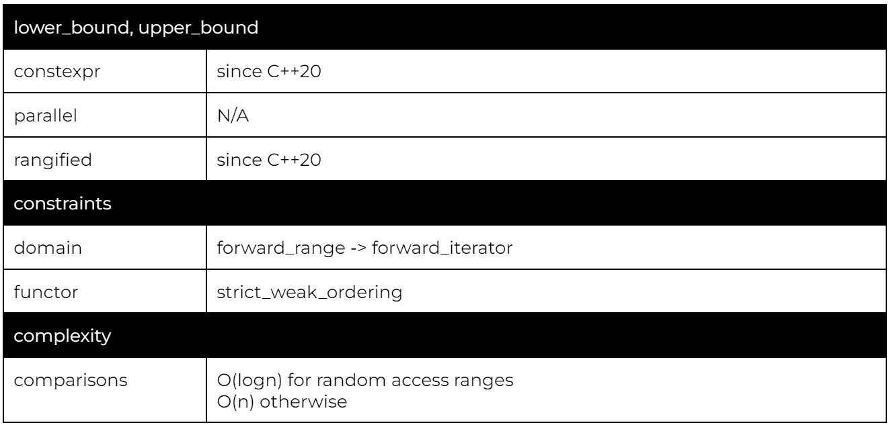
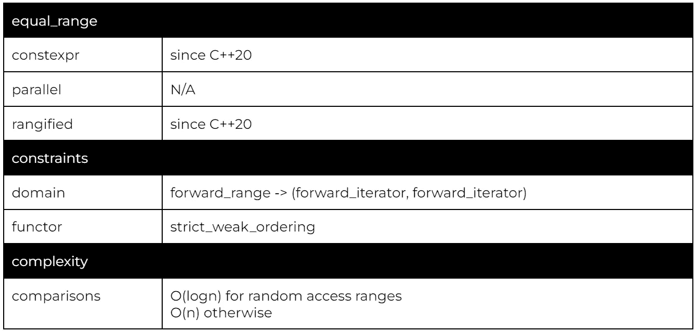
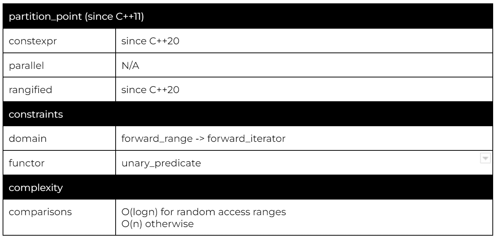
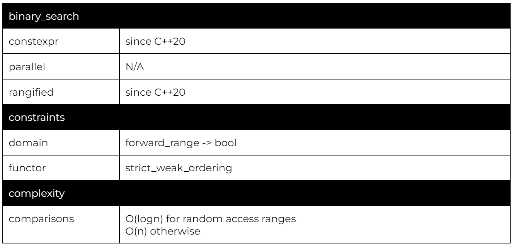
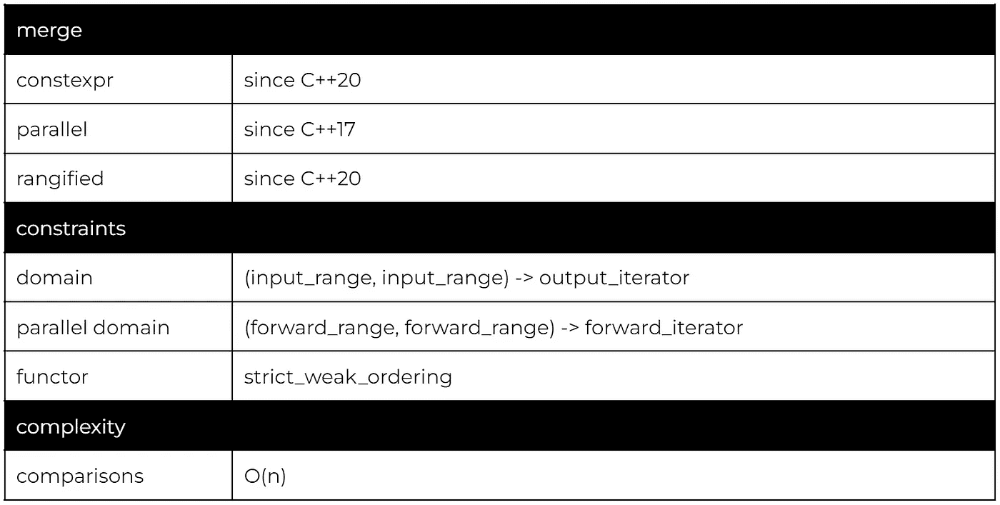
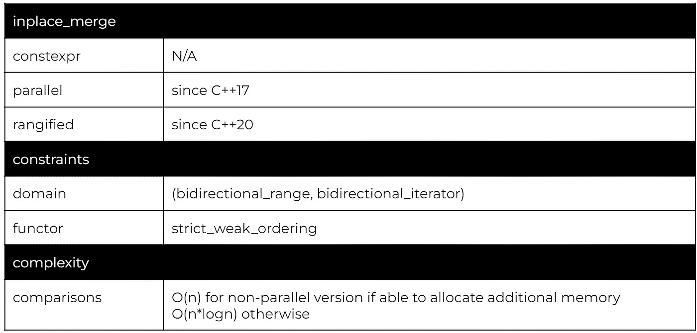
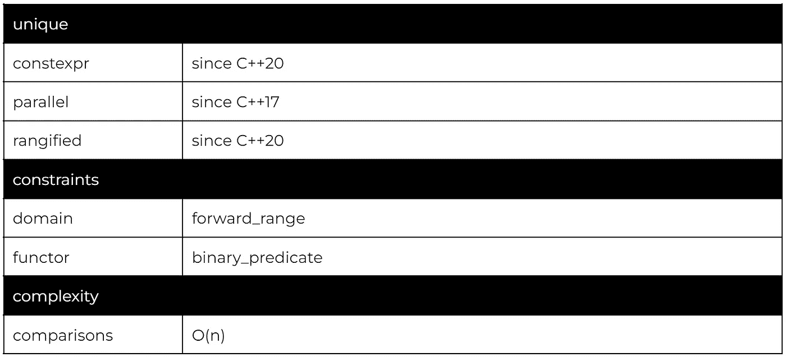
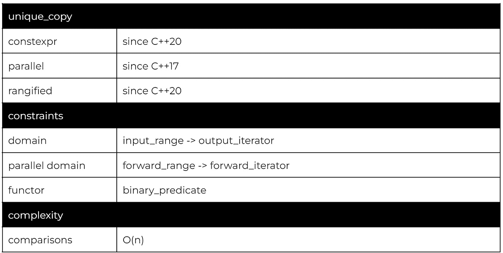
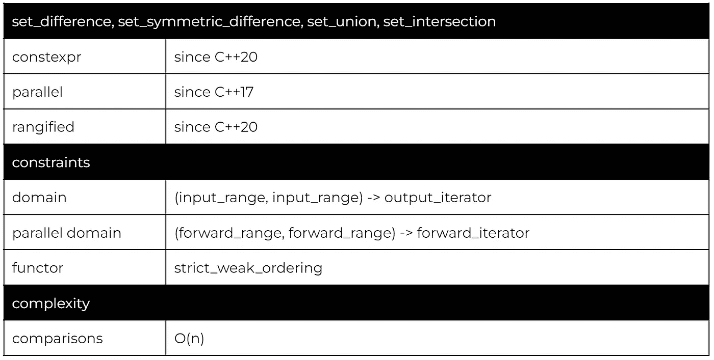

# 分治和集合:114 C++算法系列

> 原文：<https://itnext.io/divide-conquer-and-sets-the-114-c-algorithms-series-d0085a38046e?source=collection_archive---------3----------------------->

欢迎阅读 114 C++算法系列的第三篇文章。今天，我们将着眼于提供低计算复杂度但需要排序或分区范围的算法。

我们今天将讨论两类算法。在 O(logn)时间内操作的分治算法和仅在排序范围上可行的线性算法。

## 该系列:

*   [简介](/the-114-standard-c-algorithms-introduction-2a75a2df4300)
*   [排序和分割算法](/sorting-partitioning-the-114-c-algorithms-series-6503ad41cede)
*   对排序或分区范围进行操作的算法
*   [变换算法](/transformations-the-114-c-algorithms-series-deacdbd4c373)
*   [左侧折叠和其他缩减](/left-folds-and-other-reductions-the-114-c-algorithms-series-6195724d324)
*   [生成器、副本和移动](/generators-copies-and-moves-the-114-c-algorithms-series-1d0774472877)
*   [堆和堆](/heap-and-heap-the-114-c-algorithms-series-1d4215ae9f0d)
*   [搜索和最小值-最大值](https://medium.com/@simontoth/8a6ed951ad40)
*   结论(即将发布)

虽然基于散列的容器使我们能够在 O(1)平均时间内查找任何元素，但这种方法有两个缺点。首先，我们只能查找特定的元素，如果该元素不在容器中，我们会得到一个简单的查找失败。其次，我们的类型需要是可哈希的。

分而治之算法允许基于严格的弱排序来查找边界，并且即使在容器的特定值不存在时也能工作。此外，由于我们使用的是排序容器，一旦确定了边界，我们就可以轻松地访问相邻的值。

如果您没有阅读本系列的前一章，严格弱排序是满足这些约束的排序:自反: *f(a，a) = false* ，反对称: *f(a，b) = true = > f(b，a) = false* ，传递: *f(a，b) = true & & f(b，c) = true = > f(a，c) = true 【T19*

# 下限，上限，等于范围

C++提供了三种边界搜索算法。

这些算法的不同之处在于它们要搜索的边界:

*   lower_bound 返回不小于所提供值的第一个元素
*   upper_bound 返回大于所提供值的第一个元素

如果不存在这样的元素，两种算法都返回结束迭代器。

如果你阅读了前一章，这段代码可能看起来很熟悉，因为我们使用 std::partition 来实现非常相似的行为。主要的区别是我们正在处理一个不可变的范围(第 9 行),我们期望这个范围已经排序了(在这个例子中是 score)。当我们同时使用 lower_bound 和 upper_bound 时，得到的子范围将表示值的封闭范围，在本例中为[49，99](第 11、12 行)。

对数行为仅适用于随机访问范围。对 std::set、std::multiset、std::map 或 std::multimap 使用 lower_bound 或 upper_bound 将导致线性搜索。

因此，所有这些容器都以方法的形式提供了下界和上界的 O(logn)实现。

lower_bound 和 upper_bound 的组合是 equal_range，它返回两个界限。

我们可以通过为相同的值调用 lower_bound 和 upper_bound 来模拟 equal_range。

括号语法(如果你不熟悉的话)是 C++17 的结构化绑定。结构化绑定允许我们将 equal_range 返回的 std::pair 分解成两个命名变量。

# 分区点，二进制搜索

尽管如此命名，partition_point 的工作方式与 upper_bound 非常相似，但是它不是搜索特定的值，而是使用谓词进行搜索。

分区点将返回不满足所提供谓词的第一个元素。该算法只需要划分范围(相对于谓词)。

最后，二分搜索法用作存在检查，返回布尔值，表明请求值是否存在于排序范围内。

虽然功能上与调用 equal_range 并检查返回的范围是否为空相同，但 binary_search 通常会更快。这是因为 binary_search 算法必须实现为一次搜索，而 equal_range 允许两次。

由于数字 5 出现在范围中，equal_range 将返回一个非空范围，binary_search 将返回 TRUE。

# c 标准库:bsearch

从 C 标准库中，C++继承了 bsearch。该算法返回与所提供的键相等的元素之一，如果没有找到这样的元素，则返回 nullptr。

与 qsort 一样，实际上没有理由在 C++代码中使用 bsearch。

根据具体的使用情况，前面提到的算法之一应该是合适的替代品。

# 包含

我们要讲的第一个线性算法是 std::includes。该算法确定一个范围是否是另一个范围的子范围。因为我们正在处理排序的范围，所以 std::includes 以线性时间运行。

这里我们检查输入文本是否包含所有小写英文字母。

首先，我们使用另一个算法 std::iota(第 2 行)以编程方式生成英文字母列表。iota 算法生成连续增加的值来填充给定的范围。因此，我们将向量预分配给 26 个元素(第 1 行)。

# 合并，就地 _ 合并

在线性时间中可行的另一个操作是合并两个排序的范围。

使用提供的输出迭代器存储合并操作的结果。请注意，输出范围不允许与任何一个输入范围重叠。

合并操作稳定。第一个范围中的相等元素将排在第二个范围中的相等元素之前。

并行版本要求输出是一个向前的范围(由 forward_iterator 表示)。因此，我们不能使用像 std::back_inserter 这样的包装器，必须将输出范围预先分配到足够的容量。

因为 merge 禁止输入和输出范围重叠，所以我们有一个替代的 inplace_merge 来服务这个用例。

# 唯一，唯一 _ 副本

std::unique 算法删除连续的重复值。典型的用例与排序范围结合使用。但是，这不是 std::unique 的要求。

因为 unique 就地工作，并且不能调整基础范围的大小，所以它将范围的末尾留有未指定的值，并将迭代器返回到该子范围的开头(如果是范围版本，则返回子范围)。

unique 的复制版本将唯一值输出到由迭代器表示的输出范围。

# 集合差，集合对称差，集合并，集合交

最后一组需要排序范围的算法是集合运算。

所有集合操作都以相同的方式工作，处理两个输入范围并将结果复制到结果范围中，其语义如下:

*   差异:元素出现在第一个范围内，而不是第二个范围内
*   symmetric_difference:只出现在一个范围中的元素，而不是同时出现在两个范围中的元素
*   联合:在任一范围内存在的元素
*   交集:在两个范围中都存在的元素

我们还需要讨论同等元素的行为。如果我们在第一个范围中有 *m* 个这样的元素，在第二个范围中有 *n* 个这样的元素，那么得到的范围将包含:

*   差异: *max(m-n，0)* 元素
*   symmetric _ difference:*ABS(m-n)*，即:如果 *m > n* ， *m-n* 元素将从第一个范围复制；否则， *n-m* 元素将从第二个范围中复制
*   union: *max(m，n)* ，将从第一个范围中复制第一个 *m* 元素，然后从第二个范围中复制 *max(n-m，0)* 元素
*   交集: *min(m，n)* ，将从第一个范围中复制元素

# 感谢您的阅读

不要忘记关注，这样你就不会错过本系列的其他文章。例如，下一篇文章将讨论转换范围的算法。

我也在 YouTube 上发布视频。你有问题吗？在[推特](https://twitter.com/SimonToth83)或 [LinkedIn](https://www.linkedin.com/in/simontoth) 上联系我。