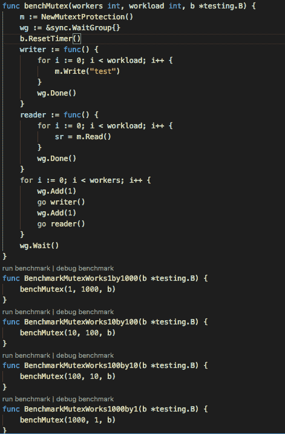
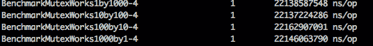
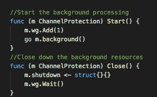
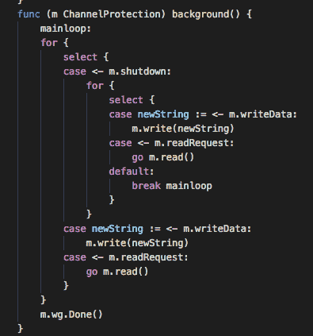
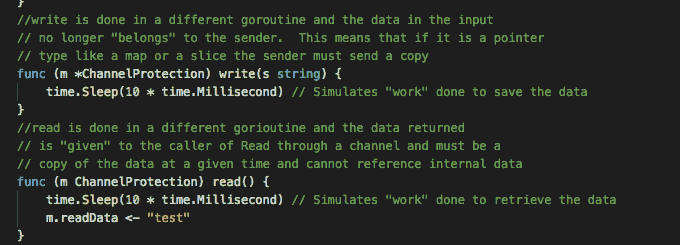
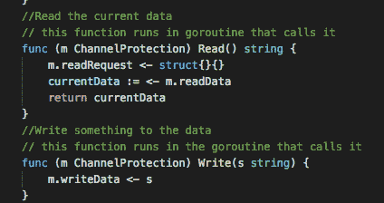
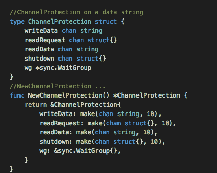
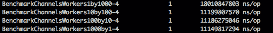
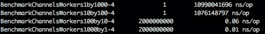

# 潜入戈朗海峡

> 原文：<https://itnext.io/diving-into-golang-channels-e9e610d586e8?source=collection_archive---------2----------------------->

将 C++或 Java 程序直接翻译成 Go 不太可能产生令人满意的结果——Java 程序是用 Java 而不是 Go 编写的。另一方面，从 Go 的角度考虑问题可能会产生一个成功但完全不同的程序。 —有效 Go

golang 设计的中心目标之一是开发一种无需重新编译和平台定制就能轻松利用多线程进程的语言。goroutine 不是一个线程，但是当线程可用时，调度程序会尝试使用线程来尽可能并行化您的工作负载。为了让它发挥作用，开发人员需要使用线程安全的数据结构。为了让并行化真正提高性能，这些数据结构必须以最有效的方式保持线程安全。

# 互斥错觉

在传统的多线程设计中，数据结构使用锁定结构(如互斥体和信号量)来保护。通过这些“锁”来保护关键部分，并通过防止一个线程访问另一个线程正在写入的数据来管理资源，直到事务完成。因为即使简单的代码行也被分解成多个指令，所以这些锁对于维护数据完整性至关重要。正确使用时，互斥体可以避免竞争情况和无效数据，但如果过度使用，它们也会削弱线性线程伸缩。它们给人一种多线程的“错觉”，因为代码看起来是在运行多个线程，但实际上它们只是在按顺序执行多个线程。

考虑以下代码:

睡眠模拟一些“工作”,我们读写字符串。下面将对其进行基准测试:

随着线程数量的增加，天真的假设是性能应该会提高。不幸的是，事实并非如此:

即使线程数量在不断增加，处理时间的变化也在合理的误差范围内。如果还不明显的话，这是代码设计方式的结果。虽然我们有许多线程，但它们都在互斥体周围排队等待。如果没有互斥体，这个虚构的工作负载就不安全，但是我们所做的只是承担额外的 goroutines、一些同步对象的开销，并不比串行工作做得更好。显然这不是我们的目标。

在一个不仅仅是单个数据操作的关键部分使用互斥体不会线性地提高性能。这个例子可能在你的计算机科学教科书中没有出现过，因为在例子中互斥体通常放在数据元素周围。不幸的现实是，关键部分常常通过 API、套接字或其他缓慢的操作(如加密或认证)包围复杂而缓慢的外部系统。因此，在内存地址周围使用紧密互斥的简单模型是行不通的。

# 基于通道的线程安全对象

最好是有一个与互斥例子具有相同接口的对象，但以某种方式防止互斥创建的资源阻塞。虽然有几种方法可以做到这一点——甚至有些方法使用了互斥体——但是使用通道可以简化代码，还可以增加系统的并行性。我们需要做的第一件事是增加一点接口。我们可以保留“读取”和“写入”公共方法，但我们还需要添加“启动”和“关闭”方法，以便我们可以确保工作负载得到充分处理:

像基准代码一样，我们使用同步。WaitGroup 确保后台线程在关闭完成之前完成。后台线程是一个 for/select 循环，处理一些通道:

这将迫使写操作按预期同步发生，而读操作可以异步进行，从而在给定的快照及时提供数据:

这里是模拟慢速资源的“工作”完成的地方。剩下的就是将写和读连接到后台线程中:

并构建一个构造函数:

这些原则在评论中有解释，但要记住的基本思想是，内存是通过通道在 goroutines 之间移动的。我稍后会谈到这是如何实现的，但现在可以说它在现代处理器上非常有效。一旦数据被传递给“Write ”,它就不再属于调用者(用“-race”运行测试将保护您不违反这一规则),从“Read”返回的数据只是存储在结构中的数据的副本(存储在内存中或通过 API 进行抽象存储)。

有了这个框架设置，下面是基准测试结果:

即使只有一个读写用户，性能也优于互斥设计，并且随着更多工作线程的加入，它会很快接近理论上的最大值(因为我们将写入设计为同步，最大值大约为 10000000000 ns/op)。相反，如果我们有一个可以无序处理“写入”的系统，那么这种缩放是荒谬的:

最后两个速度需要通过 120000000 和 20000000 ns/op 的(迭代次数*速度)来计算

# 没有免费的午餐

像软件工程中的所有事情一样，这种设计速度的提高是有代价的。如果读取和写入必须按照收到的确切顺序进行处理，或者如果工作是在单个资源上进行的(例如，如果您只有一个数据库连接)，这种设计显然是多余的。如果您的系统不能模拟并行工作负载，那么线程永远不会为您带来更好的性能。但是，如果您可以容忍异步处理，“陈旧”但内部一致的读取，或者如果您的工作负载主要由开销(如加密)决定，那么在这种系统中安排线程将为您提供可能的伸缩性。当你开始进一步将数据管道拼凑在一起时，这变得更加强大，但这是另一天的主题。

# 为什么是渠道？

您可能会问自己:当我可以想象以我一贯的方式构建这种工作负载分配系统时，为什么我要使用通道？秘密在于通道是如何工作的。通道使用两种关键技术来尽可能快地进行这些内存操作。第一个是写屏障的概念，第二个是指令的使用 AMD64 的 CMPXCHG，这是一个比较和交换或“CAS”操作。

# 书写障碍

当通道向目的地发送数据时，它必须执行非常快速的内存移动。在 golang 中，这是少数直接用汇编语言编写的代码部分之一。为了保证这个低级代码总是正确的并且不会被垃圾收集中断，创建了一个写屏障。这将创建一个位图，强制源和目标之间的写入按顺序发生，并且一旦设置好，就可以安全地执行针对内存移动的高度优化的汇编程序，而不会有任何内存“处于”垃圾收集所更改的屏障之下。

# CAS 操作

CAS 操作执行以下操作:

*   If(累加器==目标)then(目标
*   else(累加器

这个操作码本质上是对“懒惰理发师”竞争条件的处理器级解决方案。如果累加器用于存储在目标位置找到的“锁”变量的值，而源位置是您希望设置的“锁状态”(例如，一个非零值)，那么您可以使用 CAS 操作来验证您没有在另一个在您不注意时设置锁状态的进程之上设置锁状态。使用该操作大大降低了通道的 memmove 操作中的写屏障的成本，并且将通道实现中的低级原子变量降低到仅使用互斥体和高级代码无法实现的水平。补充说明:这也是 golang 中实现原子包的方式，因此如果通道不适合您的同步，并且您需要开始使用代码，我建议您查看 CompareAndSwap*函数。

# 惯用代码

虽然每一种语言都有其纯粹主义者，他们出于不那么高尚的推理而努力寻找地道的代码。不要通过共享内存来交流。”不仅仅是空话。因为 golang 既是托管内存又是托管线程(通过调度程序),所以当您遵循惯用模式(如避免共享内存)时，您的代码性能将会提高。组织您的代码管道处理以通过通道传递数据不仅可以更清晰地封装关注点，还可以让 golang 系统更好地处理内存和线程资源。核心语言中最近的更新完善了垃圾收集器的内部操作，以更好地将内存与 goroutines 关联起来，但这些优化都是围绕这种惯用模式进行的。

例子的源代码可以在[https://github.com/weberr13/Kata/tree/master/channels](https://github.com/weberr13/Kata/tree/master/channels)找到，一如既往，麻省理工学院许可