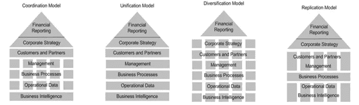
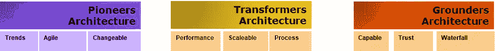

# 脱离技术架构整体

> 原文：<https://itnext.io/divorce-from-technology-architecture-monolith-1fe8fff5c6ef?source=collection_archive---------3----------------------->

你是否和我一样，正在关注 IT 架构如何经历一个成熟阶段？侧重于技术战略，以支持和确保业务能力。脆弱性，对变化的反应，以及定义和处理复杂性。很好。我很高兴地看到，传统上对无穷无尽的头衔和角色的关注很少被搁置一边，以推进建筑师和建筑将要解决的问题。

我不知道你是否同意，但有时我会被组织的参考 it 架构所触动，这些是独特的单一结构。所以另一个组织显然有别的东西。组织可能在内部谈论参考架构，但通常是技术或流程设计的精选领域。组织技术架构的一部分。让我们快速进入编程的世界。在 OOP 中，四人组在 20 年前制作了大约 20 种模式，从那以后一直是主要的明星。对于软件，我们通常认识到，即空间架构、n 层架构、微服务架构、事件驱动架构、基于 rest、基于插件等。

当谈到组织的架构策略时，通常很少讨论类型和模式。除了“我们敏捷工作！”，这确实是一个答案，但这只是组织技术战略中的一个选择。战略只是偶然存在的，比如通过继承的意识和持续的改进而存在。简单来说，这种方式的架构策略是非持久性的，就像操纵和测量一团气体一样。整个组织的低重用度。也许这种观点可以允许有点粗鲁，听起来好像没有明确的目标。

一个拥有成功技术策略的组织，应该绝对能够模板化指导方针和规则，并在另一个合适的组织中实施。那么——如果每个组织都执行一个自组织的整体架构策略(气体云),它如何适应呢？

## 当目标不明确时

我想休息一下，分享一个 IT 趣闻，其中有相似之处，但目的不明。我已经有一段时间了，当时“电脑技术员”和“网站管理员”是任何公司都非常需要的角色。只要公司得到了这些，它的要求就有了保障。这是 90 年代中期，网络泡沫还不存在。这些都是花哨的技术角色，但实际上往往隐藏在“我们需要有人为我们解决网络/技术问题”的背后。哪些工作描述不是很清楚。

当时的小公司或市政府可能没有这方面的经验。因此需要一位大师来编写网页内容，编写网页代码，部署基础设施和维护产品。同样，一名电脑技术专家帮助会计、销售等部门重启电脑、清洁鼠标滚轮、升级打印机，并为办公室购买和安装新的 Exchange 服务器以及安装 CAT5 网络机架。

随着时间的推移，这些角色消失了。网络公司偷走了大部分信息技术，但也有一些人留下来，当他们离开时，是不可能被取代的。但是更重要的事情也来了- **意识到意图**。

主流开始理解这样的事情"*啊，我们需要有人组成一个 web 解决方案，以便我们的专家可以发布他们的内容*"，"*啊，我们需要有人组成一个协作平台，以便我们可以雇用支持和技术人员来帮助更大规模的*"，"*我们需要有人可以决定我们需要什么样的基础设施，并维护它，以便我们的应用程序始终运行*， “*我们需要知道如何构建物理网络的人，这样我们才能为服务器和工作站提供快速可靠的区域*”。 这可以继续下去。

与 OOP 模式一样，工作角色开始分裂成几个更具体的角色。具体工作描述的模式被制作出来，从整体描述中雕刻出来，补充了一些要点。

## 面对建筑离婚

组织战略已经存在了很长时间。所以他们自然已经离婚了，作为成熟的一部分。以下是从 IASAGlobals SA 课程中选取的四种运营模式。

组织策略示例

只需浅显地看一眼，你就能感觉到什么适合一种型号，什么不适合另一种。即使是在 it 架构方面。单一站点内部数据中心是否同样适合这四种模式中的任何一种？当这样的引用形成时，我们能够移动*来控制*。

我最近碰巧有一次午餐约会，我们聊到了将整个组织的技术场云化、淘汰内部解决方案的好处和目标。讨论的目标是一家拥有+50，000 名员工的公司，因此这带来了相当大的变化。这种决定成功的可能性有多大？需要一点运气。不过，我的观点不是削减他们的策略。而是相对于参考点进行移动架构策略。

## 与参照策略相关的运动

我想把这家拥有+5 万名员工的公司放入一个战略模型中，这是本文中的假想。类似于上面的四个组织策略，让我们将 IT 架构拼接成三种类型的策略模型。我可以拼接成斯诺的拓扑，但现在它是任意的。

组织架构策略的三个示例

**先锋架构战略—** 这种战略需要快速响应变化，适应变化。更好的快速和失败，前进。组织可能经营和竞争一个在市场反应中具有高风险的不稳定市场。适合非常可能的初创公司，但也可能适合具有非常复杂的系统图，但确实需要响应的组织。

**转型架构战略—** 相对于组织对技术的需求，组织恰好使用高度动态的技术堆栈来解决业务需求。服务和产品通常共享基线，并由标准化和高度可配置的组件的新实例组成。只需向另一个客户添加一个实例即可轻松生成。

**接地气的架构策略—** 市场和业务需求是非常可靠和静态的。不过，对可靠性、质量、利润和精度的要求可能极其苛刻。例如，如果产品或服务出现意外偏差，人们可能会死亡。也许很多拥有复杂系统图的大型组织通常都在这里，因为他们没有能力转变为敏捷思维。

如果我们将紧急中心 911 或控制波音飞机飞行的软件放入一个策略中，哪种情况下我们生存的机会最高？

为了限制下面的声明，我选择将重点放在操作方面、SDLC 方面和基础设施托管方面。

可以作为**先驱**参考的策略，很可能包含敏捷宣言方法。高度采用新兴技术的云技术堆栈或类似技术更有意义。以及使用 DevOps 和 CI/CD 管道来简化小块的快速平滑部署。有了这个，像 SAFe 和 DAD 这样的框架可能就相关了。相反，一个强大的 IT 架构文化和前期的大设计——瀑布或 V 形——将是浪费。

谈到**变形金刚**(或“动态”)，指的是技术堆栈，它是组织的一个巨大足迹。或者相反，技术相对简单。无论哪种方式，都需要强大且完善的运营和维护能力，因为运营中断时的收入损失很高。从成本和可操作性的角度来看，托管并不那么重要。移动目标主要是在流程和交付层，以允许客户定制。这种风格可能更喜欢面向操作或过程的框架。强大的架构技术在这里可能有意义，但更多的是在操作方面和业务流程映射上，因为技术栈和系统映射并不复杂。

最后，**接地，**将被称为一切都是由意图决定的策略。更有可能的是每个组织都是自托管、自活的。流程和例程的副本。最终平行的过程。较长的交付周期、明确的要求、上市时间、材料需求等都是预期的，并整合到任何计划中。缓慢变化的系统自然对操作更健壮。对技术变化作出反应，可能非常适合基于瀑布的交付。更强的 IT 架构规程，从请求到实现的可追溯性，可能是首选。

# 结论

建模引用的好处是更容易实现标准化的包。更容易预测未来的需求和愿望。以及不涉及的内容—不符合实际战略参考的内容。比如在地勤战略中建立完整的敏捷宣言。哪一个更容易决定，有参考支持

这些参考可以是启动转换和测量转换性能的基线。例如，对一个组织的检查可以清楚地表明它存在于基础策略中。检查还可能得出结论，该组织将在先锋战略中表现出色。所以它支持一个过渡过程。由于有一个参考战略，一个基线目标已经存在。与其他转型一样，它可能会一蹴而就，也可能会失败。它也可能失败，由于从不同步的中间层的艰难爆发。但是在第三次迭代中，它可能开始提供价值。

在我们开始的地方结束。没有战略参考，组织架构战略是无框架的内容，容易成为意想不到的目标。导致脆弱性和复杂的决定，与意识，如何处理。以技术转变为目标，经常将趋势作为推动者。意味着对成功机会的“幸运的猜测”。意味着它会在下一个趋势时重新开始，即使上一个趋势是成功的(应该保留)。

相反，将组织的技术战略瞄准一个有意识的、可管理的目标，意味着它实现的成功几率更高。它可能包含趋势，人们要求被雇用，它可能没有，人们辞职。这就是生活，这个组织将继续存在。