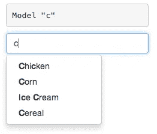

# 用 Popper.js 2 反应弹出窗口

> 原文：<https://itnext.io/diy-react-popups-with-popper-js-2-c76ff6b7fc5d?source=collection_archive---------1----------------------->



我需要在 React 中构建一个自定义的选择输入。像往常一样，它归结为呈现一个带有可用选项的 popup 元素，并计算出它相对于 input 元素的位置，确保组件能够响应窗口大小调整并做出正确反应，同时保持键盘的可访问性。当谈到 DOM 定位库时，没有竞争者——[popper . js](https://popper.js.org/)是行业标准——然而 Popper.js 2 相对较新，最近仅作为候选版本提供。我想我应该试一试——从我收集到的信息来看，除了性能上的改进，主要的区别是“修饰符”实现和触发方式的一致性。

**构件骨架**

让我们设置我们的基本组件。我将使用基于类的 React 组件，因为它们更容易推理，但是像所有其他组件一样，可以使用 React 钩子将它们重构为功能组件。

在我们的基础架构中，有两个元素:一个触发器和一个弹出窗口。让我们将它们呈现到 DOM 中，并给它们分配相应的引用。因为我们将操作 DOM 元素，所以我们希望能够通过它们的引用方便地访问这两个元素。

**Popper.js 库**

让我们拉进 Popper.js:

```
npm install @popperjs/core
```

我们现在可以使用 Popper.js 构造函数来连接我们的触发器/弹出窗口关系:

我们已经建立了两个生命周期挂钩:在`componentDidMount`上，我们通过给 Popper.js 提供触发和弹出引用(以及我们可能需要的任何修饰符，例如通过 props)来连接它。在`componentWitllUnmount`中，我们希望确保通过销毁 popper 实例来清理所有绑定。此外，我们希望确保我们的 popup 引用始终存在于 DOM 中，即使实际的 popup 内容没有显示出来——然后我们可以通过在 popup 内容可见时强制更新来控制 popper 的定位。

**门户弹出**

为了避免处理`z-index`的疯狂，我们可以将我们的弹出窗口附加到 DOM 文档的主体，从而确保它不会与我们的触发器元素相邻的任何元素冲突。这不是 100%必要的，您可以通过 CSS 解决这些问题，但是如果您的项目中已经安装了`react-dom`，您不妨利用它。

**捕捉焦点**

焦点补漏白是一个重要的辅助工具。如果您的弹出窗口包含输入或其他可聚焦的元素(您可能希望允许您的用户使用键盘浏览可用的选择或菜单选项)。`focus-trap-react`是一个非常棒的库，您可以将它引入到您的项目中，以避免处理大量的可访问性问题:

*   当用户点击外部时退出/关闭弹出窗口
*   当用户按下`ESC`时退出/关闭弹出窗口
*   将焦点捕获在弹出元素中，以确保流畅的键盘体验

就是这样。您现在有了一个可以完全控制的弹出元素。你可以创建下拉菜单、选择输入、工具提示以及任何你喜欢的需要相对于触发元素定位的东西。

**好处:**在 div 元素上使用引用可以让你访问所有的 DOM 元素属性，包括`clientWidth`，因此你可以使用`style`道具来设置你的 popup 元素的宽度，以匹配你的引用元素的宽度:

```
<div style={{ width: this.toggleRef.current.clientWidth }} />
```