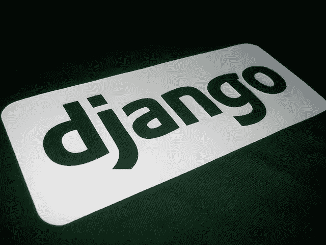

# 在 OpenShift 上使用 Init 容器进行 Django 迁移

> 原文：<https://itnext.io/django-migrations-with-init-containers-on-openshift-597db8138dad?source=collection_archive---------4----------------------->

[https://www.flickr.com/photos/kogakure/2225768345/](https://www.flickr.com/photos/kogakure/2225768345/)

随着应用程序的迭代和增长，您将不可避免地需要添加或更改数据库。在 [Django](https://www.djangoproject.com/) 生态系统中，您熟悉作为应用生命周期一部分的[迁移](https://docs.djangoproject.com/en/2.2/topics/migrations/)。随着您进入生产环境，您将不得不面对迁移带来的操作影响，因为您的应用程序的新版本以及相关的数据库更改已经推出。

照片由 [Marvin Esteve](https://unsplash.com/@tme18?utm_source=medium&utm_medium=referral) 在 [Unsplash](https://unsplash.com?utm_source=medium&utm_medium=referral) 上拍摄

随着应用程序新版本的部署，对数据库的更改可能意味着潜在的中断。在这里，我们需要了解安全迁移数据库的实践，以及如何通过滚动部署完全避免停机。

此外，我们可以关注一种方法，将我们的主应用程序从部署的迁移阶段中分离出来，以实现最快的潜在应用程序启动。能够分离迁移和正常应用程序流意味着您可以快速扩展您的应用程序，而无需浪费时间检查已经运行的迁移。

# OpenShift 上的 Django 迁移

在 [OpenShift](https://www.openshift.com/) 上部署 *Django* 应用程序的一个常见机制是作为 [DeploymentConfig](https://docs.openshift.com/container-platform/3.11/rest_api/oapi/v1.DeploymentConfig.html) 。一个 *DeploymentConfig* 允许您定义您部署的 pod，并基于映像和配置更改触发更新。一个 *DeploymentConfig* 还允许您定义一个部署策略；像前面提到的[滚动部署](https://docs.openshift.com/container-platform/3.11/dev_guide/deployments/deployment_strategies.html#rolling-strategy)。

部署配置架构

## 滚动部署的数据迁移方法

*滚动部署*策略可以让您在迁移数据时避免停机。在*滚动部署*中，当新版本上线时，您仍然有旧版本(N-1)的应用程序在运行，因此您可以避免 API 响应用户的能力出现缺口。

滚动策略示例

这也意味着您必须注意如何应用迁移。您在新版本中所做的任何更改都不能是破坏性的，它们必须是附加的，以便在滚动更新和数据库更改时旧版本不会失败。这种附加的迁移方法并不意味着您只是不断增加数据库表、列等。永远；这只是意味着你可能需要采取两步走的方法。首先维护旧的表/列，并用新代码添加新的表/列。您的新代码库将不再引用您想要删除的旧表/列。接下来，通过迁移交付第二次更新，删除新代码不再使用的旧表/列。这种两步更新流程允许您始终保持运行，但仍然保持数据结构简洁并反映您的应用程序使用情况。

## 启动流程中数据迁移的缺点

现在我们已经了解了一种安全且始终可用的数据库迁移方法，我们仍然需要了解如何在部署期间高效地迁移数据库。许多 *Django* 部署的例子将迁移步骤合并到启动流程中，或者作为容器的[入口点](https://docs.docker.com/engine/reference/builder/#entrypoint)中的命令，或者作为[源到映像(S2I)](https://docs.openshift.com/enterprise/3.0/architecture/core_concepts/builds_and_image_streams.html#source-build) [运行](https://docs.openshift.com/enterprise/3.0/using_images/s2i_images/python.html#configuration)命令中的步骤。虽然在应用程序启动命令中插入数据库迁移作为一个步骤是一种合理的方法，但它最终会影响应用程序启动的速度，并且随着时间的推移，许多迁移的成本会变得相当高。对启动性能的最大影响发生在当你打算扩展你的应用时，也许是用一个[水平自动缩放器](https://docs.openshift.com/container-platform/3.11/dev_guide/pod_autoscaling.html)。

水平 Pod 自动缩放器示例

在您的 pod 由于流量突发而向外扩展的情况下，当您达到某个扩展触发器(内存或 CPU 阈值)时，新 pod 的启动速度至关重要。如果您的 pod 启动逻辑包括已经执行的迁移检查，那么您只是在浪费启动时间，并且可能无法足够快地启动 pod 来处理增加的负载。未能处理增加的负载意味着您的用户可能遇到了可怕的 [502 坏网关错误](http://wiki-errors.com/502-bad-gateway-error-solutions/)，如果这是一个小的流量突发，它可能只是浪费资源。我们如何满足数据迁移和允许快速扩展的快速启动的需求？接下来，我们将了解作为一种可能的解决方案的 [Init 容器](https://docs.openshift.com/container-platform/4.1/nodes/containers/nodes-containers-init.html)。

## 什么是初始化容器？

一个*初始化容器*是一个短命的容器，打算在 pod 的其余部分被部署之前运行。在这里，您可以运行实用程序或自定义代码。一个 *Init 容器*甚至不必来自与部署应用程序相同的映像。这意味着，要么你可以缩小应用程序映像的范围，使其不包含工具，这对构建速度和安全性都有好处，要么你的 *Init 容器*映像可能很小，如果它在被触发时只需要执行一小部分功能，比如 shell 脚本。也可以有多个 *Init 容器*,这样你就可以根据需要隔离功能步骤，并分离项目以减少代码维护。

## 作为初始化容器的迁移

正如在上一节中看到的，我们可以使用 *Init 容器*来解决我们的迁移问题。本质上，您可以重用之前定义的相同容器映像，并使用 *Django* 迁移实用程序作为您的容器命令。

初始容器规格示例

这将允许您将迁移从正常的应用程序启动逻辑中分离出来，同时仍然在逻辑上使它在应用程序部署之前发生。

# 摘要

希望这个故事已经启发了您一种用于 Django 迁移的方法，这种方法侧重于始终保持运行并支持快速扩展。我们考虑了使用两步迁移方法，该方法支持*滚动部署*策略。此外，我们还讨论了容器启动入口点迁移的缺点，以及如何利用 *Init 容器*将迁移执行从正常的应用程序启动流程中分离出来，从而实现应用程序的快速扩展。