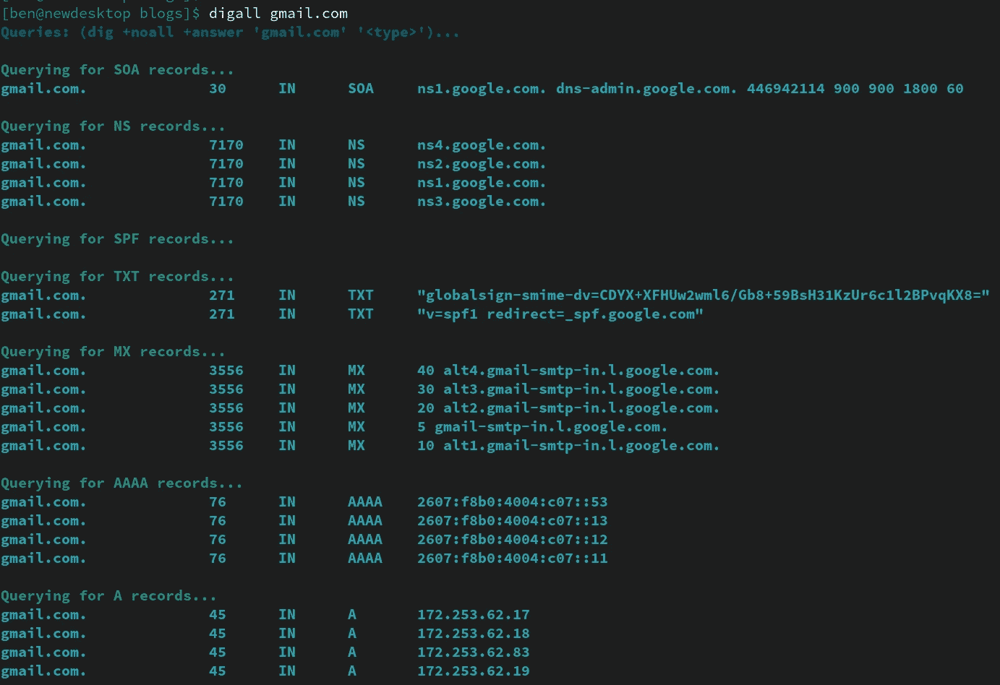

# 使用 dig 进行 DNS 调试

> 原文：<https://itnext.io/dns-debugging-with-dig-8da5bb984673?source=collection_archive---------0----------------------->


照片由[蒂姆·福斯特](https://unsplash.com/@timberfoster?utm_source=medium&utm_medium=referral)在 [Unsplash](https://unsplash.com?utm_source=medium&utm_medium=referral)

作为一名做大量基础设施、开发和安全工作的软件工程师，我经常发现自己需要检查各种域的 DNS 记录。

# 使用“挖掘”命令

Dig 是一个非常有用的工具。然而，我很少使用它，以至于我从来不记得我想要使用的确切标志集。对于发现，我通常还想搜索所有类型，这需要 7 个不同的命令！

我经常使用的 dig 命令是:`dig +noall +answer '<domain>' '<type>'`

例如，如果我正在检查`gmail.com`的记录，我需要运行所有这些命令:

为了得到 gmail.com 的所有记录

那是有点打字！如果我想查找`mail.google.com`，还有 7 个命令。

作为一个以效率和简单为乐的人，这是绝对不行的。然而，当 dig 已经如此擅长时，编写一个新的工具/程序来做这件事是愚蠢的。这里的答案，是一个 bash 函数！

# 输入“digall”命令”

`digall`是一小段 bash 代码，用于包装 for `dig`命令，并提供一种简单的方法来运行域的所有查询。它所做的就是遍历每个记录类型，并使用上面提到的标准选项(`+noall +answer`)和您指定为第一个参数的主机名或域来调用 dig。该脚本还添加了一些颜色/格式，使阅读输出更愉快，因为命令输出应该实用但也很漂亮！

如果您想在不下载/安装任何东西的情况下试用它，您可以简单地将它粘贴到现有的 bash 提示符中:

现在，您可以替换上面的 7 个 dig 命令，但只需:

```
$ digall gmail.com
```



“digall”命令的输出示例

# 有没有我可以在脚本中运行的版本？

其实是的！可以在 Github 上找到[。您可以在本地将其拉下来，并使用以下命令进行尝试:](https://github.com/FreedomBen/digall)

现在可以运行它了:

```
$ ./digall gmail.com
```

就是这样！我希望你和我一样觉得这个工具很有用。