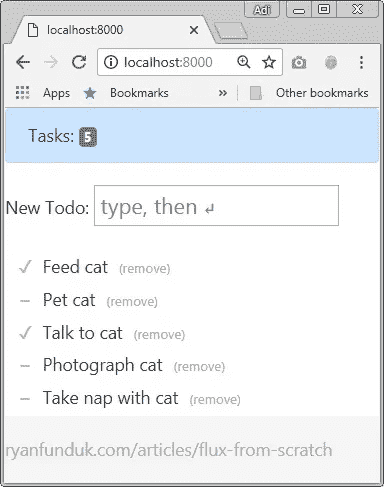
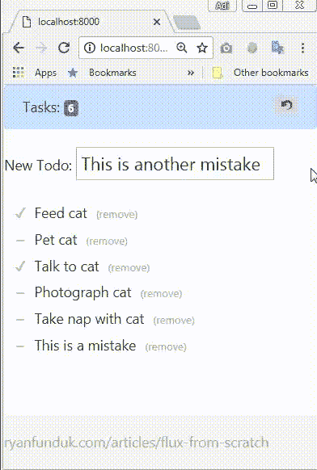
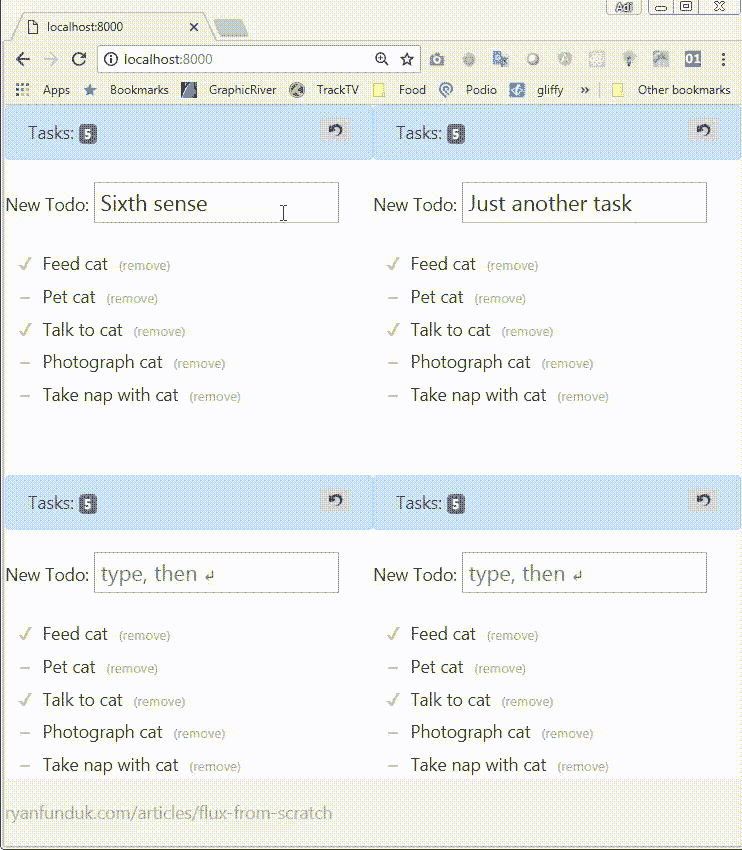

# 自己动手:客户端状态管理—第 1 部分

> 原文：<https://itnext.io/do-it-yourself-client-side-state-management-part-1-31396d28177f?source=collection_archive---------5----------------------->

lux 和 Redux 都有维护一个**应用程序状态**的概念，它们都使用**动作**来改变那个状态。它们需要 UI 和状态之间的紧密耦合。关于状态管理有不同的方法和模式，这两种模式为许多创新提供了基础。

当我看到一篇名为“Flux from Scratch”的文章(见下面的链接)时，它激励我勇往直前，自己动手:**抓住关键概念并实施它们！看看它们是如何工作的！让他们变得更好！这篇文章描述了我所采取的第一步。**

我将尝试使用简单明了的代码来实现它，不使用任何外部库(除了与 UI 相关的 jQuery 特性)。在本系列中，我将研究并实现一些概念，如 **Flux** 、 **Redux、不变性**、 **Observables** 、 **Stores** 、 **Actions** 、**dispatcher**…以及其他任何看起来相关的东西。



改编的“从零开始的流量”应用程序

# 第一步目标

该应用程序基于“从零开始的变化”文章中的示例，我想做一些更改…所以让我们…

*   创建类似 RxJS 的**可观察**和**行为主体**
*   订阅状态更改而不是特定的操作
*   维护状态更改的历史记录，并添加撤消状态更改的选项

# 密码

我们将从*可观察的*类开始。该类将维护存储中的订户列表，并在值发生更改时处理通知过程。

通过调用*来改变数值。next()* 方法并提供一个新值。
订阅由*添加。subscribe()* 方法—它们只是接受值的回调函数。

当你简化它的时候，你会得到一个非常简单的类:

你会注意到 *MyObservable 不接受初始值，也不在任何地方保存这个值。它只是一个发送通知的管道。*

另一方面，有一个*行为主体*。该类允许您设置值和订阅更改，但它也保留当前值，并公开*。getValue()* 方法。

下面是我的实现:

# 可观察与行为主体

请注意，这些类型之间存在一些关键差异，这些差异将决定哪种类型与我们的需求相关:

*   *行为主体*必须有一个初始值，在第一次调用 *next()* 之前*可观察*可能保持未定义。
*   当订阅一个*行为主体*时，它将返回最后一个值，而*可观察对象*则不会。
*   您可以使用从一个*行为主体*创建一个*可观察对象*。 *asObservable* ()获取只读可观察值。

# 捐款

我们现在可以**订阅**来存储更改。订阅可以有一个引用，然后当不再需要时可以删除它们。所以我们现在有两个新方法: *subscribe()* 和 *unsubscribe()。*

使用示例:

# 历史



添加撤消按钮

当更新状态对象时，我们可以维护更改的历史，并添加对 *undo()* 方法的支持，该方法反过来执行 *MyBehaviorSubject* 中的 *unto()* 方法。

# 额外收获:多家商店

现在我们有了不同的可以自我处理的对象，我们已经通过生成多个 dispatchers 和多个 store 为使用可以独立运行的多个 store 铺平了道路。



用多个调度员经营多个商店

# 结论

通过使用 Observables，我们能够将经典模式改变为反应模式——一种对状态变化而不是特定动作做出反应的模式。想象一下，当您扩展应用程序并增加越来越多的复杂性时，订阅所有操作或每个组件只订阅 10–15 个操作。

一旦存储可以“处理自己”并维护它自己的信息，我们就可以维护更改的历史，并在单个应用程序中支持多个存储(或多个“状态”)。

# 下一步是什么？

在下一篇文章中，我们将考虑使用*选择器*和订阅状态特定部分的选项。当然，我们将开始添加中间件来组织事情。

```
Reference"Flux from Scratch" by Ryan Funduk
[https://ryanfunduk.com/articles/flux-from-scratch/](https://ryanfunduk.com/articles/flux-from-scratch/)Code:
[https://codepen.io/rfunduk/pen/oXZzVx](https://codepen.io/rfunduk/pen/oXZzVx)
```

```
GitHub repository:
[https://github.com/justguy/FluxDemoRx](https://github.com/justguy/FluxDemoRx)
```