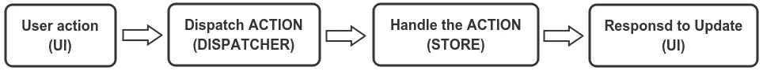
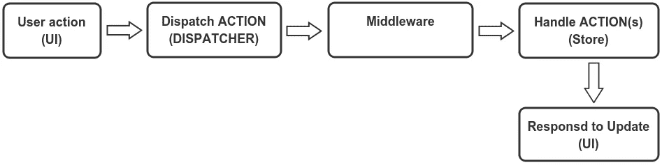
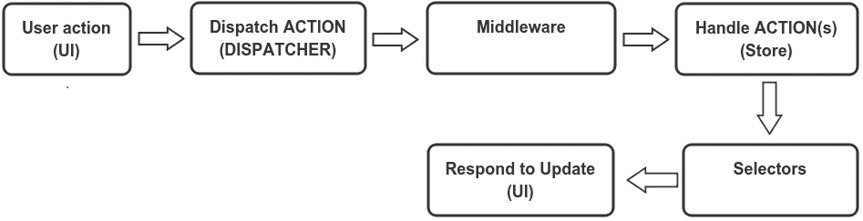
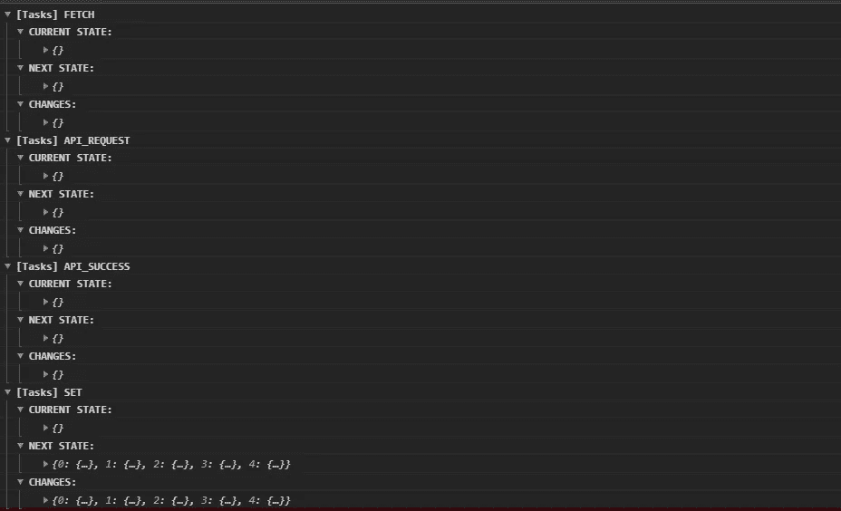
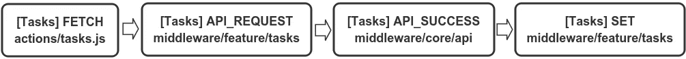
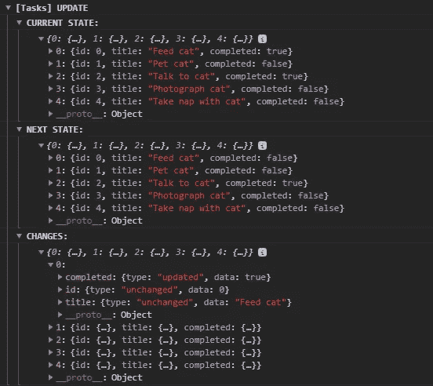
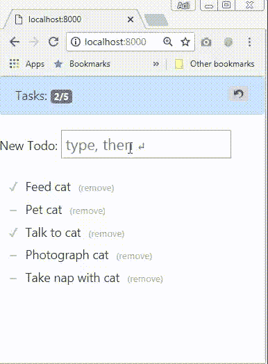

# 自己动手:客户端状态管理—第 2 部分

> 原文：<https://itnext.io/do-it-yourself-client-side-state-management-part-2-f1767b5bfc9b?source=collection_archive---------4----------------------->

在上一篇文章中，我们已经研究了对可观察对象使用 Flux statement 管理流。我们添加了一个定制的 *BehaviorSubject* 类，并将其合并到流中，以使流**对状态变化做出反应**。流程如下所示:

电流

在本文中，我们将研究使用**中间件**的概念，并尝试将应用程序的一些业务逻辑转移到可重用的构建模块中。中间件将允许我们分解和简化更新应用程序状态的逻辑。

在*中间件*就位后，我们将尝试在使用**选择器**从商店检索信息时实现可重用性和简单性。

# 密码

完整的源代码共享在 [GitHub](https://github.com/justguy/MyTasks) 上。

# 商店

新的商店将利用上面提到的所有概念，并且足够通用，因此您可以将它用于任何需要的数据结构。

初始存储包含基本内容:状态和 dispatcher，并公开方法来支持以前版本中使用的所有功能，但请注意，存储不包含任何业务逻辑。更新信息所需的所有逻辑将使用 reducers 提供。这保持了商店的清洁和可重复使用。

Redux 存储的实现

# 还原剂

Reducers 处理更新应用程序状态的逻辑。它们使用动作来激活，并返回状态的更新副本。行动包含使缩减者能够执行其工作的信息。

在我们的简单应用程序中，与业务逻辑相关的操作是面向任务的，那么我们需要什么呢？

*   装入(或取出)
*   设置所有任务
*   更新任务
*   删除任务

因此，我们的任务操作文件如下所示:

每个动作都需要类型(字符串)和有效负载(对象)。meta 是可选的，可以包含任何有助于跟踪或记录操作的信息。

您会注意到每个任务都以*【Tasks】*前缀开始，这样我们就可以区分不同对象类型的类似任务。这些动作现在可以在一个 reducer 中使用了。目前我们只需要一个减速器- *任务减速器:*

这个 reducer 接收当前状态，操纵它，并返回更新的版本(存储中的第 14 行)。然后在存储中更新新的状态(存储中的第 17 行)。现在，我们的不可变存储可以处理变化，并检查所有与流量相关的内容。

当我们添加新的缩减器时，我们需要小心并记住，将缩减器引入商店的顺序很重要，因为每个缩减器将在第一个缩减器之后添加，将从其前任获得更新的状态。

# 中间件

由于 reducers 执行业务逻辑，在流程中有特定的工作，所以我们不会使用它们来执行其他类型的操作(如日志记录、获取等)。).这就是中间件发挥作用的地方。这些是可重用的 curried 函数，可以与我们使用的业务对象类型无关。

我们在初始化期间将它们提供给商店(与减速器相同)，并在减速器之前运行它们**。**

我们的应用有 3 个**核心中间件**(位于*js/中间件/核心*下):

*   *actionSplitter* —接受一组动作，并将其拆分为独立的动作，以便减速器处理
*   *api* —处理与 api 相关的操作(在本例中:fetch)
*   *记录器* —将操作和状态变化记录到控制台

如果我们看看 API 中间件，我们可以看到它是通用的，可以从任何 URL 获取任何类型的中间件，这意味着它是可重用的:

当 API 中间件接收到获取信息的请求时，第一件事是发送请求继续处理(第 4 行)。为什么？因为当 API 操作完成时，会分派一个新的动作(第 11、12 行)。

我们还有一个在核心中间件和我们的业务逻辑之间“连接”的任务中间件——这是我们的**功能中间件**(位于 *js/middleware/feature* 下):

任务中间件首先向下发送动作(第 7 行)，然后开始处理请求。您会注意到，例如，*FETCH _ TASKS("[TASKS]FETCH ")*分派了一个新的动作:API REQUEST("*[TASKS]API _ REQUEST*")，它由 API 中间件处理。

这就是为什么我们向商店提供中间件的顺序很重要:

因此，现在我们可以向我们的商店添加中间件支持(第 46–58 行):

# 选择器

选择器是从存储中检索信息的干净且可重用的方法。它们是可定制的，可以接受参数，并且知道状态的业务逻辑和结构。当使用选择器时，我们将所有与信息检索相关的逻辑放在一个公共位置，因此应用程序的其余部分不会因结构的改变而改变。从关注点分离的角度来看，这很好。

看看任务选择器:

该文件包括我们的应用程序所需的三个选择器:

*   *任务* —获取所有任务
*   *任务* —根据 ID 获取具体的任务
*   *taskCount* —获取任务总数或已完成任务总数(是的，我可以使用第一个选择器，但是我的应用程序必须知道如何将任务定义为“完成”)

例如，显示已完成任务的计数器和总任务数是通过订阅状态更改和 *taskCount* 选择器完成的:

# 现在都在一起

当应用程序加载时，它创建一个新的存储，并传入所有中间件和 reducer(*tasks app . js*):

稍后，在呈现时，它订阅状态更改并设置所有需要的逻辑。最后，它调度 *fetchTasks()* ，这是我们的 ACTIONcreator，它创建请求商店加载任务列表的动作。

如果您查看控制台，您将能够看到正在运行的内容和信息传输:

首次加载时控制台中的记录器输出

获取和设置任务操作

当你完成一个任务时，一个单独的动作被分派:*【任务】更新*:

更新任务控制台输出包括所有必需的信息

您可以看到第一个任务的 *completed* 值已经从 *true* 变为 *false* 。记录器中的分组使得识别变更的来源和跟踪变得容易。

现在一切都像以前一样运行:

添加、更新和撤销正在工作！

# 下一步是什么？

现在我们已经有了一个*完美的*小应用程序(呵呵)和一个非常简单的基础设施，我们可以开始考虑扩展了:

*   通过避免不必要的更新来提高性能
*   添加外部 API 支持
*   添加更多数据结构
*   添加对自动更新/重复任务的支持
*   使用外部工具(如 Redux DevTools)

敬请关注。

# 参考

项目结构很大程度上基于 [Nir Kaufman](https://medium.com/u/91e7a417e575?source=post_page-----f1767b5bfc9b--------------------------------) 的书[在 Redux](https://leanpub.com/thinking-in-Redux) 中思考。

@pearlmcphee 有一篇关于选择器的很棒的文章。