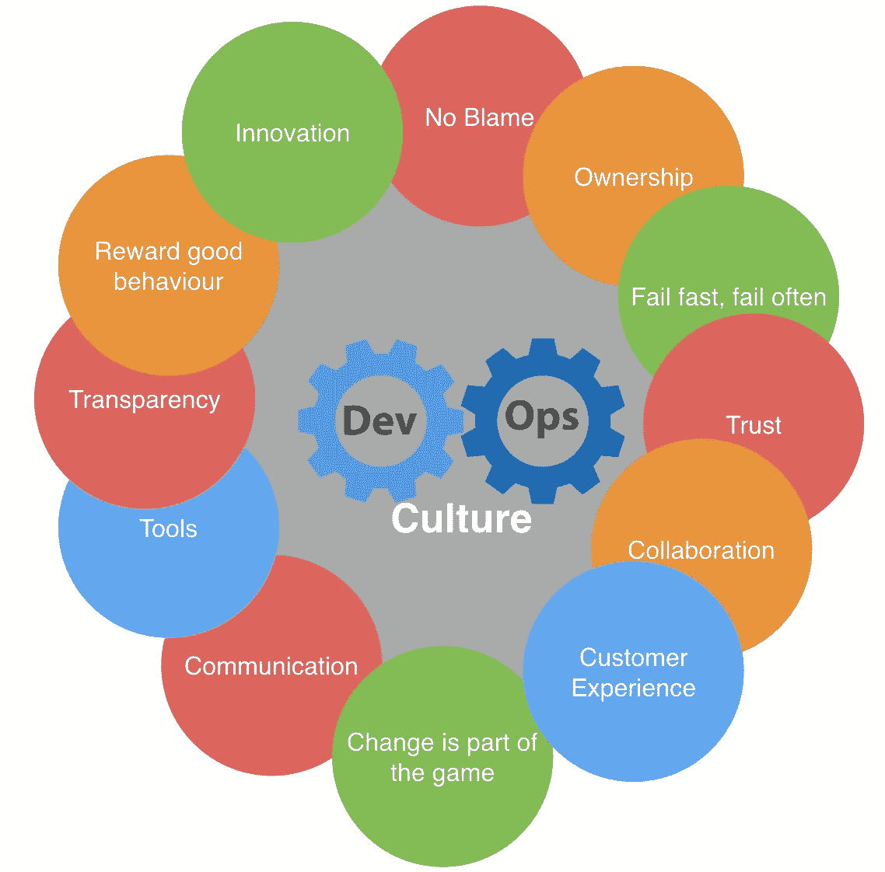
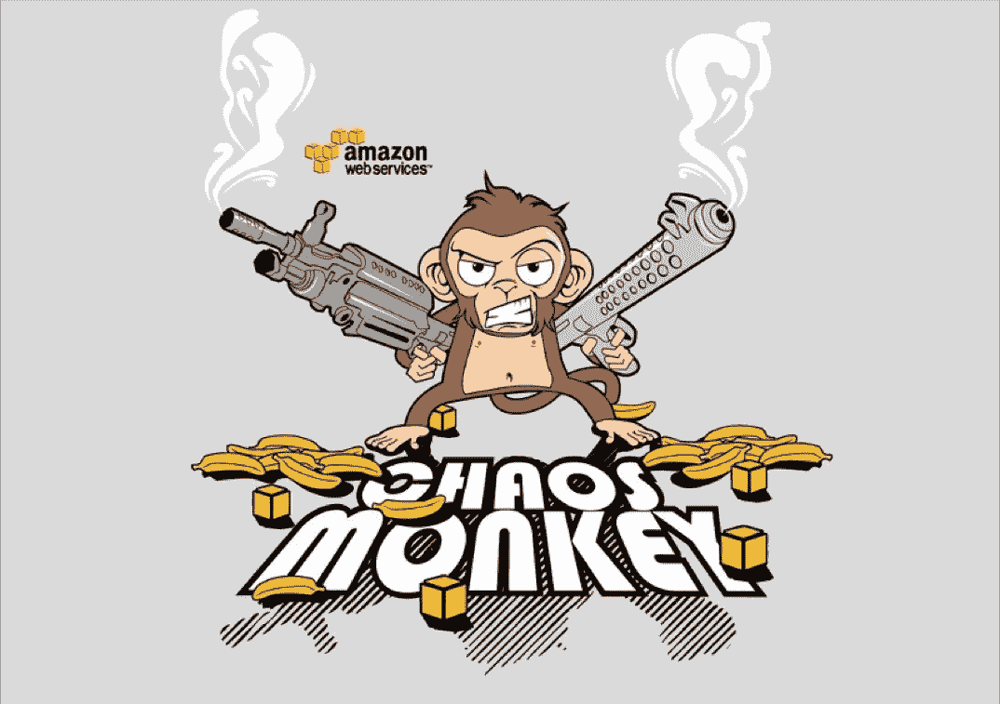
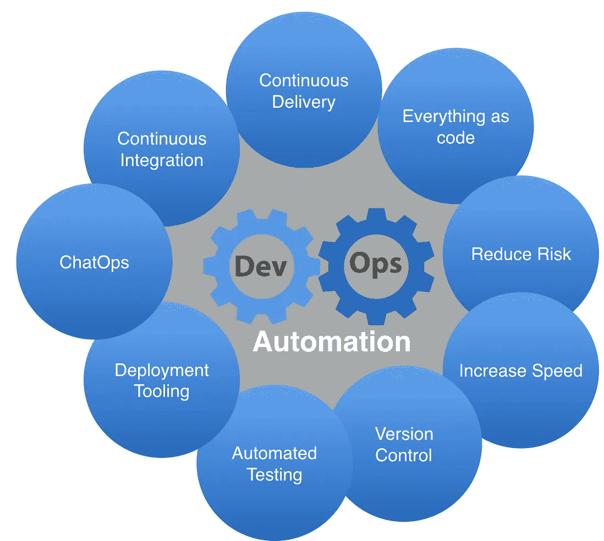

# 不要把 devops 放在笼子里

> 原文：<https://itnext.io/do-not-put-devops-in-a-cage-3604a83821e1?source=collection_archive---------3----------------------->

Devops。如果你是软件工程师、技术人员、QA、开发人员、DBA 或任何与 IT 相关的人，你一定听过这个词。围绕它有很多宣传，这是肯定的。我们不再雇佣系统管理员；我们雇佣 devops 工程师。开发人员需要理解围绕它的所有概念— *持续集成、持续部署、文化和许多其他方面*。

你还会看到一些公司将自己定位为 devops 方式的大力支持者和热心者。尽管大肆宣传，但这是一个双赢的局面:公司从中受益，ITers 以及客户/顾客也是如此！

## devops 及其定义

此外，你的读者，**你认为 devops** 是什么？请在下面发表你的评论，并引发一场关于此事的讨论。我知道很难做到简明扼要。此外，**你是否在一家自称“做 devops”的公司工作？**您是否工作或认识 devops 团队？怎么样？分享一下你的经验！创建一个新的筒仓来点燃 devops 可能看起来是反直觉的，但也许它在你的地方工作！

其中一个最简洁的定义来自于大厨的联合创始人兼 CTO 亚当·雅各布斯(Adam Jacobs)。它触及到了至关重要的鲜明点:**文化**、**专业**、**变革**(高速度)和**专长**(从业者)。

> “devops 是一项文化和专业运动，专注于我们如何建立和运营高速组织，源于其从业者的经验。”

尽管 devops 的想法和心态听起来显而易见，但为什么过了很久才出现？2009 年，devops 这个术语出现并蓬勃发展的那一年，发生了什么？

## 让我们谈谈 2009 年

一些势在必行的方面可以解释为什么 2009 年是 devops 的诞生年。不仅仅是这一年我们失去了迈克尔·杰克逊。作为每一种文化表现形式，它不仅仅是一个人或一部作品的产物。许多东西聚集在一起，肥沃了土壤，为它的出现提供了必要的条件:

*   [Patrick Debois 和他的敏捷基础设施](http://www.jedi.be/presentations/IEEE-Agile-Infrastructure.pdf)
*   Allspaw & Hammond Flickr 关于 Velocity 2009 的演示[–Flickr 每天部署 10 多项开发和运营合作](https://www.youtube.com/watch?v=LdOe18KhtT4&t=217s)
*   **精益**启动和精益文化
*   **云**计算！

云可以被认为是我们最近看到的几乎每一场革命的最大推动者:人工智能、机器学习、devops 和许多其他革命。在 devops 中，这是最重要的，因为它与将一切视为代码、构建弹性系统和伸缩性联系在一起。**云万岁！**

## 平静

在每个 devops 的演示和介绍中，都会提到**或 **CALMS** 。这一切都可以归结为文化、自动化、手段、措施和分享。文化和分享是紧密相连的。自动化、精益和测量也是如此。**

**文化对于相关的软件工程师来说是最重要的，因为它直接反映在他们的快乐和日常工作中。从下图中，你可以看到一些与 devops 文化相关的要点。我的评论去创新，没有指责(无可指责的事后 FTW！)、所有权(你拥有并且知道怎么做)&“失败得快，失败得勤”心态。这种思维模式的改变在根植于恐惧的文化中很难实现，因为它受到流程、门票和请求的束缚！**

****

**失败的方面和自动化一起产生了有史以来最伟大的工具之一呈现给观众。当你拥抱失败时，当你在日常生活中加入错误时，你开始面对它们而不绝望。网飞和 AWS 向我们展示了混沌猴，我不会宠坏它！只需点击下面的图片，就能看到来自网飞乔希·埃文斯的精彩演示。**

****

**关于**自动化**，有一些基本的方面:CI/CD，测试，通过 ChatOps 聚集，版本控制，测试。本质上，把一切都当作代码来对待，这样可以降低风险，提高速度。**

****

**通过这样做，并始终从消费者/顾客/客户的角度来看，你可以预测他们的需求。您可以建立完美的流程，避免浪费并优化您的流程。这是**精益**的部分！**

**这和**监控**有关系。通过监控您的应用程序，尤其是在部署之后，您可以预测您的需求，并在正确的时间提供正确的功能。**

**Devops 不仅仅是关于开源，而是关于**分享**——成功和失败。分享你的失败并研究它是至关重要的。*你从崩溃&烧伤*中学到更多，所以尽可能公开！**

## **把这个笼子拿走**

**我看到并面对了几个关于 devops 的倡议，特别是作为[*devo psdays Amsterdam*](https://www.devopsdays.org/events/2017-amsterdam/welcome/)的组织者。想要以一种非常有害的方式来标记和驯服 devops 运动的倡议。人们试图定义 devops 流程、框架，甚至认证 devops ( *你如何认证一个文化运动？*)。
简言之:**

*   **devops 是关于人的**
*   ****由于大型组织所要求的控制、规划和预算的必要性，**在大型企业中很难实施**(从传统的单片系统过渡到 devops 方法以及使用微服务可能会很麻烦)****
*   ****我们还没有到达它的最后阶段，也不确定——devo PS 是进化的一部分****
*   ****它需要倡导者和巨大的文化心态变化才能发挥作用****
*   ****每个人都从中受益，**不仅仅是“开发”或“运营”******

****[荷兰国际集团](https://www.ing.nl/)，一家荷兰银行和 [LINKIT](https://www.linkit.nl/) 的合作伙伴，成功地从瀑布式整体开发过渡到敏捷开发，正如你在这里看到的。****

*****这是基于“* [*PMI 荷兰分会会议*](https://www.pmi-netherlands-chapter.org/index.php/events/past-events/chapter-meetings/900-2017-03-28-chapter-meeting-at-linkit-de-meern) *”在*[*LINKIT*](https://www.linkit.nl/)*举办的“DevOps 不是工具、筒仓或认证”的演讲。*****