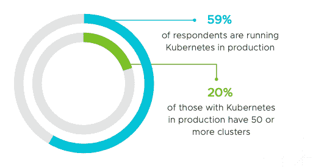
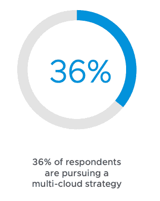
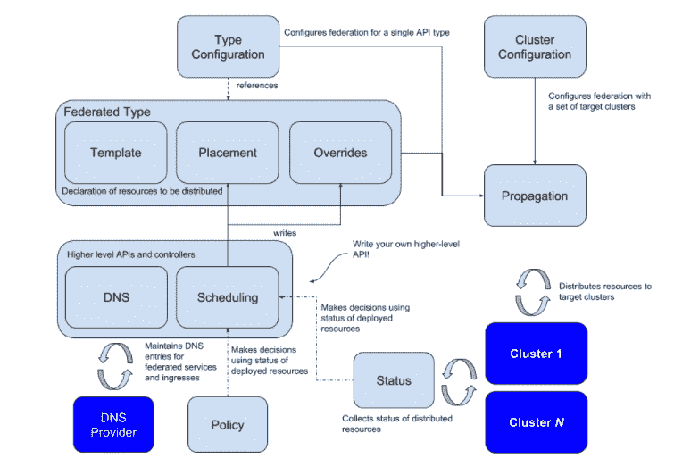
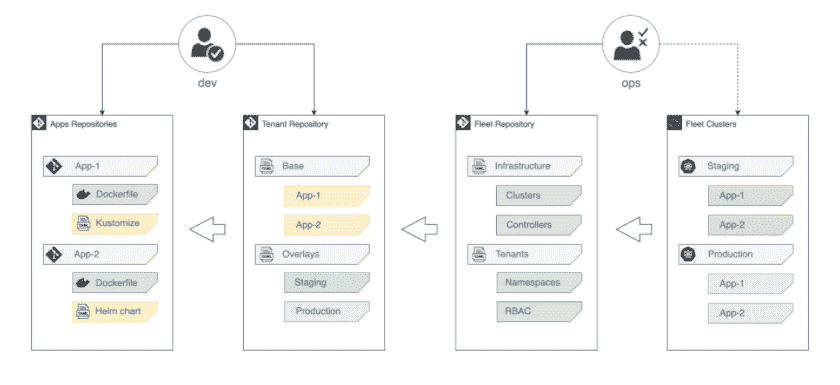
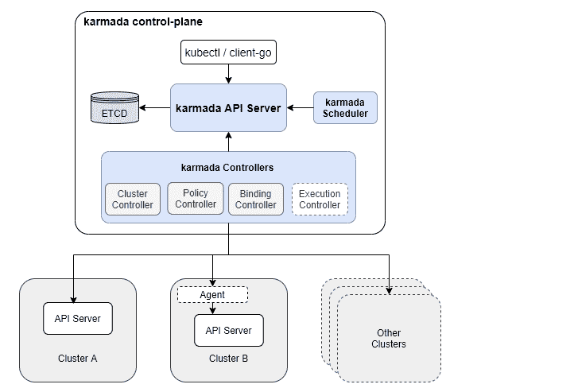
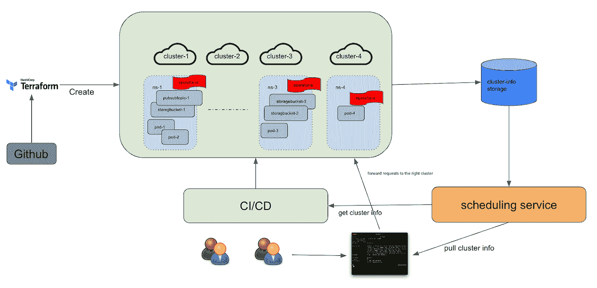

# 您需要多集群吗？

> 原文：<https://itnext.io/do-you-need-multi-clusters-6e58556f7f06?source=collection_archive---------0----------------------->

## 评估 CNCF 多集群解决方案，走我们自己的路

当部署在云上的服务达到一定水平时，所有公司都应该采用多集群。根据 VMware 2020 的 Kubernetes 报告的[状态，33%的 Kubernetes 采用者运行 26 个或更多集群，20%运行 50 个以上集群。](https://tanzu.s3.us-east-2.amazonaws.com/campaigns/pdfs/VMware_State_Of_Kubernetes_2020_eBook.pdf)



无论使用 AWS、GKE 还是其他云提供商，无论是否自己构建 Kubernetes 平台，无论是否使用自动扩展功能，您都会发现单个集群的容量是有限的。由 [Kubernetes 官方](https://kubernetes.io/docs/setup/best-practices/cluster-large/#:~:text=A%20cluster%20is%20a%20set%20of%20nodes%20%28physical,configurations%20that%20meet%20all%20of%20the%20following%20criteria%3A)推荐的“最大”集群应该是

> 每个节点不超过 110 个机架
> 
> 不超过 5000 个节点
> 
> 总共不超过 150000 个豆荚
> 
> 总集装箱数不超过 300000

许多人可能认为他们当前的集群性能很好，对多集群的需求还很遥远。然而，他们很快就会走向多集群。

# 动机

我们采用的单个集群负担很重:它包含大约 *2000 个名称空间，3000 个 pod*，但是集群中的大多数资源都是 GCP 相关的，包括***10000****more storage bucket，****10000****more IAM 资源*，以及相当数量的 Bigtable 和 BigQuery 相关的资源。与此同时，这 50 家运营商正在运行数十个内部或开源控制器。

就性能而言，GKE 自动缩放器目前工作良好。但我们仍然开始寻求多集群战略，将我们的资源和服务迁移到多集群，以解决以下问题。

*   **扩展性**。当部署或升级某个运营商时，依赖于该运营商的 pod 必须重新启动，这导致整个集群中的羊群效应，因为这些 pod 可能管理每个名称空间中的大量资源。当 APIServer 无法响应请求时，就会出现错误。由于 Kubernetes 的故障重启机制，所有吊舱在数小时内重复重启。因此，单一群集不再能够满足我们快速升级、引入新用户和部署新资源的需求。

```
"error": "Get "https://10.1.1.1:443/apis?timeout=32s": context deadline exceeded"Failed to get API Group-Resources", "error": "context deadline exceeded"
```

*   **可用性和用户体验。**作为全公司 CI/CD 管道的一部分，我们的服务将影响几乎所有正在或将要部署的服务，如 PR 合并或主建筑。单个集群的爆炸半径太大，如果一项服务需要紧急部署，就需要付出很大努力来绕过我们的单个节点故障。
*   **隔离**。集群中的资源可以根据它们的变化频率分成两类:稳定的和不稳定的。我们可以将那些稳定的资源(P99)转移到一个相对稳定的环境中，使其免受其他操作员或资源的影响。
*   **表演**。随着一些集群级别的操作员管理的资源数量增加到 10k，他们会遇到各种性能问题。有必要减少他们的 pod 使用开销并改善用户体验。
*   **多环境**。我们集群中运行的几十个运营商超出了我们的管理范围，大部分运营商维护人员都有自己的发布和部署权限。一旦其中一个出现问题，整个集群都将面临可用性问题。然而，由于当前测试环境和生产之间的巨大差距，很难预测生产中可能出现的问题。因此，我们需要一个更安全的解决方案来测试和释放这些操作符。

多集群拯救一切，**大大减轻了当前 APIServer 的压力，加快了我们新功能的升级和部署，减轻了对用户的影响，缩小了爆炸半径，提升了用户体验。**

另外，*“不要把鸡蛋放在一个篮子里”*似乎也是云战略中的趋势。在 VMware 最新的 [2021 年报告](https://tanzu.vmware.com/content/ebooks/the-state-of-kubernetes-2021)中，36%的用户已经在推动多云战略，这也是许多公司的计划之一。



由于深受 GCP 的影响，我们更接近多云战略是明智的，部署多集群将是第一步。

# 如何设置多集群

我们的研究从 CNCF 现有的能够支持和满足我们需求的工具开始。除了上面列出的痛苦，我们现在应该关注我们实际需要的东西。

*   **集群部署**，可以快速部署多个集群，解决网络问题。
*   **集群发现**，在用户资源分散到多个集群的情况下，搜索当前需要操作的集群的中心服务。它还应该提供类似于一致性散列的功能，以避免当集群随后增加时将资源重新部署到不同的集群。
*   GCP 资源和自定义 CRD 支持。我们需要更多支持那些由谷歌[配置连接器](https://cloud.google.com/config-connector/docs/overview)定义的 GCP 资源，以及由公司内部 CRD 定义的资源。

同时，我们还需要适应许多地方的多集群变化。

*   根据 CI/CD 中的当前请求对资源进行分组。有时，我们需要同时在多个集群上启动操作。
*   确保每个运营商都支持多集群。
*   为用户提供 UX 或 CLI 工具，以发现他们用于 CLI 操作的资源。

考虑到所有这些需求，让我们看看社区中的用户是如何实现多集群的，用什么策略，用什么工具。

## 战略

通常，有两种多集群策略，以 Kubernetes 为中心和以网络为中心。

*   **以 Kubernetes 为中心的**，管理多个集群，通过在多个集群上构建控制平面层来分发和调度资源管理请求，这些集群是孤立的，每个集群管理不同的资源。
*   **以网络为中心**，通过网络配置实现不同集群之间的通信，实现资源复制，保持每个集群上的资源一致。

您可能会发现这两种策略类似于克服我们在数据库中遇到的瓶颈的传统方法。没错。以 Kubernetes 为中心的模式类似于主-主模式，它依赖于一个数据库中间件(控制平面)来处理和分发请求，而以网络为中心的模式是主-从模式，主和从之间的通信最终保持数据一致。

在我们的例子中，以网络为中心的策略不适用，但是以 Kubernetes 为中心的策略可以减轻每个集群的负担。

## 工具

那些来自云提供商的工具，比如 GKE 的[多集群支持](https://cloud.google.com/kubernetes-engine/docs/how-to/multi-cluster-services)，已经过时。它们基本上都是以网络为中心，并伴随着两大问题。

*   不那么开源，很难定制或者二次开发。
*   与云提供商本身高度耦合，不利于未来的多云或混合云战略。

现在来看看社区中有哪些流行的工具可供我们选择。

**库伯菲德**

这个流行的多集群工具有两个版本，v1 `kube-federation`(已经废弃)和 v2 `[kubefed](https://github.com/kubernetes-sigs/kubefed)`。



来自 https://github.com/kubernetes-sigs/kubefed 的库伯菲德

从 kubefed 的整体架构我们可以看到，它本质上是由两个 CRD，`Type Configuration`和`Cluster Configuration`组成，通过 CRD 各自的控制器和准入 webhooks 实现两个主要功能。

*   **跨集群分布**。通过抽象出`Templates`、`Placement`、`Overrides`三个概念，可以将资源(如`Deployment`)部署到不同的集群，实现多集群的扩展。
*   **调度**，用`clusterSelector`和`ReplicaSchedulingPreference`实现资源调度。

此外，`kubefed`还支持许多特性，如高可用性、更容易的资源迁移、多云和混合云部署等。

然而，它不是我们要找的那个。

*   对于大多数开发人员来说，这是一个复杂的工具，有着陡峭的学习曲线。
*   它不支持定制分发策略，不能满足我们隔离不同稳定性资源的要求。比如`ReplicaSchedulingPreference`只能支持`Deployments`和`Replicasets`。
*   它不支持自定义 CRD。我们需要额外的努力来管理来自`Config Connector`的 GCP 资源。

**Gitops**

Gitops 已经是一个非常流行的将 Kubernetes 资源部署到集群的 CI/CD 标准，比如 [FluxCD](https://fluxcd.io/) 、 [Fleet](https://rancher.com/docs/rancher/v2.x/en/deploy-across-clusters/fleet/) 、 [ArgoCD](https://argoproj.github.io/argo-cd/) ，大部分都支持多集群。是我们可以依靠的吗？

FluxCD 支持[多集群](https://github.com/fluxcd/flux2-kustomize-helm-example)和[多租户](https://github.com/fluxcd/flux2-multi-tenancy)，使用`kustomization`和`helm`添加新集群，支持资源隔离。



经过评估，也不是那个。

*   无动态分布。资源分配需要以类似`go template`的方式提前注入，而不是动态分配。而且我们自己的 CI/CD 工具也无法与之无缝集成。
*   副作用。应用`helm`和`kustomize`的开销太高。

这些缺点是其他 Gitops 所共有的，也是不适用的。

**卡玛达**

[Karmada](https://github.com/karmada-io/karmada) 来自 CNCF 沙盒，支持多集群和多云策略。



来自 https://github.com/karmada-io/karmada 的卡玛达

其设计部分继承了`kubefed` v1 和 v2，与`APIServer`、`Scheduler`和`controller-manager`组成控制平面，通过`PropagationPolicy`和`OverridePolicy`两个 CRD 实现资源调度和分配。

Karmada 有许多优势，包括但不限于:

*   **集群管理**。统一 API 支持集群注册和生命周期管理。
*   **声明式资源调度。**支持定制的调度策略，根据标签和状态动态调度资源到合适的集群。

Karmada 的主要优势在于本土的 Kubernetes 资源加工，但它并不天然支持 CRD。

> 对于 Kubernetes 的原生资源，Karmada 知道如何解析它们，但是对于由 CRD 定义的自定义资源(或由 aggregated-apiserver 之类的东西扩展的资源)，由于缺乏资源结构的知识，它们只能被视为普通资源。因此，高级调度算法不能用于它们。

也就是说，需要[资源解释器](https://github.com/karmada-io/karmada/blob/master/docs/userguide/customizing-resource-interpreter.md)开发来实现那些功能，比如动态调度。我们不挑的最大原因。

## 我们自己的方式

意识到我们正在以一种非常“独特”的方式使用 Kubernetes，这不同于社区中的大多数场景，我们决定定制我们自己的实现来完全满足我们的需求。

从目前的单集群过渡到多集群没有太多的事情要做。

*   **集群管理**。我们已经使用 terraform 创建了当前集群，因此在解决网络问题并拥有足够的 IP 后，我们可以使用`terraform`快速创建额外的集群。
*   **调度**。当我们决定根据名称空间将资源分布到不同的集群时，我们需要一个中央调度服务:当一个名称空间被传入时，该服务可以返回相应的集群上下文，以便我们可以将资源部署到 CI/CD 服务中的相应集群。该服务还应支持 GRPC，以便与公司内的分销战略相统一。
*   **Golang 支持**。我们有许多自主开发的操作程序，因此操作程序维护人员将需要 Golang 包的支持。当然，这是一个不错的选择，因为他们可以通过 RPC 接口获得集群信息。
*   **自动化**。对于单个集群，我们通过 CLI 或简单的脚本手动完成构建集群、安装工具、安装和部署各种操作员。现在有了多集群，当手动一个接一个地部署集群显得低效且容易出错时，我们需要升级。因此，自动化相关的工具和完整的脚本是必要的。
*   CLI 工具。我们希望为用户提供与在单集群场景中相同的多集群体验，用户可以登录我们的集群来查看他们的资源。为此，我们需要实现一个 kubectl 插件来封装相关的逻辑，只要用户传入名称空间，kubectl 请求就可以被转发到相应的上下文。

基本上，从单集群到多集群的架构变化如下。



正如所见，它比任何现有的工具都更有效，并且更适合我们当前的情况。

# 结束了

本文回顾了我们在实现多集群时遇到的问题、进行的讨论以及引发的思考。我们没有使用社区中的任何工具，但是我们通过研究它们的特性、优点和缺点，为自己铺平了道路。

希望它还能让您对多集群的实现有一个大致的了解，并在您处于十字路口时有所启发。

感谢阅读！

# 参考

[https://kubernetes . io/blog/2018/12/12/kubernetes-Federation-evolution/](https://kubernetes.io/blog/2018/12/12/kubernetes-federation-evolution/)

[了解多集群 Kubernetes | Ambassador Labs(getambassador . io)](https://www.getambassador.io/learn/multi-cluster-kubernetes/)

[简化 Kubernetes |云计算本地计算基础(cncf.io)中的多集群](https://www.cncf.io/blog/2021/04/12/simplifying-multi-clusters-in-kubernetes/)

【github.com】flux CD/Flux 2-多租户:使用 Flux 管理多租户集群

【github.com karmada-io/karmada:开放、多云、多集群 Kubernetes Orchestration

[Kubernetes 多集群:如何&为什么使用它们— BMC 软件|博客](https://www.bmc.com/blogs/kubernetes-multi-clusters/)