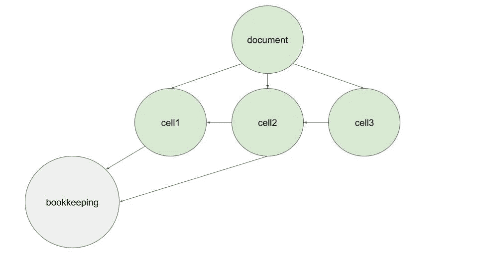

# 通过使用有向无环图来报税

> 原文：<https://itnext.io/do-your-tax-filling-by-using-a-directed-acyclic-graph-ed89682adbd0?source=collection_archive---------5----------------------->


照片由[娜塔莉亚·瓦特凯维奇](https://www.pexels.com/photo/tax-return-form-and-notebooks-on-the-table-6863514/)在[佩克斯](https://www.pexels.com/)拍摄

在许多国家，当你完成记账后，你必须填写一些官方表格。文档中的每个单元格通常遵循一些不透明的规则，在这些规则中，您需要绘制不同数量的簿记，并最终将它们与其他单元格的值相结合。它看起来像一个巨大的人造电子表格，实际上是一个依赖关系的[有向无环图](https://en.wikipedia.org/wiki/Directed_acyclic_graph)(或 DAG)。

## 定义图表

让我们定义填充文档的规则:

```
const ***documentRules*** = {
    cell1({bookkeeping: {amount1}}) {
        return amount1 * 2;
    },
    cell2({bookkeeping: {amount2}, document: {cell1}}) {
        return amount2 + cell1;
    },
    cell3({document: {cell2}}) {
        return cell2 + 42;
    },
    // etc
};
```

每个属性都是一个函数，它的名字指向文档的一个给定的单元格，它的参数是依赖项，我们需要通过解析来获取单元格的值。
如果*记账*是一个外部依赖关系(我们可以假设所有记账值在当前单据之前已经被解析)，则*单据*引用当前单据(*即*引用*单据规则*对象的其他函数)。



依赖图

如果您希望用正确的数量填充文档，您需要以某种方式解析根节点所依赖的所有值(以及它们的传递依赖关系)。幸运的是，在 JavaScript 中只需要几行代码！

## 属性描述符

在 Javascript 中，由于有了[属性描述符](https://developer.mozilla.org/en-US/docs/Web/JavaScript/Reference/Global_Objects/Object/defineProperty)，您可以精确定义对象的属性行为。例如，您可以定义一个 getter 函数或/和 setter 函数，每当通过常规点符号/等式赋值读取或赋值属性时，都会调用该函数。

```
const ***obj*** = ***Object***.defineProperties({} /* here empty object but can be whatever object */,{
    someProp:{
        get(){
            ***console***.log('getter called');
            return 42;
        },
        set(val){
            ***console***.log('setter is ignored');
        }
    }
});

***console***.log(***obj***.someProp); // getter called

***obj***.someProp = 43; // setter called

***console***.log(***obj***.someProp); // still 42!
```

这将在控制台中打印出来:

```
getter called
42
setter is ignored
getter called
42
```

我能想到的一些常见用例有:

*   将属性设为只读

```
const ***obj*** = ***Object***.defineProperties({},{
    someProp:{
        get(){
            return 42;
        }
    }
});

***obj***.someProp = 43; // will throw " Cannot set property someProp of #<Object> which has only a getter"
```

*   代理属性:

```
let ***value*** = 42;

const ***descriptors*** = {
    someProp:{
        get(){
            return ***value***;
        },
        set(val){
            ***value*** = val
        }
    }
}

const ***obj*** = ***Object***.defineProperties({},***descriptors***);
const ***objBis*** = ***Object***.defineProperties({},***descriptors***); // different object !
***obj***.someProp = 43;
***console***.log(***objBis***.someProp); // 43 !
```

*   记录属性访问
*   等等..

请注意，析构对象也会调用这些 getters:

`const {someProp} = obj;// getter for "someProp" is called here`

## 解析图形

仔细想想，您几乎可以将文档及其依赖图定义为一个普通的 Javascript 对象:

```
const ***bookkeeping*** = {
    // whatever
}

const ***document*** = {
    cell1: ***bookkeeping***.amount1,
    cell2: ***bookkeeping***.amount2 + ***document***.cell1,
    cell3: ***document***.cell2
}
```

问题在于你不能在文件初始化之前使用它，上面的代码会抛出

```
ReferenceError: Cannot access ‘document’ before initialization
```

但是我们可以利用属性 getters 来推迟对属性的访问，直到真正需要它的时候(由 cell rule 函数分解)。

让我们先定义一些实用函数(通常由库提供如 [ramda](https://ramdajs.com/) 、 [lodash](https://lodash.com/) 等):

```
const mapValues = (mapFn) => (target) => ***Object***.fromEntries(
    ***Object*** .entries(target)
        .map(([key, value]) => [key, mapFn(value)])
);
```

*mapValues* 用提供的函数映射一个对象的值，并返回一个形状与目标相同的新对象:

```
const ***target*** = {
    propA: 'foo',
    propB: 'bar'
}

const ***highlightValues*** = mapValues((string) =>string.toUpperCase());

const ***newObj*** = ***highlightValues***(***target***);

***console***.log(***newObj***);// > { propA: 'FOO', propB: 'BAR' }
```

还有一个:

```
const memoize = (fn) => {
    let result;
    return () => result !== undefined ? result : (result = fn());
};
```

它在第一次调用函数时对其求值，并在下一次调用时返回缓存的结果，因此避免了不必要的计算。

```
const ***exec*** = memoize(() => {
    ***console***.log('I can be long to terminate');
    return 42;
});

***console***.log(***exec***());
***console***.log(***exec***());
***console***.log(***exec***());
***console***.log(***exec***());/*
> I can be long to terminate
> 42
> 42
> 42
> 42
*/
```

传递的函数实际上只被调用一次。

我们现在可以基于文档规则对象定义属性描述符，就像我们之前看到的那样:

```
const createInjector = (deps, rules) => {
    const createPropertyDescriptors = mapValues((rule) => ({
            enumerable: true, // make sure prop is "serializable"
            get: memoize(() => rule(deps))
        }
    ));
    return (target = {}) => ***Object***.defineProperties(target, createPropertyDescriptors(rules));
};
```

这个函数有两个参数:一个收集依赖项并注入每个规则函数的对象和规则本身。

它返回一个函数，将映射为属性描述符的规则集分配给给定的目标。它们是注入依赖关系的基本 getters(忘记 enumerable:它只是确保属性被正确序列化)。由于 getter 无法传递参数(否则您将无法使用简单的点语法来访问对象属性: *obj.prop* )，我们自动包装规则函数，注入依赖项。

快到了！最后一个技巧是将对目标文档对象的引用作为对自身的依赖来传递，以便规则可以引用同一文档的其他规则:

```
import {test} from 'zora';

test('should resolve all values', ({equal}) => {

    const document = {}; // empty at first
    const bookkeeping = {
        amount1: 100,
        amount2: 200
    };

    const rules = {
        cell1({bookkeeping: {amount1}}) {
            return amount1 * 2;
        },
        cell2({bookkeeping: {amount2}, document: {cell1}}) {
            return amount2 + cell1;
        },
        cell3({document: {cell2}}) {
            return cell2 + 42;
        }
    };

    const resolve = createInjector({document, bookkeeping}, rules);
    equal(resolve(document), {cell1: 200, cell2: 400, cell3: 442});
});
```

注意:我们将文档传递给了依赖项和目标！

当我们检查对象的相等性时，每个属性 getter 都被调用级联调用堆栈并同时解析图，而无需我们使用任何特定的算法来遍历图。

## 结论

属性描述符有时看起来有点不可思议，但是如果小心使用，它们仍然是以简单优雅的方式解决许多问题的强大工具。