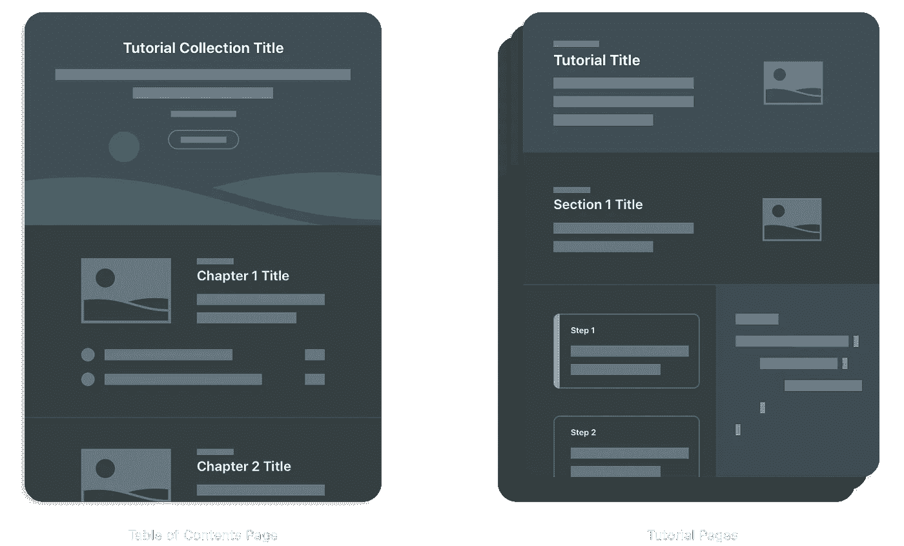
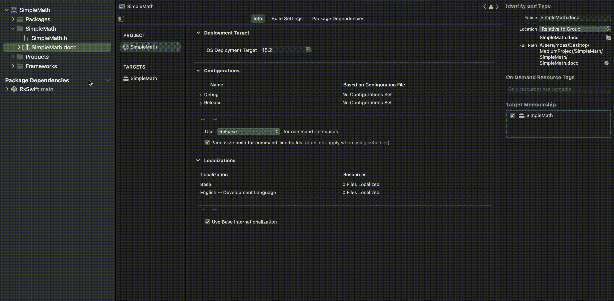
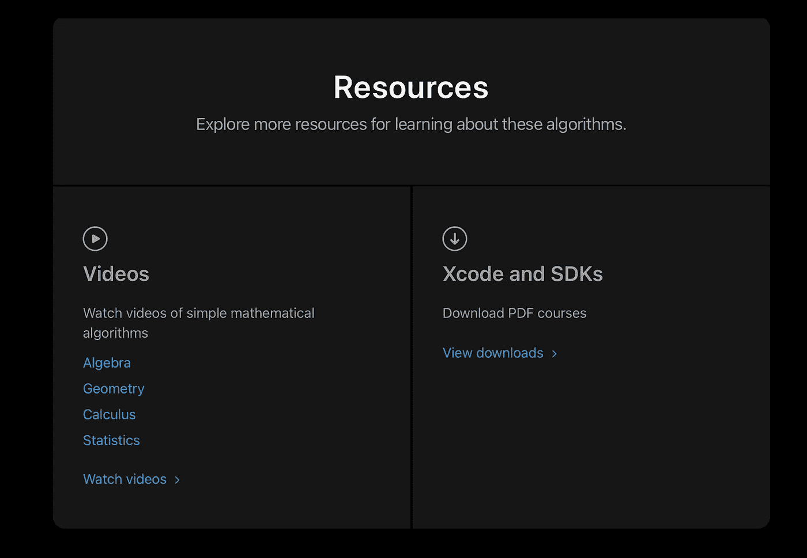
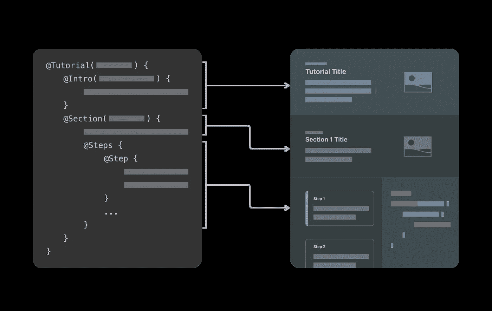
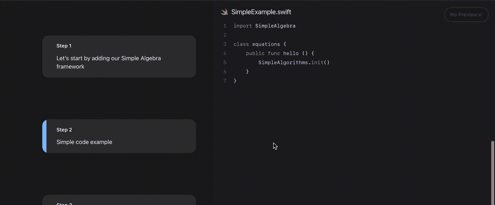
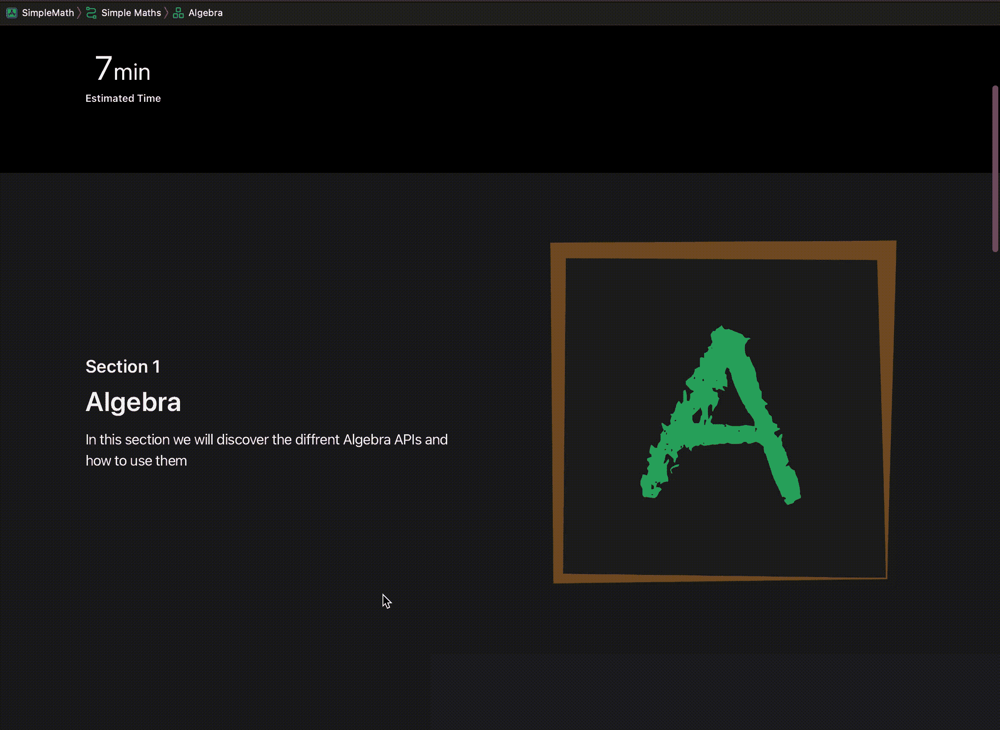
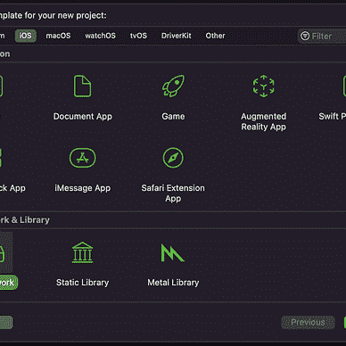
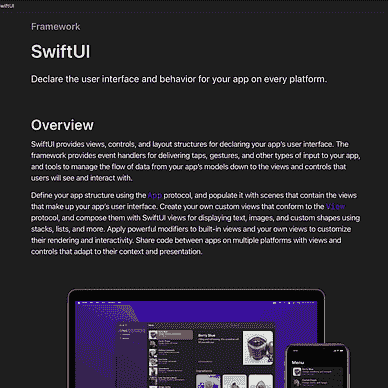

# DocC 互动教程——如何创建 iOS 框架 Pt5

> 原文：<https://itnext.io/docc-interactive-tutorials-how-to-create-an-ios-framework-pt5-51b7a1040604?source=collection_archive---------0----------------------->

W 对于任何框架来说，写得好的文档总是最终的信息来源，在本系列的第 2 部分，[我们使用苹果的 DocC](/take-your-documentation-skills-to-the-next-level-how-to-create-an-ios-framework-pt2-94193527691f) 创建了漂亮的文档，其中包括了参考文档和文章，在这篇文章中，你将创建交互式教程并一步一步地指导你的框架消费者！

为了创建 DocC 教程，我们将使用两种新类型的文件

*   **目录文件:**教程的登陆页面，它是连接不同教程和资源的粘合剂
*   教程文件:他们带领读者完成编码练习，教他们如何使用你的框架的 API。

# 目录文件

让我们从创建一个“目录”文件开始:

教程文件包括一个**简介**和多个**章节**模块。

**Intro** 块包括教程的简单描述、您提供的缩略图，它将包括一个“开始”按钮，以及教程持续时间的估计(您稍后将为每个教程提供的持续时间的总和)

在下面的例子中，我将不同的教程按照它们的数学分支进行了划分。每个**章节**也可以包括一个图像缩略图，但与简介不同，这些缩略图的尺寸会很小，一个**章节**也可以包括多个参考(链接)。

## 资源

**资源**是一个可选的指令块，属于目录文件的底部，它包括视频和可下载文件的外部链接。

# 教程文件

教程文件是今天主题的基础，这些文件包含一步一步的教程，最后还有可选的评估。

我们先创建一个教程文件！

创建后，Xcode 将为您的教程生成以下模板

然后要做的第一件事是设置教程持续时间的估计值(以分钟为单位)，DocC 稍后会将这个值添加到我们在目录文件中讨论过的总和中。

简介包括教程的名称和简要描述，并可以有一个图像作为卡片的背景。

值得注意的是，一个教程可以有多个**节**，其中 **ContentAndMedia** 指令块作为**节**的介绍。

**步骤**指令是最重要的指令，正如突出显示的，它包含了读者需要遵循的不同步骤，每个步骤包含一个简短的描述和一些代码或图像(例如一个截图)。

对图像使用**图像**指令，对代码文件使用**代码**指令，如下例所示

要使用**代码**指令，您需要创建将您的代码包含在文档目录中的 swift 文件。这个指令有两个参数，一个是名称，一个是文件名，很明显，这两个参数是不同的:

file 参数是您在其中包含的文件的真实名称

name 参数的作用类似于一个标识符，它将出现在步骤代码的顶部，您可以随意命名它，但一定要包含**。swift** 文件扩展名。

要突出显示某一段代码，就像前面的 GIF 一样，您需要创建另一个 swift 文件，用一个几乎相似的代码，DocC 将自动突出显示与原始文件相比的新代码行。确保代码指令与上一步中的代码指令同名。

> 因为 DocC 需要比较两个文件来达到这个结果，所以您不能在任何教程的第一步突出显示这个特性

## 评价

评估是可选的测验，用于测试读者对前面教程步骤的了解，在阅读完评估后，它们会出现在教程文件的末尾，评估包括一组多项选择题，在选择每个选项后会有提示和说明。

在这个例子中，我包括三个选项，但这不是一个硬性规定，例如，你可以包括 4 或 2 个选择。

> 确保将您的评估指令块包含在区段块之外

## 结论:

在今天的帖子中，我们探索了一种新的文档类型“交互式教程”，这些教程既美观又易于理解。交互式教程是我们在本系列的前一篇文档文章中探索过的文档存档的元素。

这标志着这篇文章的结束，所以请务必点击鼓掌按钮👏👏如果你喜欢的话。

如何创建一个 iOS 框架是一系列的文章，所以请在 **Medium** 或 [**Twitter**](https://twitter.com/elmoezamira) 上**关注我的**以了解最新的帖子，像往常一样，我们会一直感谢您的反馈。

编码快乐！

El Moez Amira

## 如何创建 iOS 框架

[View list](https://medium.com/@elmoezamira/list/how-to-create-an-ios-framework-739461924d14?source=post_page-----51b7a1040604--------------------------------)6 stories