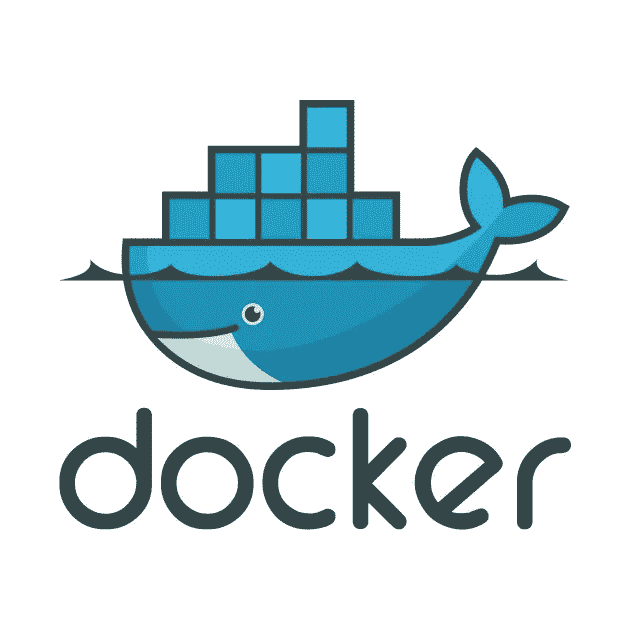
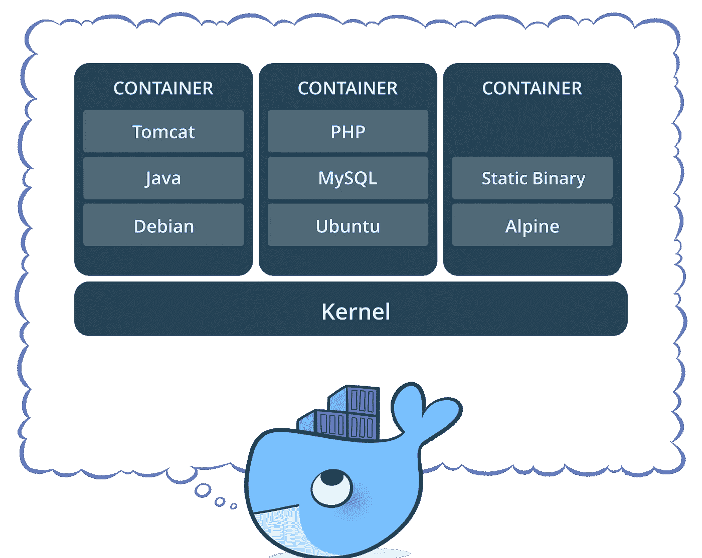

# Docker 101:基础和 Docker 文件

> 原文：<https://itnext.io/docker-101-fundamentals-the-dockerfile-b33b59d0f14b?source=collection_archive---------1----------------------->



你可能和我一样，以前听说过 Docker。您可能有同事或开发人员朋友对它赞不绝口，他们尽可能地“dockerize ”,并且在用普通人可以理解的术语解释 Docker 及其所有优点时，他们完全不知所措。今天，我将尝试为你揭开 Docker 的神秘面纱。

这实际上是 Docker 上的一个三部分系列，因为 Docker 至少需要三个单独的帖子来介绍其三个最知名的产品:

*   Docker(和 docker 文件)，
*   Docker 编写，和
*   码头工人群

所以让我们从头开始，我将解释 Docker 实际上是什么，用连我都理解的术语来解释。

## Docker 是什么？

Docker 网站本身只是将 Docker 描述为:

> “世界领先的软件容器化平台”——Docker，Docker 概述

这就清楚了，对吧？嗯……是的，不太好。关于码头工人的更好的描述可以在 OpenSource.com 找到。

> Docker 是一个工具，旨在通过使用容器来简化应用程序的创建、部署和运行。容器允许开发人员将应用程序与它需要的所有部分打包在一起，比如库和其他依赖项，然后作为一个包发送出去。—OpenSource.com，什么是码头工人？

Docker 真正做的是将应用程序代码从基础设施需求和需要中分离出来。它通过在一个称为“容器”的隔离环境中运行每个应用程序来实现这一点这意味着开发人员可以专注于在 Docker 容器中运行的实际代码，而不用担心它最终将在哪个系统上运行，devOps 可以专注于确保在 Docker 容器中安装正确的程序，并减少所需的系统数量和部署后维护所述系统的复杂性。

这是一个完美的下一个问题:为什么是 Docker？

## 为什么是 Docker？

我不知道有多少次我听到一个开发人员(包括我自己)说，“它能在我的机器上工作，我不知道为什么它不能在你的机器上工作。”—任何开发人员

这就是 Docker 的设计目的——当一个开发人员在他们的本地机器上为一个项目工作了几天(或几周)时，不可避免地会出现混乱，一旦部署到新的生命周期，应用程序就不会运行了。很可能是因为有许多安装的依赖项是运行应用程序所必需的，但它们没有保存在`package.json`或`build.gradle`中，也没有在`manifest.yml`中指定。

每一个 Docker 容器都是从一无所知的纯普通 Linux 机器开始的。


码头集装箱旋转起来就像琼恩·雪诺；它什么都不知道。

然后，我们告诉容器它需要知道的一切——为了运行应用程序，它需要下载和安装的所有依赖项。这个过程是用一个`Dockerfile`完成的，但是我有点超前了。

对于本节，可以说，Docker 消除了部署应用程序的猜测(和花费的调试时间),因为它总是作为一台全新的、隔离的机器启动，并且添加了完全相同的依赖项。每一个。单身。时间。

没有安装了不同版本依赖项的环境。没有完全缺少依赖关系的环境。不要和 Docker 胡闹。

## Docker 工具

在深入 Docker 文件之前，我将快速浏览一下 Docker 的工具套件。


Docker 提供了四个主要工具来完成任务:

*   [Docker 引擎](https://docs.docker.com/engine/)
*   [Docker 作曲](https://docs.docker.com/compose/overview/)
*   [对接机*](https://docs.docker.com/machine/overview/)
*   [码头工人群](https://docs.docker.com/engine/swarm/)

**对接机引擎**是对接机的

> "强大的开源容器化技术与构建和容器化应用程序的工作流程相结合."— Docker，关于 Docker 引擎

它从单个`Dockerfile`或`docker-compose.yml`构建并执行 Docker 映像。当有人通过 docker CLI 使用 Docker 命令时，它会与该引擎进行对话，以完成需要完成的任务。

**Docker 撰写**

> “是一个用于定义和运行多容器 Docker 应用程序的工具”——Docker，Docker Compose 概述

当您有一个由多个微服务、数据库和其他依赖项组成的应用程序时，您可以使用这种方法。`docker-compose.yml`允许您在一个地方配置所有这些服务，并使用一个命令启动它们。我将在后续的博客文章中更详细地介绍 Docker Compose。

在过去的几年里，打卡机比现在更受欢迎。

> " Docker Machine 是一个工具，可以让你在虚拟主机上安装 Docker 引擎，并使用`docker-machine`命令管理主机."—对接机，对接机概述

随着 Docker 镜像在它们的本地平台上变得更加稳定，它已经被搁置了一段时间，但是在 Docker 历史的早期，它非常有用。关于 Docker Machine，你现在需要知道的大概就是这些了。

最后一个工具 **Docker Swarm** ，将在博客 3 中详细介绍。但是现在，码头工人蜂拥而至

> 创建了一组 Docker 引擎，您可以在其中部署应用程序服务。你不需要额外的编排软件来创建或管理一个群体”——Docker，群体模式概述

这些是您将熟悉的工具，现在，我们可以讨论 Dockerfile 了。

## Dockerfile —一切开始的地方

Docker 是一个强大的工具，但是它的力量是通过使用名为 **Dockerfiles** 的东西来利用的。

> `Dockerfile`是一个文本文档，包含用户可以在命令行上调用的所有命令，以组合一个图像。使用`docker build`,用户可以创建一个连续执行几个命令行指令的自动化构建。- Docker，Docker 文件参考

Docker 映像由只读层组成，每一层代表一条 Dockerfile 指令。这些层是堆叠的，每一层都是前一层的变化的增量。

这就是我上面所说的，当 Docker 容器启动时，它需要被告知做什么，它没有安装任何东西，它知道如何做任何事情。真的没有。

Dockerfile 首先需要的是一个**基础映像**。基础映像告诉容器要安装什么作为它的操作系统——Ubuntu、RHEL、SuSE、Node、Java 等等。

接下来，您将提供设置说明。这些都是 Docker 容器需要知道的事情:环境变量、要安装的依赖项、文件所在的位置等等。

最后，你必须告诉容器做什么。通常，它将运行安装说明中指定的应用程序的特定安装和命令。接下来我将简要介绍最常见的 Dockerfile 命令，然后展示一些例子来帮助理解。

## Dockerfile 命令

下面是在你编写 docker 文件时 90%的时间都会用到的命令，以及它们的含义。

*   `FROM` —初始化新的构建阶段，并为后续指令设置 [*基础映像*](https://docs.docker.com/engine/reference/glossary/#base-image) 。因此，有效的`Dockerfile`必须以`FROM`指令开始。
*   `RUN` —将在当前图像之上的新图层中执行任何命令，并提交结果。最终提交的图像将用于`Dockerfile`中的下一步。
*   `ENV` —将环境变量`<key>`设置为值`<value>`。该值将存在于构建阶段的所有后续指令的环境中，并且在许多情况下可以被内联替换。
*   `EXPOSE` —通知 Docker 容器在运行时监听指定的网络端口。您可以指定端口是侦听 TCP 还是 UDP，如果未指定协议，默认为 TCP。这使得主机和外界可以访问隔离的 Docker 容器
*   `VOLUME` —创建一个具有指定名称的挂载点，并将其标记为包含来自本机主机或其他容器的外部挂载卷。

好了，现在已经定义了 Dockerfile 命令，让我们来看一些 docker file 样例。如果你想学习更多关于 Docker 命令的知识，我强烈推荐 [Dockerfile 文档](https://docs.docker.com/engine/reference/builder/)——它写得非常好。

## Dockerfile 文件示例

这里有几个 docker 文件示例，包括解释每一行和每一层发生了什么的注释。

**节点 Dockerfile 示例**

```
# creates a layer from the node:carbon Docker image **FROM** node:carbon# create the app directory for inside the Docker image
**WORKDIR /**usr**/**src**/**app# copy and install app dependencies from the package.json (and the package-lock.json) into the root of the directory created above
**COPY** package*****.json .**/
RUN** npm install# bundle app source inside Docker image
**COPY** . .# expose port 8080 to have it mapped by Docker daemon
**EXPOSE** 8080# define the command to run the app (it's the npm start script from the package.json file)
**CMD** [ "npm", "start" ]
```

**Java Dockerfile 示例**

```
# creates a layer from the openjdk:8-jdk-alpine Docker image **FROM** openjdk:8-jdk-alpine# create the directory for where Tomcat creates its working directories
**VOLUME /**tmp# copy the project JAR file to the container renamed as 'app.jar'
**COPY** build**/**libs **/**app# execute that JAR in the entry point below
**ENTRYPOINT** ["java", "-Djava.security.egd=file:/dev/./urandom", "-jar", "/app/java-example.jar"]
```

**Python Dockerfile 示例**

```
#creates a layer from the ubuntu:16.04 Docker image 
**FROM** ubuntu:16.04#adds files from the Docker client’s current directory
**COPY** . /app# builds the application with make 
**RUN** make /app#specifies what command to run within the container
**CMD** python /app/app.py
```

**詹金斯文档示例**

```
# creates a layer from the jenkins:lts Docker image **FROM** jenkins**/**jenkins:lts # sets user to root (because Docker always runs as root and Jenkins needs to know this)
  **USER** root

 # add and install all the necessary dependencies
 **RUN** apt-get update **&&** \
 apt-get install **-**qy \
   apt-utils \
   libyaml-dev \
   build-essential \
   python-dev \
   libxml2-dev \
   libxslt-dev \
   libffi-dev \
   libssl-dev \
   default-libmysqlclient-dev \
   python-mysqldb \
   python-pip \
   libjpeg-dev \
   zlib1g-dev \
   libblas-dev\
   liblapack-dev \
   libatlas-base-dev \
   apt-transport-https \
   ca-certificates \
   zip \
   unzip \
   gfortran **&&** \
 rm **-**rf **/**var**/**lib**/**apt**/**lists**/*** # install docker
 **RUN** curl **-**fsSL get.docker.com **-**o get-docker.sh **&&** sh get-docker.sh

 # install docker compose
 **RUN** curl **-**L https:**//**github.com**/**docker**/**compose**/**releases**/**download**/**1.8.0**/**docker-compose-`uname **-**s`**-**`uname **-**m` **> /**usr**/**local**/**bin**/**docker-compose **&&** \
     chmod **+**x **/**usr**/**local**/**bin**/**docker-compose # install pip for python
 **RUN** pip install cffi **--**upgrade
 **RUN** pip install pip2pi ansible**==**2.0

 # copy groovy executors and plugins for jenkins and run the plugins
 **COPY** executors.groovy **/**usr**/**share**/**jenkins**/**ref**/**init.groovy.d**/**executors.groovy
 **COPY** plugins.txt **/**usr**/**share**/**jenkins**/**ref**/**plugins.txt
 **RUN /**usr**/**local**/**bin**/**plugins.sh **/**usr**/**share**/**jenkins**/**ref**/**plugins.txt

 # add the jenkins user to the docker group so that sudo is not required to run docker commands
 **RUN** groupmod **-**g 1026 docker **&&** gpasswd **-**a jenkins docker
 **USER** jenkins
```

一旦你看到文件像这样分解，命令并不真的那么难或复杂。

## 图像与容器

Docker image 和 Docker container 这两个术语有时可以互换使用，但它们不应该互换，它们指的是两种不同的东西。

Docker **映像**是可执行包，包含运行应用程序所需的一切——代码、运行时、库、环境变量和配置文件。

Docker **containers** 是一个映像的运行时实例——映像在执行时在内存中变成的样子(也就是说，一个带有状态的映像，或者一个用户进程)。



码头集装箱的例子。每一个都来自一个特定的 Docker 图像。

简而言之，Docker 映像保存了 Docker 文件的快照，Docker 容器是基于 Docker 映像中包含的指令的 Docker 映像的运行实现。

明白了吗？酷毙了。

## Docker 引擎命令

一旦编写了 Docker 文件，就可以构建 Docker 映像并运行 Docker 容器。所有这些都由我之前简单介绍过的 Docker 引擎负责。

用户可以通过 Docker CLI 与 Docker 引擎交互，Docker CLI 与 Docker REST API 对话，Docker REST API 与长期运行的 Docker 守护进程(Docker 引擎的核心)对话。下面是一幅插图。


CLI 使用 Docker REST API 通过脚本或直接 CLI 命令来控制 Docker 守护进程或与之交互。许多其他 Docker 应用程序也使用底层 API 和 CLI。

以下是您在使用单个 docker 文件的大部分时间里将从命令行运行的命令。

*   `docker build` —从 Dockerfile 文件构建图像
*   `docker images` —显示该机器上的所有 Docker 图像
*   `docker run` —启动容器并运行该容器中的任何命令
*   `docker run`有多种选择，包括
*   `-p` —允许您指定主机和 Docker 容器中的端口
*   `-it`—在容器开始运行后打开一个交互终端
*   `-v` —将卷绑定挂载到容器
*   `-e` —设置环境变量
*   `-d` —以守护模式启动容器(它在后台进程中运行)
*   `docker rmi` —删除一个或多个图像
*   `docker rm` —移除一个或多个容器
*   `docker kill` —终止一个或多个运行中的容器
*   `docker ps` —显示正在运行的容器列表
*   `docker tag` —用别名标记图像，以便以后引用(有利于版本控制)
*   `docker login` —登录 Docker 注册表

这些命令可以以多得数不清的方式组合在一起，但这里有几个 Docker 命令的简单示例。

`docker build -t user1/node-example .`

这告诉 Docker:从根级别( `.` )的 Docker 文件中构建(`build`)图像，并将其标记为`user1/node-example`。不要忘记句号——这是 Docker 知道在哪里寻找 Docker 文件的方法。

`docker run -p 3003:8080 -d user1/node-example`

这告诉 Docker 运行(`run`)构建并标记为`user1/node-example`的映像，公开主机上的端口 3003，并在 Docker 容器中查找端口 8080(`-p 3003:8080`，并作为后台守护进程启动该进程(`-d)`)。

这就是使用 Docker CLI 运行命令的简单之处。再一次， [Docker 文档](https://docs.docker.com/engine/reference/run/)做得很好。

## 结论和第二部分:Docker 写作

现在你已经看到了 Docker 的冰山一角。它是一个轻量级的、隔离的运行时环境，被称为“容器”,在 docker 文件的帮助下，你可以按照你喜欢的任何方式启动和配置它。

请继续关注这个三部分系列的[第二部分](/docker-102-docker-compose-6bec46f18a0e)，在这里我将深入介绍 Docker Compose 工具，它让您只需一个文件和一个启动命令就可以配置和运行多个应用程序。这真是酷毙了。

感谢您的阅读，我希望这能让您更好地了解 Docker 的基础知识及其强大功能。掌声非常感谢！

**如果你喜欢读这篇文章，你可能也会喜欢我的其他一些博客:**

*   [React，SVG 图像和 Webpack 加载器，使它们播放得更好](https://medium.com/@paigen11/react-svg-images-and-the-webpack-loader-to-make-them-play-nice-2d177ae34d2b)
*   [JavaScript 数组方法让你成为更好的开发者](https://medium.com/@paigen11/javascript-array-methods-to-make-you-a-better-developer-4ce42052d54c)
*   [graph QL 到底是什么？](https://medium.com/@paigen11/what-is-graphql-really-76c48e720202)

**参考资料和更多资源:**

*   https://www.docker.com/what-docker
*   Docker 是什么？https://opensource.com/resources/what-docker
*   Dockerfile 文档:[https://docs.docker.com/engine/reference/builder/](https://docs.docker.com/engine/reference/builder/)
*   码头工人运行参考:[https://docs.docker.com/engine/reference/run/](https://docs.docker.com/engine/reference/run/)