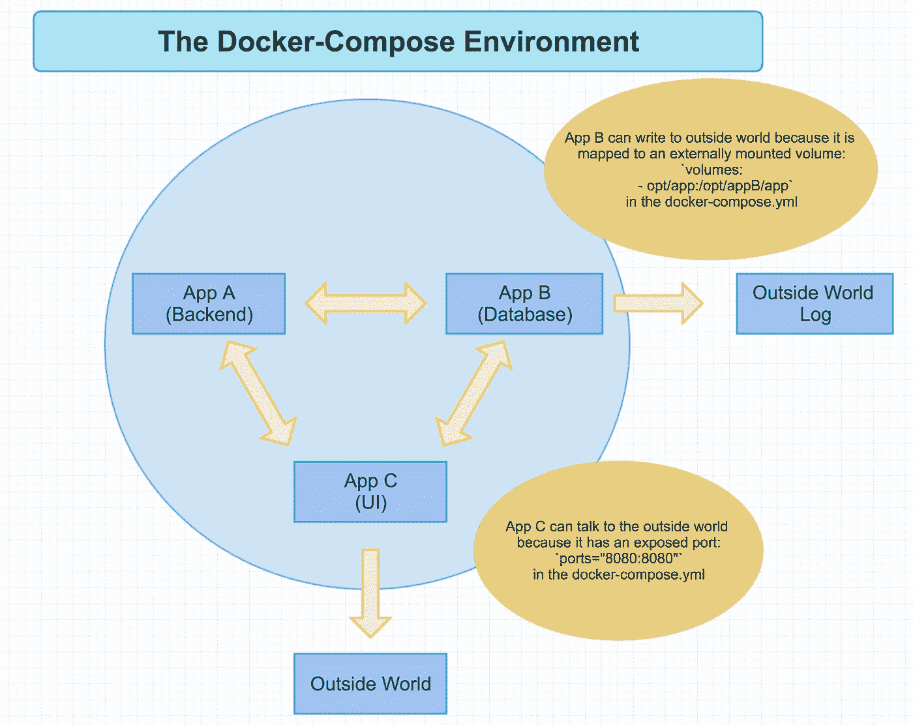
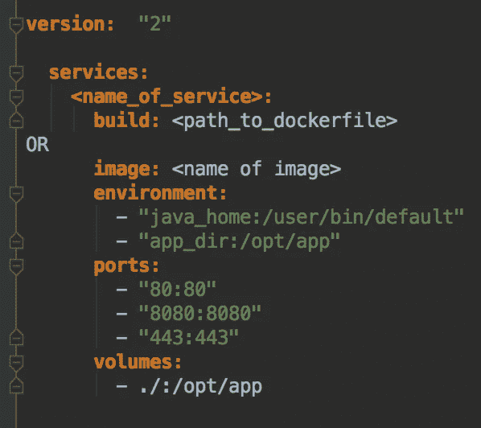
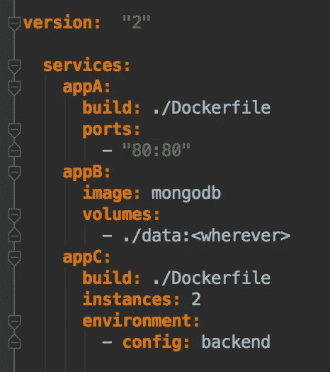
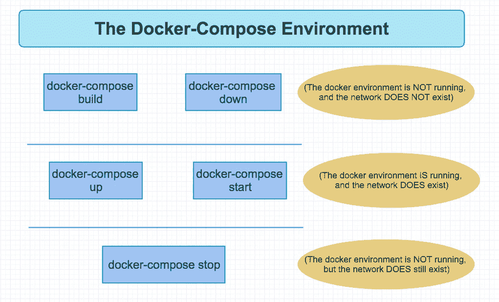

# Docker 102:Docker-撰写

> 原文：<https://itnext.io/docker-102-docker-compose-6bec46f18a0e?source=collection_archive---------0----------------------->

如果你不熟悉容器化平台 Docker，你可能想看看我的第一篇博客，在开始了解 Docker-Compose 之前，先了解一下它是什么以及它背后发生了什么。

如果你确实了解 Docker，请继续阅读，我将尝试向你展示一个单独的`docker-compose.yml`相对于最初的`Dockerfile`所能提供的能力和好处。

这很好地延续了我将讨论的第一点:为什么使用 Docker Compose 而不是 Docker CLI 命令？

## 为什么 Docker 作曲？

在开发的所有阶段，Docker Compose 都比 Docker CLI 提供了许多好处。在这里，我会给你一些细节，告诉你在每一个阶段的什么地方可以最好地利用它。

*   **较低的生命周期**

对于生命周期较低的环境，Docker Compose 能够快速、轻松地模拟生产环境。

它可以加速运行应用程序所需的所有微服务(和数据库),并且可以在隔离的 Docker 环境中无缝地将它们相互连接起来，而开发人员只需付出很少的努力。甚至不需要在内部指定不同的端口来避免冲突——一下子让整个系统运行起来非常容易。

然后就是测试。Docker 擅长许多类型的应用程序测试:

*   破坏性测试
*   性能试验
*   集成测试
*   端到端测试

Docker 在测试方面表现如此之好，是因为它创建了自己的隔离环境，启动了自己的数据库，并根据指示设置了数据，当它完成了运行测试和处理数据后，它可以关闭并重新开始备份，原始数据与之前相同。当您的多个开发人员正在处理不同的特性，并且只在干净的端到端测试运行之后才提交 PRs 时，这有多方便？

*   **生产**

如果您足够幸运，能够在生产中使用 Docker 容器，那么一个`docker-compose.yml`文件就可以部署一个完整的系统，该系统可以完全像在生命周期较低的环境中测试时那样运行。这种情况之所以会发生，是因为使用 Docker Compose 可以在生产中完成开发中完成的完全相同的步骤，这很棒，有助于消除一些总是会导致出错的恐惧部署。

*   **Docker 群体测试**

Docker Compose 使部署前的 Docker 群体测试更加容易。我暂时就说到这里，因为本系列的下一篇博客《Docker 103》将详细介绍 Docker Swarm。只要知道这是测试蜂群的方法。

最后，依我拙见，一个`docker-compose.yml`文件比 Docker CLI 更容易阅读、理解和实现。不过，这纯粹是我的看法。

既然我已经给了你使用 Docker Compose 的理由，下一个问题是:一个`docker-compose.yml`看起来像什么？我该怎么写呢？请继续阅读。

## 什么是 Docker Compose？

本质上，Docker Compose 是一张配方卡——它是组成应用程序的服务的配方，而`docker-compose.yml`决定了服务如何混合在一起。

用更专业的术语来说:

> Docker-Compose 定义了一个完整的系统，在这个系统中，服务可以在一个隔离的网络上相互通信，与用户定义的外部资源进行交互。

Docker Compose 是建立在 Docker 引擎之上的，这个引擎运行 Dockerfiles 和 Docker CLI，但是关于 Compose 要记住的最重要的一点是把它想象成一个菜谱。

下图很好地说明了这一点。

以上是 Docker 编写环境运行时的样子。应用 A 是后端微服务，可以和 App B、App C 自由通信但仅此而已，根本不能和外界的主机通信。这是因为它的`docker-compose.yml`是如何设置的，我将在下面展示。

应用程序 B 是一个数据库，它在`docker-compose.yml`中构建，带有一个外部挂载卷`volumes: — opt/app:/opt/appB/app`，允许它向外界写入一个持久数据层。有了应用程序中的这个数据层，即使整个 Docker 环境由于某种原因被破坏，当它恢复时，数据库将看到以前写入其中的数据，并替换它，以便您可以从以前的地方开始。

最后，应用程序 C 是应用程序的用户界面部分。此外，由于`docker-compose.yml`，这个应用程序可以在一个已经暴露的端口上与主机对话:`ports="8080:8080"`。这意味着，用户可以在其机器上打开 [http://localhost:8080](http://localhost:8080) 并访问正在运行的应用程序。

这就是环境的样子。这是一个非常简单的表示，但根据您的需要，它可以如此简单，也可以复杂得多。现在，让我们看看 Docker Compose YAML 文件是什么样子的，并了解它可能带来的一些细微差别。

## Docker 怎么作曲？

最后一个大问题是:如何写一个`docker-compose.yml`，其实很简单，遵循一个标准的公式。

这是任何`docker-compose.yml`的模板。

*   **样本 Docker 撰写模板**

每个`docker-compose`文件将以最小的`version: "2"`开始，如果你正在做一个 Docker Swarm 文件，它将需要`version: "3"`，但是对于一个单独的`docker-compose.yml`，你将需要 v2。

接下来，你将列出你所有的服务(在`docker-compose`中运行的每个应用都有自己的名字，你需要从 Docker 注册表中提供*`build`或`image`。你 ***不能*** 兼得。*

*   *自定义 Docker 映像将基于构建路径提供的 Docker 文件构建，或者*
*   *Docker hub 将提供所有必要的命令和设置，以使映像成功构建和运行。*

*在此之下，设置环境变量，暴露端口，并装载外部卷。所有这些事情都可以用 Docker CLI 来完成，但这是一个更干净、更容易阅读的文件，当在终端中执行命令时，不需要记住(并正确键入)它们。*

*下面是一个样本`docker-compose.yml`可能的样子。*

*   ***样本 Docker 编写 Yaml***

**

*这个`docker-compose.yml`以`version: "2"`开始(Docker Compose 需要的)，然后我们有下面列出的三个服务:`appA`、`appB`、`appC`。因为`appA`是从自定义`Dockerfile`构建的 UI，并且需要向主机公开，所以它有一个到所述`Dockerfile`的`build:`路径和一个将 UI 的内部运行端口(端口 80)映射到主机上的相同端口(也是 80)的`ports:`。*

*`appB`是一个 mongo 数据库，所以当需要启动应用程序时，可以从 Docker 注册表中取出它。不需要提前构建，只需要声明映像，对于数据持久化，添加一个`volumes:`规范，说明数据库数据可以持久化到主机的什么地方，这样就可以了。*

*而且`appC`也是一个定制的 Docker 映像，所以它有一个到自己 Dockerfile 的`build:`路径，一个为后端指定配置文件的`environment:`变量，还有两个`instances:`。这个应用程序尤其可以有两个实例，因为它没有以任何方式向主机公开。如果正在打开一个端口(或者它是某种类型的数据库)，它将只能有一个实例，以避免主机上的端口冲突，或者避免写入 Docker 环境中的两个单独的数据库。但是由于这是一个纯粹的后端服务，它可以有任意多的实例(有利于负载平衡大量的流量)，所有这些实例都可以在 Docker 环境中作为单独的容器运行，并在需要时相互通信。*

*我推荐阅读 [Docker Compose 文档](https://docs.docker.com/compose/overview/),获得更多的例子和你可以在`docker-compose.yml`中做的所有事情的描述。*

*好了，`docker-compose.yml`已经写好了，让我们看看让这个系统启动并运行所需的 Docker Compose 命令。别担心，它们不是很复杂。*

## *Docker 编写命令*

*在我继续下去之前，我必须发布以下免责声明。*

***免责声明:在这篇博文中，假设所有 docker-compose 命令都将在与** `**docker-compose.yml**` **相同的目录中执行。是的，从目录的不同级别执行命令是可能的，但是这超出了这篇关于 Docker Compose 的博客的范围。***

*既然已经说清楚了，我可以继续了。您只需要在终端中键入一些 Docker 命令，就可以让这些神奇的文件完成它们的工作。在我描述了它们之后，我提供了另一个方便的图形来说明 Docker Compose 环境可以存在的三个不同阶段。*

*   *`**docker-compose ps**` **—** 列出网络中的所有服务。这在对服务进行故障排除时特别有用，因为它会给你容器 ID，然后你可以运行`docker -it exec <ID> bash`进入容器并根据需要进行调试。*
*   *`**docker-compose build**` **—** 从自定义`Dockerfiles`生成任何需要的图像。它不会从 Docker hub 中提取图像，只会生成自定义图像。*
*   *`**docker-compose up**` **—** 调出服务运行的网络*
*   *`**docker-compose stop**` **—** 停止网络并保存所有服务的状态*
*   *`**docker-compose start**` **—** 重新启动服务，并将其恢复到停止时的状态*
*   *`**docker-compose down**`**——**用火焚烧整个 Docker 网络。网络和其中包含的所有服务被完全破坏。*

**

*以下是 Docker 编写环境存在的各种状态，具体取决于您运行的命令。*

*`docker-compose build`和`docker-compose down`表示 Docker 环境 ***不在*** 运行，网络 ***不存在*** 。*

*`docker-compose up`和`docker-compose start`表示 Docker 环境 ***正在*** 运行，网络*是否存在。**

**`docker-compose stop`表示 Docker 环境 ***未*** 运行，但网络仍*存在。***

***就是这样。使用`docker-compose.yml`构建和运行所有连接的微服务所需的所有命令。***

## ***Docker 编写示例***

***如果你想看看 Docker Compose 是如何构建的，你可以在这里下载我整理的一个回购:[https://github.com/paigen11/docker-compose-example](https://github.com/paigen11/docker-compose-example)***

***每个示例都有一个说明如何运行它的`README`，它说明了 Docker Compose 提供的灵活性。***

*****例 1*****

***第一个示例包含一个 Node.js 和一个 Spring Boot Java 应用程序，这两个应用程序都有 Dockerfiles，但没有`docker-compose.yml`，它有基本的 Docker CLI 命令来分别在端口 3003 和 3004 上运行它们。这是为了说明与`docker-compose.yml`包含的指令完全相同的指令也可以从命令行执行，但是要让它们运行起来，用户需要付出更多的努力。此外，两个服务都不知道另一个服务，它们通过`docker-compose.yml`连接的方式。***

******

***Node.js 示例:在端口 3003 上运行***

******

***Java Spring Boot 示例:在端口 3004 上运行并显示其主机名***

*****例二*****

***第二个例子部署了同样的两个应用程序，但是使用了一个`docker-compose.yml`文件。这次 Java app 运行在 3001 上，Node app 运行在 3002 上。如果您愿意，您可以让示例 1 和示例 2 同时运行，因为它们都不共享主机端口号。***

******

***节点示例 2:在端口 3002 上运行***

******

***Java 示例 2:使用不同的主机名在端口 3001 上运行***

*****例 3*****

***示例 3 通过使用一个简单的 [Nginx](https://www.nginx.com/) 前端将请求路由到 Java 或在其网络中运行的节点服务，从而更上一层楼。Nginx 不在本博客的讨论范围之内，但是就我们的目的而言，它是作为一个代理工作的，并且根据传递给它的路径，它要么提供一个应用，要么提供另一个应用。这意味着只有一个端口对外界开放(80 是 Nginx 的默认端口，所以我使用这个端口)，但是 Docker 环境中的两个应用程序都可以访问，这些服务不需要端口。请看下面的截图来帮助澄清一下。***

******

***仔细查看 URL，它只是 [http://localhost/node/，](http://localhost/node/,)并且它路由到节点示例***

******

***同样，带有/java/ route 的同一个端口路由到 java 示例***

*****例 4*****

***这是迄今为止我最喜欢的例子，因为它确实有助于说明 Docker Compose 的强大功能。在示例目录的根级别，这个特定的`docker-compose.yml`一次访问所有的 Java 和节点示例，从它们各自的`Dockerfiles`构建它们的映像，并旋转所有的六个示例加上两个带有图像标签`latest`的应用程序。所有这些容器都是通过一个 Nginx 代理来访问的。这是一个非常非常酷的例子，展示了如何使用版本控制来实现[蓝绿生产部署](https://docs.cloudfoundry.org/devguide/deploy-apps/blue-green.html)、[金丝雀部署](https://octopus.com/docs/deployment-patterns/canary-deployments)，或者甚至是一种支持同一应用程序多个版本的方式，如果不同的外部团队依赖于某个版本的功能。***

***这里只是版本化路径的几个示例，请注意 URL。***

******

***应用程序的示例 3，在 v3 路线上提供***

******

***v1 路线上的示例 1***

******

***还是示例 1，但这次是在最新的路由标记上。尼斯（法国城市名）***

## ***结论***

***这就是 Docker 的简单结构。请稍后回来查看该系列的第三部分，在那里我将回顾 Docker Swarm 的神奇之处，它构建在 Docker Compose 之上。想象一下，在多台服务器上运行多个应用程序，只需几个配置文件，这些应用程序就能感知并相互交互。这真的很酷。***

***感谢您的阅读，我希望您能像我一样有机会在自己的开发中使用 Docker Compose。掌声非常感谢！***

***如果你喜欢读这篇文章，你可能也会喜欢我的其他博客:***

*   ***[Docker 101:基本面&Docker file](https://medium.com/@paigen11/docker-101-fundamentals-the-dockerfile-b33b59d0f14b)***
*   ***[React、SVG 图像和 Webpack 加载器，使它们播放起来更好](https://medium.com/@paigen11/react-svg-images-and-the-webpack-loader-to-make-them-play-nice-2d177ae34d2b)***
*   ***[graph QL 到底是什么？](https://medium.com/@paigen11/what-is-graphql-really-76c48e720202)***

*****参考资料和更多资源:*****

*   ***https://www.docker.com/what-docker***
*   ***Docker 撰写文档:[https://docs.docker.com/compose/overview/](https://docs.docker.com/compose/overview/)***
*   ***码头工人撰写示例报告:[https://github.com/paigen11/docker-compose-example](https://github.com/paigen11/docker-compose-example)***
*   ***https://www.nginx.com/[nginx](https://www.nginx.com/)***
*   ***蓝绿色部署，Cloud Foundry 文档:[https://docs . Cloud Foundry . org/dev guide/deploy-apps/blue-Green . html](https://docs.cloudfoundry.org/devguide/deploy-apps/blue-green.html)***
*   ***Canary 部署，Octopus 部署:[https://Octopus . com/docs/deployment-patterns/canary-Deployments](https://octopus.com/docs/deployment-patterns/canary-deployments)***