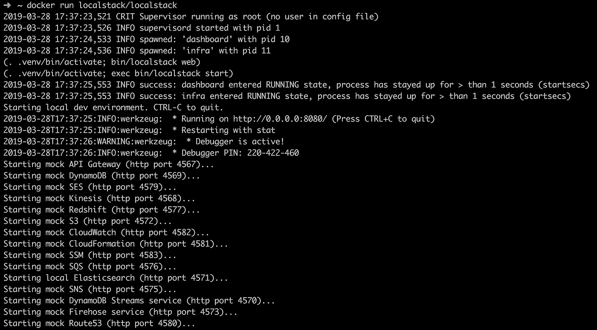
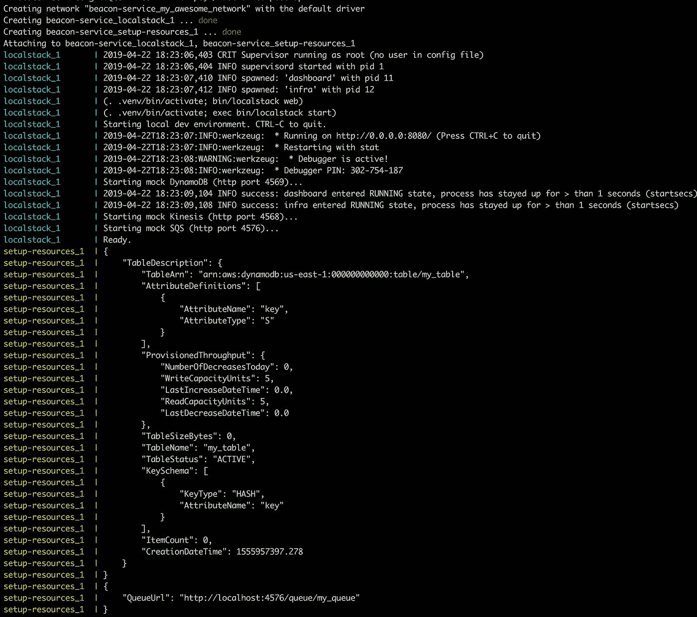
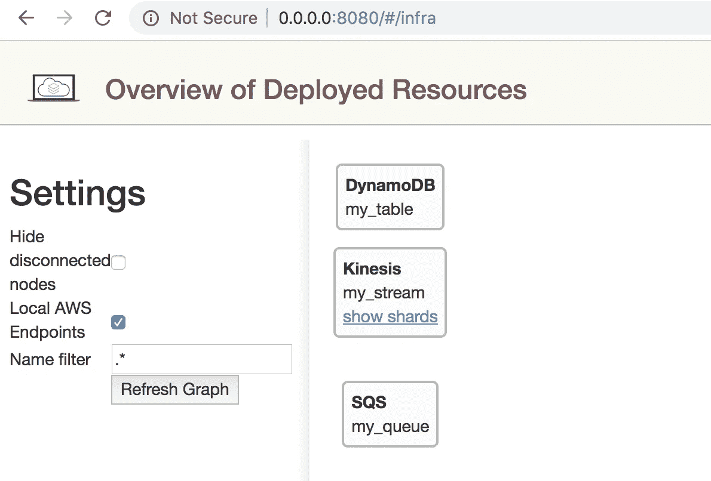

# Localstack 和两个吸烟桶

> 原文：<https://itnext.io/docker-compose-aws-localstack-why-not-both-fc8a1db84eca?source=collection_archive---------1----------------------->

几个月前，我和一个朋友进行了一次谈话，讨论如何在开发一个功能时手动“玩”AWS 应用程序。他的做法是将他想玩的任何功能推送到 Github repo，旋转 EC2 实例，将其与所有其他需要的基础设施连接起来，然后继续做他计划用它做的任何事情。

听完之后，我问道:“为什么不在本地玩你那半生不熟的——半生不熟的功能呢？用测试数据，模拟 AWS 依赖关系？”。我们可以用“我的方式似乎更容易”来概括他的回答。同时，我应该提到我们都是"*简单"*后端工程师，构建一个开发环境确实看起来像是一场骗局。

我也不太擅长基础设施，但上周我真的需要一个开发环境来测试我的 clickstream AWS 托管应用程序的所有移动部分。
**这是我如何在短短两天内从零到全功能 AWS 本地环境的故事**。我希望在阅读的几分钟内，我能让你相信这很简单，你自己也能做到。

首先来回答一个无法回避的问题:**为什么？**为什么在云中测试不够好？

*   在大多数情况下，本地调试更容易。
*   这需要时间，把你的代码放到那里，运行一个实例永远比只在本地运行几个命令要慢。
*   不是免费的！加速实例运行是有成本的。
*   你需要在线才能做到这一点，如果你在火车上工作呢？还是在飞行的时候？(我有点担心，在这篇文章发表之前，高速互联网将成为商业航班的基本必需品)

现在想象一下自己构建一个 AWS 本地版本！这是一个巨大的项目，例如，仅仅为 SQS 的最简单用法构建最小的模拟，听起来就像是一项巨大的努力。
**足够幸运的是，**[**local stack**](https://github.com/localstack/localstack)**的好心人为我们做了那件事**，并且创造了一个 **local** ， **offline** 版本的 AWS 基础架构！有了 *localstack，*你可以轻松地在本地构建一个全功能的云应用。

然而这种魔力是有代价的。依赖！
还有不少:`python, pip, npm`还有更多。这并不是一个破坏交易的依赖列表，因为你可能已经拥有了其中的大部分，但是，不需要它们不是更好吗？此外，如果一个新入职的团队成员根本不需要与他们打交道，那该有多好？考虑一下经验较少的人，或者来自不同生态系统的人(比如一年前的我)。

## 介绍 docker、docker 图像和 docker 合成

有了 Docker，你可以很容易地得到一个完全工作的 *localstack* ，漂亮地捆绑在一个 [docker 映像](https://hub.docker.com/r/localstack/localstack/)中。如果您只是运行`docker pull localstack/localstack`然后运行`docker run localstack/localstack`，那么您将运行一个 *localstack* ，同时只有一个依赖项——Docker。

docker 运行本地堆栈

既然我们已经有了一个运行中的 AWS，你可能会想要使用它:创建 Dynamo 表、SQS 队列、Kinesis 流等等……我们可以使用 [aws-cli](https://aws.amazon.com/cli/) ，但是再次声明， *aws-cli* 有更多的依赖项。
有一个 docker 也可以解决这些问题: [aws-cli docker](https://hub.docker.com/r/mesosphere/aws-cli/) ！

我已经承诺它会很简单，所以这里来了 [docker-compose](https://docs.docker.com/compose/) 。Docker compose 是一个工具，可以用来轻松启动和运行多个 Docker，并让它们奇迹般地一起工作！
你所需要知道的就是编写简短的描述性 YML 文件和两个神奇的命令:

*   `docker-compose up`让你的本地环境旋转起来
*   `docker-compose down`为拆掉它

我用它实现了以下过程:

1.  用 Kinesis、Dynamo 和一个配置好的网络为我的本地 env 安装并运行一个 local stack docker。
2.  使用 AWS-CLI docker，我执行了我的设置:我创建了表和流，甚至用初始数据填充了它。

所有这些带来的代价是只需要 2 个依赖项:(docker 和 docker-compose)，而编写的代码不到 100 行。

最大的收益来自于与我的队友分享我的本地 env 的神奇解决方案。在投入了我 2 天的配置和开发之后，团队的其他成员免费获得了一个可用的 devenv，没有安装任何依赖项(他们都已经有了 Docker)，也没有配置任何东西。现在，未来的新队友将绝对免费获得一个功能齐全的环境。

我想现在是时候坦白了。我之前撒了个小谎，我并不是从零开始做的，我有一个小小的开端——一个同事为不同的项目创建的模板，所以你会从我这里有同样的“开端”！这是我的`docker-compose.yml`:

我相信这可以做得更好！我不是专家，这是我第一次真正接触与 Docker 相关的东西。但这向您展示了这是多么简单！

最后一个小建议:一个类似的解决方案可以应用于 *Redis* ，和 *redis-cli* ，其他数据库和数据存储，以及许多其他对您的本地环境有用的应用程序和工具。

顺便说一下，用给定的`yml`文件执行`docker-compose up`将会产生以下输出:

您还可以访问 [http://0.0.0.0:8080](http://0.0.0.0:8080/) 并查看您的 *localstack* 的管理页面，以确保一切正常运行:

随时欢迎您的想法和评论！来推特上找我吧:[https://twitter.com/cherkaskyb](https://twitter.com/cherkaskyb)