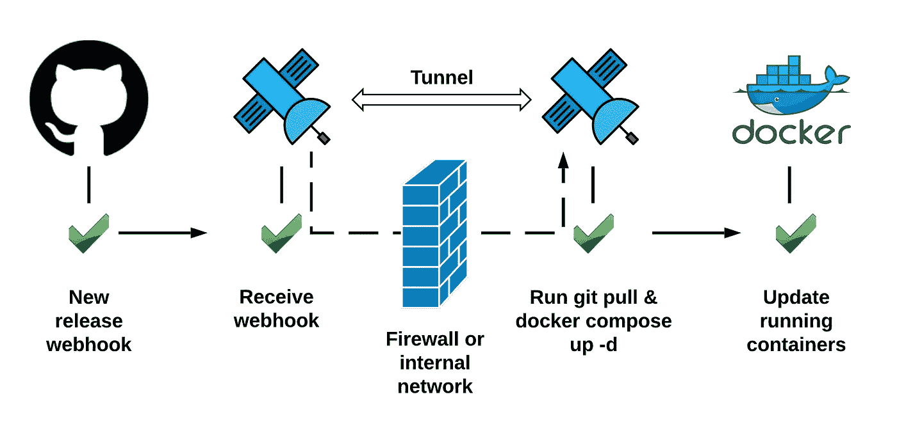
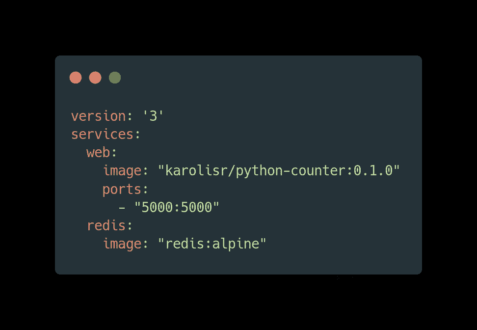
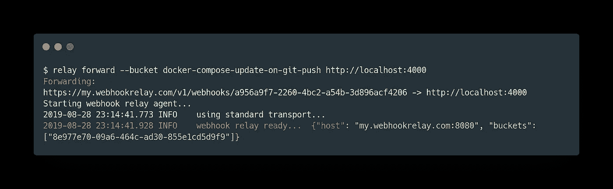
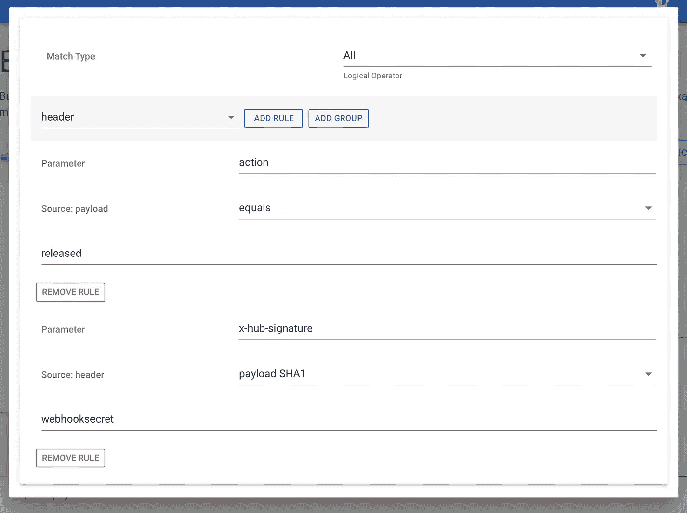

# GitHub webhook 上的 Docker 撰写更新

> 原文：<https://itnext.io/docker-compose-update-on-github-webhook-b212c9433a9b?source=collection_archive---------6----------------------->



去年我写了一篇博文，内容是关于[结合几个工具](https://webhookrelay.com/blog/2018/07/17/auto-deploy-on-git-push)在 git push 上自动化简单的 NodeJS 应用更新。许多用户通过用 Ruby、Python 或 PHP 编写本地 web 服务器来接收 webhooks，然后进行异步处理，从而解决了类似的问题。我很高兴地宣布，我们最终决定将这一功能添加到[中继 CLI](https://webhookrelay.com/v1/installation/cli) 中。现在，要在接收到的公共 webhook 上执行 bash 脚本，您可以:

```
relay forward --bucket my-bucket-name --relayer exec --command bash update.sh
```

要在 webhook 上启动 Python 应用程序:

```
relay forward --bucket my-bucket-name --relayer exec --command python my-app.py
```

这开启了一些有趣的可能性，可以创建管道，可以对几乎所有发出 webhooks 的东西做出反应。在本文中，我将向您展示如何构建 GitOps 风格的管道，使 Docker Compose 部署与托管在 git 存储库上的 docker-compose.yaml 保持同步。

**先决条件**

*   Docker & [Docker 撰写](https://docs.docker.com/compose/install/)
*   [配置了](https://my.webhookrelay.com/login)[中继 CLI](https://webhookrelay.com/v1/installation/cli) 的 Webhook 中继帐户
*   [Github 账户](https://github.com)

包含我在本文中使用的脚本的存储库可以在这里找到:[https://github . com/webhook relay/docker-compose-update-on-git-push](https://github.com/webhookrelay/docker-compose-update-on-git-push)。

# 步骤 1:通过 Docker Compose 部署容器

第一步是进行初始部署。我们将创建一个简单的 dockerized Python 应用程序，您可以在这里找到[连接到 Redis 并部署它:](https://github.com/webhookrelay/docker-compose-update-on-git-push)



docker-compose.yml

因为我们只想更新 git 标签，而不只是任何推送，所以让我们配置一个 webhook 并分析有效负载。

为了实现这一点，让我们首先创建一个具有内部输出的 bucket:



这里，稍后将使用 bucket 来订阅 github 请求，而 destination 只是一个强制参数，在本例中我们不必使用。

抓取那个[https://my.webhookrelay.com/v1/webhooks/***](https://my.webhookrelay.com/v1/webhooks/***)的 URL，并转到你的库的 settings - > webhooks 部分。到达后，设置:

*   您唯一的[https://my.webhookrelay.com/v1/webhooks/***](https://my.webhookrelay.com/v1/webhooks/***)网址的有效负载网址
*   *应用程序/json* 的内容类型
*   一个随机的秘密名称，为了这个例子，我的秘密将是' webhooksecret '
*   点击`Let me select individual events.`并选择*释放*。

现在，转到您的存储库的发布页面(例如[https://github . com/webhook relay/docker-compose-update-on-git-push/releases](https://github.com/webhookrelay/docker-compose-update-on-git-push/releases))并创建一个新的发布`1.0.0`。然后，如果你访问 bucket details 页面或者 [logs 页面](https://my.webhookrelay.com/logs)——你应该会看到来自 Github 的 webhook。打开它，让我们检查有效载荷。虽然很长，但我们应该能看到

```
"action": "released",
```

在顶部。为了确保我们只对这些事件做出反应，请创建一个规则:


如果您标记另一个版本，您现在应该看到只有一个 webhook 是 forwarder:


我们的更新脚本是:

```
#!/bin/bash
git pull
docker-compose up -d
```

它将获取最新的合成文件并更新容器。现在，让我们更新`relay.yml`文件中的配置([访问密钥&秘密可以在这里生成](https://my.webhookrelay.com/tokens)):

```
version: v1
key: xxx     # your access key
secret: xxx  # your access secret
buckets:
- docker-compose-update-on-git-push
relayer:
  type: exec
  command: bash
  commandArgs:
  - /full/path/to/docker-compose-update-on-git-push/update.sh
  timeout: 300
```

要启动中继，请运行:

```
relay run -c relay.yml
```

这将通过您的终端运行它。对于生产用例，请使用[后台服务模式](https://webhookrelay.com/v1/installation/background-service)。它将确保守护程序在操作系统启动时启动。

# 让我们试一试

启动 docker-撰写:

```
docker-compose up -d
```

检查容器:

```
$ docker ps
CONTAINER ID        IMAGE                           COMMAND                  CREATED             STATUS              PORTS                    NAMES
26cd2219e18b        redis:alpine                    "docker-entrypoint.s…"   20 seconds ago      Up 3 seconds        6379/tcp                 docker-compose-update-on-git-push_redis_1
63c8cd1ae7bb        karolisr/python-counter:0.1.0   "flask run"              20 seconds ago      Up 18 seconds       0.0.0.0:5000->5000/tcp   docker-compose-update-on-git-push_web_1
```

Docker ps 向我们展示了我们当前运行的映像，它是 0 . 1 . 0——到目前为止没有什么意外。

下一步是构建一个新的映像`0.2.0`并将其推送到注册表中。一旦它可用，我们可以更新我们的 GitHub 库`docker-compose.yml`并发布新版本。为了这个例子，让我们通过 GitHub UI 来实现。

几秒钟后，您应该会看到一个新的容器正在运行:

```
$ docker ps
CONTAINER ID        IMAGE                           COMMAND                  CREATED             STATUS              PORTS                    NAMES
27b2542423ec        karolisr/python-counter:0.2.0   "flask run"              9 seconds ago       Up 7 seconds        0.0.0.0:5000->5000/tcp   docker-compose-update-on-git-push_web_1
26cd2219e18b        redis:alpine                    "docker-entrypoint.s…"   10 minutes ago      Up 9 minutes        6379/tcp                 docker-compose-update-on-git-push_redis_1
```

我们看到我们的容器现在运行的是 0.2.0 版本，更新成功！

# 可选项:验证 GitHub 机密

Webhook 中继输出规则也可以验证 GitHub 签名:



这将确保只处理 GitHub 签名的 webhooks。

# 替代解决方案

我已经成功地使用了这些工具来更新容器:

*   [https://github.com/pyouroboros/ouroboros](https://github.com/pyouroboros/ouroboros)
*   [https://github.com/containrrr/watchtower](https://github.com/containrrr/watchtower)

如果你有一个简单的设置，只需要跟踪`latest`标签，这两个工具都可以工作。然而，如果您有多个带有 semver(或任何其他版本控制机制)的容器，这些解决方案就不起作用了。这就是为什么有一个要么是有用的。将带有图像标签的 env 或 docker-compose.yml config 提交到 git 并同步到运行服务的主机。

# 结论

与在您的机器上执行的任何代码一样，您在自动化任务时必须小心。Webhook Relay 将为您提供单向的 Webhook 流入机器。您的脚本/应用程序在您的机器上，不能通过 Webhook 中继远程修改。结合经过身份验证的 webhook 端点(您可以在存储桶级别上配置它)或 webhook 有效负载校验和验证，您可以构建一个安全的更新机制。

*最初发表于*[](https://webhookrelay.com/blog/2019/09/02/docker-compose-update-on-github-webhooks/)**。**