# Docker 容器作为一个可执行文件来使用 Go (golang)处理图像

> 原文：<https://itnext.io/docker-container-as-an-executable-to-process-images-using-go-golang-5233f9bd3bf7?source=collection_archive---------1----------------------->

## Docker:入口点、CMD、卷

## 在本课中，我们将创建一个 docker 容器，它将作为可执行文件来处理一些图像文件。为此，我们将使用 Docker VOLUME、ENTRYPOINT 和其他 Dockerfile 指令。


(来源:[**unsplash.com**](https://unsplash.com/photos/3_Xwxya43hE))

在 [**上一课**](https://medium.com/sysf/creating-your-first-docker-application-b0ce40ac67d1) 中，我们学习了如何使用 Docker 文件创建 Docker 映像，以及创建和管理 Docker 容器。我们讨论了几个 Dockerfile 指令，如`FROM`、`WORKDIR`、`ADD`、`COPY`、`CMD`等。以及他们对形象塑造过程的贡献。

在这一课中，我们将讨论用于创建 Docker 容器的`ENTRYPOINT`指令，Docker 容器的行为类似于可执行文件。我们还将讨论如何在 Docker 容器和主机之间共享文件。

这节课，我们要用 [**Go**](https://golang.org/) (golang)写一个图像处理程序。因此，我们需要一个带有 Go 安装的**父映像**。我们将使用`[golang:1.15.6-alpine3.12](https://hub.docker.com/_/golang/)`作为我们将在本课中构建的图像的父图像。

> *💡如果你不熟悉 Go (golang)编程语言，我会推荐你去看看我在 RunGo 的文章。这是一种简单而强大的编程语言。*

要在您的系统上安装 Go，请遵循本 官方文档中的 [**。在本课中，我们使用的是 **Go v1.15.6** ,我们对父映像使用的是相同的版本。本地安装 Go 是不必要的，但我们希望在创建 Docker 映像之前先测试我们的 Go 程序。**](https://golang.org/dl/)

# 图像处理程序

在本课中，我们将编写一个 Go 程序，该程序在文件系统上获取一个源图像(使用图像的路径)并将该图像裁剪成一个正方形。它还可以调整对比度和亮度。然后它最终将图像的灰度格式保存在磁盘上。结果如下所示。


(来源:[**unsplash.com**](https://unsplash.com/photos/QhR78CbFPoE))


(来源:[**unsplash.com**](https://unsplash.com/photos/LlOVWBaHU5E))

我们不会编写一个具有复杂逻辑的程序来操纵源图像的每个方面来实现这一功能。相反，我们将使用用 Go 编写的可爱的小`[imaging](https://github.com/disintegration/imaging)`库，它为我们提供了操作图像并将其保存到磁盘的函数。

```
**docker-image-processor/**
├── .dockerignore
├── .gitignore
├── Dockerfile
├── bin/
|  └── avatar
├── go.mod
├── go.sum
├── main.go
├── process.go
├── process_test.go
├── shared/
├── test.jpg
├── tmp/
|  ├── out/
|  |  ├── cmd_out.jpg
|  |  ├── model-1.jpg
|  |  └── model-2.jpg
|  └── src/
|  |  ├── model-1.jpg
|  |  └── model-2.jpg
└── utils.go
```

我们的项目结构看起来会像上面这样。不要担心现在就创建这些文件，其中一些将在以后生成。首先，让我们将这个项目转换成一个 [**Go 模块**](https://medium.com/rungo/anatomy-of-modules-in-go-c8274d215c16) ，这样我们就可以安装和跟踪依赖项了。

```
$ go mod init **docker-image-processor**
```

该命令将在项目目录中创建`go.mod`文件。我们不关心发布这个 Go 模块，所以`docker-image-processor`模块名称对我们来说是合适的。现在，让我们安装`[**imaging**](https://github.com/disintegration/imaging)`模块。

```
$ go get -u **github.com/disintegration/imaging**
```

该命令将从 GitHub 下载`imaging`模块，并将其注册为`go.mod`文件中的一个依赖项。它还会生成`go.sum`文件来保存已安装模块的加密散列和它们自己的依赖项。

`process.go`文件包含转换源图像并将输出图像保存到磁盘的实际逻辑。它有`makaAvatar`功能，负责生成图像。

```
func makaAvatar(**srcPath** string, **outPath** string) error
```

该函数接受两个参数。第一个参数`srcPath`是源图像在磁盘上的路径，第二个参数`outPath`是保存输出图像的路径。

(来源:[**gist.github.com**](https://gist.github.com/thatisuday/f4ee137b25e9ce0a0e4a3799761f17b7))

`package main`声明表明这个 Go 项目将被编译成一个**二进制可执行文件**。我们将在处理 Docker 文件和 Docker 图像时讨论更多内容。

`utils.go`文件包含一些实用函数，如`fileExists`来帮助项目中的其他程序。现在我们已经准备好了`makeAvatar()`函数，让我们测试一下。为此，最好的方法是创建一个 [**单元测试**](https://medium.com/rungo/unit-testing-made-easy-in-go-25077669318) 并执行`makeAvatar()`函数来产生一些样本输出。

(来源:[**gist.github.com**](https://gist.github.com/thatisuday/e0abb5332487d0dafc7dadac47caa17a))

Go 中的单元测试文件以后缀`_test`结尾，单元测试函数必须以前缀`Test`开头。在`process_test.go`测试文件中，我们编写了`TestMakeAvatar`函数，用于测试位于`./tmp/src`目录中的样本图像的`makeAvatar`函数，并将输出保存在`./tmp/out`目录中。然后，它检查输出文件是否存在，以得出测试结果。让我们看看这个测试的结果。

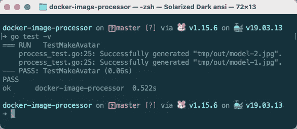

$ go 测试-v

`go test -v`命令指示 Go 在模块目录中查找测试文件(`**_test.go*`)并执行测试功能。从上面的结果来看，`TestMakeAvatar`测试已经通过。运行该测试后，您将能够在`./tmp/out`目录中看到类似下面的输出图像(*右*)。


(来源:[**unsplash.com**](https://unsplash.com/photos/LlOVWBaHU5E))

现在让我们处理`main.go`文件，这将是应用程序的入口点。我们试图构建的应用程序是一个二进制可执行文件，它接受如下所示的两个参数。

```
$ ./avatar <srcPath> <outPath>
```

`./avatar`文件是我们将从这个 Go 项目构建的可执行文件。`srcPath`和`outPath`参数是磁盘上源映像和输出映像的路径。当我们执行这个命令时，`main.go`文件中的`main()`函数将使用这些参数来执行。

但是在构建一个可执行文件之前，我们需要处理`main.go`文件，并使用命令中收到的`srcPath`和`outPath`调用`makeAvatar()`函数。我们可以使用`go run .`来运行执行`main()`函数的模块，就像可执行文件一样。

```
$ go run . <srcPath> <outPath>
```

我们可以使用`os.[Args](https://golang.org/pkg/os/#pkg-variables)`变量访问传递给执行`main()`函数的命令的参数。`Args`是字符串的切片(*数组*)，该切片的第一个元素包含可执行文件的路径。

```
*// main.go*
package mainimport "fmt"
import "os"func main() {
 fmt.Println(os.Args)
}
```

这个简单的程序在使用命令`$ go run . ./test.jpg ./test_out.jpg`执行时会产生以下结果。

```
[
  /var/folders/xx/..../b001/exe/docker-image-processor
  ./test.jpg
  ./test_out.jpg
]
```

在这种情况下，当我们运行一个 Go 程序或整个模块时，Go 首先动态创建一个二进制可执行文件，将其存储在一个临时位置，然后执行该二进制可执行文件。二进制可执行文件的执行从执行`main()`函数开始。

我们感兴趣的是从`os.Args`收到的第二个和第三个命令行参数。所以让我们修改`main()`函数，用这两个值调用`makeAvatar()`函数。

(来源:[**gist.github.com**](https://gist.github.com/thatisuday/ba0e502d6ffd89494b5bdd457cf75aa6))

在上面的程序中，首先，我们检查`os.Args`的长度是否小于`3`的长度，如果是这种情况，则错误退出程序。然后我们提取第二个和第三个参数，它们是`makeAvatar()`函数的`srcPath`和`outPath`。

```
$ go build **-o ./bin/avatar** .
```

上面的命令将从这个模块构建一个二进制可执行文件`avatar`,并将它放在项目的`./bin`目录中。然后我们可以使用`./bin/avatar <args>`命令执行这个二进制可执行文件。

```
$ **./bin/avatar** ./tmp/src/model-1.jpg ./tmp/out/cmd_out.jpg
*Success! Image has been generated at ./tmp/out/cmd_out.jpg.*
```

Go 程序中使用的相对路径将相对于当前工作目录(*终端打开的位置*)。因此，上面的命令使用`<project>/tmp/src/model-1.jpg`图像作为源图像，并生成`<project>/tmp/out/cmd_out.jpg`图像。

# 建立码头形象

到目前为止，我们已经创建了一个 Go 项目来生成二进制可执行文件。这个可执行文件通过命令行参数接收源图像的路径，并在通过命令提供的目标路径上生成输出图像。现在我们想使用 Docker 将这个应用程序容器化。

(来源:[**gist.github.com**](https://gist.github.com/thatisuday/a77e6a2c21138696573052493b6a6ad1))

> *💡我们已经在上一课 中讨论了 Dockerfile 的结构，所以我不想再解释了。*

我们使用`[golang:1.15.6-alpine3.12](https://hub.docker.com/_/golang/)`作为我们将要构建的 Docker 映像的父映像。然后，我们将`/app`设置为映像中的工作目录。然后，我们将`go.mod`和`go.sum`文件从构建上下文复制到`/app`目录，并通过运行`go mod download`命令安装 Go 依赖项。

一旦安装了依赖项，我们就将源代码从构建上下文复制到映像的`/app`目录中。最重要的部分，`go build -o ./bin/avatar .`命令在映像的`/app/bin`目录下创建`avatar`可执行文件。

到目前为止，我们已经执行了基本的 Dockerfile 指令。现在，让我们看看`VOLUME`和`ENTRYPOINT`指令是做什么的。

## 使容器可执行

当我们使用`docker run <image>`命令运行容器时，`[ENTRYPOINT](https://docs.docker.com/engine/reference/builder/#entrypoint)`指令为容器设置默认命令。

```
ENTRYPOINT ["executable", "param1", "param2"]
ENTRYPOINT command param1 param2
```

前一条`ENTRYPOINT`指令以 **exec 形式**设置命令，后一条 **shell 形式**使用`/bin/sh -c`执行命令。使用 shell 形式有一些缺点，如这里讨论的[](https://docs.docker.com/engine/reference/builder/#entrypoint)**，因此 exec 形式是首选。只有 docker 文件中的最后一条`ENTRYPOINT`指令将用于设置容器的默认命令。**

```
CMD [ "param3", "param4" ]
```

**如果`ENTRYPOINT`出现在 docker 文件中，则`[CMD](https://docs.docker.com/engine/reference/builder/#cmd)`指令将作为由`ENTRYPOINT`表示的命令的默认参数。因此，上面设置中的最后一个`ENTRYPOINT`命令是`$ executable param1 param2 param3 param4`。但是，我们可以通过在`docker run <image> param33 param44`命令中提供参数来覆盖这些参数。**

> ***💡*我们可以用`docker run`命令使用`--entrypoint`标志覆盖 Dockerfile 中设置的默认`ENTRYPOINT`值，但它将只接受`executable`值。**

**通过使用`ENRTYPOINT`指令，我们让我们的容器**充当一个可执行的**，一旦它使用`docker run`命令产生了一个由`ENRTYPOINT`表示的命令，它就运行这个命令。我们可以将可选参数传递给替换`CMD`值的`docker run <image> [params]`命令。**

```
*# Dockerfile
...**# set entrypoint* ENTRYPOINT [ "./bin/avatar" ]# *set* default arguments
CMD [ "./test.jpg", "./shared/test_out.jpg" ]
```

**在我们的 docker 文件中，`ENTRYPOINT`指令在 exec 格式中有`["./bin/avatar"]`值。这意味着当我们使用`docker run`命令从这个映像创建一个容器时，它将使用一些参数执行容器中相对于`/app`目录的`./bin/avatar`可执行文件。**

**由于 Dockerfile 中的`CMD`指令具有`[ "./test.jpg", "./shared/test_out.jpg" ]`值，如果没有为`docker run`命令提供参数，则默认命令将是`./bin/avatar ./test.jpg ./shared/test_out.jpg`。该命令将处理`./test.jpg`图像，并在相对于`/app`目录的容器中的`./shared/test_out.jpg`处生成输出。**

## **管理卷**

**正如我们在前面的[课程](https://medium.com/sysf/creating-your-first-docker-application-b0ce40ac67d1)中所讨论的，Docker 容器是一个独立的进程，有自己的文件系统。每个容器都有自己的可写层，在这里提交对文件系统所做的更改(容器中的*)。***

**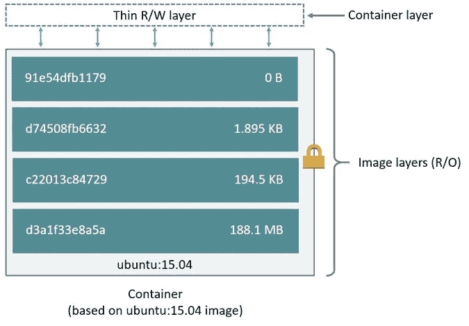**

**(解释见“ [**解剖码头工人**](https://medium.com/sysf/getting-started-with-docker-1-b4dc83e64389) ”一课)**

**这个可写层(*读/写层*)不能从主机文件系统访问。一旦容器从 Docker 引擎中移除，这一层就被破坏了。为了访问这一层，以便主机可以访问容器中的文件更改，我们使用了**卷**。**

**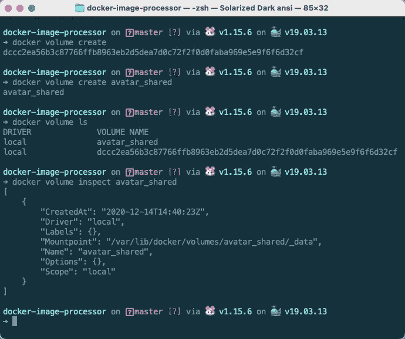**

**$ docker 卷**

**docker 卷包含诸如卷名及其在主机上的装载位置等信息。要创建 docker 卷，我们使用`$ docker volume [create](https://docs.docker.com/engine/reference/commandline/volume_create/) [name]`命令。如果您省略了`name`，一个唯一的`SHA256`散列将用于卷名。**

> ***💡*你可以用`--driver`或`-d`标志来配合`$ docker volume create`命令来指定一个卷驱动。默认情况下，它的值是`local`，正如您在上面的日志中看到的由`Driver`字段指定的。卷驱动程序将允许您自定义文件在卷中的存储方式，例如它可以启用文件加密或允许存储在远程服务器(如 AWS S3)上。您可以通过卷插件安装卷驱动程序。 [**这里的**](https://docs.docker.com/engine/extend/legacy_plugins/#volume-plugins) 是一些卷插件。**

**要列出卷，您可以使用`$ docker volume [ls](https://docs.docker.com/engine/reference/commandline/volume_ls/)`命令。您可以使用`$ docker volume [inspect](https://docs.docker.com/engine/reference/commandline/volume_inspect/) <name>`命令检查该卷，并且您将能够通过`Mountpoint`属性看到主机上装载该卷的目录。要删除一个卷，我们使用`$ docker volume [rm](https://docs.docker.com/engine/reference/commandline/volume_rm/) <name>`命令。**

**当我们使用`docker run <image>`命令从映像创建容器时，Dockerfile 中的`VOLUME`指令会自动创建一个卷。由`VOLUME`指令创建的卷的`Mountpoint`将被**与指定的目录共享**，比如我们这里的`/app/shared`。**

**即使在 Docker 容器退出或移除后，附加到它的卷仍将继续存在。这样，对容器中目录内容所做的任何更改都将保留在主机文件系统上。稍后，这个目录或卷可以用作另一个容器的挂载点，以进行额外的处理。**

**虽然 Docker 的卷看起来很简单，但它有更多的内容。除了名为 ( *带有自定义名称*)和**匿名卷** ( *带有 SHA256 散列名称*)的**之外，还有**主机卷**，您可以在其中将主机文件系统的自定义目录挂载到容器，而不是让 Docker 选择一个目录路径，在我们的例子中，该路径似乎在`/var/lib/docker/volumes`内。****

> ***💡*命名卷和匿名卷由 Docker 管理，这就是为什么它们被称为 **Docker 管理的卷**，而管理主机卷的责任由我们承担。删除 Docker 管理的卷时，其在主机上的目录也会被删除。但是，主机卷不会显示在`$ docker volume ls`命令中，必须手动移除。**

## **建筑形象与容器**

**让我们使用名为`avatar`的 Docker 文件创建一个 Docker 图像。为此，我们将使用以下命令。**

**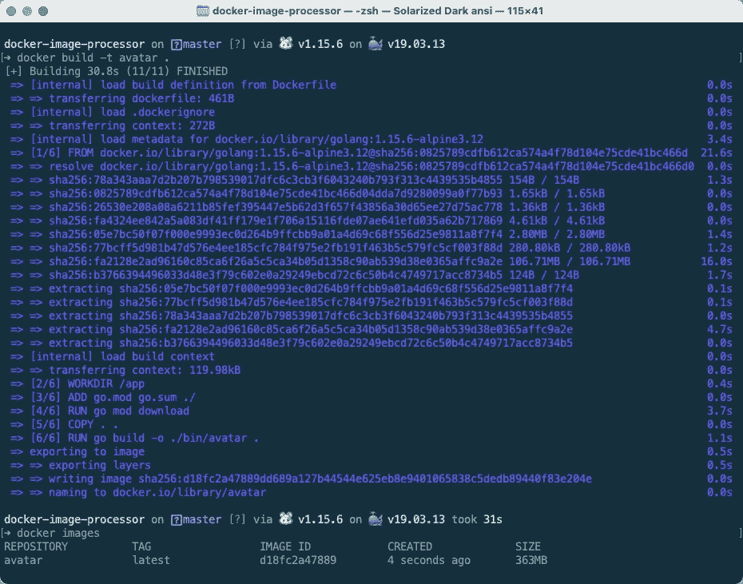**

**$ docker 构建**

**`$ docker build`命令为我们创建了一个名为`avatar:latest`的图像，显然，它的大小是`363MB`。现在，让我们从它创建一个容器。记住，当我们创建一个容器时，默认命令将由`ENTRYPOINT`指令指定。**

**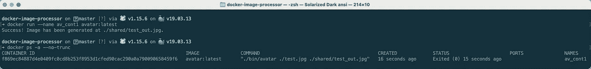**

**$ docker 运行**

**由于我们没有向`$ docker run`命令提供任何参数，它将使用`CMD`指令的默认参数，该指令与`ENTRYPOINT`指令一起使用工作区目录中的`./test.jpg`文件作为源图像，并在容器的`/app/shared`目录中生成输出图像(*与* `*./shared*` *路径相同，相对于工作区*)。一旦这个过程完成，容器就退出，不再运行。**

**容器内生成的`./shared/test_out.jpg`文件仍然在容器的读/写层内。由于 Dockerfile 有一个`VOLUME`指令，它创建一个卷，将容器的`./shared`目录挂载到主机的 Docker 管理的目录，我们应该能够在`$ docker volume ls`命令的结果中看到这个卷的条目。**

**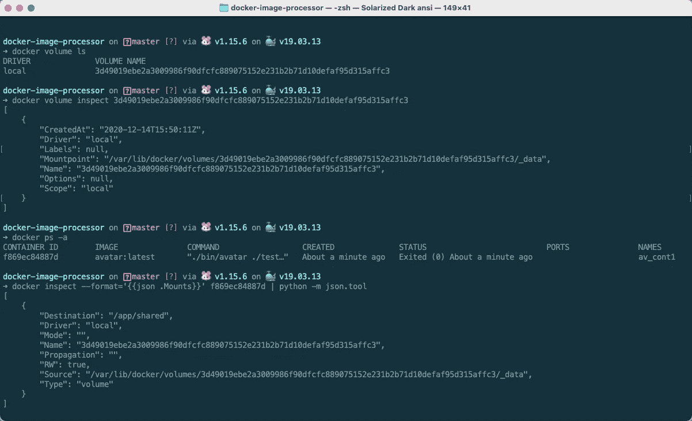**

**$码头工人检查**

**如我们所见，Docker 创建了一个匿名卷，并显示了它在主机上的装载位置。我们还可以使用`$ docker inspect <container>`命令查看与容器相连的卷。在上面的例子中，我们只是美化了属性`Mounts`，它显示容器正在使用 id 为`3d49019ebe...c3`的值，它在容器中的`Destination`是`/app/shared`。所以我们应该能够看到`/var/lib/docker/volumes/3d49019ebe...c3/_data`目录中容器的`/app/shared`内容。**

**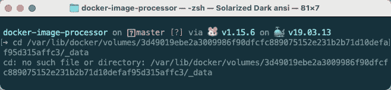**

**$ CD/var/lib/docker/volumes/3d…C3/_ data**

**哎呀，它说没有这个文件或目录。发生了什么事？实际上，我使用的是 Macbook Pro 机器，而 **macOS 不是 Docker 引擎的本机主机**，这就是为什么 Docker 引擎通过 **Linux 虚拟机** ( *VM* )运行。Docker 卷中指定的路径是虚拟机文件系统上的路径。**

**没有简单的方法来访问这个虚拟机的终端，但是你可以遵循这些 方法中的 [**方法。我使用第二种方法，因为新版本的 Docker 可能不支持第一种方法。**](https://gist.github.com/BretFisher/5e1a0c7bcca4c735e716abf62afad389)**

**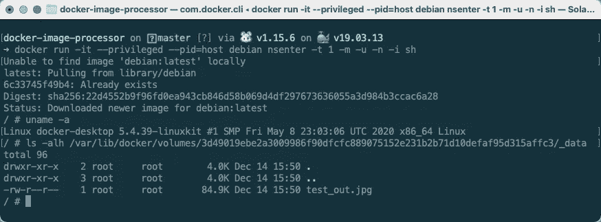**

**Docker 虚拟机**

> ***💡*我建议在您的`.bash_profile`中为上面的`$ docker run`命令添加一个**别名**，以便快速访问 Docker VM。例如，在您的`.bash_profile`中有了`alias docker_vm="docker run -it --privileged --pid=host debian nsenter -t 1 -m -u -n -i sh"`，您只需用`$ docker_vm`命令就可以进入 Docker VM。**

**一旦我们获得了对虚拟机的访问权并检查了卷目录`/var/lib/docker/volumes/3d…c3/_data`的内容，我们就可以看到`test_out.jpg`。现在从 Docker VM 下载这些文件到 macOS 主机非常棘手，所以我们将寻找一个替代的解决方案。**

**除了用 Dockerfile 中的`VOLUME`指令指定一个卷之外，我们还可以使用`-v`(*`*--volume*`的简称)或带有`$ docker run`命令的`--mount`标志动态创建和挂载一个卷。`--mount`标志比`-v`更加强大和冗长，但是为了简单起见，我们将使用`-v`，你可以从[](https://docs.docker.com/storage/volumes/#choose-the--v-or---mount-flag)**文档中阅读更多关于`--mount`的信息。*****

```
***$ docker run -v **<vol>:<dest>:<options>** <image>***
```

*****这里的`<vol>`值指定要使用的音量(*名称*)。如果这个卷不存在，Docker 将用给定的名称为我们创建它。如果省略这个值(*包括* `*:*`)，Docker 将创建一个匿名卷，与`<dest>`共享。我们还可以通过在主机的文件系统上指定目录路径来装载主机卷。*****

*****`<dest>`值指定了容器文件系统目录的绝对路径，该卷将安装在该目录中。如果这个`<dest>`目录不存在，将在容器中创建。*****

*****`<options>`值是配置卷的选项的逗号分隔列表，例如`ro`使卷**对容器而言是只读的**，这意味着容器将能够从该卷访问文件，但不能向其写入。*****

> ******💡*如果您想要挂载多个卷，您可以使用多个`-v`标志。您还可以使用带有`$ docker run`命令的`--volumes-from`标志从另一个容器挂载卷。当容器被用作卷时，它被称为卷容器。从 [**这里**](https://docs.docker.com/engine/reference/commandline/run/#mount-volumes-from-container---volumes-from) 了解更多。*****

*****这次让我们使用一个主机卷来运行一个容器。让我们使用`$ docker container prune`和`$ docker volume prune`命令擦除现有的容器和卷，重新开始。让我们创建另一个容器*****

*****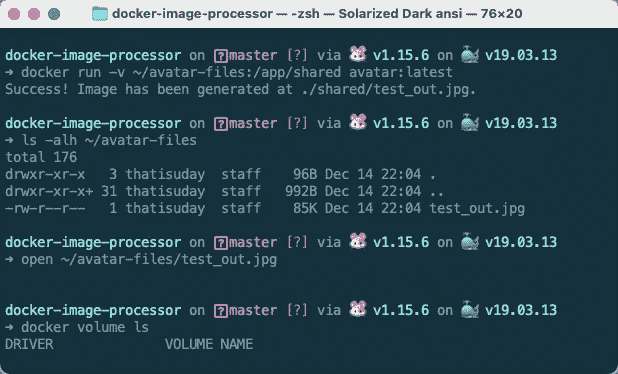*****

*****$ docker 运行*****

**********

*****~/avatar-files/test_out.jpg*****

*****在上面的例子中，我们从`avatar:latest`映像创建了一个新的容器，但是这一次，我们使用了`~/avatar-files`目录作为卷。由于这是一个**主机卷**，它不由 Docker 管理，因此不会显示在`$ docker volume ls`结果中。*****

> ******💡*一个**主机卷**也称为**绑定装载**。因此，每当您听到 **bind mount** 时，请考虑将主机上的一个目录挂载到 Docker 容器。如果我们使用的是`--mount`标志而不是`-v`，那么我们需要在值中提供`type=bind`来创建绑定挂载。更多阅读从 [**这里**](https://docs.docker.com/storage/bind-mounts/) 。*****

*****如果主机卷(*目录*)不存在，将由具有适当权限的 Docker 在主机文件系统上创建(*)。即使在容器被删除后，卷仍然存在，因此如果您删除容器,`~/avatar-files`目录将仍然存在。******

*****在上面的例子中，我们使用默认参数用于`ENTRYPOINT`指令，因为我们没有在`$ docker run`命令中提供任何参数。因此，除了来自容器工作区目录的`test.jpg`之外，我们不处理任何新图像。*****

*****这一次，让我们将`[src.jpg](https://unsplash.com/photos/nahUo1GhcrA)`图像保存在`~/avatar-files`目录中，并要求 Docker 容器使用该图像作为源图像在同一目录中生成`out.jpg`。*****

*****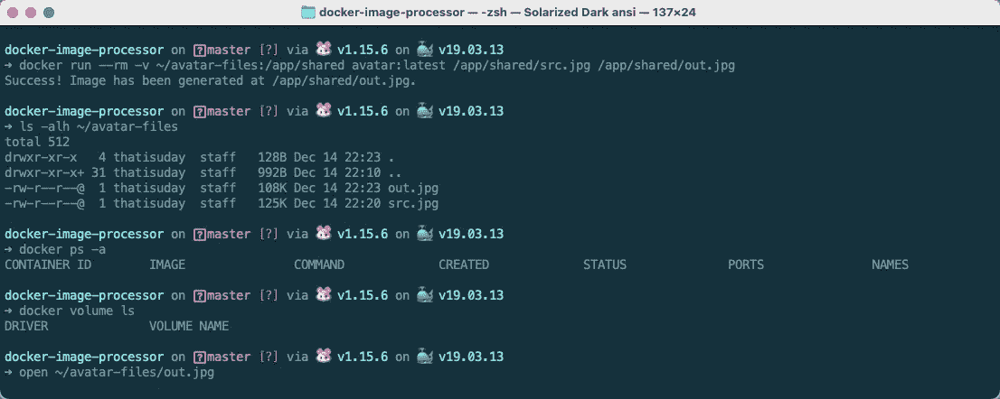*****

*****$ docker 运行*****

**********

*****~/docker-files/out.jpg*****

*****在上面的例子中，我们从`avatar:latest`图像创建了一个新的 Docker 容器。这一次，`--rm`标志将在容器一退出就移除它，这就是为什么`$ docker ps -a`结果是空的。此外，我们将把`~/avatar-files`目录挂载到容器的`/app/shared`目录中，这样容器的`src.jpg`就会在`/app/shared`中。*****

*****这一次，我们通过`$ docker run`命令本身为`ENTRYPOINT`命令指定自定义参数来覆盖`CMD`指令参数。使用上面的命令，我们要求容器的`./bin/avatar`将`/app/shared/src.jpg`作为源路径，并输出`/app/shared/out.jpg`文件，该文件将反映在主机文件系统的`~/docker-file`目录中。*****

# *****多阶段构建策略*****

*****让我们回顾一下到目前为止我们在文档中所做的事情。首先，`FROM`指示下载并设置预装 Go 的父映像。然后，我们从我们的项目目录中复制一些文件(*构建上下文*)到镜像中，并安装依赖项。然后我们将项目源代码复制到映像中，并在映像中的`./bin/avatar`处创建一个二进制可执行文件。*****

*****当我们创建一个容器时，默认的`ENTRYPOINT`命令执行这个二进制可执行文件，并从位于容器中的源映像生成一个输出映像，该映像可以与主机的文件系统共享。*****

*****现在考虑容器中必须包含的文件，以便能够产生预期的效果。如果使用默认的`CMD`参数，我们只需要`./bin/avatar`来处理源图像，`./test.jpg`用于默认的`CMD`参数，以及`./shared`目录来保存输出图像。我们不需要其他东西。*****

*****但是我们为什么要这么做。如果你记得的话，我们的 Docker 图像尺寸是`363MB`这是巨大的。不太好下载维护。如果我们能扔掉所有不需要的东西，创造一个更小尺寸的图像，这对每个人来说都是一个双赢的局面。*****

*****因此，从技术上讲，我们可以在主机上构建`./bin/avatar`二进制文件，只将它和其他必要的文件推送到映像中，但是这样会违背将整个项目容器化的目的。我们希望在 Docker 映像本身中编译整个应用程序，但仍然保持 Docker 映像的大小尽可能小。*****

*****这就是**多阶段构建**的用武之地。我们可以在一个 Dockerfile 文件中指定多个`FROM`指令。每个`FROM`指令创建一个新的**构建阶段**，最后一个构建状态产生最终的 Docker 映像。Docker 将每个构建阶段指定为唯一的索引(*从 0* 开始)，或者我们将使用`FROM <image> AS <stage>`语法来命名构建状态。使用带有`CMD`指令的`--from=<stage>`标志，我们可以将文件从一个构建阶段复制到另一个构建阶段。*****

*****让我们创建一个名为`Dockerfile.prod`的新 Dockerfile 并创建两个构建状态。第一个构建阶段生成`./bin/avatar`二进制文件，第二个构建阶段复制这个二进制文件。第二个构建阶段将生成一个 Docker 图像，该图像将用于创建一个容器来处理图像。*****

*****(来源:[**gist.github.com**](https://gist.github.com/thatisuday/de83a85930971d5c7125a2e074cf9e58))*****

*****好好看看上面的 Dockerfile.prod 文件(*我不得不使用* `*Dockerfile*` *名称来启用语法高亮显示*)。第一个构建阶段使用`golang:1.15.6-alpine3.12`映像，因为它包括 Go 安装。`AS builder`部分将构建阶段命名为`builder`。*****

*****在最终映像中，我们不需要 Go 安装，因此第二个构建阶段使用`alpine:3.12.2`作为父映像。它是一个非常轻量级的 Linux 发行版( *~5MB* )。然而，我们需要将一些文件从`builder`构建状态复制到最终映像中，因此我们在 Dockerfile 中使用带有`COPY`指令的`--from=builder`标志。*****

*****我们从`builder`阶段复制不超过`/app/bin/avatar`个文件到最终图像中。此外，我们已经删除了`VOLUME`指令，因为它将不必要地创建一个卷，我们希望用户手动指定一个。我们还删除了`ENTRYPOINT`指令(*命令*)的默认`CMD`参数，因为我们希望用户明确提供这些参数。现在，让我们建立图像。*****

*****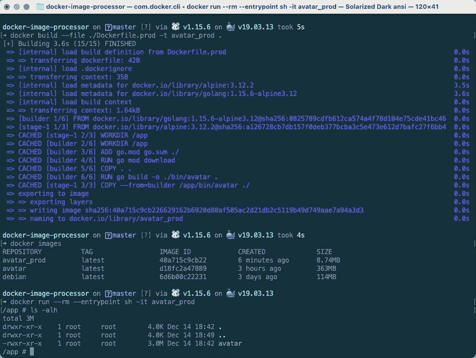*****

*****$ docker 构建*****

*****从 docker 文件构建映像时，多阶段构建没有什么特别的。然而，我们需要用`$ docker build`命令指定`--file`或`-f`标志，因为我们的 docker 文件名不再是`Dockerfile`了。新图像名称为`avatar_prod`。*****

*****当我们使用`$ docker images`命令列出图像时，我们会看到 ID 为`40a715c9cb22`的新图像。好好看看**图像尺寸**挺让人吃惊的。我们的`avatar_prod`图像的大小只有`**8.74MB**`，比`avatar`图像少了`350MB`多。*****

*****为了看看新图像中的文件是什么样子，我们从`avatar_prod`图像创建了一个容器，并用`sh`命令覆盖了默认的`ENTRYPOINT`值，该命令在容器的工作区目录中启动了一个 shell 进程。使用`ls`，我们可以验证`avatar`文件已经从`builder`阶段复制。*****

*****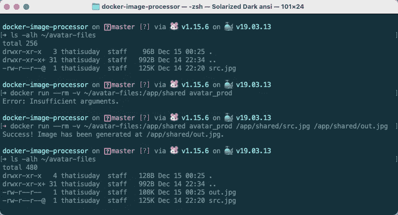*****

*****$ docker 运行*****

*****在这里，我们从`avatar_prod`图像中创建了一个新的容器。如果我们不在`$ docker run command`中提供任何参数，它将返回一条错误消息。但是通过正确的参数，我们从`avatar`图像中获得了与容器相同的功能(尺寸巨大的*)。******

> *******💡*您可以在`$ docker build`命令中使用`--target`标志来指定要在多阶段 Dockerfile 文件中构建的目标。您也可以用其他方式控制多阶段构建。阅读 [**本**](https://docs.docker.com/develop/develop-images/multistage-build/) 文档了解更多信息。******

******您可以从下面的 GitHub 资源库中找到本课中使用的示例的 docker 文件和源代码。******

******[](https://github.com/course-one/docker-image-processor) [## 课程-一/码头-图像处理器

### 使用 Go 处理图像的 docker 图像示例。GitHub 是 5000 多万开发者的家园，他们共同工作来托管…

github.com](https://github.com/course-one/docker-image-processor)****** ************

******([**thatisuday.com**](http://thatisuday.com)/[/**GitHub**](https://github.com/thatisuday)/[/**Twitter**/](https://twitter.com/thatisuday)[/**stack overflow**](https://stackoverflow.com/users/2790983/uday-hiwarale)**/[**insta gram**](https://www.instagram.com/thatisuday/))********

****************