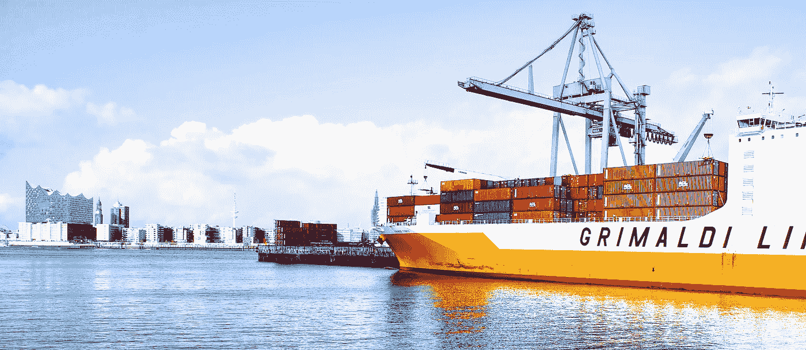

# Docker 中的 Docker？

> 原文：<https://itnext.io/docker-in-docker-521958d34efd?source=collection_archive---------0----------------------->

## 你能在 Docker 容器中运行 Docker 吗？

这篇短文基于 jérme Petazzoni 的博客文章: [**为您的 CI 或测试环境使用 Docker-in-Docker？**](https://jpetazzo.github.io/2015/09/03/do-not-use-docker-in-docker-for-ci/) **三思而行。**



货船上的集装箱。 [Axel Ahoi](https://unsplash.com/photos/hjEesK4KSDs?utm_source=unsplash&utm_medium=referral&utm_content=creditCopyText) 在 [Unsplash](https://unsplash.com/search/photos/container-ship?utm_source=unsplash&utm_medium=referral&utm_content=creditCopyText) 上拍照。

本文关注的问题如下:如果您运行一个安装了 Docker 的 Docker 容器，那么您是否可以在该 Docker 容器中运行 Docker(例如，拉取和构建图像，或者运行其他容器),并且两个 Docker 实例彼此完全独立？

答案是肯定的，但不建议这样做，因为它会导致许多低级技术问题，这些问题与 Docker 在操作系统上的实现方式有关，在[jérme Petazzoni 的帖子](https://jpetazzo.github.io/2015/09/03/do-not-use-docker-in-docker-for-ci/)中有详细解释。

好消息是，在 Docker 容器中使用 Docker 还有另一种推荐的方法，使用这种方法，两个 Docker 实例不是相互独立的，但是可以绕过这些问题。

使用这种方法，安装了 Docker 的容器不运行它自己的[**Docker 守护进程**](https://nickjanetakis.com/blog/understanding-how-the-docker-daemon-and-docker-cli-work-together#visualizing-docker-s-architecture) ，而是连接到主机系统的 Docker 守护进程。这意味着，在容器和主机系统中都有一个 Docker CLI，但是它们都连接到同一个 Docker 守护进程。在任何时候，只有一个 Docker 守护进程运行在您的机器上，即运行在主机系统上的那个。

为此，您可以启动一个安装了 Docker 的 Docker 容器，使用以下[**绑定挂载**](https://docs.docker.com/storage/bind-mounts/) 选项:

```
-v /var/run/docker.sock:/var/run/docker.sock
```

例如，您可以使用`[**docker**](https://hub.docker.com/r/_/docker/)`映像，这是一个安装了 Docker 的 Docker 映像，并像这样启动它:

```
docker run -ti -v /var/run/docker.sock:/var/run/docker.sock docker
```

然后在刚刚启动的 Docker 容器中，运行一些 Docker 命令，例如:

```
docker images
docker ps
```

观察输出。输出与您在主机系统上运行这些命令时完全相同。

看起来像是您刚刚开始的容器的 Docker 安装，您可能希望它是新的和未被触及的，已经有一些图像被缓存，一些容器正在运行。这是因为我们在容器中连接了 Docker CLI，以便与已经在主机系统上运行的 Docker 守护进程进行对话。

这意味着，如果您将一个图像放入容器中，这个图像在主机系统上也是可见的(反之亦然)。而且如果你在容器内部运行一个容器，这个容器实际上将是主机上运行的所有容器的“兄弟”(包括你在其中运行 Docker 的容器)。

这一开始可能会令人恼火。您可能会想，如果容器中的 Docker 安装与主机系统完全隔离开来，那该多好。然而，对于大多数用例来说，完全封装实际上是不需要的，只要您需要在 Docker 容器中使用 Docker，这种变通方法就是一种合法的解决方案。

但是什么时候需要在 Docker 容器中使用 Docker 呢？

# 你什么时候需要？

在 Docker 容器中运行 Docker 的问题在使用像 Jenkins 这样的 CI/CD 工具时经常出现。


在 Jenkins 中，管道阶段中的所有命令都在您指定的代理上执行。这个代理可以是一个 Docker 容器。因此，如果您的命令之一，例如，在*构建*阶段，是一个 Docker 命令(例如，用于构建图像)，那么您需要在 Docker 容器中运行一个 Docker 命令。

此外，Jenkins 本身可以作为 Docker 容器运行。如果您使用 Docker 代理，您将从 Jenkins Docker 容器中启动这个 Docker 容器。如果您的 Jenkins 管道中也有 Docker 命令，那么您将有三层嵌套的“Docker”。

然而，使用上面的方法，所有这些 Docker 使用同一个 Docker 守护进程，并且绕过了在同一个系统上多个守护进程(在本例中是三个)的所有困难。

要做到这一点，您唯一要做的就是用`-v /var/run/docker.sock:/var/run/docker.sock` 选项启动每个 Docker 容器，如上所述。

# 码头工人中的真正码头工人

如果你真的想的话，你可以在 Docker 中使用“真正的”Docker，也就是完全相互封装的嵌套 Docker 实例。您可以使用`[docker](https://hub.docker.com/r/_/docker/)`图像的`dind` ( *Docker in Docker* )标签来完成此操作，如下所示:

```
docker run --privileged -d docker:dind
```

杰罗姆·佩塔佐尼在[这里](https://github.com/jpetazzo/dind)详细描述了这种方法。但是也正如那里提到的，通常没有必要这样做。