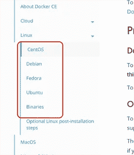
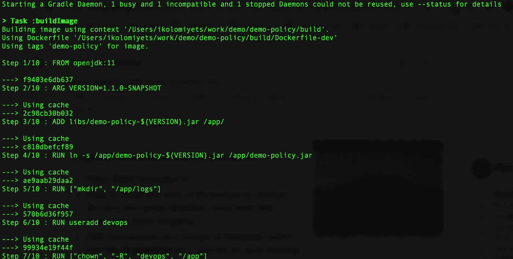

# 软件开发中的 Docker:扩展视野

> 原文：<https://itnext.io/docker-in-software-development-expanding-horizons-7b500d758f0?source=collection_archive---------5----------------------->

有大量的文章和博客文章解释了在软件开发生命周期中使用 Docker 的好处和方法。他们中的许多人也解释了如何在开发过程中使用 Docker。然而，他们中的大多数人都认为在他们的本地环境中运行着 Docker CE 或 Docker 桌面。

在某些情况下，将 Docker Desktop 安装到一个人的环境中在物理上是不可能的，或者不会有所帮助。例如，如果您的开发环境运行不受支持的 Windows 版本。或者您的公司使用在云中运行的虚拟 Windows 桌面或作为 WMWare 虚拟机。

在第一种情况下，有一个使用 Docker 工具箱的选项，但是第二种情况几乎没有变通的余地:根据我的经验，在虚拟化的 Windows 实例上运行 Docker 非常慢。它最终可能会起作用，但这种经历令人沮丧。

# 有什么选择吗？

在非 Linux 环境的幕后，Docker 使用一个 Linux VM。因此，在上面描述的场景中，自然的选择是一个独立的 Linux VM，Docker CE 在其中运行，不会有任何性能下降。

它可以是本地虚拟机或基于云的虚拟机，也可以是运行 Linux 操作系统的独立硬件，无论您需要做的是什么:

*   在虚拟机或硬件套件上安装 Linux 操作系统
*   在 Linux 实例上安装 Docker CE
*   启用对运行在 Linux 实例上的 Docker 守护进程的远程访问(可选)

# 设置 Docker 实例

按照 [Docker 文档](https://docs.docker.com/install/linux/docker-ce/centos/)安装 Docker CE。该链接描述了 CentOS 的安装过程。如果您使用不同的 Linux 发行版，请在左侧面板中选择您想要的版本。



一旦确认 Docker 在 Linux 实例上运行，就可以直接用于开发。

这个过程比预期的要稍微麻烦一些。本质上，我们必须在 Windows 端构建生成 Docker 映像所需的软件工件，然后在 Linux 实例上复制它们，并在 Linux 实例上再次运行`docker build`命令。

或者，我们可以将源代码推送到 Linux 实例，并在那里构建工件和 Docker 映像。

无论如何，一旦在 Linux 实例上构建了映像，就可以用它来启动容器。确保映像提供了远程调试应用程序的方法。这些技术依赖于用来开发相关应用程序的编程语言，但是现在大多数现代语言都允许远程调试。

同样，根据开发过程中使用的语言，构建工具可能会提供远程构建映像的方法。要使用这种方法，我们必须启用对 Docker 守护进程的远程访问。

# 启用 Docker 远程访问

默认情况下，Docker 只监听本地 unix 套接字，因此它只能被本地访问。为了能够远程访问 Docker，必须将其配置为监听 TCP 套接字。

然而，一旦 TCP 套接字侦听器被启用，任何人都可以不受限制地访问它，因此任何人都可以完全控制您的 Docker 实例。

为了防止对 Docker 实例的未授权访问，我们还必须通过启用 TLS 验证来保护 Docker 守护进程套接字。

首先，遵循[本指南](https://docs.docker.com/install/linux/linux-postinstall/#configuring-remote-access-with-systemd-unit-file)使用 systemd 单元文件启用远程访问，或者[遵循](https://docs.docker.com/install/linux/linux-postinstall/#configuring-remote-access-with-daemonjson)指南使用 daemon.json 文件启用远程访问。

接下来，按照下一篇文章中描述的[保护守护进程套接字。](https://docs.docker.com/engine/security/https/)

关于配置远程访问的一个注意事项:文档说明 dockerd 命令行选项应该如下所示:

但是，看起来文档已经过时了。“fd://”选项至少在 CentOS 7 上不再有效。

对于最新的 Docker CE，您必须使用“unix://”套接字选项来代替:

因为 Windows 实例没有安装 Docker 客户端，所以您必须在 Linux 实例上运行`docker --tlsverify --tlscacert=ca.pem --tlscert=cert.pem --tlskey=key.pem \
-H=<host>:2376 version`来验证 Docker 守护进程的设置。确认后，将客户端私钥和证书以及可信 CA 证书复制到 Windows 实例，并安全地存储它们。确保所有三个文件都存储在同一位置，并且它们的名称是 ca.pem、cert.pem 和 key.pem。

# 使用远程 Docker 守护进程进行开发

在开发过程中，可以通过多种方式使用远程 Docker 守护进程。通常，我们运行构建的应用程序来测试或调试它们。远程运行 Docker 的方式取决于项目中使用的语言。

在某些情况下，除了将工件复制到远程系统并在 Linux shell 中直接调用 docker 命令之外，没有其他方法可以将应用程序构建和部署到远程 Docker 实例。

然而，在某些情况下，有一些工具和插件可以帮助你。

例如，如果你用 Java 或 Kotlin 开发，有 gradle 和 maven 插件允许你远程构建图像。

让我们看看如何使用 gradle 来实现这一点。出于这个例子的目的，我们将使用 [gradle-docker-plugin](https://github.com/bmuschko/gradle-docker-plugin/) 。

在修改项目的 build.gradle 文件之前，向`%HOMEPATH%\.gradle\gradle.properties`文件添加两个变量:

```
dockerUrl=https://<linux_host_name>:2376dockerKeysDir=<path_to_certs>
```

理论上，它们可以被添加到项目的 build.gradle 或 gradle.properties 文件中，但这将使项目与特定环境紧密耦合，因此不修改源代码就不容易在其他地方构建代码。

确保`<linux_host_name>`对应于用于创建服务器端证书的服务器名称。如果它们不匹配，TLS 验证将失败。

`<path_to_certs>`应该替换为我们保存*的目录的路径。pem 文件，从 Linux 实例复制。

现在，将`com.bmuschko.docker-remote-api`插件添加到 gradle.build 文件中。你可以在这里找到如何使用插件的完整说明。

```
plugins {    
  id 'java'    
  id 'org.springframework.boot' version '2.1.3.RELEASE'    
  id "io.spring.dependency-management" version "1.0.7.RELEASE"    
 **id 'com.bmuschko.docker-remote-api' version '4.6.2'** }
```

接下来，我们必须定义一个将为我们构建 Docker 映像的新任务:

```
task buildImage(type: DockerBuildImage) {    
  dependsOn build               // 1
  inputDir = file('.')          // 2
  // dockerFile = file('Dockerfile-dev') // 3
  tags.add(projectName)         // 4
}
```

这是任务所需的最低配置。下面是任务中每个调用的简要说明:

1.  定义对构建任务的依赖，即构建任务将在构建映像之前调用。
2.  指定 docker 上下文，或 docker 命令执行的根目录。由于插件将目录的内容传输到远程主机，所以确保`inputDir`只包含构建映像所需的必要文件是有意义的。该路径相对于项目根目录。
3.  默认情况下，插件将使用`Dockerfile`文件来构建图像。如果你有多个 docker 文件，插件会被指示使用另一个。
4.  指定了新的图像标签。在我们的示例中，它被设置为项目名称，但在这里可以是任何名称，只要它符合图像标记规则。

看起来，当上述任务在 Windows 上执行时，由于 gradle 锁定了其中一个文件而失败。作为一种变通方法，我们必须将 docker 文件复制到构建目录，并将其用作 docker 上下文根。这需要创建一个额外的任务:

```
task copyDockerFile(type: Copy) {    
  dependsOn build    
  from 'Dockerfile'    
  into buildDir
} task buildImage(type: DockerBuildImage) {    
  dependsOn copyDockerFile    
  inputDir = buildDir
  tags.add(projectName)
}
```

因此，我们添加了一个任务，将 docker 文件复制到构建目录，然后使用构建目录作为 docker 构建的根上下文。

现在，运行以下命令来构建应用程序，并在 Linux 实例上创建 docker 映像:

```
gradlew clean buildImage
```



# 远程调试

确保 Dockerfile 的构建方式可以启动应用程序，从而允许连接远程调试器。

最简单的方法是将远程调试选项添加到 Dockerfile 文件中的 CMD 语句:

# 创建容器

一旦构建了映像，我们就可以在远程容器中运行应用程序了。

最简单的选择是使用 ssh 访问 Linux 实例，并在命令行中使用 docker 或 docker-compose 运行容器。

我个人更喜欢 docker-compose 选项，因为它允许在每次构建后轻松地重新创建新版本的容器。按照官方文档中的描述，将 docker-compose 安装到 Linux 虚拟机[中。](https://docs.docker.com/compose/install/)

在 Linux 虚拟机上创建一个 docker-compose.yaml 文件，如下所示:

```
version: "3"services: <service_name>: container_name: <container_name> image: <image_name> ports: - "8080:8080" - "5009:5009"
```

用创建的图像的名称替换上例中的值<service_name>、<container_name>和<image_name>。上面我们将它设置为项目的名称。然后运行以下命令启动容器:</image_name></container_name></service_name>

```
docker-compose up -d
```

现在，您的应用程序正在运行，可以通过 http:// <linux_vm_name>:8080 访问。此外，您可以通过 Linux VM 上的端口 5009 访问 IDE 的调试器。</linux_vm_name>

# 结论

虽然，在你的开发机器上安装 Docker 实例并不总是可能的，但是这不应该阻止你在软件开发生命周期中使用 Docker。

您可以[获得我前段时间最初为 Docker 和 Kubernetes 培训创建的示例项目](https://github.com/ikolomiyets/demo-policy),但是从那以后就用它进行各种测试。它被配置为根据 gradle.properties 文件的内容在远程 Docker 上构建开发映像，并启用了远程调试。

不过这需要 JDK 11 岁以上。在构建项目之前，确保 JAVA_HOME 变量指向 JDK 11+。