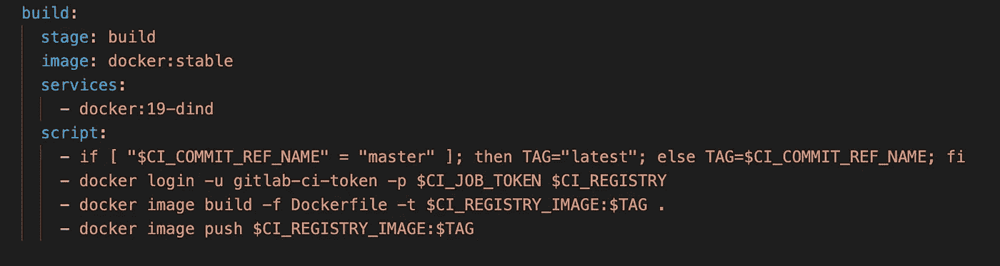
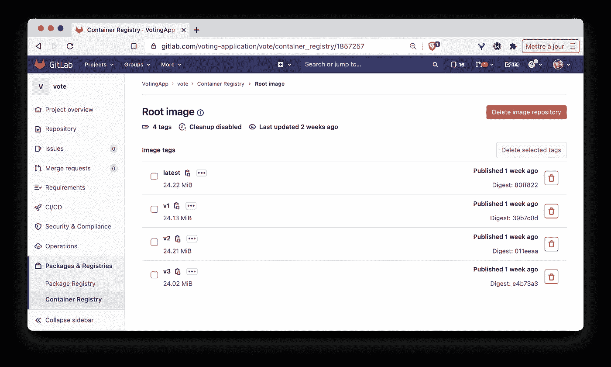
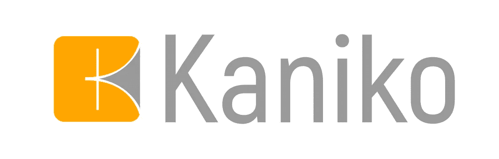
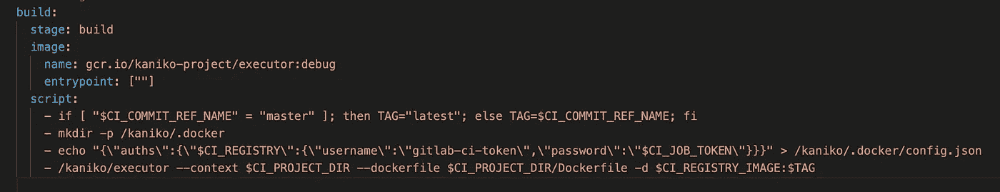
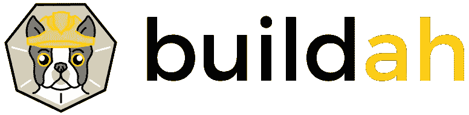
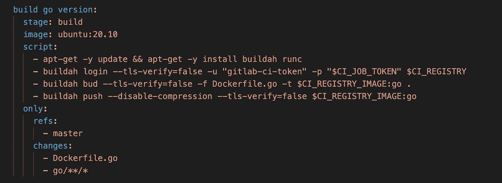
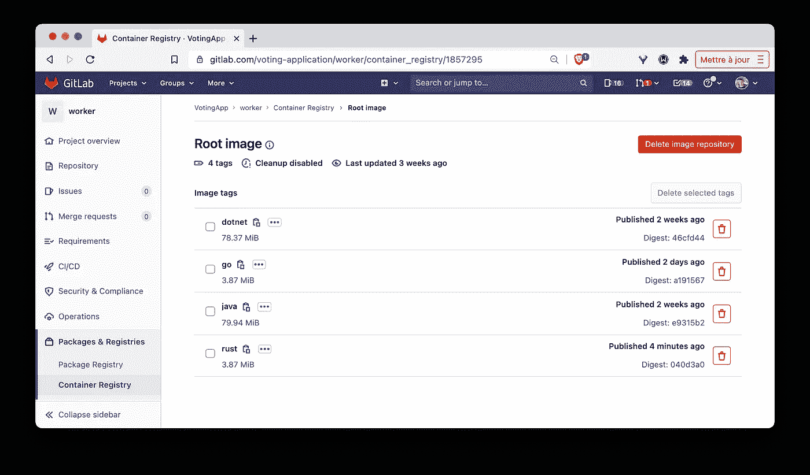

# Docker，Kaniko，Buildah

> 原文：<https://itnext.io/docker-kaniko-buildah-209abdde5f94?source=collection_archive---------1----------------------->

## 构建容器映像的不同方法

照片由[王思然·哈德森](https://unsplash.com/@hudsoncrafted?utm_source=unsplash&utm_medium=referral&utm_content=creditCopyText)在 [Unsplash](https://unsplash.com/s/photos/build?utm_source=unsplash&utm_medium=referral&utm_content=creditCopyText) 上拍摄

2015 年，Docker 和其他一些容器技术领导者创建了 OCI [(开放容器倡议)](https://opencontainers.org/)来定义:

*   图像规范:容器图像必须如何构造
*   运行时规范:容器必须如何根据映像规范运行

命令`docker image build`可能是最著名的创建容器映像的命令。然而，在 Docker 之上，还有其他工具知道如何构建一个映像(如何构建其文件系统并提供相关的元数据),以便它符合映像规范。

在本文中，我们将在 GitLab CI 管道环境中说明其中 3 种工具的用法:

*   [码头工人](https://docker.com)
*   [Kaniko](https://github.com/GoogleContainerTools/kaniko)
*   [Buildah](https://buildah.io/)

通常，我们将在 VotingApp 的上下文中说明这一点，这是一个示例微服务应用程序，我经常使用它来说明各种技术。

ℹ️:如果你不知道 VotingApp，请查看这篇介绍该应用程序、其架构和不同版本的短文。

额外的上下文:

*   VotingApp 的每个微服务都有自己在*中定义的 GitLab CI 管道。gitlab-ci.yaml* 文件(每个存储库中一个)
*   `vote-ui`、`vote`、`result-ui`的管道使用 Docker 构建映像，`result`使用 Kaniko，`worker`使用 Buildah，所以这三种技术在 VotingApp 中有说明
*   当源代码被推入存储库时，CI 被触发，命令在*中指定。gitlab-ci.yaml* 被执行。这将为当前微服务构建一个映像，并将该映像推送到 GitLab 注册表中

现在让我们看一个使用 Docker 从 GitLab CI 管道构建映像的例子。

微服务(以及其他一些服务)使用 Docker 构建一个图像，并将其推送到 GitLab 注册表。下面是*的部分。gitlab-ci.yaml* 定义此步骤:

使用 Docker 构建容器映像

在本例中，容器映像是基于 **docker:19-dind** ，安装了 docker 守护程序的映像在容器内构建的。

ℹ️·丁德代表 Docker 中的 Docker，Docker 中的 Docker running

让我们回顾一下`script`属性中的每个命令(每行一个):

*   第一个命令仅用于根据已经提交的 git 分支的名称来设置 TAG 环境变量:如果`master`那么我们将使用 tag `latest`在任何其他情况下我们将使用分支的名称
*   使用第二个命令是为了让 Docker 守护进程可以登录 GitLab 注册表。在 GitLab CI 作业中，我们可以使用 CI_JOB_TOKEN，这是一个仅在作业期间可用的临时令牌(顺便说一下，这非常方便，因此我们不必提供凭据)
*   第三个命令是一个常规的`docker image build`，它创建一个名为`$CI_REGISTRY_IMAGE:$TAG`的图像。如果我们推动掌握这个名称将因此成为`registry.gitlab.com/voting-application/vote:latest`
*   最后一个命令是常规的`docker image push`，它将之前创建的图像发送到 GitLab 注册表中

如果我们查看一下`vote`微服务的容器注册表，我们可以看到有 4 个图像标签。每一个都是在相应的 git 分支(主分支、v1、v2 和 v3)被推送之后创建的。

投票微服务的容器注册表中的现有图像标签

我猜你们中的许多人已经习惯了这些步骤，并且可能已经通过命令行运行了数百次。现在让我们看看另一个可以构建容器图像的工具: [Kaniko](https://github.com/GoogleContainerTools/kaniko) 。

Kaniko 是一个在容器或 Kubernetes 集群中从 docker 文件构建容器映像的工具。Kaniko 不依赖 Docker 守护进程，完全在用户空间执行 Docker 文件中的每个命令，不需要运行守护进程。

`result`微服务使用 Kaniko 构建映像并将其推送到 GitLab 注册表。下面是*的部分。gitlab-ci.yaml* 定义这一步。

在这个例子中，图像是在一个基于`gcr.io/kaniko-project/executor`(以其`debug`风格)的容器中构建的。

ℹ️一个以`gcr.io`开头的图片存放在[谷歌容器注册表](https://cloud.google.com/container-registry/)中

让我们回顾一下`script`属性中的每个命令:

*   第一个命令用于设置 TAG 环境变量，正如我们在前面的例子中看到的那样
*   第二个命令创建了 */kaniko/。kaniko 稍后将使用的 docker* 文件夹
*   第三个命令创建一个 *config.json* 文件，其中包含 Kaniko 用来连接 GitLab 注册表的凭证。这个 *config.json* 文件位于上一步创建的文件夹中
*   最后一个命令是对 Kaniko executor 的调用，它创建并推送图像

如果我们查看一下`result`微服务的容器注册表，我们可以看到有 4 个图像标签。每一个都是在相应的 git 分支(主分支、v1、v2 和 v3)被推送之后创建的。

结果微服务的容器注册表中的现有图像标签

[Buildah](https://buildah.io/) 是一个基于 Linux 的开源工具，它可以构建开放容器倡议(OCI)容器映像，而无需安装完整的容器运行时或守护程序。可以从 docker 文件或以交互方式构建图像。如果你想知道更多，这篇[伟大的文章](https://developers.redhat.com/blog/2021/01/11/getting-started-with-buildah/)将帮助你开始使用 [Buildah](https://buildah.io/) 。

`worker`微服务使用 Buildah 构建映像并将其推送到 GitLab 注册表。下面是*的部分。gitlab-ci.yaml* 定义这个步骤，在这个例子中我们将只考虑 **Go** 版本，但是这个方法对于其他语言是相同的。

ℹ️`worker`与我们看到的第一批微服务不同。每个版本的 worker 都有一个构建块(意味着每种语言)，以确保如果只修改 Go 源代码，不会重新构建所有映像。可能有另一种(更干净的)方法可以做到这一点:)

在这个例子中，图像是在基于`ubuntu:20.10`的容器中构建的。

让我们回顾一下`script`属性中的每个命令:

*   第一个命令安装 buildah 和 runc
*   使用第二个命令是为了让 Docker 守护进程可以登录 GitLab 注册表，就像我们在第一个例子中看到的那样
*   第三个命令从与 Go 版本相关的 Dockerfile 构建映像( *Dockerfile.go* )。
*   最后一个命令将图像推送到注册表

正如我们所见，本例中使用的命令与第一个使用 DinD 方法的例子中使用的命令非常接近。

如果我们查看一下`worker`微服务的容器注册表，我们可以看到有 4 个图像标签，每个标签对应一个工人的磁偏角。NET，Java，Go，Rust)。

worker 微服务的容器注册表中的现有图像标签

## 关键外卖

在这篇短文中，我们展示了几个工具的用法，这些工具知道如何构建容器映像(因此遵守了 OCI 映像规范)。

从应用程序的角度来看，如果图像是用 Docker、Kaniko 或 Buildah 构建的，它不会改变任何东西，因为图像格式是标准化的。

在下一篇文章中，我们将确保所有图像都为多拱做好准备，这样 VotingApp 也可以在 ARM 设备上运行。