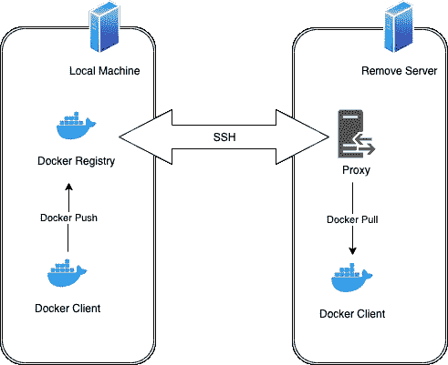

# SSH 上的 Docker

> 原文：<https://itnext.io/docker-over-ssh-51ab25a79f2e?source=collection_archive---------0----------------------->


Abigail Lynn 在 [Unsplash](https://unsplash.com?utm_source=medium&utm_medium=referral) 上拍摄的照片

最近，我的一个副业项目遇到了挑战。我需要将我在一台机器上构建的 docker 容器转移到另一台可以通过 SSH 访问的机器上。我不想把我的容器推到一个公共的 docker 注册中心，或者设置我自己的私有注册中心。

# 使用内置工具

没多久就找到了栈溢出的答案([https://stackoverflow.com/a/26226261/272958](https://stackoverflow.com/a/26226261/272958))

```
docker save <image> | bzip2 | \
     ssh user@host 'bunzip2 | docker load'
```

让我们来分解一下:

1.  `docker save <image>`获取所有图像数据，并将其连同其标签一起序列化为二进制数据流。
2.  `docker load`获取二进制数据流并将其反序列化为带有标签的图像。
3.  `bzip2`压缩流，`bunzip2`解压缩流。
4.  `ssh user@host 'some command'` ssh 进入远程主机并运行指定的命令。

原来`docker load`能够自动解压缩`bzip`的内容，所以您可以将命令简化为:

```
docker save <image> | bzip2 | \
  ssh user@host 'docker load'
```

你可以删除`bzip2`，但是 docker 图像通常很大，而且`bzip2`的压缩节省了大量的带宽。

但是我仍然有一个问题。我是通过一个缓慢的 3G 互联网连接做这些事情的，远程主机已经有了我想要推送的图像中的大多数层，我只需要推送包含我的应用程序逻辑的微小的新层。

# 使用层推动

再研究一下，我发现了 [docker-push-ssh](https://pypi.org/project/docker-push-ssh/) 。使用此命令，您可以:

```
docker-push-ssh user@host <image>
```

它只传输需要的层。为此，它:

1.  在本地机器上建立一个临时的 docker 注册表——这非常容易，因为在 docker 映像中有一个 docker 注册表，名为`registry:2`
2.  对本地注册表执行一个`docker push`操作。这很快，因为它遍布本地机器的网络。
3.  使用 SSH 来代理远程服务器上的端口，以便它连接到本地机器上的代理。
4.  在远程服务器上执行`docker pull`。这个 pull 是在 SSH 隧道上运行的，但是 docker pull 足够聪明，只拉它还没有的层。



SSH 上的 Docker 图

# 我自己的解决方案

这是一个伟大的想法，但我有三个问题:

1.  它是用 Python 写的，需要 Python 2.7，我不想依赖已经安装的 Python 2.7。
2.  它已经有一段时间没有更新了，这通常不是问题，但是考虑到它依赖于旧版本的 Python，这就有点让人担心了。
3.  不清楚它在远程机器上需要的特权级别。我希望能够锁定一些东西，这样做推送的用户除了将指定的 docker 图像推送到远程机器之外不能做任何事情。

为了解决这一切，我决定在 Node.js 中创建一个名为 [docker-over-ssh](https://github.com/ForbesLindesay/docker-over-ssh) 的 CLI。尽管名字如此， [docker-over-ssh](https://github.com/ForbesLindesay/docker-over-ssh) 实际上是完全与传输无关的。它只需要一种通过 stdin 和 stdout 与自身的远程实例进行通信的方法。要使用它，您需要在本地和远程机器上安装`docker-over-ssh`。然后你可以运行:

```
docker-over-ssh push <image> \
  ssh user@host "docker-over-ssh pull <image>"
```

该图看起来与上一个解决方案完全相同。

`docker-over-ssh push`命令启动一个本地 docker 注册表，将映像推送到其中，然后运行“子命令”(在本例中为`ssh user@host "docker-over-ssh pull <image>"`)，并将 tcp 流量从该子命令的 stdio 代理到本地 docker 注册表。

`docker-over-ssh pull <image>`命令启动一个本地 TCP 代理(用几行 node.js 代码编写),并将该代理连接到 stdio，这样它就可以与本地 docker 注册表对话。然后它指向本地注册表运行`docker pull`。只有新的层被转移，这使得一切都非常有效。

用户需要的唯一权限是能够在远程机器上运行`docker-over-ssh pull <image>`，其他什么都不需要。

# 与 CircleCI 一起使用

在这一点上，我有一个工作解决方案，但我想自动化这一点，以便部署可以从 CircleCI 完成。[向 CircleCI](https://circleci.com/docs/2.0/add-ssh-key/) 添加一个 SSH 密钥相当容易。挑战在于如何在复杂的 docker 网络设置中实现这一点:

*   您的本地代码(即终止代理的 node.js 代码)不能与使用`docker run`运行的容器对话。
*   `docker`守护进程(用于运行`docker push`)无法与作为主 CircleCI 作业的服务运行的容器对话。

我找不到任何可行的方法来直接解决这些问题，但是我发现了 [NGROK](https://ngrok.com/) ，它使得创建一个代理本地服务的互联网可访问地址变得非常容易。有了这个，我可以告诉 CircleCI 启动一个 docker 注册表作为我构建的服务，然后使用 [ngrok](https://ngrok.com/) 启动一个临时代理，将其暴露给`docker`守护进程。它甚至支持使用用户名和密码(我会动态自动生成)来保护它，以确保一切都很安全。

最后，我所要做的就是更新 CircleCI 配置:

```
docker:
  - image: circleci/node:12
    environment:
      LOCAL_DOCKER_REGISTRY_PORT: '5000'
  - image: registry:2
```

并将`DOCKER_REGISTRY_NGROK`环境变量设置为我的 API key for ngrok，可以免费获得。

然后我在 [docker-over-ssh](https://github.com/ForbesLindesay/docker-over-ssh) 中添加了一些代码来处理这两个环境变量。

# 结论

我做这一切的原因是试图建立一个 [dokku](http://dokku.viewdocs.io/dokku/) 服务器，我可以在其中运行许多辅助项目，并避免在 heroku 上为很少使用的东西花费大量金钱。我对这个问题的解决方案相当满意，但我现在决定调查 Kubernetes，因为数字海洋有一个托管的 Kubernetes 服务，似乎非常实惠。这将需要我想出运行一个具有某种认证/授权的持久 docker 注册表。如果你对一篇关于我如何做到这一点的文章感兴趣，请记得点击“关注”按钮。