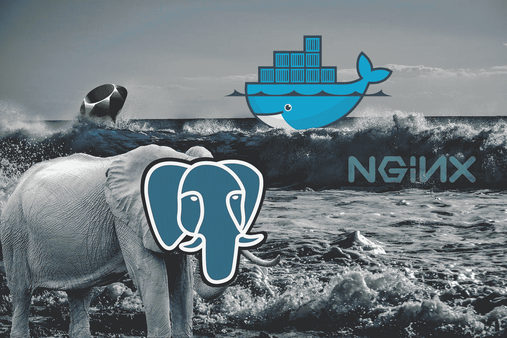

# docker+Rails+Puma+Nginx+Postgres

> 原文：<https://itnext.io/docker-rails-puma-nginx-postgres-999cd8866b18?source=collection_archive---------1----------------------->



如果您正在编写一个 rails 应用程序并使用 docker 来部署您的应用程序。这篇文章是给你的。

在这里，我分享生产就绪的配置文件，这将有助于您加快部署过程。

# 设置

在你的项目根目录下创建一个名为`docker`的文件夹，现在在里面再创建两个目录`app`和`web`。

```
-app_name
  -app
  -db
  -config
    -database.yml
  ...
  -docker
    -app
      -DockerFile
    -web
      -DockerFile
      -nginx.conf
  -docker-compose.yml
```

> 我们创建的文件夹结构只是为了以模块化的方式保存我们的文件，你可以把它保存在任何你想要的地方。

# 将你的 Rails 应用归档

将 rails app 的 *DockerFile* 放入`app`文件夹中。

```
FROM ruby:2.3.1RUN apt-get update -qq && apt-get install -y build-essential libpq-dev nodejs # Set an environment variable where the Rails app is installed to inside of Docker imageENV RAILS_ROOT /var/www/app_name
RUN mkdir -p $RAILS_ROOT # Set working directory
WORKDIR $RAILS_ROOT# Setting env up
ENV RAILS_ENV='production'
ENV RACK_ENV='production' # Adding gems
COPY Gemfile Gemfile
COPY Gemfile.lock Gemfile.lockRUN bundle install --jobs 20 --retry 5 --without development test # Adding project files
COPY . .
RUN bundle exec rake assets:precompileEXPOSE 3000CMD ["bundle", "exec", "puma", "-C", "config/puma.rb"]
```

这些配置将安装基本的系统需求，将您的项目复制到 docker 容器，安装 gems，预编译您的资产。

# 代理您的 web 请求

我们需要一个[反向代理](https://en.wikipedia.org/wiki/Reverse_proxy)，在我们的例子中是 Nginx web 服务器，来代理对 Puma 的请求

## Nginx 的 DockerFile

将 Nginx 的 *DockerFile* 放入`web`文件夹

```
# Base image
FROM nginx# Install dependencies
RUN apt-get update -qq && apt-get -y install apache2-utils# establish where Nginx should look for files
ENV RAILS_ROOT /var/www/app_name# Set our working directory inside the image
WORKDIR $RAILS_ROOT# create log directory
RUN mkdir log# copy over static assets
COPY public public/# Copy Nginx config template
COPY docker/web/nginx.conf /tmp/docker.nginx# substitute variable references in the Nginx config template for real values from the environment 
# put the final config in its placeRUN envsubst '$RAILS_ROOT' < /tmp/docker.nginx > /etc/nginx/conf.d/default.confEXPOSE 80# Use the "exec" form of CMD so Nginx shuts down gracefully on SIGTERM (i.e. `docker stop`)
CMD [ "nginx", "-g", "daemon off;" ]
```

## Nginx 配置文件

将 *nginx.conf* 放到`web`文件夹中

```
upstream rails_app {  
   server app:3000;
} server {  
   # define your domain  
   server_name www.example.com;      # define the public application root  
   root   $RAILS_ROOT/public;  
   index  index.html; # define where Nginx should write its logs  
   access_log $RAILS_ROOT/log/nginx.access.log;  
   error_log $RAILS_ROOT/log/nginx.error.log;   

   # deny requests for files that should never be accessed  
   location ~ /\. {    
      deny all;  
   } location ~* ^.+\.(rb|log)$ {    
      deny all;  
   }  

   # serve static (compiled) assets directly if they exist (for rails production)  
   location ~ ^/(assets|images|javascripts|stylesheets|swfs|system)/   {    
      try_files $uri @rails;     
      access_log off;    
      gzip_static on;      # to serve pre-gzipped version     
      expires max;    
      add_header Cache-Control public;     

      add_header Last-Modified "";    
      add_header ETag "";    
      break;  
   } 

   # send non-static file requests to the app server  
   location / {    
      try_files $uri @rails;  
   }      location @rails {    
      proxy_set_header  X-Real-IP  $remote_addr;    
      proxy_set_header  X-Forwarded-For $proxy_add_x_forwarded_for;               proxy_set_header Host $http_host;    
      proxy_redirect off;    
      proxy_pass http://rails_app;  
   }
}
```

# 介绍 Docker 编写器

因为我们的应用程序将跨多个容器运行，所以最好将它们作为一个容器来控制。这就是 Docker Compose 为我们做的事情。要使用 Docker Compose 启动我们的应用程序，请在 Rails 应用程序的根目录下创建一个文件 *docker-compose.yml* 。

```
version: '3'volumes:  
  postgres_data: {} services:  
  app:    
    build:      
      context: .      
      dockerfile: ./docker/app/DockerFile    
    depends_on:      
      - db    db:    
    image: postgres    
    volumes:      
      - postgres_data:/var/lib/postgresql/data    web:    
    build:      
      context: .      
      dockerfile: ./docker/web/DockerFile    
    depends_on:      
      - app    
    ports:      
      - 80:80
```

# 将您的数据库容器化

我们用来运行 Postgres 数据库的名为“db”的引用 docker 容器。你需要更新你的*数据库*

```
default: &default  
  adapter: postgresql  
  encoding: unicode  
  username: postgres  
  password:  
  pool: 5  
  host: db production:  
  <<: *default  
  database: app_name_production
```

此时，您应该能够使用`docker-compose build`构建所有容器

一旦构建完成，你可以用`docker-compose run app rake db:create RAILS_ENV=production`初始化你的数据库，然后用`docker-compose run app rake db:migrate db:seed RAILS_ENV=production`填充它。

> 如果您希望您的容器每次都运行相同的可执行文件，那么您应该考虑将 entrypoint 与 [CMD](https://docs.docker.com/engine/reference/builder/#/cmd) 结合使用。参见[入口点](https://docs.docker.com/glossary/?term=ENTRYPOINT)

现在我们终于可以用`docker-compose up -d`运行应用程序了。

要验证所有三个容器都启动并运行，请执行`docker ps`

# 结论

通过正确的 Docker 设置，软件部署过程可以比以往任何时候都更快。此外，无论应用程序在哪里运行，您都可以确保一致的环境。

查看 [Github 要点](https://gist.github.com/satendra02/1b335b06bfc5921df486f26bd98e0e89)

# 重要说明

如果你有任何关于实现的问题，不要忘记检查下面的评论，也许我已经回答了你的问题。

> 此外，对于 Ruby & Rails 的更新版本，请查看[这篇文章](https://scotto.medium.com/2021-docker-ruby-3-rails-6-puma-nginx-postgres-d84c95f68637)作者[**joo Scotto**](https://scotto.medium.com/)

(通过提供帮助其他人找到我在 Medium 上的文章👏🏽下面。)