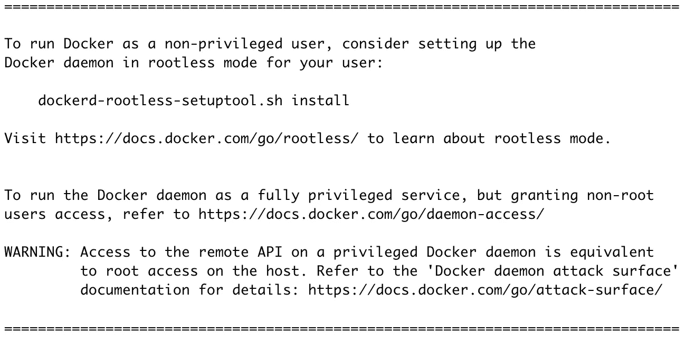
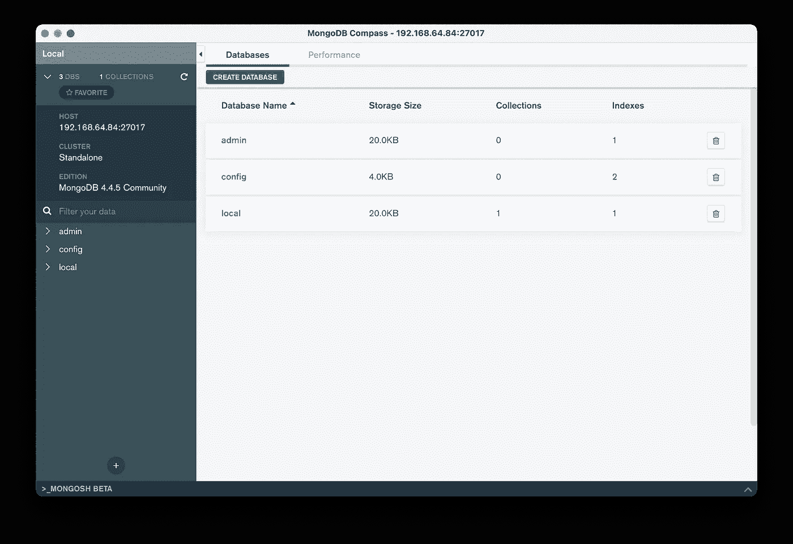

# Docker 以无根模式运行

> 原文：<https://itnext.io/docker-running-in-rootless-mode-bdbcfc728b3a?source=collection_archive---------1----------------------->

## 运行具有额外安全层的容器


照片由[迈克尔·泽兹奇](https://unsplash.com/@lazycreekimages?utm_source=unsplash&utm_medium=referral&utm_content=creditCopyText)在 [Unsplash](https://unsplash.com/s/photos/secure?utm_source=unsplash&utm_medium=referral&utm_content=creditCopyText) 上拍摄

当我提供 Docker 培训时，我通常会给每个参与者提供一个 Ubuntu VM，并要求他们使用以下命令安装 Docker:

```
$ curl -sSL [https://get.docker.com](https://get.docker.com) | sh
```

在 Docker 20.10 中，该命令的输出略有变化，因为它现在提供了如何在无根模式下运行 Docker 的信息，这意味着让 Docker 守护程序与当前用户而不是根用户一起运行。在本文中，我们将看到如何做到这一点，以及这意味着什么。

## 运行无根 Docker 守护程序

使用 [Multipass](https://multipass.run) 我们创建一个名为`docker`的 Ubuntu 虚拟机，并在其中获得一个 shell:

```
$ multipass launch -n docker$ multipass shell docker
```

接下来，我们从这个 shell 安装 Docker:

```
ubuntu@docker:~$ curl -sSL [https://get.docker.com](https://get.docker.com) | sh
```

这个命令安装 Docker 守护进程，并使用`root`用户启动它。正如我们从输出中看到的，我们还有一条有趣的消息，解释了如何在无根模式下运行 Docker 守护进程:



Docker 守护程序现在可以很容易地在无根模式下安装

默认情况下，Docker 守护程序以 root 用户身份运行，因此访问该守护程序可能会带来许多安全隐患。无根模式的想法是与另一个用户一起运行 Docker 守护程序，这样在容器受损或坏人获得守护程序 API 的情况下，权限升级会变得更加困难。

让我们运行上面输出中指定的命令:

```
**$ dockerd-rootless-setuptool.sh install**
```

注意:由于涉及到用户名称空间，需要首先安装一些依赖项(如果不存在，您将得到一条错误消息)，这可以通过以下命令来完成:

```
sudo sh -eux <<EOF
# Install newuidmap & newgidmap binaries
apt-get install -y uidmap
EOF
```

在无根模式下启动 docker 守护进程后，我们需要设置以下环境变量，以便 Docker 客户端与守护进程的这个新实例进行通信:

```
export PATH=/usr/bin:$PATH
export DOCKER_HOST=unix:///run/user/1000/docker.sock
```

注意:DOCKER_HOST past (1000)中引用的 id 是当前用户的`uid`，如以下命令所示:

```
**$ id**
**uid=1000(ubuntu)** gid=1000(ubuntu) groups=1000(ubuntu),4(adm),20(dialout),24(cdrom),25(floppy),27(sudo),29(audio),30(dip),44(video),46(plugdev),117(netdev),118(lxd)
```

在接下来的部分中，我们将通过几个容器来说明无根模式的一些局限性。

ℹ️一个无根守护进程也可以使用下面的命令直接安装`curl -sSL [https://get.docker.com/rootless](https://get.docker.com/rootless) | sh`

## 启动样本容器

现在让我们运行几个容器，看看在无根守护进程的上下文中可能遇到的问题。

*   **幽灵集装箱**

让我们试着运行第一个基于 [ghost](https://hub.docker.com/_/ghost) 镜像的容器(ghost 是一个免费的开源博客平台):

```
$ docker run -p 2368:2368 -d ghost
```

容器运行良好，可以使用多路虚拟机的 IP 在端口 2368(默认 Ghost 端口)上访问 Ghost 接口:


*   **MongoDB 容器**

现在让我们运行一个基于 [mongo](https://hub.docker.com/_/mongo) 映像的容器:

```
$ docker run -d -p 27017:27017 mongo:4.4
```

从 [MongoDB Compass](https://www.mongodb.com/products/compass) 客户端，我们可以通过 Multipass VM 的 IP 访问端口 27017(默认的 Mongo 端口)上的数据库。那时一切都很好。



*   **Nginx 容器暴露在端口 80 上**

由于守护进程没有使用`root`运行，所以有一些明显的限制。例如，不允许在特权端口(端口< 1024)上公开容器，正如我们在 nginx 容器中看到的:

```
**$ docker run -p 80:80 -d nginx:1.18-alpine** ...
cannot expose privileged port 80, you can add 'net.ipv4.ip_unprivileged_port_start=80' to /etc/sysctl.conf (currently 1024), or set CAP_NET_BIND_SERVICE on rootlesskit binary, or choose a larger port number (>= 1024): listen tcp4 0.0.0.0:80: bind: permission denied.
```

*   **使用捆绑架的阿尔卑斯集装箱**

现在让我们尝试运行一个基于 [alpine 映像](https://hub.docker.com/_/alpine)的容器，并将主机的根文件夹绑定到容器文件系统中。这可以用下面的命令来完成；

```
$ docker run -ti -v /:/host alpine
```

默认情况下，我们在容器中得到一个`sh`shell(alpine 中的默认 shell)。在 shell 中检查我们的身份，我们可以看到我们是 root。

```
/ # whoami
root
```

现在，让我们从这个 shell 中删除主机的`sh`可执行文件:

```
/ # rm /host/usr/bin/sh
rm: can't remove '/host/usr/bin/sh': Permission denied
```

不允许我们执行此操作，因为我们是容器内的 root 用户，但不是主机上的 root 用户。容器内的 Root 被映射到主机上的非 root 用户。

*   **另一个阿尔卑斯集装箱**

我们现在将运行一个新的容器，并在容器内部和主机上直接看到与流程相关联的用户:

```
ubuntu@docker:~$ docker run --name sleep -d alpine sleep 3600
```

如果我们从容器内部检查该进程，我们可以看到 sleep 命令是以 root 用户身份运行的

```
**ubuntu@docker:~$ docker exec sleep ps aux** PID   USER     TIME  COMMAND
    1 root      0:00 sleep 3600
...
```

但是如果我们检查主机上的睡眠进程，我们可以看到它属于`ubuntu`用户。

```
**ubuntu@docker:~$ ps aux | grep sleep** ubuntu  4642  0.0  0.0 1576     4 ?    Ss   10:45   0:00 sleep 3600
```

从这个例子中我们可以了解到，如果容器中以 root 用户身份运行的进程受到威胁，那么最多只能升级到运行 Docker 守护进程的用户，而不能升级到主机的 root 用户。

> 在无根模式下，容器内的根不是主机上的根

*   **内存限制**

让我们运行一个容器，它的唯一目的是使用 RAM 填充数组。

```
**$ docker container run --memory 32m estesp/hogit** WARNING: Your kernel does not support swap limit capabilities or the cgroup is not mounted. Memory limited without swap.
...
Populating row 0 of 500000 sized array of uint64 values
Waiting 3 seconds before next row creation
...
Populating row 9 of 500000 sized array of uint64 values
Waiting 3 seconds before next row creation
```

这个容器创建了这个大数组的 10 行，正如它应该做的那样，并且没有因为它的内存消耗而被终止。

```
ubuntu@docker:~$ docker inspect hog -f '{{ .State.OOMKilled }}'
false
```

🔥在一个非无根守护进程中，这个容器在创建几行后就会被终止(OOM)。

因此在运行容器时没有考虑到`--memory`标志。我们本可以通过仔细查看我们得到的警告来提前发现这一点:

```
WARNING: Your kernel does not support swap limit capabilities or the cgroup is not mounted. Memory limited without swap.
```

这可以解释为 Docker 无根模式不支持 Cgroup v1。以下命令显示当前使用了 Cgroup v1，而在这个无根上下文中应该使用 Cgroup v2。

```
**ubuntu@docker:~$ docker info | grep -i cgroup
** Cgroup Driver: none
 Cgroup Version: 1
WARNING: Running in rootless-mode without cgroups. To enable cgroups in rootless-mode, you need to boot the system in cgroup v2 mode.
```

如果使用 Cgroup v1，ℹ️其他 Cgroup 的相关标志如`--cpus`也不起作用。

## 摘要

Docker 经常被安全人员指出，因为守护程序是以 root 用户身份运行的。在这种情况下，以无根模式运行 Docker 守护进程无疑是一个伟大的举措👍

我们在本文中只看到了一些限制，但还有其他限制，如受支持的存储驱动程序列表。当然，这肯定会在不久的将来发展，以克服许多现有的限制。