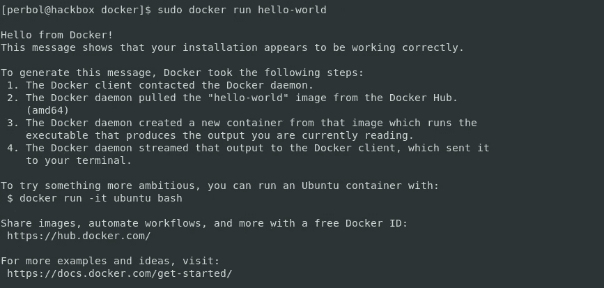
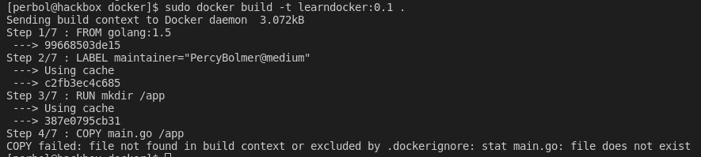
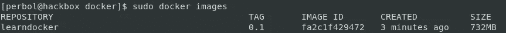
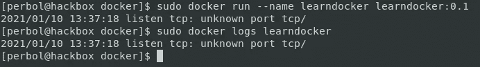
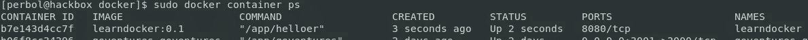
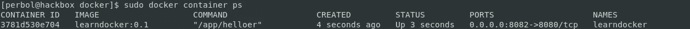
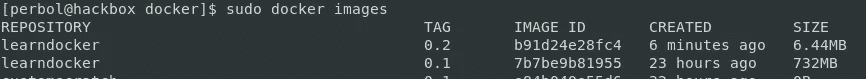
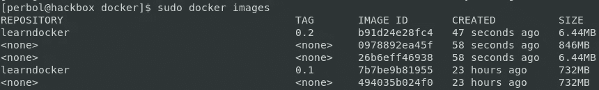
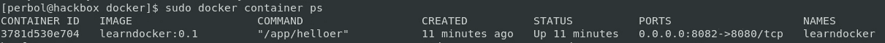
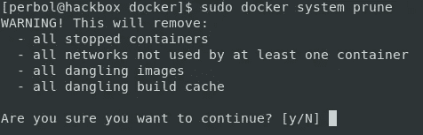

# Docker 基础解释

> 原文：<https://itnext.io/docker-skyrocketed-my-teams-productivity-e19cd89a23ea?source=collection_archive---------3----------------------->

## 记录这个，记录那个，记录一切。


Guillaume Bolduc 在 [Unsplash](https://unsplash.com/s/photos/container?utm_source=unsplash&utm_medium=referral&utm_content=creditCopyText) 上拍摄的照片

大约两年前，我开始听到越来越多关于 Docker 的消息。最终，我听到了太多关于 Docker 的讨论，以至于我不得不更深入地研究它，了解 fuzz 是关于什么的。

我唯一的遗憾是没有早点学会。它对我的日常工作帮助很大，我真的相信 Docker 是每个开发人员都应该学习的东西。

我们先来谈谈 Docker 是什么，它是用来做什么的，以及如何使用它。我们还将构建自己的图像来演示用法。我们还将尝试在 docker-compose 中使用我们自己的图像。希望它能说服一些人开始使用 Docker。

## Docker 是什么？

Docker 用于创建**容器化软件**。这意味着我们可以创建一套标准化的软件，可以在任何有 docker-engine 的地方部署和运行。这样做的结果是，如果有人经历了在 docker 映像中安装我们想要的软件的麻烦，我们就不必重做了。

这是我能想到的解释 docker 的最简单的方法，docker 是安装在容器中的一套预装软件。这就是你开始体验和学习 docker 所需要知道的一切。

如果你对 docker 是什么以及其内部运作的更深入的知识感兴趣，最好在 docker 网站上阅读。

下面说一些 Docker 世界需要理解的词汇。

## 图像

图像是容器应该包含的文件的预设设置。有人制作了一个包含预装软件的映像。它可以在 CentOS 图像或任何东西上安装 Elasticsearch。然后这个软件被构建成一个映像，可以部署给任何想要安装 Elasticsearch 的人。

> Docker 容器映像是一个轻量级的、独立的、可执行的软件包，包括运行应用程序所需的一切:代码、运行时、系统工具、系统库和设置。

有两种[图像](https://docs.docker.com/develop/develop-images/baseimages/)

*   **基础图像**—docker 提供的保留的最小图像。通过使用“从头开始”来定义基础映像。当我们说最小的时候，它确实是最小的。如果你在 scratch 的基础上创建了一个新的映像，并且没有添加任何东西，那么它就是 0B。
*   **父映像** —当我们使用另一个已经创建的映像作为新映像的基础时。


显示基本图像的图片，大小为 0 B。

使用 **docker build** 命令构建图像。图像被赋予名称和标签。这个名称就是图像的名称，比如 postgresql。标签是由分号附加的版本或其他信息。
构建图像的示例如下

```
sudo docker build -t customImage:0.1 .
```

我们看到的是正在运行的命令 docker build，-t 标志指定了标签。在我们的例子中，它是一个名为 customImage 的映像，版本为 0.1。

## 容器

容器是当用户启动一个图像时，这个容器上的文件是基于所使用的图像的。

> 容器图像在运行时成为容器

使用 **docker run** 命令创建容器。因此，要将我们的 customImage:0.1 转换成一个容器，我们应该这样运行它。

```
sudo docker run customImage
```

## 码头枢纽

[Docker hub](https://hub.docker.com/search?q=&type=image) 是 Docker 图片的储存库。在这里，我们会发现其他人创造的图像，随时可供我们使用。

**想想 Docker 的 GitHub。**

当你需要一个新软件的时候，这是一个很好的地方。有大量的可用，而且都是免费的！

想象一下我有多惊讶，Postgres 是最受欢迎的形象。说真的，你试过装吗？我大概做了 20-30 次，总是有问题。但不再是了，我现在有了漂亮的码头工人。

# 为什么是 docker？

我最喜欢用现实生活中的场景来解释这一点。在我开始在我所有的项目中使用 Docker 之前，我花了很多时间安装和配置不同的软件。当时我从事许多小项目，根据项目的不同，我必须安装所有需要的软件。或者如果另一个项目已经在使用我需要重新配置的软件。

## 时间消耗

所以有一周我在做一个使用 Elasticsearch 的项目，第二周我需要 PostgreSQL，第三周是 Redis。这种情况一直持续，最糟糕的是，每次我有一个新项目，我都必须重新配置。一个项目需要 PostgreSQL 以这种或那种方式配置。我花了很多时间管理每个项目的设置。这不是没有意义的，我的 bash 和 makefile 技能大幅提高，但仍然消耗了很多时间。让我们不要谈论我的开发服务器上的环境变量和端口管理。

Docker **以一种超级简单、易于管理、令人敬畏的方式**解决了所有这些问题。我不记得上次我必须安装一个软件是什么时候了。我已经竭尽全力了。

需要 PostgreSQL，太好了，给你。
还需要什么吗，太好了，有人可能也打败了你，并在 Dockerhub 上传了一张图片。

在项目之间切换时，我不需要管理多个 PostgreSQL 或任何软件实例的配置，一切都在我的 docker 文件中。并且它们不会冲突，因为它们都运行在它们的容器环境中。

## 测试

我喜欢单元测试。它们非常适合测试低级函数和精确的代码行。

但我也喜欢在真实的环境中测试，它能让我平静下来。我可能知道这个特定的 SQL 查询在到达数据库时会工作，但是我喜欢在“真实环境”中测试我的应用程序。

这也更容易，我知道我们可以在测试中模拟我们的数据库。但是运行一个真正的数据库并对其执行真正的查询要容易得多。如果我没有使用 Docker，我不会推荐这样做。在 Docker 之前，我建议使用 mock，但是现在运行一个测试数据库是如此简单，没有理由不这样做。(我已经准备好面对仇恨邮件和死亡威胁)

Docker 允许我们轻松快捷地复制我们的应用程序将要生活的真实环境。稍后我将详细讨论这一点。

## 部署

这可能会耗费时间，但值得多写一章。

在我对 docker 狂热之前，我通常在我的项目中存储一个供应商目录。该目录包含所有需要的依赖项、正确版本的驱动程序和库。我就是这样发现解决很多部署问题的。但这并不总是有帮助，一些客户希望软件在 Windows 上运行，一些在 Linux 上运行，另一个在 mac 上运行。因此，我们要么通过在供应商内部添加更多依赖项来支持这一点，要么在复杂的 [CI/CD 管道](https://semaphoreci.com/blog/cicd-pipeline)中创建交叉构建。现在你仍然应该运行 CI/CD，但是它们变得容易多了，至少在我看来是这样的。

为什么这么问？正如前面提到的，只要有 docker 引擎，docker 映像可以在任何计算机上运行。而且它们对许多操作系统都是可用的。

这方面的一个例子是我的工作流，我使用 centOS，我倾向于用它作为我的 docker 图像的基础。

所以我们在基于 centOS 的 docker 映像上构建我们的应用程序。这个映像可以通过 docker[发布到 windows 电脑](https://www.docker.com/blog/preview-linux-containers-on-windows/)上并启动，它就可以工作了。它将会工作，因为我们的映像包含所有需要的软件。

## 可量测性

容器不仅易于部署，而且非常轻量级，易于扩展。说真的，我见过大小为 50-100 MB 的 docker 图像，用于完全运行的应用程序。

有很好的工具可以让我们扩展应用程序。

有 [docker-swarm](https://docs.docker.com/engine/swarm/swarm-tutorial/scale-service/) ，还有 [Kubernetes](https://kubernetes.io) 。还有很多，但我提到这两个是因为我已经对它们进行了实战测试，对结果很满意。

## 了不起

我说过 Docker 很棒吗？

# 如何对接？

所以现在我们知道了开始使用 docker 所需要的一切。首先，你需要[安装 docker](https://docs.docker.com/engine/install/) 。在该链接中找到您当前的操作系统，并按照说明进行操作。我将在我的例子中使用 CentOS。

```
sudo yum install -y yum-utils
sudo yum-config-manager \ --add-repo \ [https://download.docker.com/linux/centos/](https://download.docker.com/linux/centos/)
sudo yum install docker-ce docker-ce-clisudo systemctl start dockersudo systemctl enable docker
```

通过运行以下命令，确保您的安装工作正常。

```
sudo docker run hello-world
```



Hello-world docker 的输出

## 了解 Dockerfile

Dockerfile 是一个纯文本文件，它给出了在构建图像时我们的图像应该做什么的说明。关于这一点有很多要学的，但是在这篇文章中我将只回顾其中的要点。

docker 中的图像是分层构建的。构建期间运行的每个命令都会添加一个额外的层。所以我们的图像实际上只是一系列的图层。Dockerfile 文件定义了这些层。

Dockerfile 使用它所在的路径作为所谓的**上下文**。上下文是 Dockerfile 的位置中的所有文件或目录。如果有您不希望 docker 文件包含在上下文中的文件或目录，您可以创建一个名为**的文件。dockerignore** (有点像 gitignore)。**。dockerignore** 是一个文本文件，每行包含一个文件名或一个要避免的文件模式的正则表达式。

Docker 实际上[警告用户](https://docs.docker.com/engine/reference/builder/#:~:text=A%20Dockerfile%20is%20a%20text,command%2Dline%20instructions%20in%20succession.)不要将 docker 文件存储在你的主机的根目录中，因为整个硬盘驱动器都将包含在上下文中。这并不意味着整个硬盘将被插入到构建的映像中，只是插入到构建上下文中，使得所有文件在构建期间都可用。

所有 docker 文件都基于来自语句的**开始构建它们的映像。FROM 定义了使用什么样的图像作为基础，这意味着在 FROM 之后运行的任何命令都会给我们的图像添加层。**

让我们回顾一下 docker 文件中一些最常见的命令。完整的清单可在码头工人网站上找到。

*   **运行** —运行用于根据镜像所基于的操作系统执行命令。对于 Linux 它是 Bash，对于 windows 它是 cmd。
*   **ENV** —用于在容器内部分配环境变量。
*   **标签** —用于向容器添加元数据。来自父图像的标签被继承。
*   **复制** —将文件从主机复制到容器。只能从主机复制文件。
*   **添加**——非常类似于 COPY，它也将文件复制到我们的容器中。不同之处在于，ADD 还可以通过 URL 使用远程文件。它还可以将本地焦油提取到容器中。
*   **ARG** —构建映像的人可以在构建时设置的变量。在构建过程中，可以在 docker 文件中使用 ARGS，但是在构建映像之后，除非重新构建映像，否则不能使用或更改它们。
*   **卷** —在主机和容器之间添加一个挂载点。语法是卷路径。这通常在容器重启之间持久化数据时使用，例如数据库。实际数据存储在主机上，但在容器中使用。
*   **EXPOSE** —告诉 Docker 引擎容器正在监听特定的端口和协议。格式是端口协议(udp/tcp)
*   **CMD** —定义 Docker 容器在启动时应该运行的命令和参数。这通常指向带有一组缺省值的二进制文件。当允许用户更改命令时，应该使用 CMD。
*   入口点——通常在容器应该作为可执行文件运行时使用。它的功能与 CMD 相同，但是如果使用 ENTRYPOINT，用户不允许更改该命令。
*   **WORKDIR** —设置命令运行的路径。所以如果设置为/app，就像运行 cd /app 一样。

## 建立我们的第一个形象

让我们从建立我们的第一个图像开始。

首先创建一个新文件夹和一个名为 **Dockerfile** 的文件。如果没有指定，Docker 将在当前目录中搜索名为 Dockerfile 的文件。

```
mkdir docker
touch Dockerfile
```

现在你需要决定你的起点是什么。我说的起点是指我们将使用什么样的形象作为新形象的基础。基地的一切都将被复制到我们的图像中。如果我们想真正拥有完全的控制权，我们也可以从头开始。我不建议从一个基础图像开始，而是使用一个叫做多重构建的东西，我将在最后展示。我不推荐它的原因是 scratch 没有任何可用的东西，甚至没有 bash。如果您的整个应用程序都是一个二进制文件，这没问题。

在这个例子中，我们将构建一个超级简单的应用程序，当我们访问一个 URL 时，它将打印 hello-world。我们想把重点放在 docker 的功能上，而不是我们将要构建的令人惊叹的应用程序。
我们将基于我们的图像 **golang:1.5，**这是一个包含编程语言 golang 的图像，当我们访问某个 URL 时，我们将使用它来打印 hello world。

我们可以检查 golang:1.5 与 docker **检查**也看看是什么形象。Inspect 将打印关于图像的信息。打印出来的信息很多，所以阅读起来需要一些理解。阅读信息我们可以看到，该映像是一个 Linux OS，他们设置了一些环境变量，并将一个 Golang 二进制文件放入/usr/local/bin。

```
sudo docker inspect golang:1.5
```

在任何文本编辑器中打开 docker 文件，让我们开始构建一些东西。
我们将使用**标签**来添加关于维护者是谁的元数据。
接下来，我们需要用 **RUN** 创建一个文件夹，我们将在其中存储我们的应用程序，用 **COPY 将所需文件从我们的主机复制到容器中。**用 **WORKDIR** 移动到那个目录，用 **RUN、**编译我们的应用程序，最后我们需要用 **CMD** 执行我们的应用程序。

我的 docker 文件看起来像这样

我当前的 docker 文件，我们继续构建 Golang 图像，并在其中添加我们的应用程序。

让我们运行 **docker build，**来构建图像，我将把我的图像命名为 learndocker:0.1。

```
sudo docker build -t learndocker:0.1 .
```



一个例子，我们可以看到层的图像被附加

成功了吗？**当然不是**，我们正试图将一个名为 main.go 的文件从我们的主机复制到我们的目录中。那个文件不存在，所以创建一个并将下面的要点复制到其中。要点是一个用 Go 编写的超级瘦 Hello world HTTP 服务器。如果你没有安装 Go，不要担心，你的 Docker 镜像会安装。

从 Docker 打印 Hello 的瘦 HTTP 服务器

让我们重新运行 build 命令，看看会发生什么，我也将使用 images 命令打印我们所有的当前图像。

```
sudo docker build -t learndocker:0.1 .
sudo docker images
```



我们可以看到，我们的映像已创建，大小为 732 MB

太好了，我们开始吧。我将在构建时使用**名称**标志。我喜欢能够通过名字而不是 ID 来删除我的容器。现在我们不需要删除任何容器，因为我们将使用 **rm** 标志。rm 标志使容器在退出时自我删除。

```
sudo docker run --rm --name learndocker learndocker:0.1# If you dont run --rm, make sure to delete the container after exit
sudo docker rm -f learndocker
```



容器的输出

您会看到容器将一个错误输出到控制台。我们看到这一点是因为我们运行了连接到我们终端的容器。如果您添加了 **-d** 标志，容器将在后台运行。这很常见，我们会错过容器的输出。这就是为什么我还要运行 **docker 日志**来检查错误。Docker 日志是一种查看容器输出到 stdout 的内容的方式。我通常设置一个 **Filebeat** 来读取我的 docker 日志，并将它们输出到一个 **Elasticsearch 中。**

因此，让我们修复错误。为此，我们需要了解**环境变量。**在 Go 代码中，我们使用环境变量 **PORT** 来确定托管 HTTP 服务器的端口。因为 Docker 容器没有那个设置，所以它不会工作。所以我们需要使用 **ENV** 命令来添加它。

我们可以通过设置 **-e** 标志将它添加到我们的运行命令中。

```
sudo docker run --name dockerlearn -e PORT=8080 dockerlearn:0.1
```

这不是很用户友好，因为它要求我们的用户知道这一点，所以让我们改为添加一个默认的 docker 文件。这样，只有当我们需要定制它时，我们才需要配置它。

让我们将 **ENV** 命令和 **ARG** 命令添加到 Dockerfile 文件中。我们将允许图像的维护者在构建应用程序时设置默认端口，但也允许用户用环境变量覆盖默认端口。 **ARG** 用于提供构建变量， **ENV** 用于运行时变量。

在这个 docker 文件中，我们为主机端口设置了一个默认值

现在重建映像并再次运行它。您应该不会再看到错误。您可以通过添加 **build-arg** 标志来更改默认端口

```
sudo docker build -t learndocker:0.1 --build-arg port=8080 .
```

尝试在浏览器中访问 [localhost:8080](http://localhost:8080) 。如果您更改了端口，请记住在 URL 中更改端口。

Auch，没起作用？

这是因为 HTTP 服务器只为拥有本地主机的容器服务。一开始使用 Docker 可能会令人困惑，但是我发现总是把容器想象成另一台服务器/计算机是有帮助的。这在技术上是不正确的，但它有助于理解为什么事情不工作。


看到港口了吗？没有向我们的主机开放的端口

我们需要**将我们将要托管的端口**映射到我们主机上的一个端口，以便能够访问它。如果你在 Dockerfile 章节的时候注意了，你可能会想跑去 Dockerfile 并添加一个 **EXPOSE 8080** 。我们将这样做，除了我们将公开环境变量集。

这是我们的新 docker 文件，我们在其中公开了端口。

重新构建应用程序并启动它。

```
sudo docker build -t learndocker:0.1 --build-arg port=8080 .
sudo docker run --rm --name learndocker -e PORT=8080 -d learndocker:0.1
```

还是不行？这是因为 EXPOSE 命令实际上只用于为 docker 引擎记录容器正在监听的端口。要访问公开的端口，我们需要在运行容器时映射它。**在运行容器时使用 **-p** 标志将主机端口绑定到容器**。没有必要重建图像，我们没有改变任何东西。仅将运行命令修改为以下内容。p 命令接受 HOSTPORT:CONTAINERPORT 并绑定它们。

```
sudo docker run --rm --name learndocker -p 8082:8080 -e PORT=8080 -d learndocker:0.1
```



我们可以看到端口 8080/tcp 是公开的，但只是针对容器本身。



添加-p 标志后，我们可以看到它实际上映射了我的主机 8082 ->8080

**这次不耍花招**，访问 [localhost:8082](http://localhost:8082) 就可以了。

## 通过多重构建优化我们的形象

所以 Docker 的一个非常酷的特性来了。我们可以使用多阶段构建来优化和最小化我们的映像。这个想法是，您使用一个父映像，执行一些操作，然后您可以使用您的新映像，并从它复制任何需要的东西到另一个映像。

这听起来很复杂，但却出奇的简单。

我们在这里要做的是使用 Golang 映像来构建我们的二进制 HTTP 服务器，然后将该二进制文件复制到 Docker 基本映像中。这个图像很大，叫做 Scratch。

以下要点显示了我们更新的 docker 文件。我会在要点的评论中解释所有新行的情况。

多阶段构建示例

让我们建立我们的新形象，并审查它。我已经将更新后的 Docker 配置放到了一个新的 Docker 文件中，以进行分隔，这次我还将更新版本标签。

```
sudo docker build -t learndocker:0.2 --build-arg port=8080 --file MultiBuildDocker.docker .
sudo docker images
```



你可以看到使用或不使用多重构建的大小差异。

你现在有了一个巨大的容器，大小为**6.44 MB。**信不信由你，有一些技巧可以让它变得更小，但它们与 Golang 非常相关。我们可以改变编译器，删除不必要的依赖，如 CGO，但我们不会在这里讨论。您可以尝试运行新的 learndocker:0.2 映像。不过这次你要靠自己了，应该很简单。

## 清理未使用的图像

如果你一直按照我现在所做的去做，我们将会有一些未使用的图片占据不必要的空间。

```
sudo docker images
```



图像结果，当我们覆盖它们时，图像被设置为名称<none>和标签<none>。</none></none>

如您所见，运行 images 命令会显示在主机上构建或下载的所有映像。我们可以看到名为 **<无>的图像。**如果您使用与现有图像相同的名称和标签重建图像，就会发生这种情况。

让我们确保没有容器在运行，然后删除未使用的图像。

```
sudo docker container ps
```



显示我们的容器正在运行，容器 ID 或名称用于删除它。

这向我们显示了任何正在运行的容器以及关于它们的一些信息。让我们使用 ID 或 Name 字段将其删除。

```
sudo docker container rm learndocker
```

**docker 容器 rm** 移除单个容器，使用-f 强制。这甚至会删除正在运行的容器。如果你有很多容器在运行，或者有很多图像，你可以使用**系统修剪。**系统修剪将删除任何未使用的图像，任何创建的网络，非常适合清理我们的混乱。

```
sudo docker system prune
```



清理不用的容器和图像很快，但是要小心使用！

## docker-撰写

我建议每个容器运行一个软件。运行多个容器的开销很低，所以不需要分离。

只运行一个容器是有用的，但是对于一个完整的应用程序，我们通常需要更多的容器。很多时候，假设我们需要不止一个容器是安全的，比如一个数据库和一个应用程序。这就是 docker-compose 发挥作用的地方。

Docker-compose 用于**运行几个容器。如果需要的话，它有助于在容器之间建立共享网络，以及许多额外的事情。它还帮助我们运行构建命令，并且运行容器变得更加容易。事实上，我多次使用 docker compose，即使我只有一个容器。这也使得使用 Docker 更容易，存储配置比修改命令行参数容易得多。**

使用此[链接](https://docs.docker.com/compose/install/)安装 docker-compose。

当使用 docker-compose 时，你只需要运行两个命令。

sudo docker-compose up ，它将创建容器，运行你的配置，创建网络，挂载文件，你可以用 docker 做的任何事情。但这一切都将基于一个简单的 YAML。

**sudo docker-compose down** 关闭并清理所有需要的东西。

让我们构建一个新的 docker-compose.yaml，它将为我们的 HTTP 图像和 PostgreSQL 提供服务。我选择 PostgreSQL 是因为我真的需要展示用 docker 设置它是多么容易。

gist 展示了一个 docker-compose 设置，它在同一个网络上运行我们的图像和 postgres

如果你复制粘贴要点，然后开始 docker-compose。等待它建立和设置好一切，然后你就可以访问 [localhost:8082](http://localhost:8082) 。

```
sudo docker-compose up
```

比运行 **docker 构建和 docker 运行**更容易，对吗？
你也可以看到，如果你运行，我们不会重新创建不必要的图像

```
sudo docker-compose down
sudo docker images 
```

这就是 docker-compose。使用它，它很神奇，很有帮助。另外，不要忘记设置 PostgreSQL 是多么容易。现在我们还没有真正尝试过，你可以自己做，或者相信我。通过暴露的端口 8083 很容易访问它。

这就是我认为你需要开始探索和使用 Docker 的要点。希望这篇文章至少对你有一点帮助。Docker 中还有很多值得探索的地方，但我认为最好熟悉一些基础知识，并在出现问题时使用他们的文档。

那么，你还在等什么？

> 走出去，记录世界！