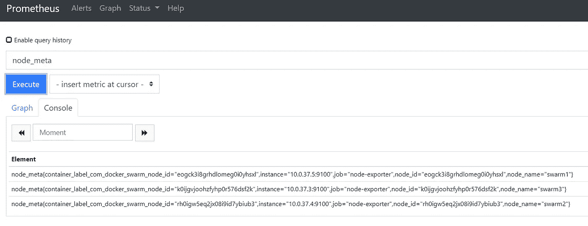
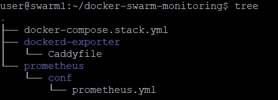
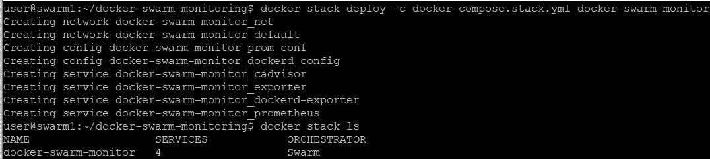
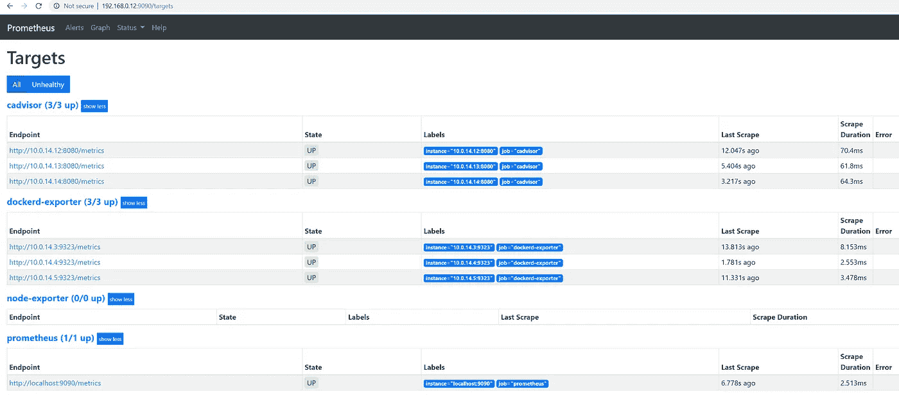
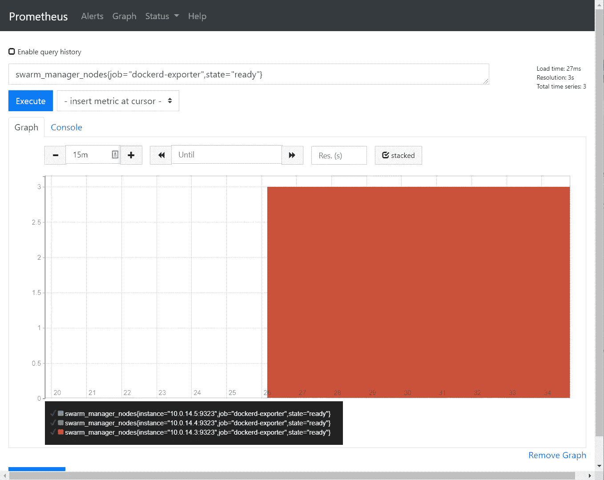
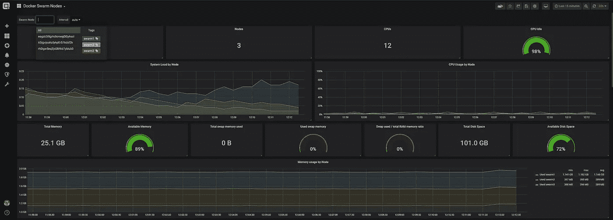
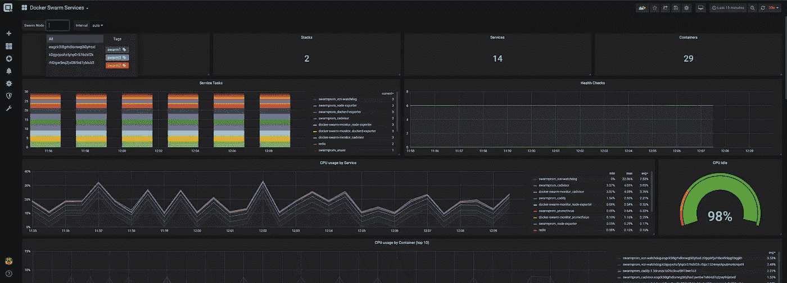

# 码头工人群体监控

> 原文：<https://itnext.io/docker-swarm-monitoring-4dfe88c72d56?source=collection_archive---------2----------------------->

当运行 [Docker Swarm](https://docs.docker.com/engine/swarm/) 和大量 Docker 节点和容器而不是单个 Docker 节点时，在正常运行时间和性能监控方面存在一些挑战。就单个节点指标而言，这不仅仅是集群功能的问题，也是部署的问题。

这篇博文解释了如何设置 Docker Swarm monitoring，如何部署和设置以下组件来收集尽可能多的重要指标:

1.  管理员
2.  节点导出器
3.  码头出口商

为了收集所有的数据，我们还安装了一个 [prometheus](https://www.prometheus.io) 服务。

假设我们运行一个 3 人的 Docker Swarm 集群，其设置如上一篇博文所述:

【https://www.opvizor.com/install-and-use-docker-swarm 

因为我们不想使用 docker 服务命令运行所有容器，所以我们一步一步地构建 docker-compose 文件，以拥有一个完整的部署文件来启动我们的 docker 群集监控。

在部署任何监控组件时，重要的部分是它们需要在集群中的所有节点上运行，以允许完全可见性。

因此，我们创建了跨节点网络和服务，并确保在需要时将它们部署在每个节点上(设置 deploy: mode: **global** )。

让我们开始创建一个 **docker-compose.stack.yml** 并创建覆盖网络(可跨节点访问)、一个用于我们未来的 prometheus 数据的卷、一个用于我们的 prometheus 的配置以及一个用于我们在最后创建的 Dockerd 服务的配置。

此外，我们使用 Docker Swarm 配置作为节点导出器的入口点脚本。这样，我们可以使用 Stefan Prodan 的智能方式来收集 Swarm 节点元数据，而无需更改容器映像本身(因此我们可以坚持使用总是更新的原始 Prometheus 节点导出器)。

```
version: "3.3" 
networks: 
  net: 
  driver: overlay 
  attachable: true 
volumes: 
  prometheus: {} 
configs: 
  dockerd_config: 
    file: ./dockerd-exporter/Caddyfile 
  prom_conf: 
    file: ./prometheus/conf/prometheus.yml 
  node_exporter_entrypoint: 
    file: ./node-exporter/docker-entrypoint.sh 
services:
```

# 部署 cAdvisor

cAdvisor(容器顾问)让容器用户了解他们正在运行的容器的资源使用和性能特征。它是一个正在运行的守护进程，收集、聚合、处理和导出关于正在运行的容器的信息。具体来说，对于每个容器，它保存资源隔离参数、历史资源使用、完整的历史资源使用直方图和网络统计。该数据按容器和机器范围导出。

cAdvisor 拥有对 Docker 容器的本地支持，并且应该支持任何其他开箱即用的容器类型。我们努力争取全面的支持，因此如果情况不是这样，请随时提出问题。cAdvisor 的容器抽象是基于 [lmctfy](https://github.com/google/lmctfy) 的，所以容器本质上是分层嵌套的。

如果您想了解更多关于 cAdvisor 的信息:

【https://github.com/google/cadvisor 

将 cadvisor 服务添加到 docker-compose.stack.yml 中

```
cadvisor:
    image: google/cadvisor
    networks:
      - net
    command: -logtostderr -docker_only
    volumes:
      - /var/run/docker.sock:/var/run/docker.sock:ro
      - /:/rootfs:ro
      - /var/run:/var/run
      - /sys:/sys:ro
      - /var/lib/docker/:/var/lib/docker:ro
    deploy:
      mode: global
      resources:
        limits:
          memory: 128M
        reservations:
          memory: 64M
```

# 部署节点导出器

我们要添加的下一个服务是节点导出器，它公开了额外的指标。

[https://hub.docker.com/r/prom/node-exporter/](https://hub.docker.com/r/prom/node-exporter/)

因为我们还没有创建将被加载到 Docker Swarm 配置中的入口点配置文件，所以我们现在需要创建它。

```
mkdir node-exporter 
vi docker-entrypoint.sh# file content:#
#!/bin/sh -eNODE_NAME=$(cat /etc/nodename)
echo "node_meta{node_id=\"$NODE_ID\", container_label_com_docker_swarm_node_id=\"$NODE_ID\", node_name=\"$NODE_NAME\"} 1" > /home/node-meta.promset -- /bin/node_exporter "$@"exec "$@"
```

该脚本收集本地节点信息并创建一个元数据文件，该文件将由节点导出器服务获取，供 Prometheus 抓取:

*collector . textfile . directory =/home/*

稍后，Prometheus 还将存储 node_meta 信息:



让我们将节点导出器服务添加到您的 docker-compose.stack.yml 中(确保保持对齐，这样所有像 cadvisor 和 exporter 这样的服务都从相同的位置开始)。

**重要提示:不要在 yaml 文件中使用制表符**

```
node-exporter:
    image: prom/node-exporter:latest
    networks:
      - net
    volumes:
      - /sys:/host/sys:ro
      - /:/rootfs:ro
      - /proc:/host/proc:ro
      - /etc/hostname:/etc/nodename
    configs:
      - source: node_exporter_entrypoint
        target: /docker-entrypoint.sh
    deploy:
      mode: global
    environment:
      - NODE_ID={{.Node.ID}}
    command:
      - '--path.procfs=/host/proc'
      - '--path.rootfs=/rootfs'
      - '--path.sysfs=/host/sys'
      - '--collector.filesystem.ignored-mount-points=^/(sys|proc|dev|host|etc)($
      - '--collector.textfile.directory=/home/'
      - '--no-collector.ipvs'
    entrypoint:
       - /bin/sh
       - /docker-entrypoint.sh
```

# 部署 Dockerd 导出程序

Docker 守护程序导出程序也公开了 Docker swarm metrics，这是启用该选项所必需的(实验性的),我们将使用一个特定的容器来公开我们的 prometheus 服务器的 prometheus metrics。

[https://github.com/stefanprodan/dockerd-exporter](https://github.com/stefanprodan/dockerd-exporter)

最简单的方法是更改或创建文件**/etc/docker/daemon . JSON**，添加以下内容并重启 docker 服务。

```
{
  "metrics-addr" : "0.0.0.0:9323",
  "experimental" : true
}
```

我们还需要为我们的服务创建配置文件:

**。/dockerd-exporter/caddy file**

```
:9323 {
    proxy / {$DOCKER_GWBRIDGE_IP}:9323 {
            transparent
        }errors stderr
    tls off
}
```

然后，我们可以添加 Caddy 服务，向我们的 Prometheus 服务发现公开端口 9323 指标。在添加它之前，确保您的 docker 网关桥反映了服务描述中的 IP 地址。因此，请运行以确保其为示例中的 172.18.0.1，或者相应地更改该值:

**docker run -rm -net 主机 alpine IP-o addr show docker _ GW bridge**

将 dockerd exporter 服务添加到 docker-compose.stack.yml 中

```
dockerd-exporter:
    image: stefanprodan/caddy
    networks:
      - net
    environment:
      - DOCKER_GWBRIDGE_IP=172.18.0.1
    configs:
      - source: dockerd_config
        target: /etc/caddy/Caddyfile
    deploy:
      mode: global
      resources:
        limits:
          memory: 128M
        reservations:
          memory: 64M
```

# 部署普罗米修斯

既然所有需要的导出器服务都在我们的 docker-compose 文件中，现在让我们添加 Prometheus 服务器来完成收集器代理和服务部分。

首先，我们需要确保在 prometheus/conf 目录中有一个有效的 prometheus.yml 配置。

```
global:
  scrape_interval:     15s
  evaluation_interval: 15sexternal_labels:
    monitor: 'prommon'scrape_configs:
  - job_name: 'prometheus'
    static_configs:
      - targets: ['localhost:9090']- job_name: 'dockerd-exporter'
    dns_sd_configs:
    - names:
      - 'tasks.dockerd-exporter'
      type: 'A'
      port: 9323- job_name: 'cadvisor'
    dns_sd_configs:
    - names:
      - 'tasks.cadvisor'
      type: 'A'
      port: 8080- job_name: 'node-exporter'
    dns_sd_configs:
    - names:
      - 'tasks.node-exporter'
      type: 'A'
      port: 9100
```

然后我们需要将 Prometheus 服务添加到 Docker Swarm Monitoring stack 我们的 docker-compose.stack.yml 文件中。

```
prometheus:
    image: prom/prometheus
    networks:
      - net
    ports:
      - "9090:9090"
    command:
      - '--config.file=/etc/prometheus/prometheus.yml'
      - '--storage.tsdb.path=/prometheus'
      - '--storage.tsdb.retention=${PROMETHEUS_RETENTION:-24h}'
    volumes:
      - prometheus:/prometheus
    configs:
      - source: prom_conf
        target: /etc/prometheus/prometheus.yml
    deploy:
      mode: replicated
      replicas: 1
      placement:
        constraints:
          - node.role == manager
      resources:
        limits:
          memory: 2048M
        reservations:
          memory: 128M
```



现在，我们可以作为一个名为 docker-swarm-monitor 的堆栈同时启动一切:

```
docker stack deploy -c docker-compose.stack.yml docker-swarm-monitor
```



您可以使用 **docker stack ls** 和 **docker service ls** 来检查堆栈和服务

要删除我们的部署，只需运行**docker stack RM docker-swarm-monitor**

如果您遇到任何服务无法启动的问题，建议您首先检查日志。最简单的方法是使用服务名，即**docker service logs-f docker-swarm-monitor-Prometheus**

特别是当从网站上复制/粘贴文件时，格式会变得混乱。

# 普罗米修斯刮削术

现在一切都已经设置好了，服务已经开始了。接下来要检查的是 Prometheus 的自动抓取，因此正在收集指标。只需访问端口 9090 上的 Swarm 集群 ip:



如果数据真的存在，创建一个简单的普罗米修斯图



# 形象化

下一步是运行一个 [Grafana](https://www.grafana.com) 服务，并导入或创建仪表板。

如果您运行 Performance Analyzer，您只需连接您的 Prometheus 数据源，并向我们询问要导入的仪表板。



整个项目也可以在 github 上找到，所以你可以用一个简单的 docker stack 命令直接开始并运行一个完整的 Docker Swarm monitoring stack，而不是复制这里的例子。只是做一个

```
git clone [https://github.com/opvizordz/docker-swarm-monitor.git](https://github.com/opvizordz/docker-swarm-monitor.git)docker stack deploy -c docker-compose.stack.yml docker-swarm-monitor
```

*原载于 2019 年 8 月 19 日*[*https://www.opvizor.com*](https://www.opvizor.com/docker-swarm-monitoring)*。*