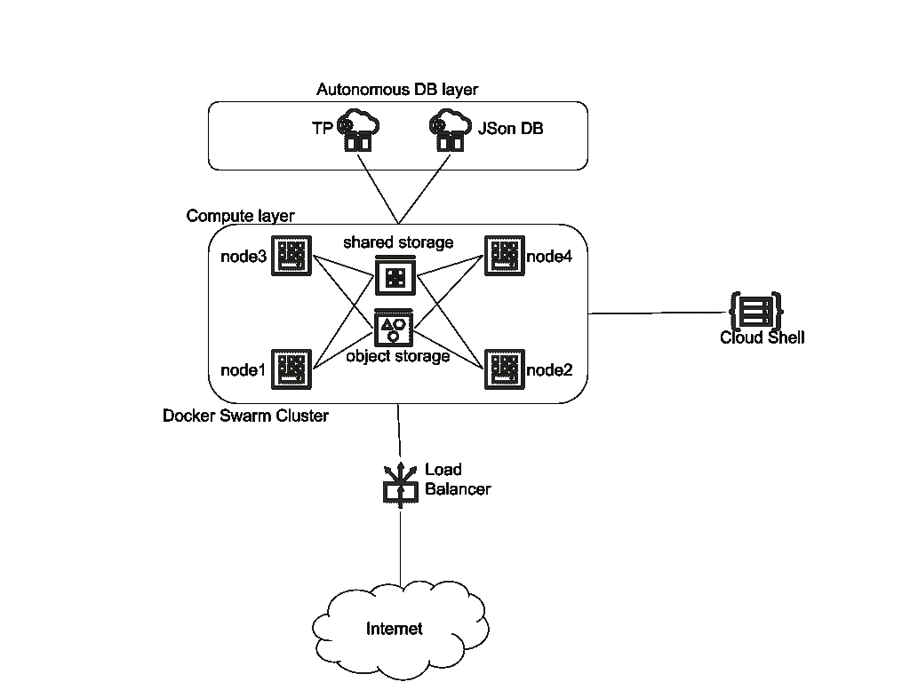
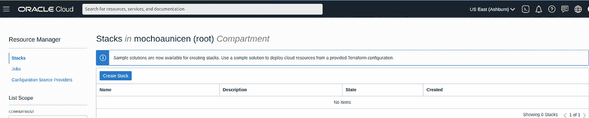
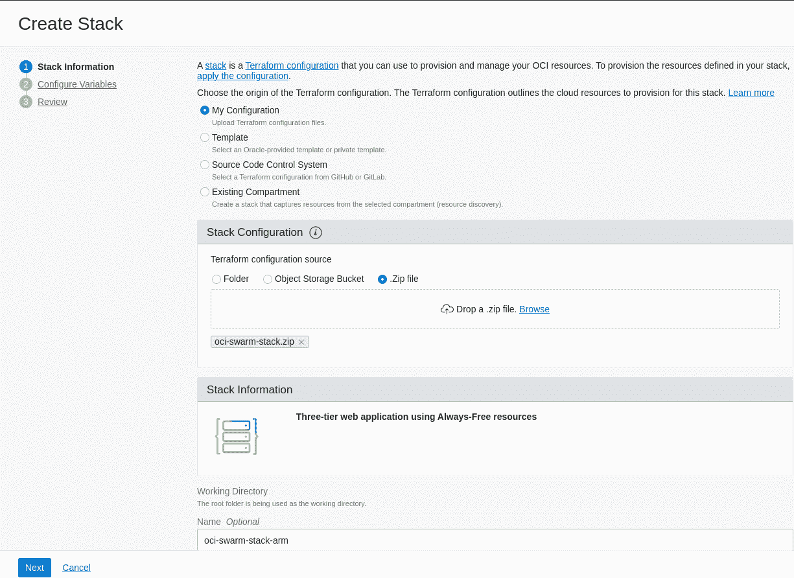
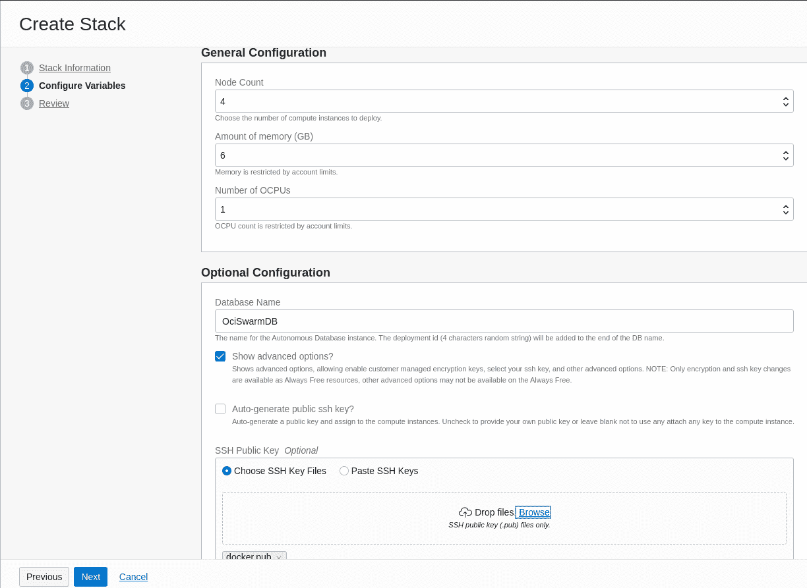
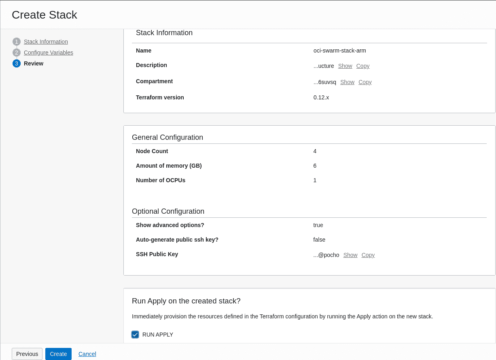
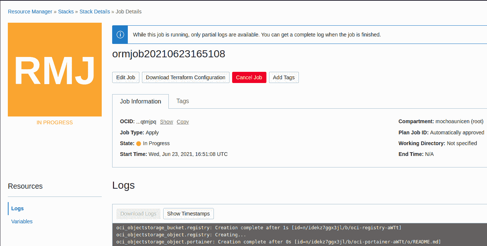
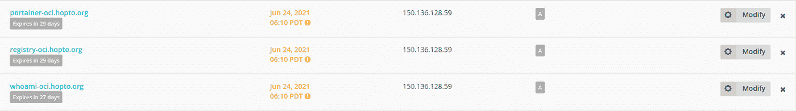
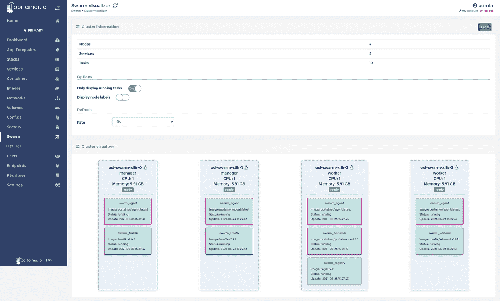

# Oracle 云 OCI 采用 arm 处理器的 Docker Swarm 堆栈

> 原文：<https://itnext.io/docker-swarm-stack-at-oracle-cloud-oci-using-arm-processors-c26dc8900986?source=collection_archive---------1----------------------->


Oracle 云基础设施(OCI)提供 Ampere Altra 处理器和业内首款 80 核 Arm 服务器，每核小时仅售 0.01 美元，每核可灵活配置 1 至 80 个 OCPUs 和 1 至 64 GB 内存。OCI Ampere Altra A1 计算平台提供确定性性能、线性可扩展性和安全架构，具有市场上最佳的性价比。

本文是以下相关文章系列的续篇:

*   [Oracle 始终释放 HA 配置中的云实例](/oracle-always-free-cloud-instances-in-ha-configuration-e1d3dd59d3b1)
*   [我自己的开发/测试云环境使用 Oracle Always 免费实例](/my-own-dev-test-cloud-environment-using-oracle-always-free-instances-598695cc3a10)
*   [我自己在 Oracle Cloud 使用自主数据库和 ML 免费部署物联网](https://marcelo-ochoa.medium.com/my-own-iot-deployment-at-oracle-cloud-free-using-autonomous-db-and-ml-f0632e240a29)
*   [使用 Oracle 云负载平衡器加密证书——包括自动更新功能](/using-lets-encrypt-certs-with-oracle-cloud-load-balancer-including-auto-renew-feature-7ae87e6d207b)
*   [使用 Oracle 云对象存储作为 Docker 卷](https://marcelo-ochoa.medium.com/using-oracle-cloud-object-storage-as-docker-volume-3ec7882f51b7)
*   [估计微服务最大数据库吞吐量](https://marcelo-ochoa.medium.com/estimating-micro-services-max-db-throughput-8ad1da22a41b)

但是，这篇文章不是描述如何按照逐步说明进行部署，而是讲述如何使用基础架构作为使用 [Terraform](https://es.wikipedia.org/wiki/Terraform_(software)) 和 [Oracle Resource Manager](https://docs.cloud.oracle.com/en-us/iaas/Content/ResourceManager/Concepts/resourcemanager.htm) 的代码，在文章的最后，您只需点击几下鼠标，就可以在 Oracle Always Free instance 上获得一个四节点 Swarm 集群。

让我们首先介绍我们的测试环境，参见部署图:



部署图表

我们在上面看到了共享存储，该共享存储是使用虚拟机块存储实现的，并使用 GlusterFS 进行复制，该存储是为 PostgreSQL 或 MySQL 等块级 IO 而设计的，我们的 Docker 容器有一个新的共享存储，它是使用为存储 HTML 页面、图像、配置文件或 Docker 注册表 blob 对象而设计的对象存储实现的。

> 注意:通过为 Oracle 对象存储添加 Docker 插件，我们可以从 Oracle [云外壳](https://docs.cloud.oracle.com/en-us/iaas/Content/API/Concepts/devcloudshellgettingstarted.htm)访问常规文件系统。Docker S3 卷插件和面向 Docker 的 GlusterFS 卷插件可在 ARM([S3Fs](https://hub.docker.com/r/mochoa/s3fs-volume-plugin-aarch64)/[GlusterFS](https://hub.docker.com/r/mochoa/glusterfs-volume-plugin-aarch64))和 X86 _ 64([S3Fs](https://hub.docker.com/r/mochoa/s3fs-volume-plugin-x86_64)/[GlusterFS](https://hub.docker.com/r/mochoa/glusterfs-volume-plugin-x86_64))平台的 [GitHub](https://github.com/marcelo-ochoa/docker-volume-plugins) / [DockerHub](https://hub.docker.com/p/mochoa/s3fs-volume-plugin) 获得。

# 部署文件

示例脚本和配置文件可以在我的 GitHub repo[OCI-swarm-cluster](https://github.com/marcelo-ochoa/oci-swarm-cluster)arm brach 获得，只需克隆并执行:

```
$ git clone [https://github.com/marcelo-ochoa/oci-swarm-cluster](https://github.com/marcelo-ochoa/oci-swarm-cluster) ***-b arm***
$ cd oci-swarm-cluster
$ zip -r ../oci-swarm-stack.zip .
```

仅此而已，***OCI-swarm-Stack . zip***是用来创建 Swarm 栈的文件。

# 部署 Docker 群堆栈

遵循使用 Oracle 云控制台的四次点击指南，[资源管理器- >堆栈](https://cloud.oracle.com/resourcemanager/stacks)菜单



资源管理器窗格

选择创建堆栈、ZIP 文件配置并浏览生成的 oci-swarm-stack.zip 文件



创建堆栈—堆栈信息

单击“Next ”,取消选择“auto generated public SSH keys ”,从您的计算机中选择一个公钥，该公钥将允许您访问为群集创建的计算实例。



创建堆栈—配置变量

单击下一步，查看公钥和堆栈信息



创建堆栈—查看

单击创建，您的 Terraform 堆栈将被创建，如果选择运行应用，堆栈将自动创建，几分钟后您将看到如下输出:



资源经理-工作详细信息

在日志的末尾，您会看到类似这样的内容:

```
Apply complete! Resources: 44 added, 0 changed, 0 destroyed.
Outputs:
  autonomous_database_password = db_auto_generated_password
  comments = The application URL will be unavailable for a few minutes after provisioning, while the application is configured
  deploy_id = Xi8r
  deployed_to_region = us-ashburn-1
  dev = Made with ❤ by Marcelo Ochoa
  generated_private_key_pem = No Keys Auto Generated
  lb_public_url = [http://***150.136.128.59***](http://150.136.128.59)oci_swarm_basic_source_code = https://github.com/marcelo-ochoa/oci-swarm-cluster
```

# 一些调整

此部署中作为示例包括的堆栈包括:

*   使用 OCI 对象存储的 Docker v2 注册表回购
*   用于管理 Docker 群堆栈的 Portainer 可视化工具
*   LetsEncrypt SSL 证书生成

最后一点要求您为每个在 [docker-compose.yml](https://github.com/marcelo-ochoa/oci-swarm-cluster/blob/arm/scripts/docker-compose.yml) 中声明的主机名拥有一个有效的 DNS 条目，指向负载平衡器公共 IP，例如使用 NoIP.com



NoIP 示例输出 A 资源

如果你有像上面这样的公共 DNS 条目，编辑你的 [docker-compose.yml](https://github.com/marcelo-ochoa/oci-swarm-cluster/blob/arm/scripts/docker-compose.yml) 文件并重新部署 swarm 栈， [docker-compose.yml](https://github.com/marcelo-ochoa/oci-swarm-cluster/blob/arm/scripts/docker-compose.yml) 文件将看起来像这样:

*   -trae fik . http . routers . portainer . rule =(Host(` portainer-OCI . hopto . org `) & & path prefix(`/`))
*   -traefik . http . routers . registry . rule =(Host(` registry-OCI . hopto . org `) & & path prefix(`/v2/`))

这些值将确保 Traefik 从 LetsEncrypt Acme Bot 生成有效的 SSL 证书。

```
[root@oci-swarm-xi8r-0 ~]# vi docker-compose.yml
[root@oci-swarm-xi8r-0 ~]# source /root/swarm.env
[root@oci-swarm-xi8r-0 ~]# export $(cut -d= -f1 /root/swarm.env)[root@oci-swarm-xi8r-0 ~]# docker stack deploy -c docker-compose.yml swarm
Updating service swarm_traefik (id: h5yoa5iary7su5yg5snc4xl0i)
Updating service swarm_whoami (id: jxc83xcimu8292coaof7348wg)
Updating service swarm_registry (id: j7l3n7qdfwaduhrejpglg6bwj)
Updating service swarm_agent (id: v5iqree794b47zm6o8cxiineo)
Updating service swarm_portainer (id: 9r8g06wh3en9bzllr63510dcz)
```



门户用户界面

# 表演

对于新的 ARM 处理器和形状，我们重新进行了一些性能测试，如文章[估计微服务最大数据库吞吐量](https://marcelo-ochoa.medium.com/estimating-micro-services-max-db-throughput-8ad1da22a41b)中所示，结果如下:

两个微服务，8 个并发连接(docker 服务规模 sb_soecs=2):

```
soecs:
image: swingbench:2.6.0
command: /opt/swingbench/bin/charbench -cf /opt/Wallet_test1.zip -cs test1_tpurgent -c /opt/swingbench/configs/SOE_Client_Side.xml -u soe -p ${SOE_PWD} -uc 8 -a -v users,tpm,tps,cpu,disk -mt 20000 -mr
Author  :     Dominic Giles
Version :     2.6.0.1135
Results will be written to results.xml.
..... lots of output here ....
|Maximum Transactions/min      |                         13255|
|Average Transactions/sec      |                        206.27|
|Maximum Transactions/min      |                         14266|
|Average Transactions/sec      |                        227.28|
.....
Completed Run.
```

4 个微服务，4 个并发连接(docker 服务规模 sb_soecs=4):

```
soecs:
image: swingbench:2.6.0
command: /opt/swingbench/bin/charbench -cf /opt/Wallet_test1.zip -cs test1_tpurgent -c /opt/swingbench/configs/SOE_Client_Side.xml -u soe -p ${SOE_PWD} -uc 4 -a -v users,tpm,tps,cpu,disk -mt 10000 -mr
Author  :     Dominic Giles
Version :     2.6.0.1135
Results will be written to results.xml.
..... lots of output here ....
|Maximum Transactions/min      |                          5655|
|Average Transactions/sec      |                         89.30|
|Maximum Transactions/min      |                          5692|
|Average Transactions/sec      |                         91.77|
|Maximum Transactions/min      |                          5649|
|Average Transactions/sec      |                         89.29|
|Maximum Transactions/min      |                          6514|
|Average Transactions/sec      |                        104.21|
.....
Completed Run.
```

在这两种情况下，两个节点/两个微服务或四个节点/四个微服务 ARM 处理器将以更低的价格获得两倍于 AMD OCI 处理器的吞吐量*！！！*