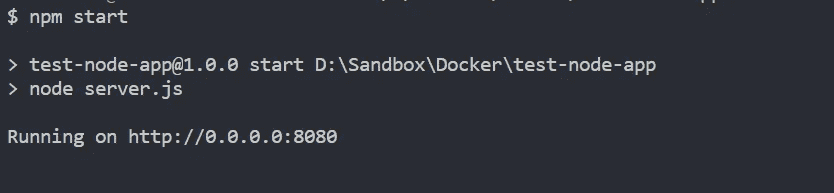
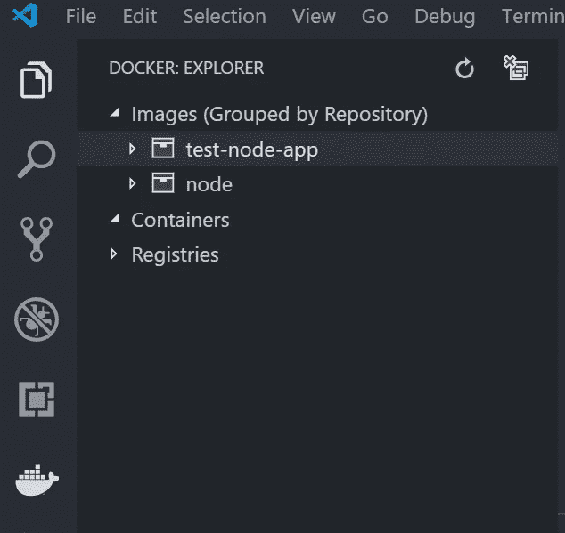

# 用 VS 代码 Dockerize 一个 Node.js 应用

> 原文：<https://itnext.io/dockerize-a-node-js-app-with-vs-code-bd471710dc22?source=collection_archive---------2----------------------->

你好亲爱的程序员，欢迎来到我的技术文章系列，献给 **Node.js** 和 **Docker。**希望你喜欢！


[https://unsplash.com/photos/t20pc32VbrU](https://unsplash.com/photos/t20pc32VbrU)

# 问题:

你以前从未使用过 Docker，你是一名 JavaScript 开发人员。您希望了解如何将容器与节点一起使用。我们走吧！

# 1.设置

在本教程中，我将使用我最喜欢的编辑器 [Visual Studio 代码](https://code.visualstudio.com/)。您还需要安装 [**节点**](https://nodejs.org/en/download/) 和**停靠站**。在我的例子中，我使用的是 Windows，所以我从这里得到了 Windows 的 Docker。

下一个命令创建一个名为 test-node-app 的新文件夹，然后创建 npm 包文件并在 VS 代码中打开文件夹。

```
mkdir test-node-app && cd test-node-app && npm init -y && code .
```

另外，请安装 express 来创建服务器。

```
npm i express
```

# 2.创建基本节点应用程序

打开 *package.json* 文件，修改如下:

```
{
 "name": "test-node-app",
 "version": "1.0.0",
 "description": "",
 "main": **"server.js",**
 "scripts": {
 **"start": "node server.js",**
   "test": "echo \"Error: no test specified\" && exit 1"
 },
 "keywords": [],
 "author": "",
 "license": "ISC",
 "dependencies": {
  ** "express": "^4.17.1"**
  }
}
```

现在添加名为 *server.js:* 的新文件

超级基础基础 app 准备好了。现在我们来局部测试一下。在应用程序文件夹中运行此命令:

```
npm start
```

您应该在控制台中看到以下内容，并且能够通过链接 [http://localhost:8080/](http://localhost:8080/) 访问服务器



我正在使用 git bash 终端

# 3.准备文档文件

为了建立我们的形象，我们需要一个 docker 文件。创建一个名为`Dockerfile`的文件

```
touch Dockerfile
```

这个文件告诉 docker 下载版本 8 的 Node.js，为应用程序创建目录，复制那里的 package.json 文件，为 node_modules 运行`npm install`，告诉这个应用程序想要使用哪个端口，最后用`npm start`运行它。

呃..很多是吗？😮

我们还需要一个名为`.dockerignore`的文件。创建并粘贴以下内容:

```
node_modules
npm-debug.log
```

# 4.建立码头工人形象

首先，用这个命令构建我们的映像。

```
docker build -t test-node-app .
```

等到它完成，现在我们可以看到新的图像创建。

```
docker images
```

如果你用的是 VS 代码，可以安装一个非常好看的 [Docker 扩展](https://marketplace.visualstudio.com/items?itemName=ms-azuretools.vscode-docker)。它在侧面板上添加了一个打开 Docker explorer 的按钮。在这里，您可以看到所有可用的图像和容器。从那里你可以运行，停止和删除容器，这是非常有用的。



如果您想删除图像，请运行以下命令:

```
docker rmi <image id>
```

# 5.运行 Docker 容器(最终)

是时候运行基于我们映像的容器了(我们在隔离环境中的应用程序)。重要的是我们需要告诉 docker 如何映射端口。现在我们运行我们的容器，将 8080 端口映射到 49165。

```
docker run -p 49165:8080 -d test-node-app
```

这意味着我们现在可以通过这个网址访问应用程序 [http://localhost:49165/](http://localhost:49165/)

还有一个非常有用的命令可以查看所有正在运行的容器:

```
docker ps
```

您可以通过在 VS Code Docker 扩展中右键单击或通过以下命令来停止容器:

```
docker stop <container id>
```

现在，如果您再次运行`docker ps`，您将看不到您的容器正在运行。如果您想查看停止的容器，您需要像这样在命令中添加`— all`标志:

```
docker ps -a
```

如果你还有一些问题，你可以在这里查阅官方[文件](https://nodejs.org/de/docs/guides/nodejs-docker-webapp/)。

🚀如果你从那篇文章中读到了一些有趣的东西，请喜欢并关注我的更多帖子。谢谢你亲爱的编码员！😏