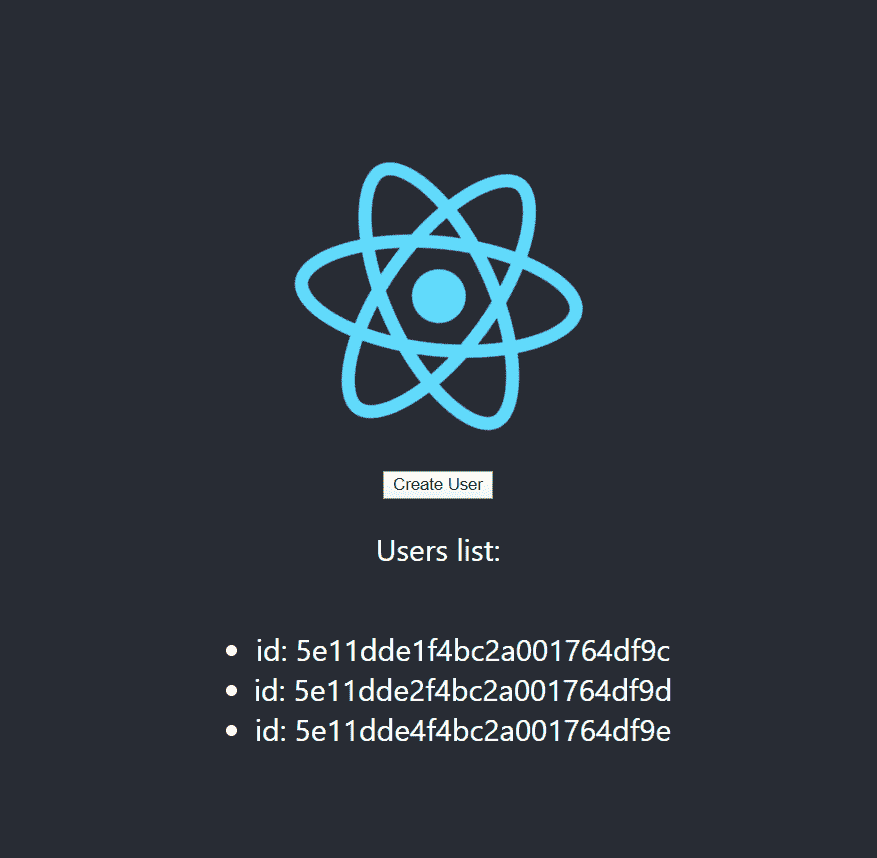

# 用连接到 MongoDb 的 Node.js 后端对接一个 React 应用程序

> 原文：<https://itnext.io/dockerize-a-react-app-with-node-js-backend-connected-to-mongodb-63740fc0f9e7?source=collection_archive---------1----------------------->

你好亲爱的程序员，欢迎来到我的系列技术文章的最后一篇，献给 *Node.js* 和 *Docker* 。希望你喜欢！

请找到系列的第一部分:
1。[“用 VS 代码 Dockerize a node . js app”](/dockerize-a-node-js-app-with-vs-code-bd471710dc22)
2。 ["](/dockerize-a-node-js-app-connected-to-mongodb-64fdeca94797) [对接一个连接到 MongoDb 的 node . js app](/dockerize-a-node-js-app-connected-to-mongodb-64fdeca94797)"


照片由 [Kimson Doan](https://unsplash.com/@kimsondoan) 在 [Unsplash](https://unsplash.com/?utm_source=medium&utm_medium=referral) 上拍摄

# 问题:

我们已经从本系列的前一篇文章中了解了如何将 Docker 与 Node 和 Mongo 结合使用。为了完成我们的 MERN 堆栈应用程序，我们需要添加前端部分。在我们的例子中，frontend 将使用 React 实现。让我们学习如何创建完整的前端，后端，数据库和运行 Docker 中的一切工作的应用程序！

# 1.克隆后端节点. js

在本系列之前的[部分](https://dev.to/vguleaev/dockerize-a-node-js-app-connected-to-mongodb-5bp1)中，我们使用 MongoDb 和 Docker 创建了一个 Node.js 应用程序。对于本教程，我们将需要相同的项目。从这里克隆[源代码](https://github.com/vguleaev/Express-Mongo-Docker-tutorial)或者运行这个命令:

```
git clone [https://github.com/vguleaev/Express-Mongo-Docker-tutorial.git](https://github.com/vguleaev/Express-Mongo-Docker-tutorial.git)
```

克隆完成后，将文件夹从`test-mongo-app`重命名为`api`。这将是我们的后端。

为了测试一切正常，打开`api`文件夹并运行`npm install`。安装完依赖项后，让我们检查一下是否一切正常。🍾

```
docker-compose up
```

这个命令将使用我们的`docker-compose.yml`来获取 mongo 映像并启动连接到 MongoDb 的 express 服务器。

如果一切正常，您应该在控制台中看到如下内容:

```
web_1 | Listening on 8080 
web_1 | MongoDb connected
```

在浏览器中打开这个端点[http://localhost:8080/users](http://localhost:8080/users)，您应该得到一个空数组作为响应。这是正确的，因为我们的数据库现在完全是空的。

# 2.创建 React 应用

是时候开发我们的前端部分了。转到父目录并运行:

```
npm i create-react-app -g 
create-react-app ui
```

现在我们的文件夹结构应该是这样的:
**…**
├──/api
└──/ui
(*其中 API 是克隆的后端应用，ui 是新创建的 React 应用。*

为了确保一切正常，让我们打开 **ui** 文件夹并启动 React 应用程序:

```
cd ui
npm start
```

你应该在 [http://localhost:3000](http://localhost:3000) 看到基本的 React app。🎈

# 3.Dockerize React 应用程序

在 **ui 的**文件夹中创建一个`.dockeringore`文件:

```
node_modules 
.git 
.gitignore
```

*(如果没有这个文件，我们的* `*docker build*` *命令将只是挂在 Windows 上。)*

同时在 **ui** 文件夹中创建一个`Dockerfile`文件:

```
FROM node:8
# Create app directory
WORKDIR /usr/src/app
# Install app dependencies
COPY package*.json ./

RUN npm install --silent
# Copy app source code
COPY . .

#Expose port and start application
EXPOSE 3000
CMD ["npm", "start"]
```

让我们测试一下 React 在 docker 中的工作情况。首先，我们将使用标记 react:app 构建图像:

```
docker build -t react:app .
```

现在运行我们的标记图像，并对 docker 使用相同的端口:

```
docker run -p 3000:3000 react:app
```

打开 [http://localhost:3000](http://localhost:3000) ，应该会看到 Docker 提供的 React。👍

⚠️:如果你像往常一样用 Ctrl+C 关闭容器，它不会停止。要停止容器运行，执行`docker ps`命令。

```
CONTAINER ID IMAGE COMMAND CREATED STATUS PORTS NAMES 
06c982ce6ae9 react:app "docker-entrypoint.s..." 12 days ago Up About a minute 0.0.0.0:3000->3000/tcp strange_montalcini
```

然后选择所需的 id 并停止容器。

```
docker stop 06c982ce6ae9
```

# 4.从 React 应用程序调用 api

打开 **ui** 文件夹，安装`axios`

```
cd ui
npm i axios
```

我们将稍微改变一下`App`组件，让它有一个创建用户和显示用户 id 列表的按钮。我们将调用 */user-create* 和 */users* 从我们的 Nodejs 应用程序获取端点。

将此粘贴到 App.js 文件中:

```
import React, { Component } from 'react';
import logo from './logo.svg';
import axios from 'axios';
import './App.css';

const apiUrl = `http://localhost:8080`;

class App extends Component {
  state = {
    users: []
  };

  async createUser() {
    await axios.get(apiUrl + '/user-create');
    this.loadUsers();
  }

  async loadUsers() {
    const res = await axios.get(apiUrl + '/users');
    this.setState({
      users: res.data
    });
  }

  componentDidMount() {
    this.loadUsers();
  }

  render() {
    return (
      <div className="App">
        <header className="App-header">
          
          <button onClick={() => this.createUser()}>Create User</button>
          <p>Users list:</p>
          <ul>
            {this.state.users.map(user => (
              <li key={user._id}>id: {user._id}</li>
            ))}
          </ul>
        </header>
      </div>
    );
  }
}

export default App;
```

由于我们在端口 3000 上运行前端，但后端在端口 8080 上运行，我们将遇到一个 [CORS](https://en.wikipedia.org/wiki/Cross-origin_resource_sharing) 问题。为了避免这种情况，请转到 **api** 项目并安装 cors 包。

```
npm i cors
```

然后在`server.js`文件中使用它:

```
const express = require('express');
const app = express();
const connectDb = require('./src/connection');
const User = require('./src/User.model');
const cors = require('cors');

app.use(cors());
// ...
```

# 5.在 Docker 中一起运行 React 和 Node

最后一步！现在从目录 **api** 中移除`docker-compose.yml`并在根文件夹中创建`docker-compose.yml`。粘贴这个:

```
version: '2'
services:
  ui:
    build: ./ui
    ports:
      - '3000:3000'
    depends_on:
      - api
  api:
    build: ./api
    ports:
      - '8080:8080'
    depends_on:
      - mongo
  mongo:
    image: mongo
    ports:
      - '27017:27017'
```

我们的根文件夹结构现在看起来是这样的:
**…**
├──/API
├──/ui
└──docker-compose . yml

我们有一个 docker-compose，它描述了我们希望在 docker 中运行的服务。在我们的例子中，我们有三个服务: **ui、api、mongo** 。🐋

对于每个服务，将在每个项目中使用`Dockerfile`创建 docker 图像。我们在行构建中指定路径。(例如`build: ./ui`)

对于 **mongo** 我们没有构建图像的项目，因为我们使用来自 docker [hub](https://hub.docker.com/_/mongo/) 的预定义图像。(如`image: mongo`)

我们还指定端口和依赖项。在我们的例子中，首先将在端口 *27017* 上启动 **mongo** ，因为 api 依赖于 mongo。第二个容器是端口 *8080* 上的 **api** ，因为 **ui** 依赖于它。最后一个容器是从端口 *3000* 开始的 **ui** 。

最后，从根文件夹运行所有的服务与一个命令！🧙

```
docker-compose up --build
```

打开 [http://localhost:3000/](http://localhost:3000/) 点击按钮创建用户。打开开发者工具查看调用。现在我们从 docker 运行前端和后端！



# 6.使用 React 生产构建

现在，我们用开发服务器启动 React 应用程序，这可能不是我们想要在生产中使用的。但是我们可以很容易地解决这个问题。

我们只需要在 **ui** 项目中改变我们的`Dockerfile`。我们将启动一个生产构建，并使用 nginx 服务器为其提供服务。将所有内容替换为:

```
# build environment
FROM node:12.2.0-alpine as build
WORKDIR /app
ENV PATH /app/node_modules/.bin:$PATH
COPY package.json /app/package.json
RUN npm install --silent
RUN npm install react-scripts@3.0.1 -g --silent
COPY . /app
RUN npm run build

# production environment
FROM nginx:1.16.0-alpine
COPY --from=build /app/build /usr/share/nginx/html
EXPOSE 80
CMD ["nginx", "-g", "daemon off;"]
```

由于我们现在暴露了端口 80，我们需要在`docker-compose.yml`将它从 3000 改为 80。

```
ui:
    build: ./ui
    ports:
      - '80:80'
    depends_on:
      - api
```

现在再次运行神奇的命令来启动 docker 中的一切🔮

```
docker-compose up --build
```

打开 [http://localhost/](http://localhost/) ，您应该看到完全相同的工作应用程序，但是现在 React 正在生产模式下运行。

在这里看到[源代码](https://github.com/vguleaev/React-Express-Mongo-Docker-tutorial/tree/master/react-express-mongo-app)。尽情享受吧！

恭喜你成功注册了 React，Nodejs 和 Mongodb！🎉🎉🎉

🚀如果你从那篇文章中读到了一些有趣的东西，请喜欢并关注我的更多帖子。谢谢你亲爱的编码员！😏

*原载于 2020 年 1 月 5 日*[*https://dev . to*](https://dev.to/vguleaev/dockerize-a-react-app-with-node-js-backend-connected-to-mongodb-10ai)*。*